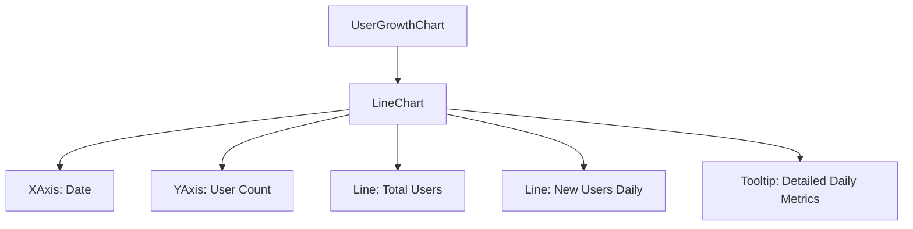
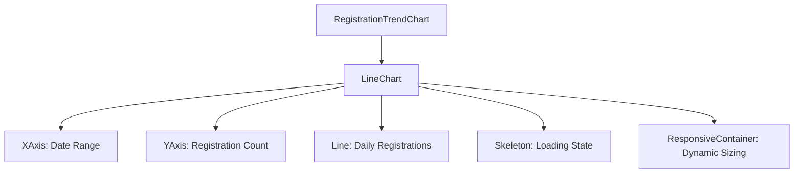
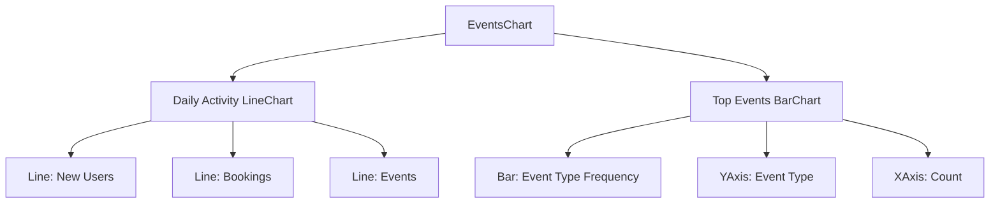
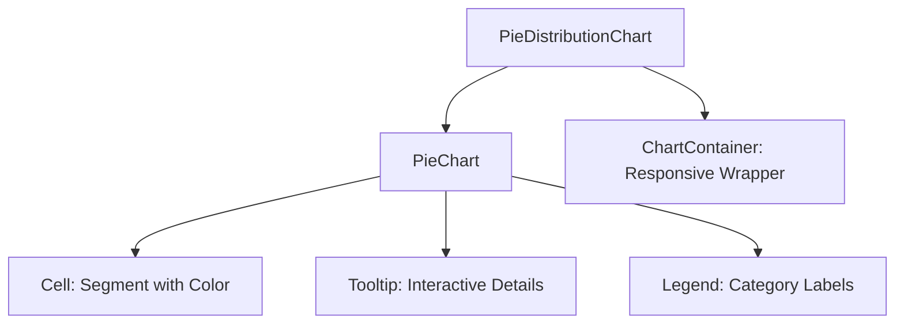
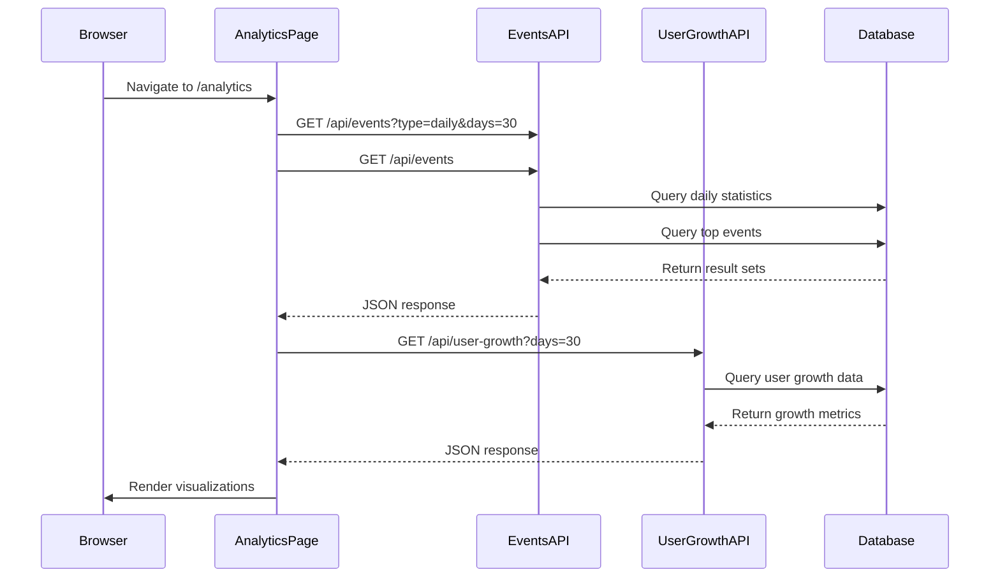
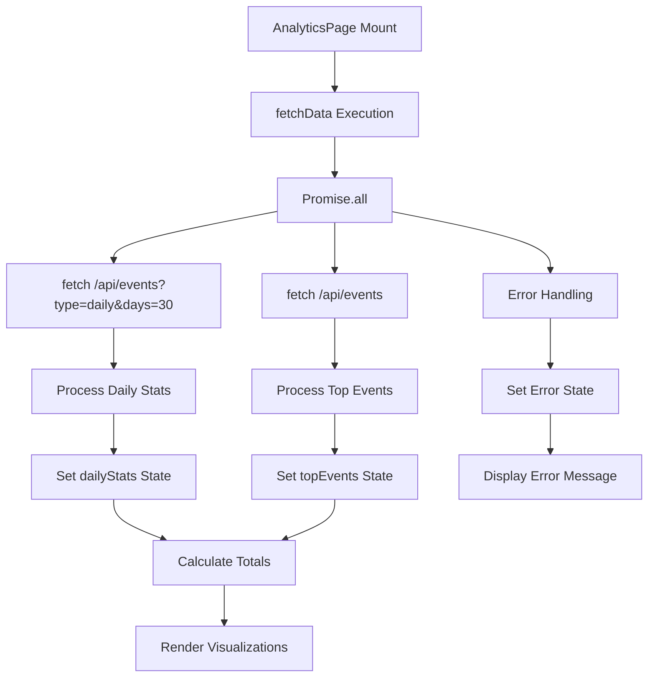
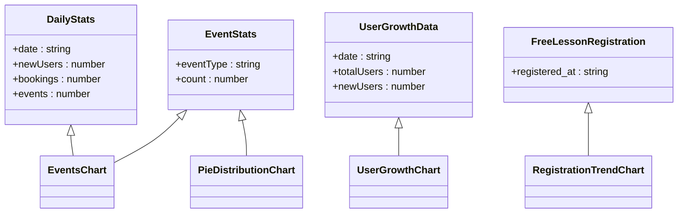
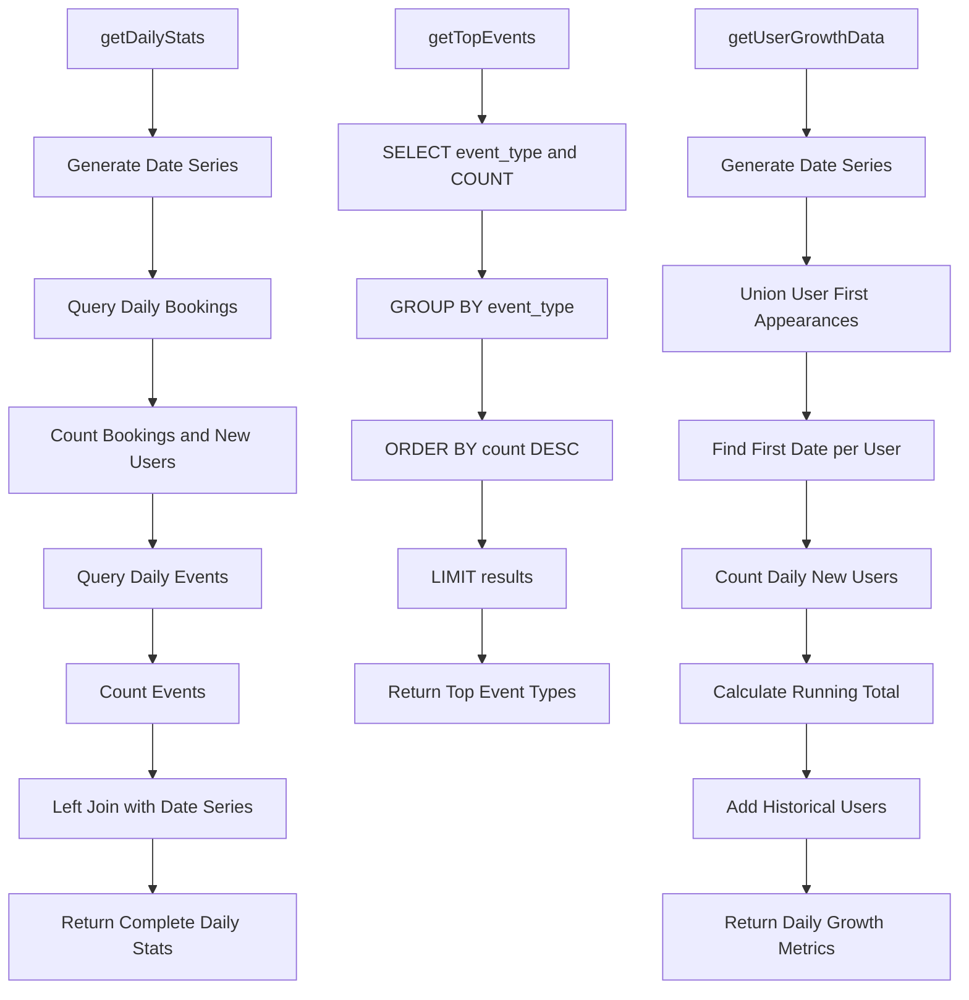
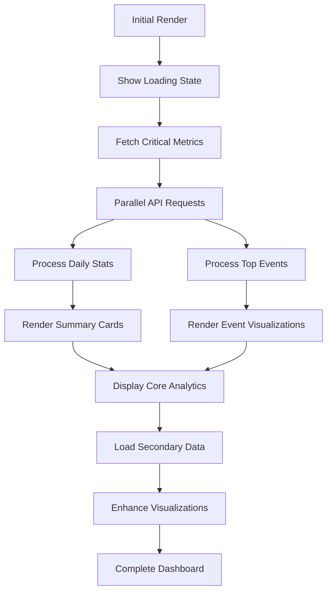
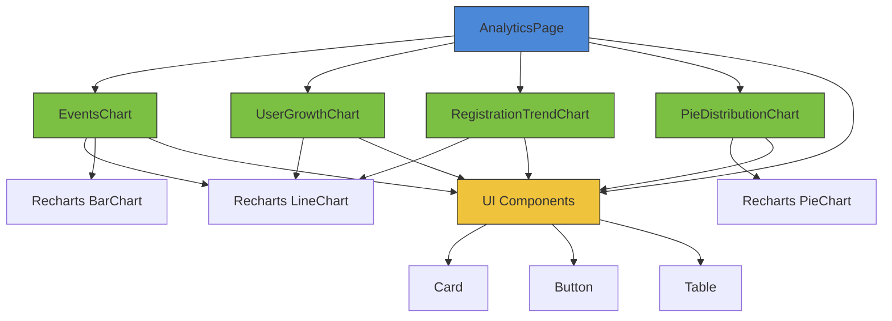

# Analytics Features

<cite>
**Referenced Files in This Document**   
- [page.tsx](file://app/analytics/page.tsx)
- [UserGrowthChart.tsx](file://components/UserGrowthChart.tsx)
- [RegistrationTrendChart.tsx](file://components/RegistrationTrendChart.tsx)
- [EventsChart.tsx](file://components/EventsChart.tsx)
- [PieDistributionChart.tsx](file://components/PieDistributionChart.tsx)
- [route.ts](file://app/api/events/route.ts)
- [route.ts](file://app/api/user-growth/route.ts)
- [queries.ts](file://lib/queries.ts)
</cite>

## Table of Contents
1. [Introduction](#introduction)
2. [Core Analytics Visualizations](#core-analytics-visualizations)
3. [Data Fetching and API Integration](#data-fetching-and-api-integration)
4. [Data Models and Backend Queries](#data-models-and-backend-queries)
5. [Tiered Data Loading Strategy](#tiered-data-loading-strategy)
6. [Interpreting Analytics for Business Decisions](#interpreting-analytics-for-business-decisions)
7. [Customization and Extension](#customization-and-extension)
8. [Component Relationships](#component-relationships)

## Introduction
The analytics features in hsl-dashboard provide comprehensive data-driven insights into user engagement, course performance, and platform growth. The system enables stakeholders to monitor key metrics through interactive visualizations that track user growth, registration trends, and event analytics. These insights help identify patterns in user behavior, measure marketing effectiveness, and inform strategic decisions for platform improvement and expansion.

## Core Analytics Visualizations

### User Growth Charts
The User Growth Chart visualizes both total platform users and daily new user acquisitions over a specified period. This line chart displays two key metrics: the cumulative total of users (in primary color) and the number of new users added each day (in green). The visualization helps identify growth patterns, seasonal trends, and the impact of marketing campaigns on user acquisition.

**Diagram sources**
- [UserGrowthChart.tsx](file://components/UserGrowthChart.tsx#L15-L86)

**Section sources**
- [UserGrowthChart.tsx](file://components/UserGrowthChart.tsx#L1-L86)

### Registration Trends
The Registration Trend Chart tracks free lesson registrations over a 30-day period, providing insights into user interest and engagement with introductory content. This line chart helps identify peak registration periods, assess the effectiveness of promotional activities, and forecast future demand for courses. The component includes skeleton loading states to enhance perceived performance during data retrieval.

**Diagram sources**
- [RegistrationTrendChart.tsx](file://components/RegistrationTrendChart.tsx#L15-L98)

**Section sources**
- [RegistrationTrendChart.tsx](file://components/RegistrationTrendChart.tsx#L1-L98)

### Event Analytics
The Events Chart component provides a comprehensive view of platform activity through two complementary visualizations: a line chart showing daily metrics (new users, bookings, and events) and a horizontal bar chart displaying the most frequent user actions. This dual visualization enables analysis of both quantitative activity trends and qualitative user behavior patterns.

**Diagram sources**
- [EventsChart.tsx](file://components/EventsChart.tsx#L15-L125)

**Section sources**
- [EventsChart.tsx](file://components/EventsChart.tsx#L1-L125)

### Distribution Analysis
The Pie Distribution Chart visualizes proportional data across categories, currently used to show the distribution of different event types. This component leverages Recharts with custom styling to create accessible, responsive pie charts that help identify the relative importance of various user actions and platform interactions.

**Diagram sources**
- [PieDistributionChart.tsx](file://components/PieDistributionChart.tsx#L15-L82)

**Section sources**
- [PieDistributionChart.tsx](file://components/PieDistributionChart.tsx#L1-L82)

## Data Fetching and API Integration

### API Endpoint Architecture
The analytics system retrieves data from dedicated API endpoints using the Next.js App Router framework. The primary endpoints include `/api/events` for event analytics and `/api/user-growth` for user growth metrics. These endpoints support query parameters to customize data retrieval, such as specifying time ranges and result limits.

**Diagram sources**
- [page.tsx](file://app/analytics/page.tsx#L23-L201)
- [route.ts](file://app/api/events/route.ts#L1-L27)
- [route.ts](file://app/api/user-growth/route.ts#L1-L17)

**Section sources**
- [page.tsx](file://app/analytics/page.tsx#L1-L201)
- [route.ts](file://app/api/events/route.ts#L1-L27)
- [route.ts](file://app/api/user-growth/route.ts#L1-L17)

### Client-Side Data Retrieval
The AnalyticsPage component implements a data fetching strategy using React's useEffect hook to retrieve analytics data when the component mounts. The implementation uses Promise.all to parallelize requests to multiple endpoints, reducing overall loading time. Error handling is implemented to provide user feedback in case of data retrieval failures.

**Diagram sources**
- [page.tsx](file://app/analytics/page.tsx#L23-L201)

**Section sources**
- [page.tsx](file://app/analytics/page.tsx#L1-L201)

## Data Models and Backend Queries

### Analytics Data Structures
The system defines several TypeScript interfaces to structure analytics data consistently across the application. These interfaces ensure type safety and provide clear documentation of the data shape expected by visualization components.

**Diagram sources**
- [page.tsx](file://app/analytics/page.tsx#L15-L21)
- [UserGrowthChart.tsx](file://components/UserGrowthChart.tsx#L1-L13)
- [RegistrationTrendChart.tsx](file://components/RegistrationTrendChart.tsx#L1-L13)
- [EventsChart.tsx](file://components/EventsChart.tsx#L1-L13)

**Section sources**
- [page.tsx](file://app/analytics/page.tsx#L1-L201)
- [UserGrowthChart.tsx](file://components/UserGrowthChart.tsx#L1-L86)
- [RegistrationTrendChart.tsx](file://components/RegistrationTrendChart.tsx#L1-L98)
- [EventsChart.tsx](file://components/EventsChart.tsx#L1-L125)

### Database Query Implementation
The analytics queries are implemented in the lib/queries.ts file using PostgreSQL with Common Table Expressions (CTEs) to create comprehensive data sets. The queries join data from multiple sources (bookings, events, free lesson registrations) to provide a holistic view of platform activity.

**Diagram sources**
- [queries.ts](file://lib/queries.ts#L221-L292)
- [queries.ts](file://lib/queries.ts#L474-L539)

**Section sources**
- [queries.ts](file://lib/queries.ts#L1-L1431)

## Tiered Data Loading Strategy
The analytics dashboard implements a tiered data loading strategy to prioritize critical metrics and enhance user experience. The system first loads summary metrics and basic visualizations, then progressively enhances the page with more detailed analytics. This approach ensures that users see meaningful content quickly while additional data loads in the background.

The implementation uses React's useState and useEffect hooks to manage loading states and coordinate data retrieval. Skeleton components provide visual feedback during loading, maintaining perceived performance. The strategy also includes error boundaries to handle failed requests gracefully, allowing partial data display when some endpoints fail.

**Section sources**
- [page.tsx](file://app/analytics/page.tsx#L23-L201)

## Interpreting Analytics for Business Decisions
The analytics data can inform several key business decisions. User growth trends help evaluate the effectiveness of marketing campaigns and identify optimal times for promotional activities. Registration trends for free lessons indicate interest levels in specific course topics and can guide content development priorities.

Event analytics reveal the most common user actions, highlighting popular features and potential usability issues. For example, a high volume of "button_click" events for a particular feature suggests strong user engagement, while low conversion rates from registration to booking may indicate friction in the user journey.

The comparative metrics (average daily users, bookings, and events) provide benchmarks for performance evaluation. Significant deviations from historical averages can trigger investigations into underlying causes, whether positive (successful marketing campaign) or negative (technical issue).

## Customization and Extension
The analytics system is designed to be extensible, allowing for the addition of new metrics and visualizations. To add a new metric, developers should:

1. Create a new database query function in lib/queries.ts
2. Implement a corresponding API route in app/api/
3. Develop a visualization component using Recharts
4. Integrate the component into the analytics page

Customization options include adjusting time ranges, adding filters for specific user segments, and modifying visualization styles. The component architecture supports theme consistency through shared UI components and CSS variables.

For performance optimization, consider implementing data caching strategies and pagination for large data sets. The current implementation could be enhanced with real-time updates using WebSockets for time-sensitive analytics.

## Component Relationships
The analytics components are organized in a modular architecture with clear dependencies. The top-level AnalyticsPage orchestrates data retrieval and coordinates the rendering of specialized visualization components. Each visualization component is responsible for a specific type of data presentation and accepts standardized data props.

**Diagram sources**
- [page.tsx](file://app/analytics/page.tsx#L1-L201)
- [EventsChart.tsx](file://components/EventsChart.tsx#L1-L125)
- [UserGrowthChart.tsx](file://components/UserGrowthChart.tsx#L1-L86)
- [RegistrationTrendChart.tsx](file://components/RegistrationTrendChart.tsx#L1-L98)
- [PieDistributionChart.tsx](file://components/PieDistributionChart.tsx#L1-L82)

**Section sources**
- [page.tsx](file://app/analytics/page.tsx#L1-L201)
- [EventsChart.tsx](file://components/EventsChart.tsx#L1-L125)
- [UserGrowthChart.tsx](file://components/UserGrowthChart.tsx#L1-L86)
- [RegistrationTrendChart.tsx](file://components/RegistrationTrendChart.tsx#L1-L98)
- [PieDistributionChart.tsx](file://components/PieDistributionChart.tsx#L1-L82)