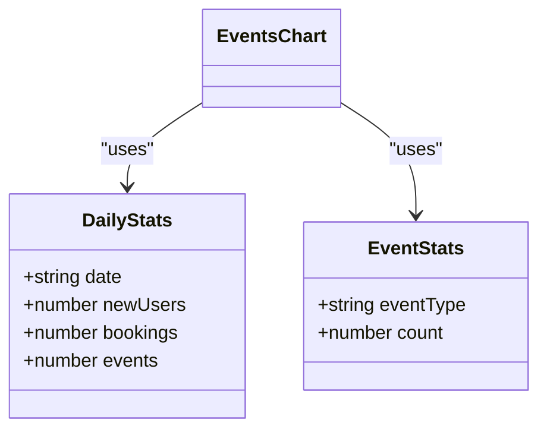
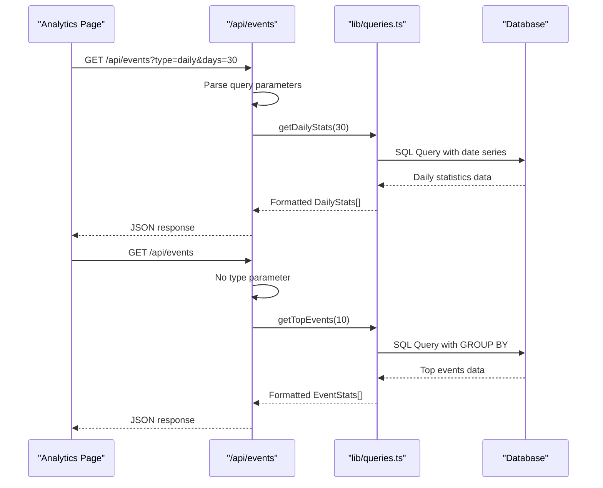
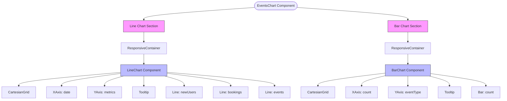
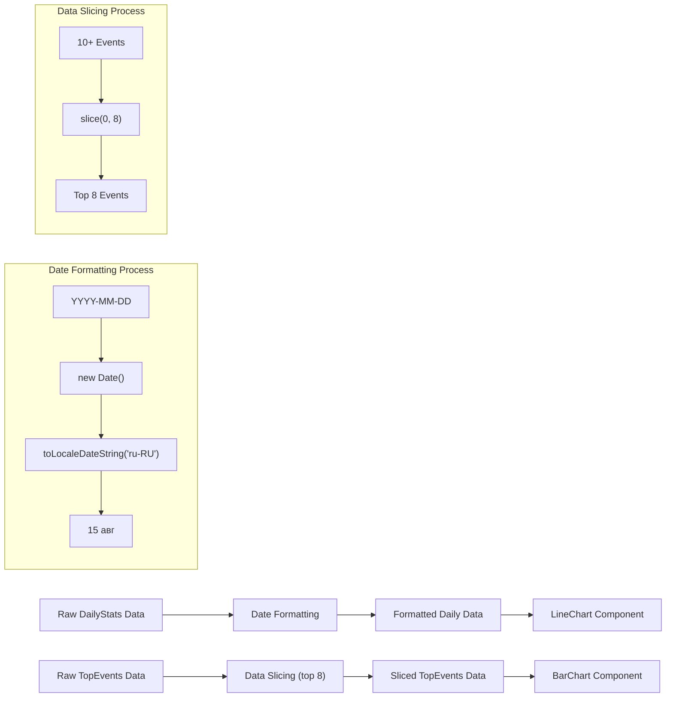

# Event Analytics

<cite>
**Referenced Files in This Document**   
- [components/EventsChart.tsx](file://components/EventsChart.tsx)
- [app/api/events/route.ts](file://app/api/events/route.ts)
- [lib/queries.ts](file://lib/queries.ts)
- [app/analytics/page.tsx](file://app/analytics/page.tsx)
</cite>

## Table of Contents
1. [Introduction](#introduction)
2. [Architecture Overview](#architecture-overview)
3. [Core Components](#core-components)
4. [Data Models](#data-models)
5. [API Endpoint Implementation](#api-endpoint-implementation)
6. [Chart Visualization Details](#chart-visualization-details)
7. [Data Processing and Formatting](#data-processing-and-formatting)
8. [Common Issues and Solutions](#common-issues-and-solutions)
9. [Customization and Extension](#customization-and-extension)
10. [Conclusion](#conclusion)

## Introduction

The Event Analytics feature provides comprehensive insights into user activity patterns through visualizations of daily trends and top user events. This documentation details the implementation of the EventsChart component, which combines Recharts LineChart and BarChart to display multiple metrics including new users, bookings, and events. The system is designed to support Russian locale formatting and provides a clear view of user engagement patterns over time. The analytics dashboard fetches data from a dedicated API endpoint that handles different query parameters for various data types, enabling flexible data retrieval and presentation.

## Architecture Overview

The Event Analytics feature follows a client-server architecture with a clear separation between data retrieval, processing, and visualization layers. The frontend component requests data from a backend API endpoint, which queries the database and returns structured data that is then visualized using Recharts components.

```mermaid
graph TB
subgraph "Frontend"
AnalyticsPage[Analytics Page]
EventsChart[EventsChart Component]
LineChart[Recharts LineChart]
BarChart[Recharts BarChart]
end
subgraph "Backend"
APIEndpoint[/api/events]
Queries[lib/queries.ts]
Database[(PostgreSQL)]
end
AnalyticsPage --> EventsChart
EventsChart --> LineChart
EventsChart --> BarChart
AnalyticsPage --> APIEndpoint
APIEndpoint --> Queries
Queries --> Database
Database --> Queries
Queries --> APIEndpoint
APIEndpoint --> AnalyticsPage
style AnalyticsPage fill:#f9f,stroke:#333
style EventsChart fill:#bbf,stroke:#333
style APIEndpoint fill:#f96,stroke:#333
style Queries fill:#ff9,stroke:#333
```

**Diagram sources**
- [app/analytics/page.tsx](file://app/analytics/page.tsx)
- [components/EventsChart.tsx](file://components/EventsChart.tsx)
- [app/api/events/route.ts](file://app/api/events/route.ts)
- [lib/queries.ts](file://lib/queries.ts)

**Section sources**
- [app/analytics/page.tsx](file://app/analytics/page.tsx)
- [components/EventsChart.tsx](file://components/EventsChart.tsx)
- [app/api/events/route.ts](file://app/api/events/route.ts)

## Core Components

The Event Analytics feature is built around several core components that work together to provide a comprehensive view of user activity. The main visualization component is EventsChart, which renders both a line chart for daily trends and a bar chart for top events. This component receives data from the Analytics page, which orchestrates data fetching from the API endpoint. The API endpoint itself acts as a controller, routing requests to appropriate query functions based on the requested data type. The data flow begins with the Analytics page making concurrent requests to fetch daily statistics and top events, which are then passed as props to the EventsChart component for rendering.

**Section sources**
- [components/EventsChart.tsx](file://components/EventsChart.tsx#L23-L125)
- [app/analytics/page.tsx](file://app/analytics/page.tsx#L43-L77)

## Data Models

The Event Analytics feature utilizes two primary data models: DailyStats and EventStats. These interfaces define the structure of the data used for visualization and ensure type safety throughout the application.



The DailyStats interface represents daily activity metrics with four properties: date (in ISO string format), newUsers (count of new user registrations), bookings (count of course bookings), and events (count of user actions). The EventStats interface captures information about event types with two properties: eventType (a string describing the type of event) and count (the number of occurrences). Both interfaces are defined in multiple locations across the codebase, ensuring consistency between the frontend components and the data returned by the API.

**Diagram sources**
- [components/EventsChart.tsx](file://components/EventsChart.tsx#L6-L16)
- [lib/queries.ts](file://lib/queries.ts#L45-L50)

**Section sources**
- [components/EventsChart.tsx](file://components/EventsChart.tsx#L6-L16)
- [lib/queries.ts](file://lib/queries.ts#L45-L50)
- [app/analytics/page.tsx](file://app/analytics/page.tsx#L11-L21)

## API Endpoint Implementation

The /api/events endpoint serves as the primary data source for the Event Analytics feature, handling different query parameters to return various types of event data. The endpoint implementation is straightforward, using query parameters to determine which data to retrieve and return.



When a request is received, the endpoint checks the 'type' parameter to determine the data type requested. If 'type' is 'daily', it calls getDailyStats with the specified number of days (defaulting to 30). If 'type' is 'recent', it calls getRecentEvents with the specified limit (defaulting to 30). For any other type or no type parameter, it returns the top events by calling getTopEvents with a limit of 10. Error handling is implemented with try-catch blocks to ensure graceful failure and appropriate error responses.

**Diagram sources**
- [app/api/events/route.ts](file://app/api/events/route.ts#L5-L27)
- [lib/queries.ts](file://lib/queries.ts#L221-L292)

**Section sources**
- [app/api/events/route.ts](file://app/api/events/route.ts#L5-L27)

## Chart Visualization Details

The EventsChart component implements a dual-chart layout using Recharts to display both temporal trends and categorical distributions. The component renders two distinct visualizations within card containers: a line chart showing daily activity trends and a horizontal bar chart displaying the most frequent user events.



The line chart visualizes three metrics simultaneously: new users in the primary color, bookings in green (#10b981), and events in amber (#f59e0b). Each line includes data points represented by dots with matching fill colors. The horizontal bar chart displays event types on the Y-axis and their frequencies on the X-axis, with bars filled in the primary color and rounded corners on the right side. Both charts include tooltips with custom styling that matches the application's design system, featuring a card-like appearance with border and shadow effects.

**Diagram sources**
- [components/EventsChart.tsx](file://components/EventsChart.tsx#L23-L125)

**Section sources**
- [components/EventsChart.tsx](file://components/EventsChart.tsx#L23-L125)

## Data Processing and Formatting

The EventsChart component performs several data processing steps to prepare the raw data for visualization. The most significant transformation is the formatting of dates for display in the Russian locale, which enhances readability for the target audience.



For the line chart, the component maps over the dailyData array to transform the ISO date strings into human-readable formats using the Russian locale ('ru-RU'). The dates are displayed with abbreviated month names and numeric day values (e.g., "15 авг" for August 15). For the bar chart, the component applies a data slicing operation using Array.slice(0, 8) to limit the display to the top 8 events, preventing the chart from becoming overcrowded and ensuring optimal readability. This processing occurs within the component's render function, ensuring that the data transformations are applied before visualization.

**Diagram sources**
- [components/EventsChart.tsx](file://components/EventsChart.tsx#L25-L31)
- [components/EventsChart.tsx](file://components/EventsChart.tsx#L98-L100)

**Section sources**
- [components/EventsChart.tsx](file://components/EventsChart.tsx#L25-L31)
- [components/EventsChart.tsx](file://components/EventsChart.tsx#L98-L100)

## Common Issues and Solutions

Several common issues may arise when working with the Event Analytics feature, particularly related to data display and performance. The most frequent issue is data overcrowding in the bar chart, which is addressed by the built-in slicing mechanism that limits the display to the top 8 events. This prevents the horizontal bar chart from becoming too tall and ensures that only the most significant event types are displayed.

Another potential issue is date formatting inconsistencies, particularly when dealing with different time zones. The current implementation uses the browser's local time zone for date formatting, which may lead to discrepancies if users are in different regions. To mitigate this, the system could be enhanced to use UTC dates consistently throughout the application.

Performance considerations include the concurrent data fetching pattern used in the Analytics page, which makes two separate API calls simultaneously. While this reduces overall loading time, it could potentially overload the database under heavy load. A solution would be to implement a combined endpoint that returns both daily statistics and top events in a single response, reducing database query overhead.

**Section sources**
- [components/EventsChart.tsx](file://components/EventsChart.tsx#L98-L100)
- [app/analytics/page.tsx](file://app/analytics/page.tsx#L48-L52)

## Customization and Extension

The Event Analytics components are designed to be extensible, allowing for customization and the addition of new features. The EventsChart component can be easily modified to include additional metrics in the line chart by adding new Line components with appropriate dataKey values and styling. Similarly, the bar chart can be extended to display additional event categories by modifying the data slicing logic or implementing pagination for event types.

Customization options include:
- Changing the color scheme by modifying the stroke properties of the Line components
- Adjusting the time period by modifying the days parameter in the API call
- Adding new metrics to the line chart by extending the DailyStats interface and query
- Implementing dynamic event filtering based on user selection
- Adding interactive features such as chart zooming or data point selection

To extend the functionality, developers can create new query functions in lib/queries.ts that return specialized event data, then expose these through the API endpoint by adding new type parameters. The component structure supports this extensibility by keeping data retrieval separate from data visualization, allowing new data types to be incorporated with minimal changes to the rendering logic.

**Section sources**
- [components/EventsChart.tsx](file://components/EventsChart.tsx)
- [lib/queries.ts](file://lib/queries.ts)
- [app/api/events/route.ts](file://app/api/events/route.ts)

## Conclusion

The Event Analytics feature provides a comprehensive view of user activity through well-designed visualizations that combine temporal trends with categorical distributions. The implementation leverages Recharts to create responsive and accessible charts that effectively communicate key metrics to stakeholders. The architecture follows a clean separation of concerns, with distinct layers for data retrieval, processing, and visualization. The system supports Russian locale formatting for enhanced usability and includes mechanisms to handle common display issues such as data overcrowding. With its extensible design, the feature can be easily customized to meet evolving analytical needs, making it a valuable tool for understanding user engagement patterns and informing business decisions.