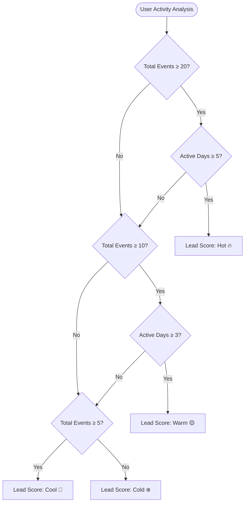
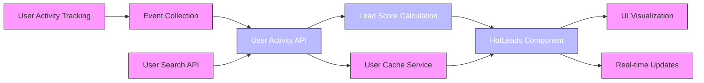
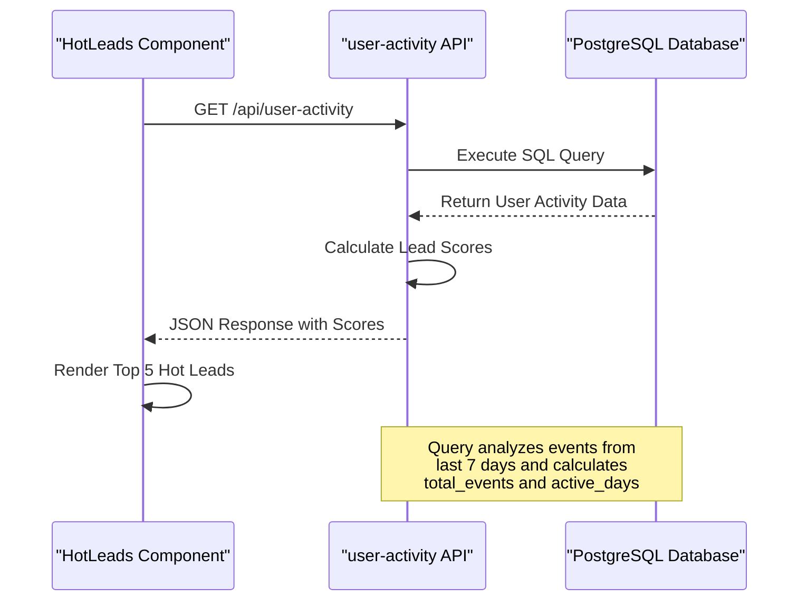
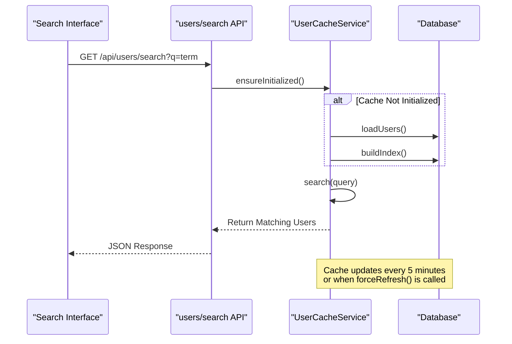
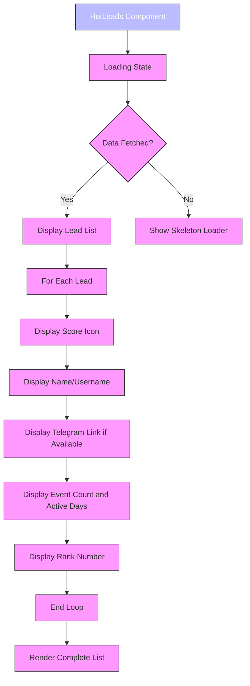

# Lead Scoring System

<cite>
**Referenced Files in This Document**   
- [HotLeads.tsx](file://components/HotLeads.tsx)
- [user-activity/route.ts](file://app/api/user-activity/route.ts)
- [userCache.ts](file://lib/userCache.ts)
- [search/route.ts](file://app/api/users/search/route.ts)
- [queries.ts](file://lib/queries.ts)
</cite>

## Table of Contents
1. [Introduction](#introduction)
2. [Lead Scoring Criteria](#lead-scoring-criteria)
3. [Data Flow and Architecture](#data-flow-and-architecture)
4. [HotLeads Component Implementation](#hotleads-component-implementation)
5. [User Activity API](#user-activity-api)
6. [Integration with User Search](#integration-with-user-search)
7. [UI Display and Visualization](#ui-display-and-visualization)
8. [Performance and Caching](#performance-and-caching)
9. [Troubleshooting and Customization](#troubleshooting-and-customization)
10. [Conclusion](#conclusion)

## Introduction
The Lead Scoring System is a critical component of the HSL Dashboard that identifies high-potential users based on their engagement patterns. The system analyzes user behavior across multiple dimensions including message interactions, course interest, and booking history to calculate lead scores. This documentation provides a comprehensive overview of the HotLeads component, detailing how lead scores are calculated, displayed, and updated in real-time. The system integrates with various data sources and APIs to provide an accurate representation of user engagement and potential.

## Lead Scoring Criteria
The lead scoring system categorizes users into four tiers based on their engagement metrics: hot, warm, cool, and cold. These categories are determined by analyzing two primary factors: total events and active days within a 7-day window.



**Diagram sources**
- [user-activity/route.ts](file://app/api/user-activity/route.ts#L20-L40)

**Section sources**
- [user-activity/route.ts](file://app/api/user-activity/route.ts#L20-L40)

## Data Flow and Architecture
The lead scoring system follows a well-defined data flow from user activity tracking to score calculation and visualization. This section outlines the complete architecture and data flow of the system.



**Diagram sources**
- [user-activity/route.ts](file://app/api/user-activity/route.ts#L5-L50)
- [HotLeads.tsx](file://components/HotLeads.tsx#L15-L30)
- [userCache.ts](file://lib/userCache.ts#L10-L30)

**Section sources**
- [user-activity/route.ts](file://app/api/user-activity/route.ts#L5-L50)
- [HotLeads.tsx](file://components/HotLeads.tsx#L15-L30)
- [userCache.ts](file://lib/userCache.ts#L10-L30)

## HotLeads Component Implementation
The HotLeads component is responsible for displaying the top five users with the highest engagement scores. It fetches data from the user activity API and renders it in a visually appealing format with appropriate icons and links.

```mermaid
classDiagram
class HotLeads {
+useState : hotLeads : UserActivity[]
+useState : loading : boolean
+useEffect : fetch('/api/user-activity')
+getScoreIcon(score : string) : string
+getTelegramLink(username : string) : string | null
}
class UserActivity {
+user_id : number
+username : string
+first_name : string
+email : string
+total_events : number
+active_days : number
+last_activity : string
+lead_score : 'hot' | 'warm' | 'cool' | 'cold'
}
HotLeads --> UserActivity : "displays"
HotLeads --> "API Endpoint" : "fetches from"
class "API Endpoint" {
+GET /api/user-activity
}
```

**Diagram sources**
- [HotLeads.tsx](file://components/HotLeads.tsx#L5-L14)
- [HotLeads.tsx](file://components/HotLeads.tsx#L15-L30)

**Section sources**
- [HotLeads.tsx](file://components/HotLeads.tsx#L5-L110)

## User Activity API
The user activity API endpoint calculates lead scores by querying the database for user engagement data. It uses a SQL query with a Common Table Expression (CTE) to aggregate user activity metrics and apply scoring logic.



**Diagram sources**
- [user-activity/route.ts](file://app/api/user-activity/route.ts#L5-L50)
- [HotLeads.tsx](file://components/HotLeads.tsx#L20-L25)

**Section sources**
- [user-activity/route.ts](file://app/api/user-activity/route.ts#L5-L50)

## Integration with User Search
The lead scoring system integrates with the user search functionality through a caching service that enables fast lookups. When users are identified as hot leads, their information can be quickly retrieved and displayed with relevant details.



**Diagram sources**
- [userCache.ts](file://lib/userCache.ts#L10-L30)
- [search/route.ts](file://app/api/users/search/route.ts#L5-L20)

**Section sources**
- [userCache.ts](file://lib/userCache.ts#L10-L214)
- [search/route.ts](file://app/api/users/search/route.ts#L5-L35)

## UI Display and Visualization
The HotLeads component presents the highest-scoring users in a clean, informative card format. Each lead is displayed with their score indicator, name, engagement metrics, and a direct link to their Telegram profile when available.



**Diagram sources**
- [HotLeads.tsx](file://components/HotLeads.tsx#L63-L109)

**Section sources**
- [HotLeads.tsx](file://components/HotLeads.tsx#L63-L109)

## Performance and Caching
The system implements a sophisticated caching mechanism through the UserCacheService to optimize performance and reduce database load. This service maintains an in-memory index of users and refreshes data periodically to ensure accuracy.

```mermaid
classDiagram
class UserCacheService {
-index : Map<string, TelegramUser[]>
-streamCache : Map<string, TelegramUser[]>
-allUsers : TelegramUser[]
-initialized : boolean
-lastUpdate : number
+ensureInitialized() : Promise<void>
+search(query : string) : TelegramUser[]
+getUsersByStream(stream : string) : TelegramUser[]
+forceRefresh() : Promise<void>
}
class HotLeads {
+fetch('/api/user-activity')
}
class UserSearch {
+fetch('/api/users/search')
}
UserCacheService <|-- HotLeads : "indirect dependency"
UserCacheService <|-- UserSearch : "direct dependency"
UserCacheService --> "Database" : "loads data from"
class "Database" {
+free_lesson_registrations
+bookings
+events
}
```

**Diagram sources**
- [userCache.ts](file://lib/userCache.ts#L10-L30)
- [userCache.ts](file://lib/userCache.ts#L100-L120)

**Section sources**
- [userCache.ts](file://lib/userCache.ts#L10-L214)

## Troubleshooting and Customization
This section addresses common issues with the lead scoring system and provides guidance on customizing the scoring algorithm and threshold values.

### Common Issues
- **Score Accuracy**: Ensure the database contains complete event data for accurate scoring
- **Cache Staleness**: The user cache refreshes every 5 minutes; use forceRefresh() for immediate updates
- **API Errors**: Check server logs for database connection issues or query failures

### Customization Options
The lead scoring criteria can be customized by modifying the CASE statement in the user activity API. For example, to adjust the thresholds:

```sql
CASE 
  WHEN total_events >= 25 AND active_days >= 7 THEN 'hot'
  WHEN total_events >= 15 AND active_days >= 5 THEN 'warm'
  WHEN total_events >= 8 THEN 'cool'
  ELSE 'cold'
END as lead_score
```

Additionally, the number of leads displayed in the HotLeads component can be adjusted by changing the slice value in the useEffect hook:

```typescript
setHotLeads(data.slice(0, 10)); // Display top 10 leads instead of 5
```

**Section sources**
- [user-activity/route.ts](file://app/api/user-activity/route.ts#L30-L40)
- [HotLeads.tsx](file://components/HotLeads.tsx#L25-L30)

## Conclusion
The Lead Scoring System effectively identifies high-potential users by analyzing their engagement patterns across multiple touchpoints. By leveraging user activity data, the system calculates lead scores that help prioritize outreach efforts. The HotLeads component provides a clear visualization of the top prospects, while the integration with user search enables quick access to detailed user information. With its modular architecture and clear customization points, the system can be adapted to meet evolving business requirements and scoring criteria.