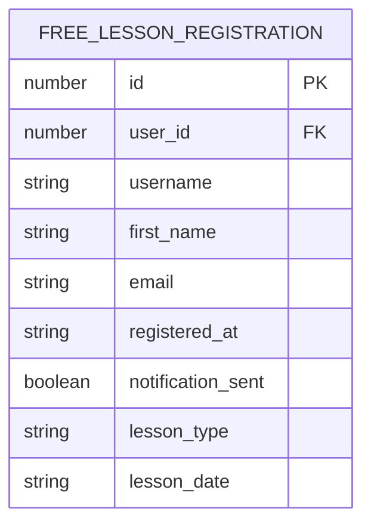
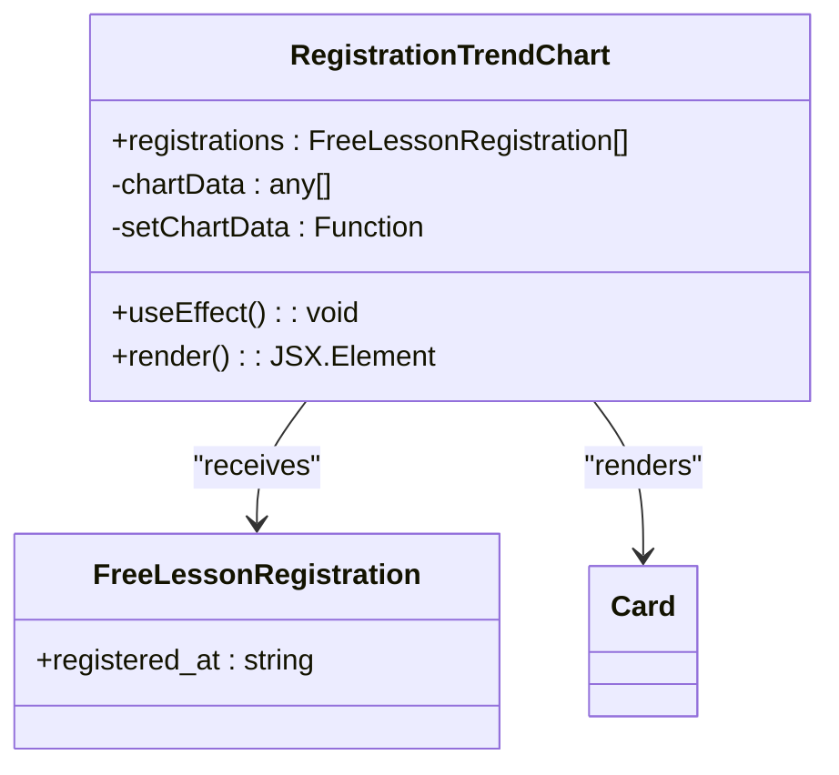
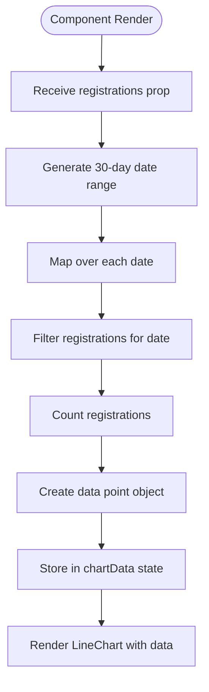
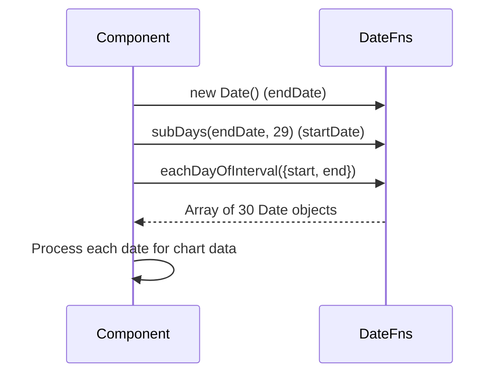
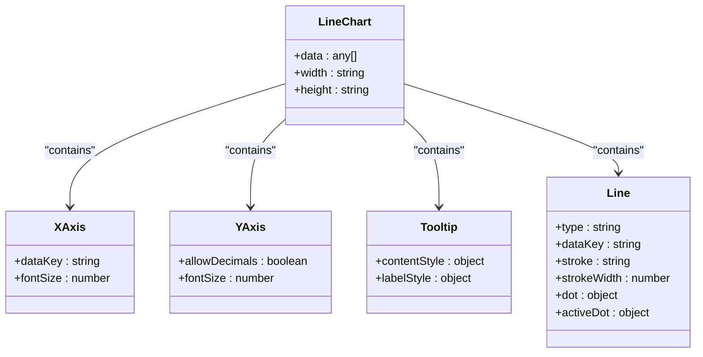
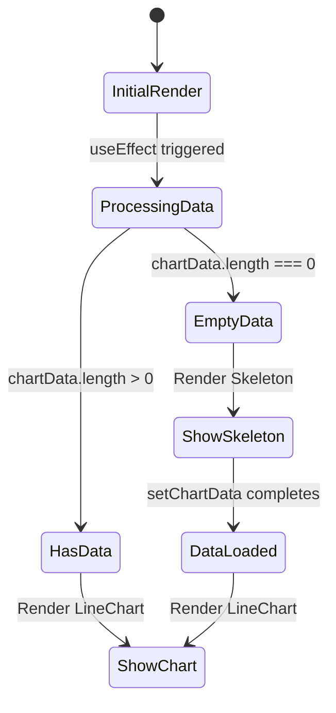
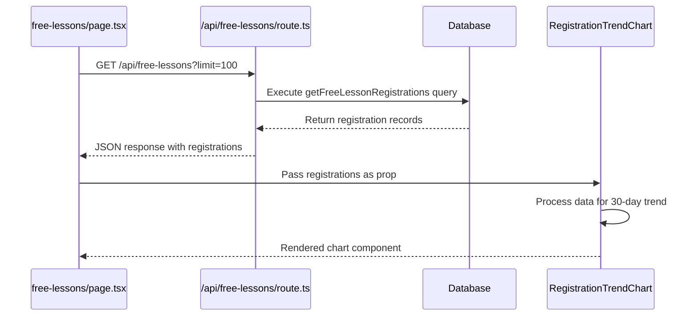
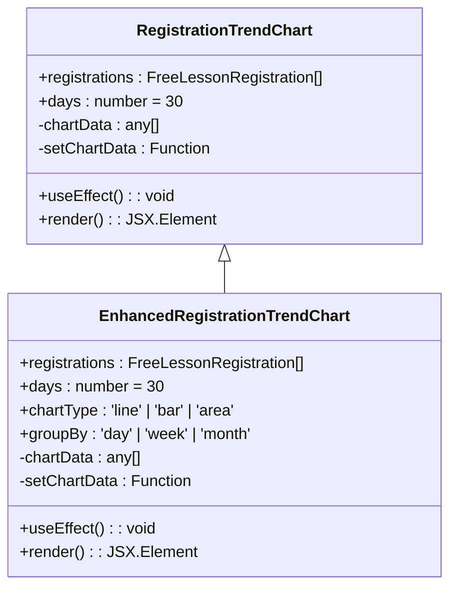

# Registration Trends

<cite>
**Referenced Files in This Document**   
- [RegistrationTrendChart.tsx](file://components/RegistrationTrendChart.tsx)
- [free-lessons/page.tsx](file://app/free-lessons/page.tsx)
- [queries.ts](file://lib/queries.ts)
- [route.ts](file://app/api/free-lessons/route.ts)
</cite>

## Table of Contents
1. [Introduction](#introduction)
2. [Free Lesson Registration Data Model](#free-lesson-registration-data-model)
3. [Component Architecture](#component-architecture)
4. [Data Processing Flow](#data-processing-flow)
5. [Date Range Generation](#date-range-generation)
6. [Chart Visualization](#chart-visualization)
7. [Loading State Management](#loading-state-management)
8. [API Integration](#api-integration)
9. [Customization and Extension](#customization-and-extension)
10. [Troubleshooting Guide](#troubleshooting-guide)

## Introduction
The Registration Trends feature provides a visual representation of free lesson sign-ups over a 30-day period using the RegistrationTrendChart component. This document details the implementation of this component, which leverages Recharts LineChart for data visualization and date-fns for date manipulation. The component processes registration data, generates a time series for the last 30 days, and displays trends in user sign-ups. It includes a skeleton loading state and handles data filtering by day to provide meaningful insights into registration patterns.

**Section sources**
- [RegistrationTrendChart.tsx](file://components/RegistrationTrendChart.tsx#L1-L98)

## Free Lesson Registration Data Model
The FreeLessonRegistration data model defines the structure of registration records used throughout the application. The core field for trend analysis is `registered_at`, which stores the timestamp of when a user registered for a free lesson. This field is used to filter and group registrations by date for the trend chart visualization.

The complete data model includes additional fields such as user identification (user_id, username, first_name), contact information (email), lesson details (lesson_type, lesson_date), and tracking information (notification_sent). However, the RegistrationTrendChart component only requires the `registered_at` field, demonstrating a focused interface that receives only the necessary data for its specific purpose.

**Diagram sources**
- [queries.ts](file://lib/queries.ts#L33-L43)
- [RegistrationTrendChart.tsx](file://components/RegistrationTrendChart.tsx#L8-L10)

**Section sources**
- [queries.ts](file://lib/queries.ts#L33-L43)
- [RegistrationTrendChart.tsx](file://components/RegistrationTrendChart.tsx#L8-L10)

## Component Architecture
The RegistrationTrendChart component follows a functional React component pattern with hooks for state management and side effects. It accepts a single prop, `registrations`, which is an array of FreeLessonRegistration objects. The component uses the useState hook to manage the processed chart data and the useEffect hook to transform the raw registration data into a format suitable for visualization.

The component is wrapped in a Card UI element that provides a consistent visual container with a header containing the title "Registration Trend (30 days)". This design ensures the chart integrates seamlessly with the overall application UI while maintaining a clear focus on the trend data.

**Diagram sources**
- [RegistrationTrendChart.tsx](file://components/RegistrationTrendChart.tsx#L16-L98)

**Section sources**
- [RegistrationTrendChart.tsx](file://components/RegistrationTrendChart.tsx#L16-L98)

## Data Processing Flow
The data processing flow in the RegistrationTrendChart component begins with the useEffect hook, which executes whenever the `registrations` prop changes. The hook generates a date range for the last 30 days using date-fns functions, then maps over this range to create data points for each day.

For each date in the range, the component filters the registration data to count how many registrations occurred on that specific day. The date string is formatted to 'yyyy-MM-dd' for comparison, ensuring accurate day-based filtering regardless of the time component in the timestamp. The resulting data point includes the formatted date label, registration count, and full date string.

**Diagram sources**
- [RegistrationTrendChart.tsx](file://components/RegistrationTrendChart.tsx#L20-L45)

**Section sources**
- [RegistrationTrendChart.tsx](file://components/RegistrationTrendChart.tsx#L20-L45)

## Date Range Generation
The component uses date-fns to generate a date range for the last 30 days. It creates an end date set to the current date and a start date calculated by subtracting 29 days from the end date using the `subDays` function. This creates a 30-day window (inclusive of both start and end dates).

The `eachDayOfInterval` function from date-fns generates an array of Date objects for each day within this interval. This approach ensures consistent daily intervals and properly handles edge cases like month and year boundaries. The generated date range serves as the foundation for the trend analysis, providing a complete timeline even for days with zero registrations.

**Diagram sources**
- [RegistrationTrendChart.tsx](file://components/RegistrationTrendChart.tsx#L22-L24)

**Section sources**
- [RegistrationTrendChart.tsx](file://components/RegistrationTrendChart.tsx#L22-L24)

## Chart Visualization
The chart visualization is implemented using Recharts LineChart, which provides a responsive and interactive line graph. The chart displays registration trends with the date on the x-axis and registration count on the y-axis. The x-axis uses the "MMM dd" date format (e.g., "Jan 15") for clear readability, while the y-axis shows whole numbers only, as fractional registrations are not meaningful.

The line is styled with the application's primary color and includes data points represented as circles. When users hover over data points, a tooltip appears with detailed information. The chart is wrapped in a ResponsiveContainer to ensure it adapts to different screen sizes and container dimensions.

**Diagram sources**
- [RegistrationTrendChart.tsx](file://components/RegistrationTrendChart.tsx#L55-L90)

**Section sources**
- [RegistrationTrendChart.tsx](file://components/RegistrationTrendChart.tsx#L55-L90)

## Loading State Management
The component implements a skeleton loading state to provide visual feedback when data is being processed. Initially, the `chartData` state is an empty array. When the component first renders or when the `registrations` prop changes, the chart data is being processed in the background.

If `chartData` is empty (length 0), the component renders a Card with a Skeleton component instead of the chart. This skeleton has a fixed height of 64 units, maintaining consistent layout spacing while data loads. Once the data processing completes and `chartData` is populated, the actual chart renders immediately, providing a smooth transition from loading state to data visualization.

**Diagram sources**
- [RegistrationTrendChart.tsx](file://components/RegistrationTrendChart.tsx#L47-L53)

**Section sources**
- [RegistrationTrendChart.tsx](file://components/RegistrationTrendChart.tsx#L47-L53)

## API Integration
The RegistrationTrendChart component receives its data from an API endpoint that provides free lesson registration records. The data flows through the free-lessons page, which fetches registration data from the `/api/free-lessons` endpoint using the `getFreeLessonRegistrations` function from the queries library.

The API route uses a database query to retrieve registration records, converting the registered_at timestamp to ISO format for consistent date handling. The page component passes the registration data as a prop to the RegistrationTrendChart, establishing a clear data flow from API to visualization.

**Diagram sources**
- [free-lessons/page.tsx](file://app/free-lessons/page.tsx#L25-L35)
- [route.ts](file://app/api/free-lessons/route.ts#L4-L12)
- [queries.ts](file://lib/queries.ts#L200-L215)

**Section sources**
- [free-lessons/page.tsx](file://app/free-lessons/page.tsx#L25-L35)
- [route.ts](file://app/api/free-lessons/route.ts#L4-L12)

## Customization and Extension
The RegistrationTrendChart component can be extended to support different time periods beyond the current 30-day window. This could be achieved by adding a prop to specify the number of days, allowing for 7-day, 90-day, or custom period trends. The date range generation logic would need to be modified to accept a configurable duration.

Additional customization options could include different chart types (bar chart, area chart), multiple data series (comparing different lesson types), or interactive date range selection. The component's current design, with its focused data processing in useEffect and clear separation of concerns, provides a solid foundation for these enhancements.

**Diagram sources**
- [RegistrationTrendChart.tsx](file://components/RegistrationTrendChart.tsx#L22-L24)

**Section sources**
- [RegistrationTrendChart.tsx](file://components/RegistrationTrendChart.tsx#L22-L24)

## Troubleshooting Guide
Common issues with the Registration Trend feature include empty charts, incorrect date formatting, and performance concerns with large datasets. If the chart displays a skeleton loading state indefinitely, verify that the `registrations` prop contains data and that the `registered_at` field is properly formatted as an ISO string.

For date-related issues, ensure that the date-fns formatting strings match between the filtering logic ('yyyy-MM-dd') and the original data format. When dealing with large datasets, consider implementing pagination or data sampling to maintain performance, as the current implementation processes all received registration data on every render.

To debug data flow issues, verify the API response structure matches the FreeLessonRegistration interface and confirm that the parent component is properly passing the registrations prop to the RegistrationTrendChart component.

**Section sources**
- [RegistrationTrendChart.tsx](file://components/RegistrationTrendChart.tsx#L47-L53)
- [free-lessons/page.tsx](file://app/free-lessons/page.tsx#L25-L35)
- [route.ts](file://app/api/free-lessons/route.ts#L4-L12)