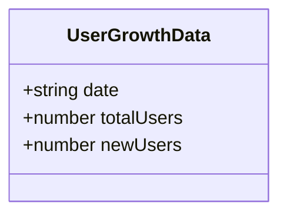
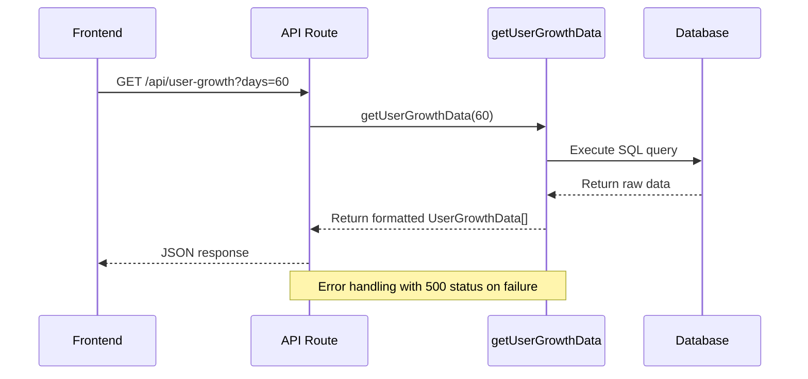
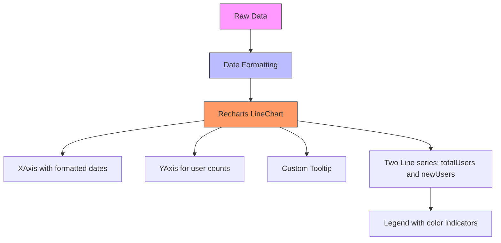
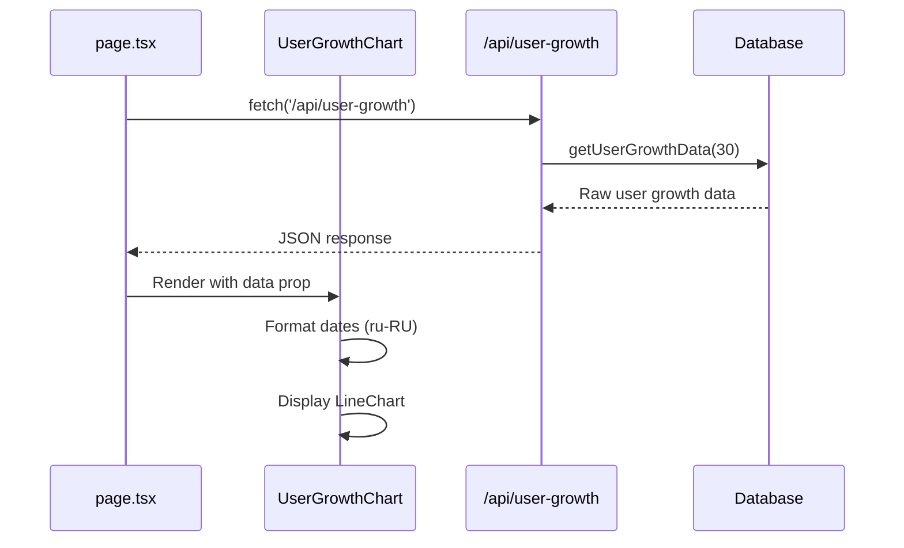

# User Growth Analytics

<cite>
**Referenced Files in This Document**   
- [UserGrowthChart.tsx](file://components/UserGrowthChart.tsx)
- [route.ts](file://app/api/user-growth/route.ts)
- [queries.ts](file://lib/queries.ts)
- [page.tsx](file://app/page.tsx)
</cite>

## Table of Contents
1. [Introduction](#introduction)
2. [Data Model](#data-model)
3. [Backend Implementation](#backend-implementation)
4. [Frontend Component](#frontend-component)
5. [Integration and Data Flow](#integration-and-data-flow)
6. [Customization and Extension](#customization-and-extension)
7. [Troubleshooting Guide](#troubleshooting-guide)

## Introduction

The User Growth Analytics feature provides visualization of user growth metrics over time, displaying both total and new users through a Recharts LineChart component. This documentation details the implementation of the UserGrowthChart component and its integration with the backend API, covering data fetching, processing, formatting, and display. The system enables configurable time periods and provides localized Russian formatting for dates and tooltips.

**Section sources**
- [UserGrowthChart.tsx](file://components/UserGrowthChart.tsx)
- [route.ts](file://app/api/user-growth/route.ts)

## Data Model

The UserGrowthData interface defines the structure of user growth data used throughout the application. This interface is consistently defined across multiple files in the codebase, ensuring type safety and consistency between frontend and backend components.

**Diagram sources**
- [queries.ts](file://lib/queries.ts#L52-L56)
- [UserGrowthChart.tsx](file://components/UserGrowthChart.tsx#L5-L9)

The data model contains three key fields:
- `date`: A string representation of the date in ISO format (YYYY-MM-DD)
- `totalUsers`: The cumulative number of users up to that date
- `newUsers`: The number of new users acquired on that specific date

This consistent interface definition across the codebase ensures type safety and prevents data structure mismatches between components.

**Section sources**
- [queries.ts](file://lib/queries.ts#L52-L56)
- [UserGrowthChart.tsx](file://components/UserGrowthChart.tsx#L5-L9)
- [page.tsx](file://app/page.tsx#L21-L25)

## Backend Implementation

The backend implementation of the user growth analytics feature consists of an API route that serves as an interface between the frontend component and the database query logic. The API endpoint at `/api/user-growth` accepts an optional 'days' parameter to configure the time period for data retrieval, defaulting to 30 days when not specified.

**Diagram sources**
- [route.ts](file://app/api/user-growth/route.ts#L1-L17)
- [queries.ts](file://lib/queries.ts#L474-L539)

The backend implementation includes comprehensive error handling, with try-catch blocks that log errors to the console and return appropriate HTTP status codes and error messages to the frontend. The database query uses a complex CTE (Common Table Expression) to calculate cumulative user growth, handling edge cases such as historical user data that predates the requested time period.

**Section sources**
- [route.ts](file://app/api/user-growth/route.ts#L1-L17)
- [queries.ts](file://lib/queries.ts#L474-L539)

## Frontend Component

The UserGrowthChart component is a client-side React component that visualizes user growth data using Recharts. The component receives data through props and processes it for display, applying Russian locale formatting to dates and customizing tooltips for better user experience.

**Diagram sources**
- [UserGrowthChart.tsx](file://components/UserGrowthChart.tsx#L15-L86)

The component implementation includes several key features:
- Date formatting using the Russian locale ('ru-RU') with short month names and numeric day values
- Custom tooltip formatting that translates metric names to Russian
- Distinct visual styling for the two data series (total users and new users)
- Responsive container for proper display across different screen sizes
- Legend elements with colored indicators matching the chart lines

The date formatting is applied through JavaScript's toLocaleDateString method, transforming ISO date strings into more readable formats like "янв. 15" for January 15th.

**Section sources**
- [UserGrowthChart.tsx](file://components/UserGrowthChart.tsx#L15-L86)

## Integration and Data Flow

The integration between the frontend UserGrowthChart component and the backend API follows a standard data flow pattern in the Next.js application. The main dashboard page (page.tsx) fetches user growth data from the API endpoint and passes it as props to the UserGrowthChart component.

**Diagram sources**
- [page.tsx](file://app/page.tsx#L150-L153)
- [UserGrowthChart.tsx](file://components/UserGrowthChart.tsx#L15-L86)
- [route.ts](file://app/api/user-growth/route.ts#L1-L17)

The data flow begins with the dashboard page making a fetch request to the user-growth API endpoint. The backend processes this request, retrieves data from the database through the getUserGrowthData function, and returns it in JSON format. The dashboard page then passes this data to the UserGrowthChart component via props, which processes and displays it with appropriate formatting.

**Section sources**
- [page.tsx](file://app/page.tsx#L150-L153)
- [UserGrowthChart.tsx](file://components/UserGrowthChart.tsx#L15-L86)

## Customization and Extension

The UserGrowthChart component and its associated backend functionality can be customized and extended in several ways to meet evolving requirements. The current implementation provides a solid foundation that can be enhanced with additional features and metrics.

To customize the chart appearance, developers can modify the Recharts component properties such as colors, line styles, and tooltip styling. The current implementation already demonstrates customization through:
- Custom tooltip content styling with card-like appearance
- Russian language labels for data series
- Specific stroke widths and dot styling for data points
- Custom legend with colored indicators

To extend the functionality with additional metrics, developers could:
1. Modify the UserGrowthData interface to include new fields
2. Update the database query in getUserGrowthData to calculate additional metrics
3. Add new Line components to the chart with different dataKeys
4. Update tooltip formatters to handle new metric names

Potential extensions include adding metrics like user retention, churn rate, or conversion rates from free to paid users. The modular design of the component and API endpoint makes such extensions relatively straightforward.

**Section sources**
- [UserGrowthChart.tsx](file://components/UserGrowthChart.tsx#L15-L86)
- [queries.ts](file://lib/queries.ts#L474-L539)

## Troubleshooting Guide

When working with the User Growth Analytics feature, several common issues may arise. This section provides guidance on identifying and resolving these issues.

### Data Loading Issues
If the chart displays but shows no data, check:
- Network requests to /api/user-growth in browser developer tools
- API response format matches the UserGrowthData interface
- Data prop being passed correctly to the UserGrowthChart component
- Loading state management in the parent component

### Date Formatting Problems
If dates appear incorrectly formatted:
- Verify the locale string 'ru-RU' is correctly specified
- Check that date strings from the API are in valid ISO format
- Ensure the date transformation in the formattedData map function executes properly

### API Errors
If the API returns errors:
- Check server logs for database query errors
- Verify the days parameter is properly parsed as an integer
- Ensure the database connection is available
- Validate that the SQL query in getUserGrowthData executes correctly

### Visual Display Issues
For chart rendering problems:
- Confirm Recharts dependencies are properly installed
- Check that the ResponsiveContainer has sufficient height
- Verify CSS classes don't interfere with chart rendering
- Ensure data array is not empty when passed to the chart

The error handling in the API route provides valuable debugging information, logging errors to the console and returning descriptive error messages to help diagnose issues.

**Section sources**
- [route.ts](file://app/api/user-growth/route.ts#L1-L17)
- [UserGrowthChart.tsx](file://components/UserGrowthChart.tsx#L15-L86)
- [page.tsx](file://app/page.tsx#L150-L153)