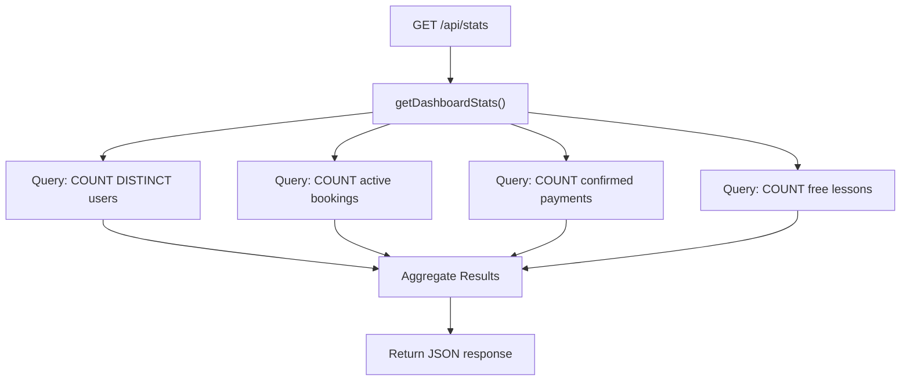
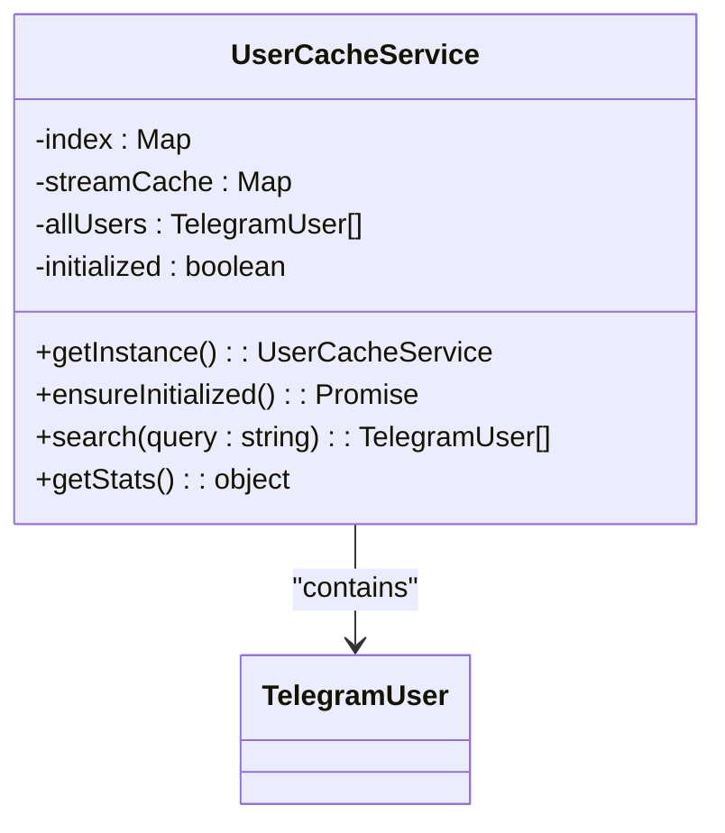
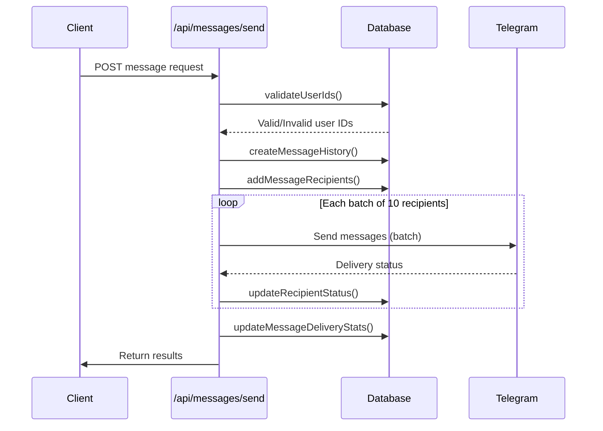
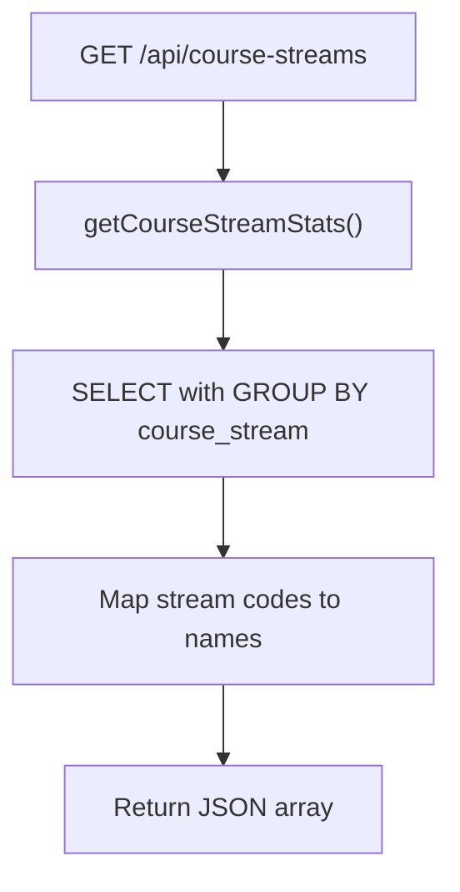
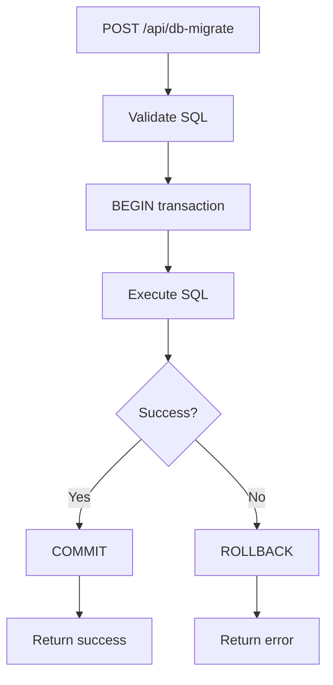
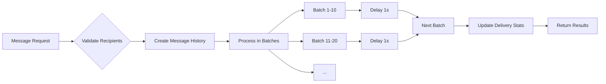
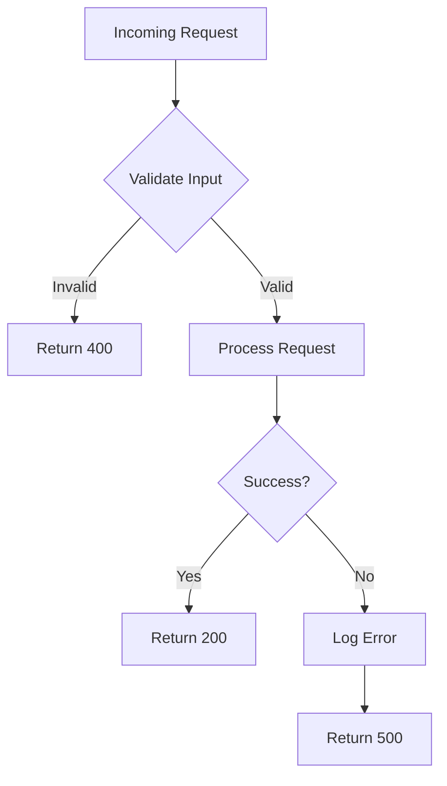

# API Endpoints

<cite>
**Referenced Files in This Document**   
- [stats/route.ts](file://app/api/stats/route.ts)
- [users/search/route.ts](file://app/api/users/search/route.ts)
- [messages/send/route.ts](file://app/api/messages/send/route.ts)
- [course-streams/route.ts](file://app/api/course-streams/route.ts)
- [db-migrate/route.ts](file://app/api/db-migrate/route.ts)
- [queries.ts](file://lib/queries.ts)
- [userCache.ts](file://lib/userCache.ts)
</cite>

## Table of Contents
1. [Introduction](#introduction)
2. [Core Endpoints Overview](#core-endpoints-overview)
3. [Endpoint: /api/stats](#endpoint-api-stats)
4. [Endpoint: /api/users/search](#endpoint-api-users-search)
5. [Endpoint: /api/messages/send](#endpoint-api-messages-send)
6. [Endpoint: /api/course-streams](#endpoint-api-course-streams)
7. [Endpoint: /api/db-migrate](#endpoint-api-db-migrate)
8. [Data Loading and Processing Strategies](#data-loading-and-processing-strategies)
9. [Security and Validation Practices](#security-and-validation-practices)
10. [Error Handling and Rate Limiting](#error-handling-and-rate-limiting)
11. [Usage Patterns and Implementation Guidance](#usage-patterns-and-implementation-guidance)

## Introduction
This document provides comprehensive API documentation for the RESTful endpoints in the hsl-dashboard application. It details the functionality, request/response schemas, authentication requirements, and implementation patterns for key endpoints that support dashboard analytics, user search, message broadcasting, course analytics, and database management. The documentation is based on direct analysis of the source code and reflects actual implementation details.

## Core Endpoints Overview
The hsl-dashboard exposes several critical RESTful endpoints that serve different aspects of the application's functionality:

- **/api/stats**: Retrieves aggregated dashboard metrics including user counts, bookings, and registrations
- **/api/users/search**: Provides instant cached user search with optional cache statistics
- **/api/messages/send**: Enables broadcasting messages to Telegram users with batch processing
- **/api/course-streams**: Returns detailed analytics for course streams and enrollment status
- **/api/db-migrate**: Allows secure execution of database schema migrations via API

These endpoints follow consistent patterns for error handling, database connectivity, and security validation.

**Section sources**
- [stats/route.ts](file://app/api/stats/route.ts)
- [users/search/route.ts](file://app/api/users/search/route.ts)
- [messages/send/route.ts](file://app/api/messages/send/route.ts)
- [course-streams/route.ts](file://app/api/course-streams/route.ts)
- [db-migrate/route.ts](file://app/api/db-migrate/route.ts)

## Endpoint: /api/stats
Retrieves comprehensive dashboard statistics for display on the main analytics interface.

### HTTP Method and URL
```
GET /api/stats
```

### Authentication Requirements
None - public endpoint accessible without authentication.

### Request Parameters
No request parameters required.

### Response Schema
```json
{
  "totalUsers": number,
  "activeBookings": number,
  "confirmedPayments": number,
  "freeLessonRegistrations": number
}
```

### Example Response
```json
{
  "totalUsers": 1247,
  "activeBookings": 89,
  "confirmedPayments": 76,
  "freeLessonRegistrations": 342
}
```

### Error Codes
- **500 Internal Server Error**: Failed to fetch dashboard statistics due to database or system error

### Implementation Details
The endpoint uses the `getDashboardStats()` function from `queries.ts` to aggregate data from multiple tables (bookings, events, free_lesson_registrations) using SQL UNION operations to count unique users across all systems.



**Diagram sources**
- [stats/route.ts](file://app/api/stats/route.ts#L1-L15)
- [queries.ts](file://lib/queries.ts#L102-L140)

**Section sources**
- [stats/route.ts](file://app/api/stats/route.ts#L1-L15)
- [queries.ts](file://lib/queries.ts#L102-L140)

## Endpoint: /api/users/search
Provides instant user search functionality using an in-memory cache for high-performance lookups.

### HTTP Method and URL
```
GET /api/users/search
```

### Authentication Requirements
None - public endpoint accessible without authentication.

### Request Parameters
| Parameter | Type | Required | Description |
|---------|------|----------|-------------|
| q | string | No | Search query for username or first name (minimum 1 character) |
| stats | boolean | No | If "true", returns cache statistics instead of search results |

### Response Schema
Array of user objects matching the search criteria:
```json
[
  {
    "user_id": number,
    "username": string,
    "first_name": string
  }
]
```

When `stats=true`, returns cache statistics:
```json
{
  "totalUsers": number,
  "indexSize": number,
  "streamCacheSize": number,
  "streamStats": {
    "3rd_stream": number,
    "4th_stream": number,
    "5th_stream": number
  },
  "nonCourseUsers": number,
  "initialized": boolean,
  "lastUpdate": string
}
```

### Example Requests
```
GET /api/users/search?q=john
GET /api/users/search?stats=true
```

### Example Responses
Search results:
```json
[
  {
    "user_id": 123456,
    "username": "johndoe",
    "first_name": "John"
  }
]
```

Cache statistics:
```json
{
  "totalUsers": 1247,
  "indexSize": 26,
  "streamCacheSize": 3,
  "streamStats": {
    "3rd_stream": 45,
    "4th_stream": 32,
    "5th_stream": 28
  },
  "nonCourseUsers": 89,
  "initialized": true,
  "lastUpdate": "2024-01-15T10:30:00.000Z"
}
```

### Error Codes
- **500 Internal Server Error**: Failed to search users due to system error

### Implementation Details
The endpoint leverages the `UserCacheService` singleton to provide instant search results. The cache uses a letter-based indexing system for O(1) lookup performance and automatically refreshes every 5 minutes.



**Diagram sources**
- [userCache.ts](file://lib/userCache.ts#L2-L212)
- [users/search/route.ts](file://app/api/users/search/route.ts#L1-L36)

**Section sources**
- [users/search/route.ts](file://app/api/users/search/route.ts#L1-L36)
- [userCache.ts](file://lib/userCache.ts#L2-L212)

## Endpoint: /api/messages/send
Broadcasts messages to Telegram users with support for text, video, and document content.

### HTTP Method and URL
```
POST /api/messages/send
```

### Authentication Requirements
None - but requires valid BOT_TOKEN environment variable to be configured.

### Request Schema
```json
{
  "recipients": [
    {
      "user_id": number,
      "username": string,
      "first_name": string
    }
  ],
  "message": {
    "type": "text" | "video" | "document",
    "text": string,
    "parse_mode": "HTML",
    "video_file_id": string,
    "document_file_id": string,
    "buttons": [
      {
        "text": string,
        "url": string,
        "callback_data": string,
        "row": number
      }
    ]
  },
  "scheduled_at": string
}
```

### Response Schema
Success response:
```json
{
  "success": true,
  "message_id": number,
  "sent_count": number,
  "failed_count": number,
  "errors": [
    {
      "user_id": number,
      "error": string
    }
  ]
}
```

Scheduled message response:
```json
{
  "success": true,
  "scheduled": true,
  "message_id": number,
  "scheduled_at": string,
  "recipient_count": number,
  "message": string
}
```

### Example Request
```json
{
  "recipients": [
    {"user_id": 123456, "username": "johndoe"},
    {"user_id": 789012, "username": "janedoe"}
  ],
  "message": {
    "type": "text",
    "text": "Hello! <b>Welcome</b> to our course!",
    "buttons": [
      {
        "text": "Join Group",
        "url": "https://t.me/course_group"
      }
    ]
  }
}
```

### Error Codes
- **400 Bad Request**: Invalid request data (missing recipients, empty message, invalid scheduled time)
- **400 Bad Request**: Some user IDs not found in database
- **500 Internal Server Error**: Bot token not configured or system error

### Implementation Details
The endpoint implements batch processing to respect Telegram's rate limits, sending messages in batches of 10 with 1-second delays between batches.



**Diagram sources**
- [messages/send/route.ts](file://app/api/messages/send/route.ts#L1-L372)
- [queries.ts](file://lib/queries.ts#L675-L694)

**Section sources**
- [messages/send/route.ts](file://app/api/messages/send/route.ts#L1-L372)
- [queries.ts](file://lib/queries.ts#L675-L694)

## Endpoint: /api/course-streams
Retrieves detailed analytics for course streams including enrollment and confirmation status.

### HTTP Method and URL
```
GET /api/course-streams
```

### Authentication Requirements
None - public endpoint accessible without authentication.

### Request Parameters
No request parameters required.

### Response Schema
Array of course stream statistics:
```json
[
  {
    "courseId": number,
    "courseName": string,
    "courseStream": string,
    "total": number,
    "confirmed": number,
    "pending": number,
    "cancelled": number
  }
]
```

### Example Response
```json
[
  {
    "courseId": 1,
    "courseName": "Вайб кодинг",
    "courseStream": "3-й поток",
    "total": 45,
    "confirmed": 38,
    "pending": 5,
    "cancelled": 2
  }
]
```

### Error Codes
- **500 Internal Server Error**: Failed to fetch course stream statistics due to database or system error

### Implementation Details
The endpoint queries the bookings table to aggregate statistics by course and stream, mapping internal stream codes to human-readable names.



**Diagram sources**
- [course-streams/route.ts](file://app/api/course-streams/route.ts#L1-L14)
- [queries.ts](file://lib/queries.ts#L178-L218)

**Section sources**
- [course-streams/route.ts](file://app/api/course-streams/route.ts#L1-L14)
- [queries.ts](file://lib/queries.ts#L178-L218)

## Endpoint: /api/db-migrate
Executes database schema migrations via API with transaction safety.

### HTTP Method and URL
```
POST /api/db-migrate
```

### Authentication Requirements
None - but should be protected in production environments.

### Request Schema
```json
{
  "sql": string,
  "description": string
}
```

### Response Schema
Success response:
```json
{
  "success": true,
  "message": string,
  "rowsAffected": number,
  "command": string
}
```

Error response:
```json
{
  "success": false,
  "error": string
}
```

### Example Request
```json
{
  "sql": "ALTER TABLE users ADD COLUMN email_verified BOOLEAN DEFAULT false",
  "description": "Add email verification flag to users table"
}
```

### Example Response
```json
{
  "success": true,
  "message": "Migration executed successfully: Add email verification flag to users table",
  "rowsAffected": 0,
  "command": "ALTER TABLE"
}
```

### Error Codes
- **400 Bad Request**: SQL statement is required
- **500 Internal Server Error**: Migration execution error (transaction rolled back)

### Implementation Details
The endpoint executes SQL statements within a database transaction, ensuring atomicity - if any error occurs, the transaction is rolled back.



**Diagram sources**
- [db-migrate/route.ts](file://app/api/db-migrate/route.ts#L1-L54)

**Section sources**
- [db-migrate/route.ts](file://app/api/db-migrate/route.ts#L1-L54)

## Data Loading and Processing Strategies
The application employs several sophisticated data loading and processing strategies to optimize performance and reliability.

### Tiered Data Loading in Dashboard API
The main dashboard API (`/api/stats`) uses a tiered approach to data loading:

1. **Direct Database Queries**: Each metric is retrieved through optimized SQL queries
2. **Connection Pooling**: Uses a connection pool to manage database connections efficiently
3. **Error Isolation**: Each query is independent, so failure in one doesn't affect others
4. **Aggregation**: Results are aggregated in application code before response

This strategy ensures that the dashboard loads quickly even when some data sources are temporarily unavailable.

### Batch Processing for Message Sending
The message broadcasting system implements batch processing to handle large recipient lists:

- **Batch Size**: 10 recipients per batch
- **Rate Limiting**: 1-second delay between batches
- **Error Isolation**: Individual message failures don't stop the entire broadcast
- **Progress Tracking**: Real-time status updates for sent and failed messages

This approach respects Telegram's rate limits while maximizing delivery efficiency.



**Diagram sources**
- [messages/send/route.ts](file://app/api/messages/send/route.ts#L1-L372)
- [stats/route.ts](file://app/api/stats/route.ts#L1-L15)

**Section sources**
- [messages/send/route.ts](file://app/api/messages/send/route.ts#L1-L372)
- [stats/route.ts](file://app/api/stats/route.ts#L1-L15)

## Security and Validation Practices
The application implements several security and validation practices to protect data integrity and prevent common vulnerabilities.

### Parameterized Queries
All database operations use parameterized queries to prevent SQL injection attacks:

- **Input Validation**: All user inputs are validated before database operations
- **Type Safety**: TypeScript interfaces ensure data type consistency
- **Environment Validation**: Critical environment variables (BOT_TOKEN) are checked before use

### Input Sanitization
The application sanitizes and validates all incoming data:

- **User ID Validation**: Verifies that all recipient user IDs exist in the database
- **Message Length Limits**: Enforces Telegram's message length constraints
- **Future Scheduling**: Validates that scheduled times are in the future
- **Media Type Validation**: Ensures proper file IDs for video and document messages

### Error Handling
Comprehensive error handling is implemented throughout the API:

- **Try-Catch Blocks**: All asynchronous operations are wrapped in try-catch
- **Transaction Safety**: Database migrations use BEGIN/COMMIT/ROLLBACK
- **Graceful Degradation**: Cache system continues to work even if refresh fails
- **Detailed Logging**: Comprehensive logging for debugging and monitoring



**Section sources**
- [messages/send/route.ts](file://app/api/messages/send/route.ts#L1-L372)
- [db-migrate/route.ts](file://app/api/db-migrate/route.ts#L1-L54)
- [queries.ts](file://lib/queries.ts)

## Error Handling and Rate Limiting
The API implements robust error handling and respects external rate limits.

### Error Handling Patterns
All endpoints follow a consistent error handling pattern:

- **500 Internal Server Error**: System-level errors (database connectivity, etc.)
- **400 Bad Request**: Client input errors (validation failures)
- **Structured Error Responses**: Clear error messages with context
- **Comprehensive Logging**: All errors are logged with context for debugging

### Rate Limiting Considerations
The application respects external API rate limits:

- **Telegram API**: 1 message per second per chat, handled by 1-second batch delays
- **Database Connections**: Connection pooling prevents overwhelming the database
- **Cache TTL**: 5-minute cache expiration balances freshness and performance

For high-volume operations, the batch processing approach ensures compliance with rate limits while maintaining acceptable performance.

**Section sources**
- [messages/send/route.ts](file://app/api/messages/send/route.ts#L1-L372)
- [userCache.ts](file://lib/userCache.ts#L2-L212)

## Usage Patterns and Implementation Guidance
Based on the code analysis, here are recommended usage patterns and implementation guidance.

### Common Implementation Issues
- **Missing BOT_TOKEN**: Ensure the BOT_TOKEN environment variable is set
- **Invalid User IDs**: Always validate user IDs before sending messages
- **Message Length**: Respect Telegram's 4096 character limit for text messages
- **Cache Initialization**: The user cache initializes lazily on first access
- **Transaction Safety**: Database migrations are atomic and rollback on error

### Best Practices
- **Use Cache for User Search**: Leverage the cached search endpoint for performance
- **Batch Large Messages**: For large recipient lists, expect longer processing times
- **Monitor Migration Logs**: Check DATABASE_MIGRATION_LOG.md after schema changes
- **Handle Partial Failures**: Message sending may have mixed success/failure results
- **Validate Scheduled Times**: Ensure scheduled_at is a valid future ISO timestamp

### Integration Examples
When integrating with these APIs:

1. **Dashboard Display**: Call `/api/stats` and `/api/course-streams` on page load
2. **User Search**: Use `/api/users/search?q=username` for real-time search
3. **Message Broadcasting**: POST to `/api/messages/send` with recipient list
4. **Database Management**: Use `/api/db-migrate` for controlled schema changes

The APIs are designed to be consumed directly by the frontend application with minimal transformation required.

**Section sources**
- [stats/route.ts](file://app/api/stats/route.ts)
- [users/search/route.ts](file://app/api/users/search/route.ts)
- [messages/send/route.ts](file://app/api/messages/send/route.ts)
- [course-streams/route.ts](file://app/api/course-streams/route.ts)
- [db-migrate/route.ts](file://app/api/db-migrate/route.ts)
- [queries.ts](file://lib/queries.ts)
- [userCache.ts](file://lib/userCache.ts)