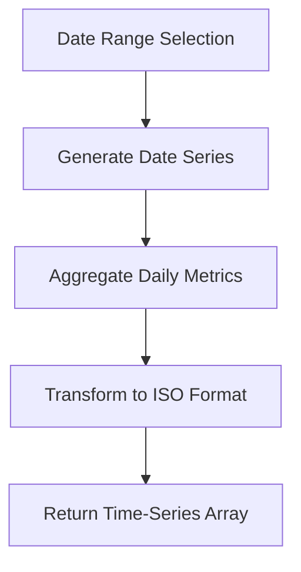
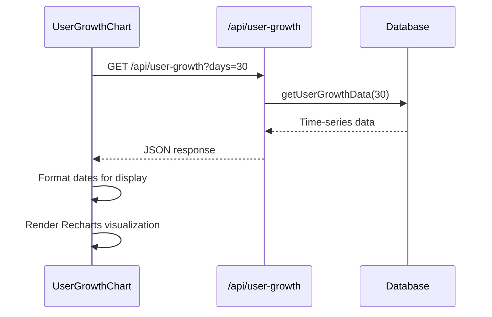
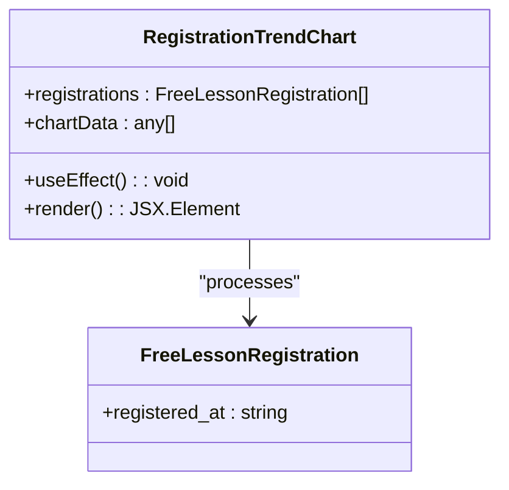
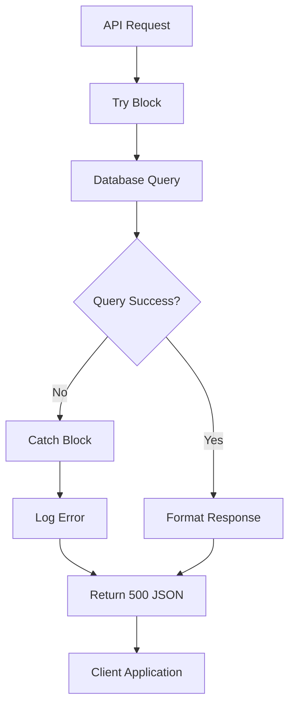

# Analytics Data API

<cite>
**Referenced Files in This Document**   
- [user-growth/route.ts](file://app/api/user-growth/route.ts)
- [events/route.ts](file://app/api/events/route.ts)
- [UserGrowthChart.tsx](file://components/UserGrowthChart.tsx)
- [RegistrationTrendChart.tsx](file://components/RegistrationTrendChart.tsx)
- [queries.ts](file://lib/queries.ts)
- [db.ts](file://lib/db.ts)
</cite>

## Table of Contents
1. [Introduction](#introduction)
2. [Core Endpoints](#core-endpoints)
3. [Time-Series Data Format](#time-series-data-format)
4. [Query Parameters](#query-parameters)
5. [Response Structure](#response-structure)
6. [Chart Integration](#chart-integration)
7. [Error Handling](#error-handling)
8. [Performance Optimization](#performance-optimization)
9. [Conclusion](#conclusion)

## Introduction
The Analytics Data API provides time-series endpoints that power the dashboard visualizations for user growth and event registration trends. These endpoints serve aggregated data from multiple sources including user bookings, event interactions, and free lesson registrations. The API is designed to support real-time analytics with efficient database queries, caching strategies, and optimized response formats for charting libraries like Recharts.

**Section sources**
- [user-growth/route.ts](file://app/api/user-growth/route.ts#L1-L17)
- [events/route.ts](file://app/api/events/route.ts#L1-L27)

## Core Endpoints

### /api/user-growth
This endpoint provides cohort-based user acquisition metrics, returning daily new user counts and cumulative total users over a specified time period. The data is aggregated from multiple sources: bookings, events, and free lesson registrations.

### /api/events
This endpoint serves event registration trends with multiple data types:
- **Daily statistics**: New users, bookings, and events by date
- **Recent events**: Latest user interactions with event details
- **Top events**: Most frequent event types by count

The endpoint uses query parameters to determine which data type to return, defaulting to top events when no type is specified.

**Section sources**
- [user-growth/route.ts](file://app/api/user-growth/route.ts#L1-L17)
- [events/route.ts](file://app/api/events/route.ts#L1-L27)
- [queries.ts](file://lib/queries.ts#L474-L539)

## Time-Series Data Format

All analytics endpoints return time-series data in a consistent ISO 8601 date format (YYYY-MM-DD). The data is aggregated at the daily level by default, providing one data point per day.



**Diagram sources**
- [queries.ts](file://lib/queries.ts#L244-L292)
- [queries.ts](file://lib/queries.ts#L474-L539)

## Query Parameters

### Common Parameters
| Parameter | Type | Default | Description |
|---------|------|---------|-------------|
| days | number | 30 | Number of days to include in the time series (1-90) |
| type | string | "top" | Data type for /api/events: "daily", "recent", or "top" |
| limit | number | 30 | Limit for recent events or top events results |

### Example Requests
```
GET /api/user-growth?days=60
GET /api/events?type=daily&days=45
GET /api/events?type=recent&limit=50
```

**Section sources**
- [user-growth/route.ts](file://app/api/user-growth/route.ts#L5-L7)
- [events/route.ts](file://app/api/events/route.ts#L5-L9)

## Response Structure

### /api/user-growth Response
```json
[
  {
    "date": "2024-01-15",
    "totalUsers": 1250,
    "newUsers": 42
  },
  {
    "date": "2024-01-16",
    "totalUsers": 1292,
    "newUsers": 42
  }
]
```

### /api/events?type=daily Response
```json
[
  {
    "date": "2024-01-15",
    "newUsers": 42,
    "bookings": 28,
    "events": 156
  }
]
```

### Error Response
```json
{
  "error": "Failed to fetch user growth data"
}
```

**Section sources**
- [user-growth/route.ts](file://app/api/user-growth/route.ts#L10-L17)
- [events/route.ts](file://app/api/events/route.ts#L20-L27)
- [queries.ts](file://lib/queries.ts#L474-L539)

## Chart Integration

### UserGrowthChart Component
The UserGrowthChart component consumes data from /api/user-growth to display both total user growth and daily new user acquisition. It uses Recharts to render a dual-line chart with:

- Primary line: Total users (cumulative)
- Secondary line: New users per day
- Russian language labels for display
- Custom tooltip formatting



**Diagram sources**
- [UserGrowthChart.tsx](file://components/UserGrowthChart.tsx#L1-L86)
- [user-growth/route.ts](file://app/api/user-growth/route.ts#L1-L17)

### RegistrationTrendChart Component
The RegistrationTrendChart component visualizes free lesson registration trends over a 30-day period. It processes raw registration data to aggregate counts by date and render a line chart showing registration volume trends.



**Diagram sources**
- [RegistrationTrendChart.tsx](file://components/RegistrationTrendChart.tsx#L1-L98)
- [queries.ts](file://lib/queries.ts#L244-L292)

**Section sources**
- [RegistrationTrendChart.tsx](file://components/RegistrationTrendChart.tsx#L1-L98)
- [events/route.ts](file://app/api/events/route.ts#L1-L27)

## Error Handling

The API implements robust error handling to ensure graceful degradation when database queries fail:

- All endpoints wrapped in try-catch blocks
- Server errors return 500 status with descriptive JSON
- Errors logged to console for debugging
- Empty datasets handled gracefully by chart components
- Skeleton loading states for initial data fetch



**Diagram sources**
- [user-growth/route.ts](file://app/api/user-growth/route.ts#L10-L17)
- [events/route.ts](file://app/api/events/route.ts#L20-L27)

**Section sources**
- [user-growth/route.ts](file://app/api/user-growth/route.ts#L10-L17)
- [events/route.ts](file://app/api/events/route.ts#L20-L27)

## Performance Optimization

### Database Query Optimization
The analytics queries use PostgreSQL's generate_series function to ensure complete date ranges, even when no data exists for certain days. Window functions calculate running totals efficiently in the database rather than in application code.

```sql
WITH date_series AS (
  SELECT generate_series(
    CURRENT_DATE - INTERVAL '30 days',
    CURRENT_DATE,
    INTERVAL '1 day'
  )::date AS date
)
```

### Caching Strategy
While not explicitly implemented in the current code, the architecture supports caching through:
- Database connection pooling
- Potential Redis integration for query results
- Client-side data caching in React components
- HTTP response caching headers

### Indexing Recommendations
For optimal performance, the following database indexes should exist:
- bookings(created_at, user_id, confirmed)
- events(created_at, user_id, event_type)
- free_lesson_registrations(registered_at, user_id)

**Section sources**
- [queries.ts](file://lib/queries.ts#L474-L539)
- [db.ts](file://lib/db.ts#L1-L52)

## Conclusion
The Analytics Data API provides robust time-series endpoints that power the dashboard's visualization components. By aggregating data from multiple sources and presenting it in a consistent format, the API enables meaningful insights into user growth and event registration trends. The integration with Recharts components ensures smooth, responsive visualizations, while the error handling and performance considerations maintain reliability under various conditions.

**Section sources**
- [user-growth/route.ts](file://app/api/user-growth/route.ts#L1-L17)
- [events/route.ts](file://app/api/events/route.ts#L1-L27)
- [UserGrowthChart.tsx](file://components/UserGrowthChart.tsx#L1-L86)
- [RegistrationTrendChart.tsx](file://components/RegistrationTrendChart.tsx#L1-L98)
- [queries.ts](file://lib/queries.ts#L474-L539)