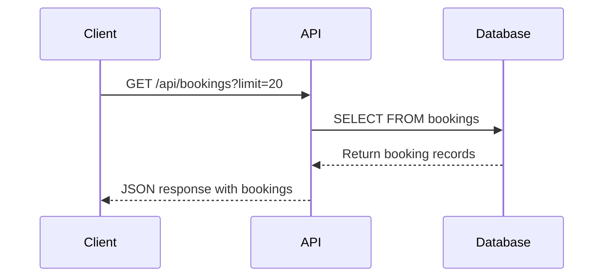
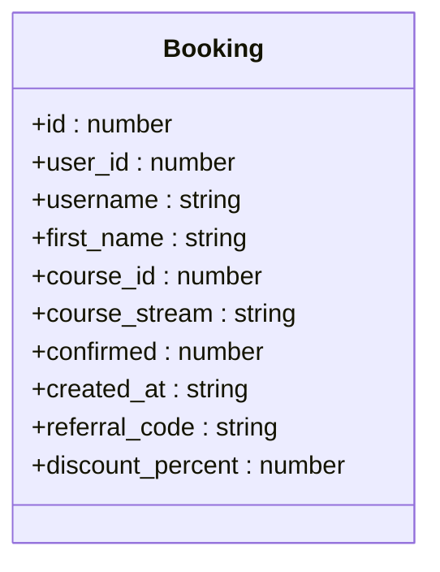
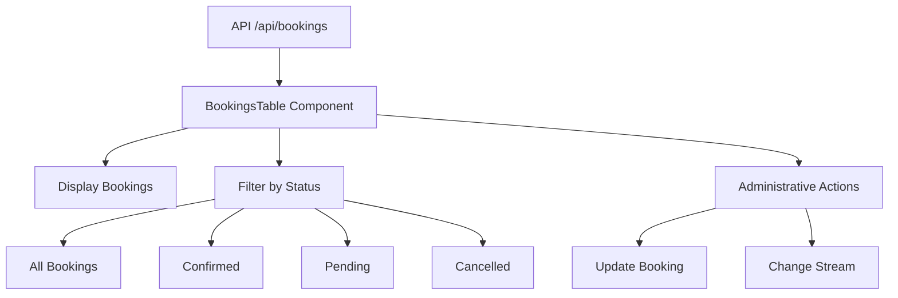
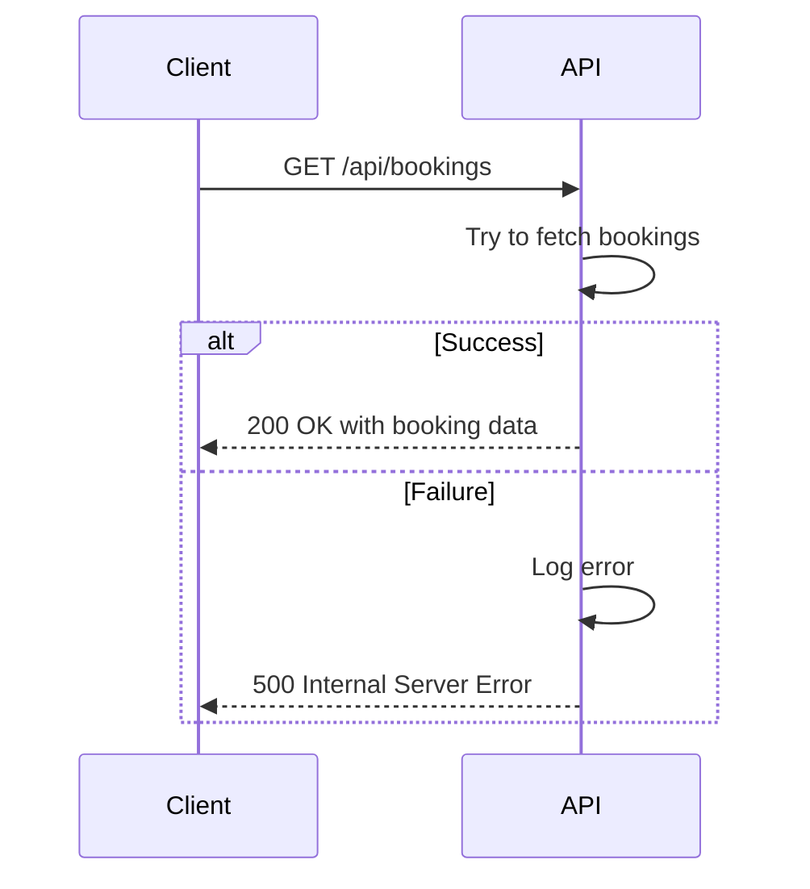
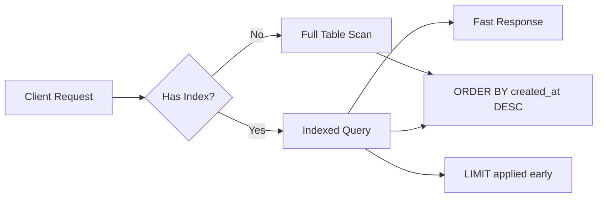
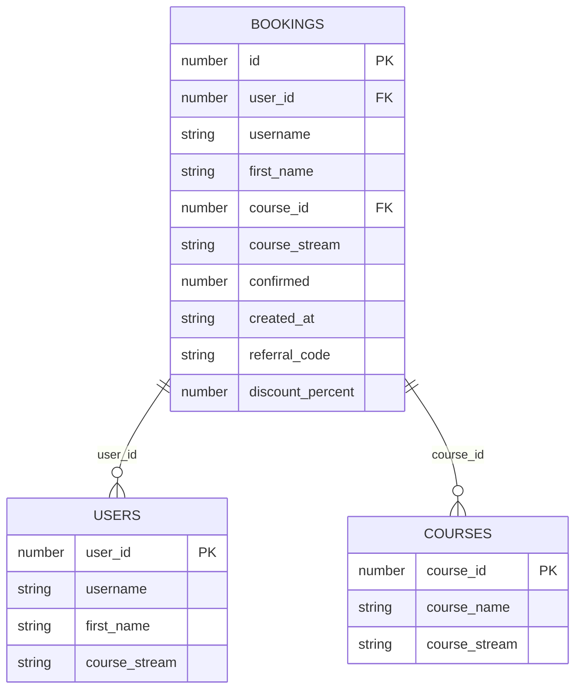
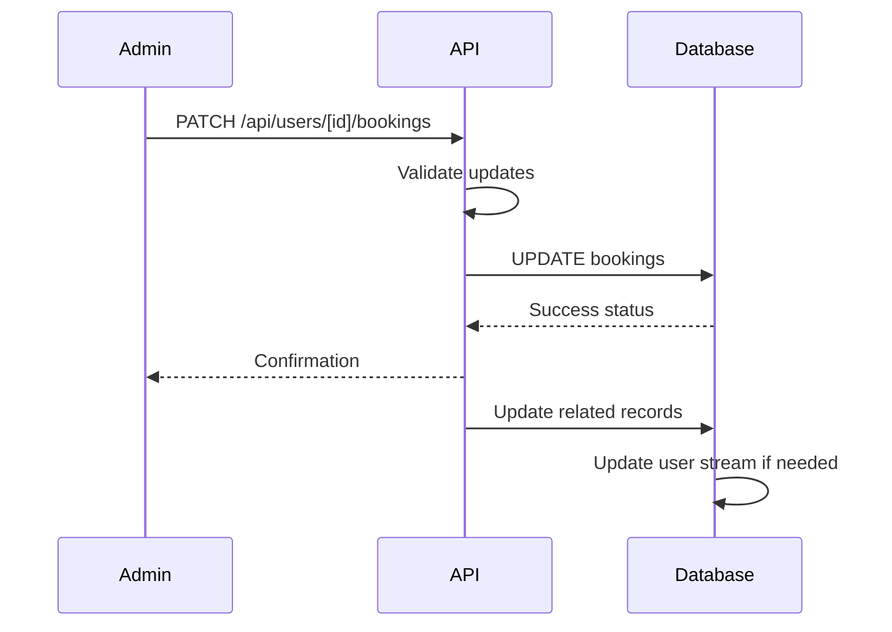

# Bookings API

<cite>
**Referenced Files in This Document**   
- [route.ts](file://app/api/bookings/route.ts)
- [queries.ts](file://lib/queries.ts)
- [BookingsTable.tsx](file://components/BookingsTable.tsx)
- [route.ts](file://app/api/users/[id]/bookings/route.ts)
</cite>

## Table of Contents
1. [Introduction](#introduction)
2. [API Endpoint](#api-endpoint)
3. [Response Schema](#response-schema)
4. [Query Parameters](#query-parameters)
5. [Integration with BookingsTable](#integration-with-bookingstable)
6. [Example Responses](#example-responses)
7. [Error Handling](#error-handling)
8. [Performance Optimization](#performance-optimization)
9. [Data Model Relationships](#data-model-relationships)
10. [Downstream Processes](#downstream-processes)

## Introduction
The Bookings API provides access to student booking records for educational courses. This documentation details the GET method for the `/api/bookings` endpoint, which retrieves booking information including user details, course information, booking status, payment status, and timestamps. The API supports filtering, pagination, and integrates with frontend components to display booking history and enable administrative actions.

## API Endpoint
The `/api/bookings` endpoint supports the GET method to retrieve recent booking records.



**Diagram sources**
- [route.ts](file://app/api/bookings/route.ts#L1-L17)
- [queries.ts](file://lib/queries.ts#L295-L319)

**Section sources**
- [route.ts](file://app/api/bookings/route.ts#L1-L17)

## Response Schema
The API returns an array of booking objects with the following fields:

| Field | Type | Description |
|-------|------|-------------|
| id | number | Unique booking identifier |
| user_id | number | User identifier |
| username | string | User's Telegram username |
| first_name | string | User's first name |
| course_id | number | Course identifier |
| course_stream | string | Course stream identifier |
| confirmed | number | Booking status code |
| created_at | string | ISO timestamp of booking creation |
| referral_code | string | Applied referral code |
| discount_percent | number | Discount percentage applied |

The `confirmed` field uses numeric codes to represent booking status:
- 2: Confirmed (payment completed)
- 1: Pending (awaiting payment)
- -1: Cancelled



**Diagram sources**
- [queries.ts](file://lib/queries.ts#L295-L319)
- [BookingsTable.tsx](file://components/BookingsTable.tsx#L6-L24)

**Section sources**
- [queries.ts](file://lib/queries.ts#L295-L319)

## Query Parameters
The endpoint accepts the following query parameters:

| Parameter | Type | Required | Default | Description |
|---------|------|----------|---------|-------------|
| limit | number | No | 20 | Number of records to return (maximum 100) |

The API currently supports basic pagination through the limit parameter. For filtering by status, date range, or course stream, clients should use the `/api/users/[id]/bookings` endpoint which provides more comprehensive filtering capabilities.

**Section sources**
- [route.ts](file://app/api/bookings/route.ts#L4-L6)

## Integration with BookingsTable
The Bookings API integrates directly with the BookingsTable component to display booking history and enable administrative actions.



**Diagram sources**
- [route.ts](file://app/api/bookings/route.ts#L1-L17)
- [BookingsTable.tsx](file://components/BookingsTable.tsx#L62-L188)

**Section sources**
- [BookingsTable.tsx](file://components/BookingsTable.tsx#L62-L188)

The BookingsTable component:
- Fetches data from the `/api/bookings` endpoint
- Displays booking information in a tabular format
- Provides filtering by booking status (all, confirmed, pending, cancelled)
- Shows user information, course details, status badges, discount information, and timestamps
- Integrates with administrative functionality through the user details dialog

## Example Responses
### Successful Response with Bookings
```json
[
  {
    "id": 123,
    "user_id": 456,
    "username": "john_doe",
    "first_name": "John",
    "course_id": 1,
    "course_stream": "3rd_stream",
    "confirmed": 2,
    "created_at": "2025-09-02T10:30:00.000Z",
    "referral_code": "FRIEND10",
    "discount_percent": 10
  },
  {
    "id": 122,
    "user_id": 457,
    "username": "jane_smith",
    "first_name": "Jane",
    "course_id": 1,
    "course_stream": "4th_stream",
    "confirmed": 1,
    "created_at": "2025-09-02T09:15:00.000Z",
    "referral_code": null,
    "discount_percent": 0
  }
]
```

### Empty Response
```json
[]
```

**Section sources**
- [route.ts](file://app/api/bookings/route.ts#L10-L12)

## Error Handling
The API implements standard error handling for various failure scenarios.



**Diagram sources**
- [route.ts](file://app/api/bookings/route.ts#L8-L17)

**Section sources**
- [route.ts](file://app/api/bookings/route.ts#L8-L17)

Error responses follow this schema:
```json
{
  "error": "Failed to fetch bookings"
}
```

HTTP Status Codes:
- 200 OK: Successful response with booking data
- 500 Internal Server Error: Failed to fetch bookings due to server-side issues

## Performance Optimization
The API implements several performance optimizations to ensure efficient data retrieval.



**Diagram sources**
- [queries.ts](file://lib/queries.ts#L298-L313)

**Section sources**
- [queries.ts](file://lib/queries.ts#L298-L313)

Key optimizations include:
- Database indexing on the `created_at` column for efficient sorting
- Use of LIMIT clause to restrict result set size
- DESC ordering on created_at to retrieve most recent bookings first
- Connection pooling through the database client
- Proper resource cleanup with try-finally blocks

The query performance is further enhanced by the database's indexing strategy, with indexes on frequently queried fields like `created_at` and `confirmed` status.

## Data Model Relationships
The bookings data model has relationships with user and course data models.



**Diagram sources**
- [queries.ts](file://lib/queries.ts#L298-L313)
- [BookingsTable.tsx](file://components/BookingsTable.tsx#L6-L24)

**Section sources**
- [queries.ts](file://lib/queries.ts#L298-L313)

The relationships are:
- Each booking belongs to a user (user_id foreign key)
- Each booking is for a specific course (course_id foreign key)
- User information is denormalized into the bookings table for performance
- Course information is referenced by ID with names mapped in the application layer

## Downstream Processes
Booking confirmations trigger downstream administrative processes through related API endpoints.



**Diagram sources**
- [route.ts](file://app/api/users/[id]/bookings/route.ts#L54-L141)
- [queries.ts](file://lib/queries.ts#L1338-L1387)

**Section sources**
- [route.ts](file://app/api/users/[id]/bookings/route.ts#L54-L141)

When a booking is confirmed (confirmed=2), it enables:
- User access to course materials
- Assignment to specific course streams
- Eligibility for targeted messaging
- Inclusion in course statistics and analytics
- Potential triggering of automated welcome sequences

Administrative actions are handled through the `/api/users/[id]/bookings` PATCH endpoint, which validates updates and ensures data integrity before modifying booking records.