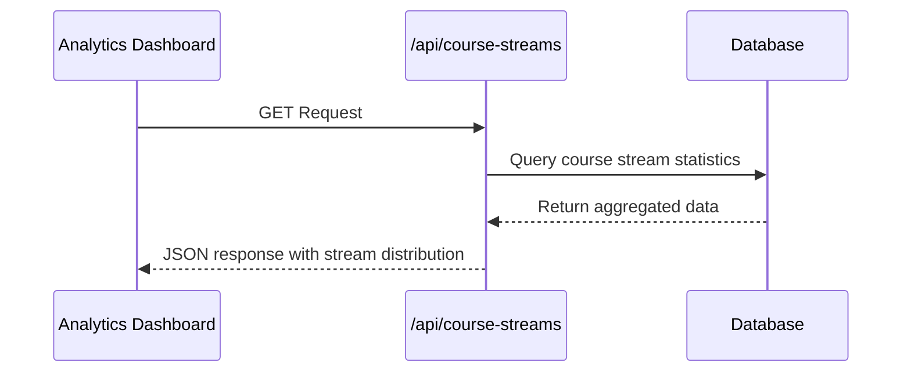
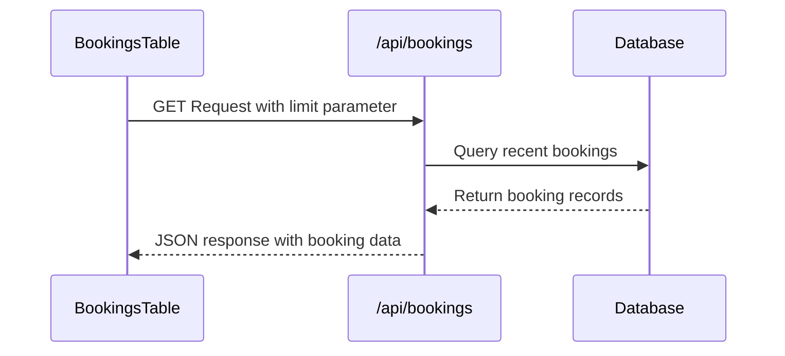
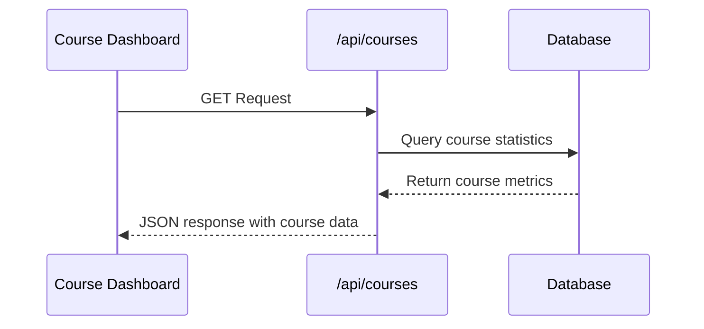
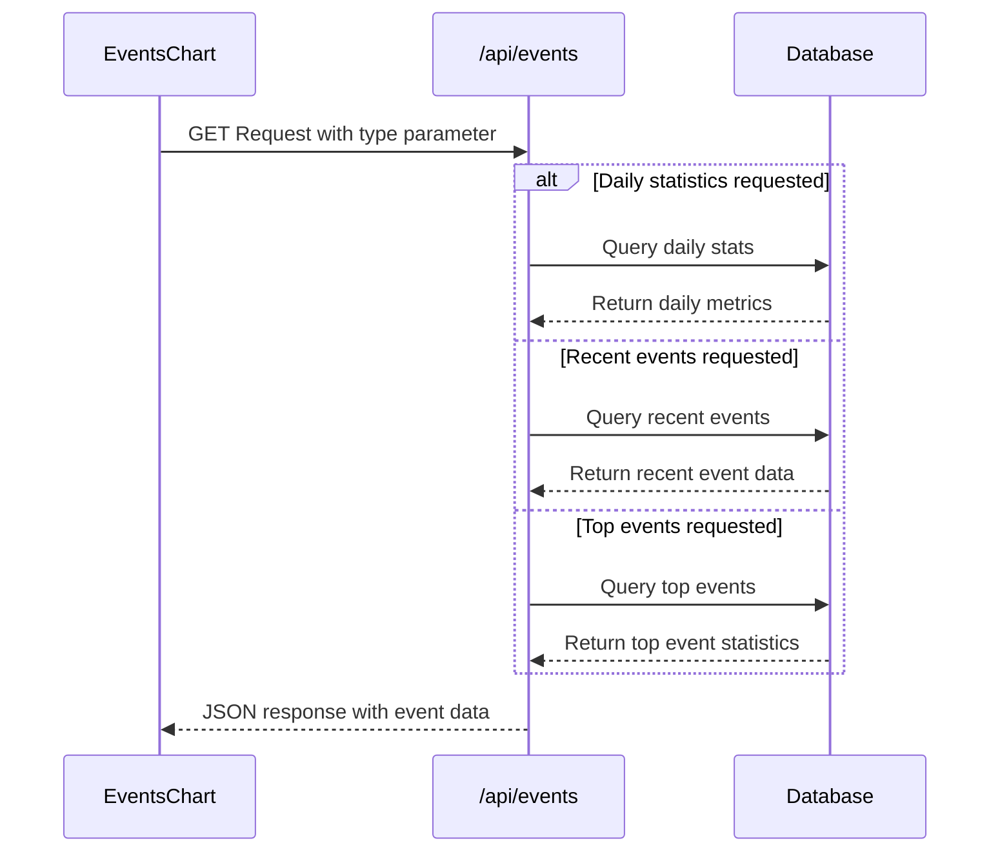
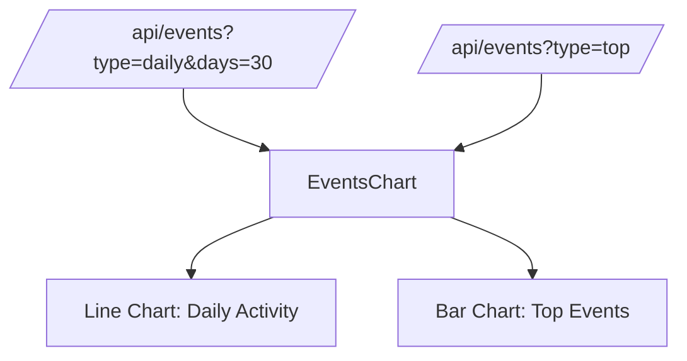
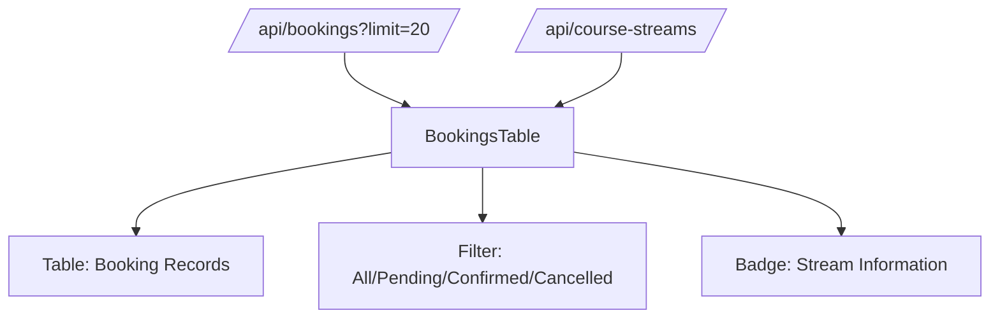
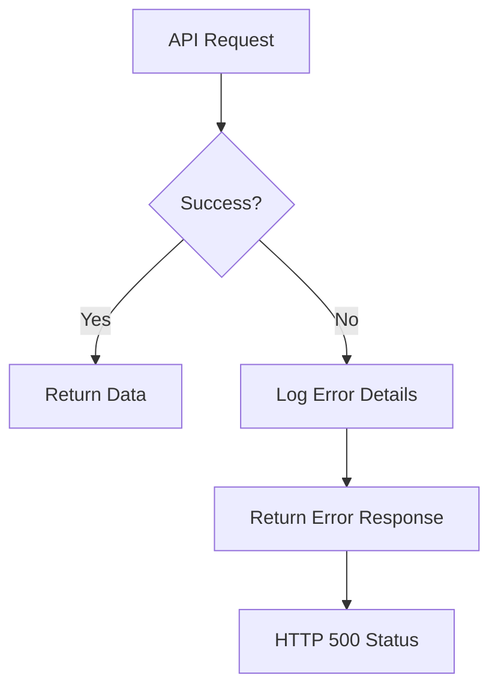
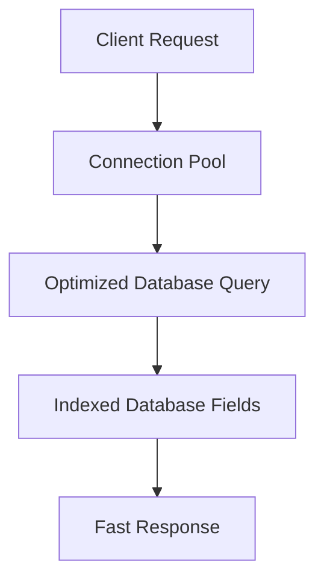

# Course Analytics API

<cite>
**Referenced Files in This Document**   
- [course-streams/route.ts](file://app/api/course-streams/route.ts)
- [bookings/route.ts](file://app/api/bookings/route.ts)
- [courses/route.ts](file://app/api/courses/route.ts)
- [events/route.ts](file://app/api/events/route.ts)
- [EventsChart.tsx](file://components/EventsChart.tsx)
- [BookingsTable.tsx](file://components/BookingsTable.tsx)
- [queries.ts](file://lib/queries.ts)
</cite>

## Table of Contents
1. [Introduction](#introduction)
2. [API Endpoints](#api-endpoints)
3. [Response Schemas](#response-schemas)
4. [Frontend Integration](#frontend-integration)
5. [Query Parameters](#query-parameters)
6. [Error Handling](#error-handling)
7. [Performance Optimization](#performance-optimization)
8. [Usage Patterns](#usage-patterns)

## Introduction
The Course Analytics API provides comprehensive data for monitoring course enrollment statistics, student booking records, course catalog information, and event tracking. This API serves as the backbone for data visualization components in the analytics dashboard, enabling real-time insights into user engagement, course performance, and event attendance patterns. The endpoints are designed to support filtering, pagination, and efficient data retrieval for dashboard components.

## API Endpoints

### /api/course-streams
This endpoint retrieves course enrollment statistics broken down by course stream. It provides metrics on total enrollments, confirmed bookings, pending registrations, and cancellations for each course stream.



**Diagram sources**
- [course-streams/route.ts](file://app/api/course-streams/route.ts)
- [queries.ts](file://lib/queries.ts#L178-L218)

**Section sources**
- [course-streams/route.ts](file://app/api/course-streams/route.ts)
- [queries.ts](file://lib/queries.ts#L178-L218)

### /api/bookings
This endpoint returns recent student booking records with filtering capabilities. It supports pagination through the limit parameter and provides comprehensive booking details including user information, course enrollment status, and discount information.



**Diagram sources**
- [bookings/route.ts](file://app/api/bookings/route.ts)
- [queries.ts](file://lib/queries.ts#L295-L319)

**Section sources**
- [bookings/route.ts](file://app/api/bookings/route.ts)
- [queries.ts](file://lib/queries.ts#L295-L319)

### /api/courses
This endpoint provides course catalog statistics, including enrollment metrics for each course. It returns aggregated data on total enrollments, confirmed payments, pending registrations, and cancellations.



**Diagram sources**
- [courses/route.ts](file://app/api/courses/route.ts)
- [queries.ts](file://lib/queries.ts#L143-L175)

**Section sources**
- [courses/route.ts](file://app/api/courses/route.ts)
- [queries.ts](file://lib/queries.ts#L143-L175)

### /api/events
This endpoint offers flexible event tracking with multiple data views. It supports different types of event statistics through the type parameter, including daily activity, recent events, and top event types.



**Diagram sources**
- [events/route.ts](file://app/api/events/route.ts)
- [queries.ts](file://lib/queries.ts#L221-L241)
- [queries.ts](file://lib/queries.ts#L244-L292)
- [queries.ts](file://lib/queries.ts#L322-L367)

**Section sources**
- [events/route.ts](file://app/api/events/route.ts)
- [queries.ts](file://lib/queries.ts#L221-L241)
- [queries.ts](file://lib/queries.ts#L244-L292)
- [queries.ts](file://lib/queries.ts#L322-L367)

## Response Schemas

### Course Stream Statistics
The response schema for /api/course-streams includes stream distribution metrics:

```json
[
  {
    "courseId": 1,
    "courseName": "Вайб кодинг",
    "courseStream": "3-й поток",
    "total": 45,
    "confirmed": 38,
    "pending": 5,
    "cancelled": 2
  }
]
```

**Section sources**
- [queries.ts](file://lib/queries.ts#L18-L26)

### Booking Records
The response schema for /api/bookings includes detailed booking information:

```json
[
  {
    "id": 123,
    "user_id": 456,
    "username": "student123",
    "first_name": "John",
    "course_id": 1,
    "course_stream": "3rd_stream",
    "confirmed": 2,
    "created_at": "2024-01-15T10:30:00Z",
    "referral_code": "FRIEND20",
    "discount_percent": 20
  }
]
```

**Section sources**
- [bookings/route.ts](file://app/api/bookings/route.ts)
- [queries.ts](file://lib/queries.ts#L295-L319)

### Course Statistics
The response schema for /api/courses includes course-level metrics:

```json
[
  {
    "courseId": 1,
    "courseName": "Вайб кодинг",
    "total": 120,
    "confirmed": 95,
    "pending": 15,
    "cancelled": 10
  }
]
```

**Section sources**
- [queries.ts](file://lib/queries.ts#L9-L16)

### Event Statistics
The response schema for /api/events varies based on the type parameter:

**Daily Statistics:**
```json
[
  {
    "date": "2024-01-15",
    "newUsers": 12,
    "bookings": 8,
    "events": 25
  }
]
```

**Top Events:**
```json
[
  {
    "eventType": "lesson_link_clicked",
    "count": 156
  }
]
```

**Recent Events:**
```json
[
  {
    "id": 789,
    "user_id": 456,
    "username": "student123",
    "first_name": "John",
    "event_type": "lesson_link_clicked",
    "created_at": "2024-01-15T11:45:00Z",
    "details": {}
  }
]
```

**Section sources**
- [queries.ts](file://lib/queries.ts#L221-L241)
- [queries.ts](file://lib/queries.ts#L244-L292)
- [queries.ts](file://lib/queries.ts#L322-L367)

## Frontend Integration

### EventsChart Component
The EventsChart component consumes data from the /api/events endpoint to visualize user activity trends. It uses both daily statistics and top events data to create comprehensive visualizations.



**Section sources**
- [EventsChart.tsx](file://components/EventsChart.tsx)
- [events/route.ts](file://app/api/events/route.ts)

### BookingsTable Component
The BookingsTable component integrates with the /api/bookings endpoint to display recent booking records with filtering capabilities. It also connects with /api/course-streams for stream-specific data.



**Section sources**
- [BookingsTable.tsx](file://components/BookingsTable.tsx)
- [bookings/route.ts](file://app/api/bookings/route.ts)
- [course-streams/route.ts](file://app/api/course-streams/route.ts)

## Query Parameters

### /api/bookings Parameters
- **limit**: Number of booking records to return (default: 20)
  - Example: `/api/bookings?limit=50`

### /api/events Parameters
- **type**: Type of event data to retrieve
  - Values: "daily", "recent", "top" (default: "top")
- **days**: Number of days for daily statistics (default: 30)
  - Example: `/api/events?type=daily&days=7`
- **limit**: Number of records for recent events (default: 30)
  - Example: `/api/events?type=recent&limit=10`

**Section sources**
- [events/route.ts](file://app/api/events/route.ts)
- [bookings/route.ts](file://app/api/bookings/route.ts)

## Error Handling
All endpoints implement consistent error handling with appropriate HTTP status codes and error messages:

```json
{
  "error": "Failed to fetch course stream statistics"
}
```

Error responses are returned with a 500 status code when database queries fail. The API logs detailed error information for debugging purposes while returning user-friendly error messages to the frontend.



**Section sources**
- [course-streams/route.ts](file://app/api/course-streams/route.ts#L6-L14)
- [bookings/route.ts](file://app/api/bookings/route.ts#L8-L17)
- [courses/route.ts](file://app/api/courses/route.ts#L6-L14)
- [events/route.ts](file://app/api/events/route.ts#L15-L27)

## Performance Optimization
The API implements several performance optimizations:

### Database Indexing
Critical database fields are indexed to ensure fast query performance:
- bookings.created_at (for recent bookings)
- bookings.course_stream (for stream statistics)
- events.created_at (for daily statistics)
- events.event_type (for top events)

### Connection Pooling
The API uses PostgreSQL connection pooling to efficiently manage database connections and prevent connection exhaustion under high load.

### Query Optimization
Database queries are optimized with appropriate WHERE clauses, LIMIT statements, and efficient JOIN operations to minimize response times.



**Section sources**
- [queries.ts](file://lib/queries.ts)
- [db.ts](file://lib/db.ts)

## Usage Patterns
The Course Analytics API is primarily used in the dashboard analytics pages to power various data visualization components. The typical usage pattern involves:

1. Initial page load fetching multiple datasets in parallel
2. Periodic polling for updated statistics
3. User-triggered filtering and parameter changes
4. Integration with data visualization libraries for chart rendering

The API endpoints are designed to work together to provide a comprehensive view of course analytics, with the EventsChart and BookingsTable components being the primary consumers of this data.

**Section sources**
- [analytics/page.tsx](file://app/analytics/page.tsx)
- [EventsChart.tsx](file://components/EventsChart.tsx)
- [BookingsTable.tsx](file://components/BookingsTable.tsx)