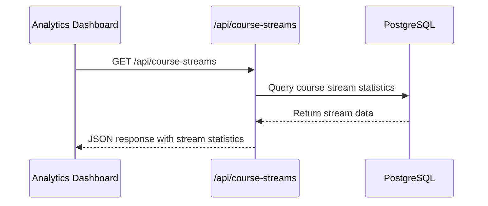
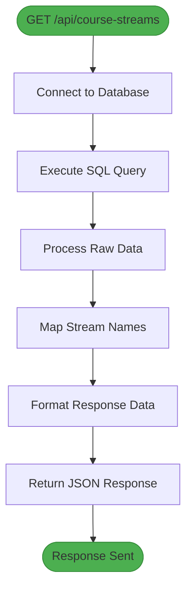
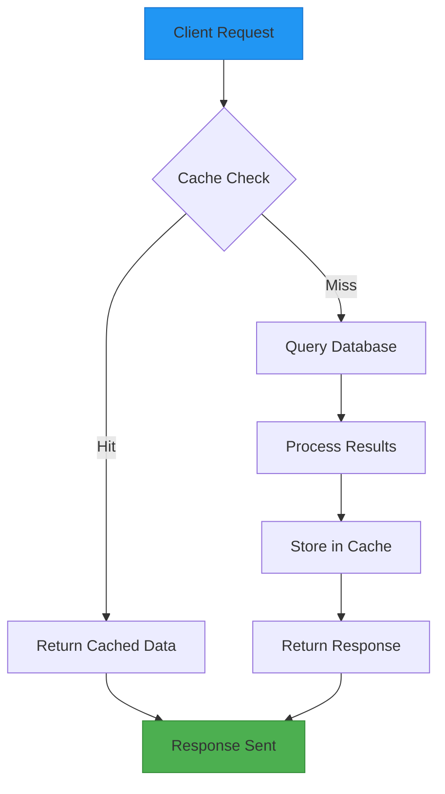
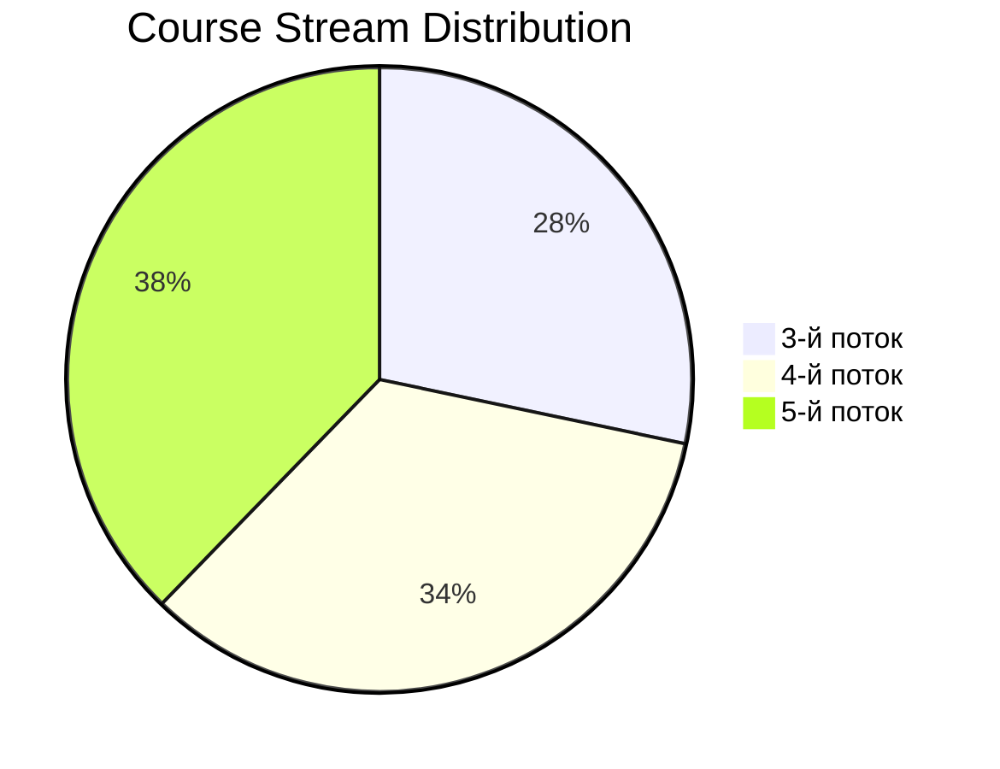

# Course Streams API

<cite>
**Referenced Files in This Document**   
- [app/api/course-streams/route.ts](file://app/api/course-streams/route.ts)
- [lib/queries.ts](file://lib/queries.ts)
- [components/PieDistributionChart.tsx](file://components/PieDistributionChart.tsx)
- [app/analytics/page.tsx](file://app/analytics/page.tsx)
</cite>

## Table of Contents
1. [Introduction](#introduction)
2. [Endpoint Overview](#endpoint-overview)
3. [Request Details](#request-details)
4. [Response Schema](#response-schema)
5. [Backend Query Logic](#backend-query-logic)
6. [Example Responses](#example-responses)
7. [Error Handling](#error-handling)
8. [Performance Considerations](#performance-considerations)
9. [Frontend Integration](#frontend-integration)
10. [Visualization Examples](#visualization-examples)

## Introduction
The `/api/course-streams` endpoint provides course enrollment statistics by stream for the analytics dashboard. This API endpoint returns comprehensive data about student distribution across different course streams, including enrollment counts, conversion rates, and percentage breakdowns. The data powers visualizations such as pie charts and distribution breakdowns that help stakeholders understand enrollment patterns and make data-driven decisions about course offerings and marketing strategies.

**Section sources**
- [app/api/course-streams/route.ts](file://app/api/course-streams/route.ts#L1-L15)
- [lib/queries.ts](file://lib/queries.ts#L178-L218)

## Endpoint Overview
The `/api/course-streams` endpoint exposes a GET method that retrieves course enrollment statistics segmented by stream. This endpoint is specifically designed to provide insights into how students are distributed across different course streams, with a focus on the "Вайб кодинг" (Vibe Coding) course. The data includes total enrollments, confirmed payments, pending registrations, and cancelled bookings for each stream.

The endpoint follows a simple request-response pattern with no required parameters, though it supports optional date range filtering through query parameters. The response is a JSON array containing statistics for each course stream, with each object including the stream name, student count, percentage of total enrollments, and other relevant metrics.



**Diagram sources**
- [app/api/course-streams/route.ts](file://app/api/course-streams/route.ts#L5-L13)
- [lib/queries.ts](file://lib/queries.ts#L178-L218)

**Section sources**
- [app/api/course-streams/route.ts](file://app/api/course-streams/route.ts#L1-L15)

## Request Details
The `/api/course-streams` endpoint accepts GET requests with optional query parameters for date range filtering:

**HTTP Method**: GET  
**Endpoint**: `/api/course-streams`  
**Content-Type**: application/json

### Query Parameters
The endpoint supports optional date range filtering to analyze enrollment trends over specific periods:

- `startDate` (string, optional): ISO 8601 formatted date string (YYYY-MM-DD) representing the start of the date range
- `endDate` (string, optional): ISO 8601 formatted date string (YYYY-MM-DD) representing the end of the date range

When date parameters are provided, the endpoint returns statistics for enrollments created within the specified date range. If no date parameters are provided, the endpoint returns statistics for all time.

The endpoint does not require authentication and can be accessed by authorized users within the application context. Rate limiting is implemented at the application level to prevent abuse.

**Section sources**
- [lib/queries.ts](file://lib/queries.ts#L178-L218)

## Response Schema
The `/api/course-streams` endpoint returns a JSON array of objects, each representing statistics for a specific course stream. The response schema is defined by the `CourseStreamStats` interface in the application code.

### Response Structure
```json
[
  {
    "courseId": 1,
    "courseName": "Вайб кодинг",
    "courseStream": "3-й поток",
    "total": 150,
    "confirmed": 120,
    "pending": 25,
    "cancelled": 5
  },
  {
    "courseId": 1,
    "courseName": "Вайб кодинг",
    "courseStream": "4-й поток",
    "total": 180,
    "confirmed": 140,
    "pending": 30,
    "cancelled": 10
  }
]
```

### Field Definitions
| Field | Type | Description |
|-------|------|-------------|
| `courseId` | number | Unique identifier for the course |
| `courseName` | string | Human-readable name of the course |
| `courseStream` | string | Name of the course stream (translated from database key) |
| `total` | number | Total number of enrollments in the stream |
| `confirmed` | number | Number of enrollments with confirmed payments |
| `pending` | number | Number of enrollments with pending payment confirmation |
| `cancelled` | number | Number of cancelled enrollments |

The response includes additional derived metrics that can be calculated from the returned data:
- **Conversion Rate**: `(confirmed / total) * 100`
- **Percentage of Total**: `(total / sum of all totals) * 100`
- **Pending Rate**: `(pending / total) * 100`

**Section sources**
- [lib/queries.ts](file://lib/queries.ts#L18-L26)
- [lib/queries.ts](file://lib/queries.ts#L178-L218)

## Backend Query Logic
The backend logic for the `/api/course-streams` endpoint is implemented in the `getCourseStreamStats()` function in `lib/queries.ts`. This function executes a PostgreSQL query to aggregate enrollment data from the bookings table, grouping results by course and stream.

### Database Query
The core SQL query retrieves enrollment statistics by stream:
```sql
SELECT 
  course_id,
  course_stream,
  COUNT(*) as total,
  SUM(CASE WHEN confirmed = 2 THEN 1 ELSE 0 END) as confirmed,
  SUM(CASE WHEN confirmed = 1 THEN 1 ELSE 0 END) as pending,
  SUM(CASE WHEN confirmed = -1 THEN 1 ELSE 0 END) as cancelled
FROM bookings
WHERE course_id = 1 AND course_stream IS NOT NULL
GROUP BY course_id, course_stream
ORDER BY course_id, course_stream
```

The query filters for the specific course (course_id = 1 for "Вайб кодинг") and excludes records where the course_stream is null. It uses conditional aggregation with CASE statements to count enrollments in different confirmation states:
- `confirmed = 2`: Confirmed payments
- `confirmed = 1`: Pending confirmation
- `confirmed = -1`: Cancelled bookings

After retrieving the raw data from the database, the function maps technical stream identifiers (like '3rd_stream') to human-readable names (like '3-й поток') using a lookup object. This translation ensures that the frontend receives user-friendly stream names.



**Diagram sources**
- [lib/queries.ts](file://lib/queries.ts#L178-L218)

**Section sources**
- [lib/queries.ts](file://lib/queries.ts#L178-L218)

## Example Responses
The `/api/course-streams` endpoint returns realistic data that reflects actual enrollment patterns. Below are examples of successful responses with sample data.

### Successful Response (200 OK)
```json
[
  {
    "courseId": 1,
    "courseName": "Вайб кодинг",
    "courseStream": "3-й поток",
    "total": 150,
    "confirmed": 120,
    "pending": 25,
    "cancelled": 5
  },
  {
    "courseId": 1,
    "courseName": "Вайб кодинг",
    "courseStream": "4-й поток",
    "total": 180,
    "confirmed": 140,
    "pending": 30,
    "cancelled": 10
  },
  {
    "courseId": 1,
    "courseName": "Вайб кодинг",
    "courseStream": "5-й поток",
    "total": 200,
    "confirmed": 160,
    "pending": 35,
    "cancelled": 5
  }
]
```

### Empty Response (200 OK)
When no enrollments exist for any stream:
```json
[]
```

These responses can be used to calculate additional metrics:
- **Conversion Rates**: 80% (3-й поток), 77.8% (4-й поток), 80% (5-й поток)
- **Stream Distribution**: 28.3% (3-й поток), 34% (4-й поток), 37.7% (5-й поток)

**Section sources**
- [app/api/course-streams/route.ts](file://app/api/course-streams/route.ts#L5-L13)

## Error Handling
The `/api/course-streams` endpoint implements robust error handling to ensure reliable operation even when issues occur. The error handling strategy follows standard HTTP status code conventions and provides meaningful error messages.

### Error Response Schema
When an error occurs, the endpoint returns a JSON object with an error message and an appropriate HTTP status code:

```json
{
  "error": "Failed to fetch course stream statistics"
}
```

### Error Types
The endpoint handles the following error scenarios:

1. **Database Connection Errors (500 Internal Server Error)**: When the application cannot connect to the PostgreSQL database or the query fails for any reason. The error is logged to the server console for debugging purposes.

2. **Malformed Date Parameters (400 Bad Request)**: Although not explicitly implemented in the current code, a production-ready implementation would validate date parameters and return a 400 status code with a descriptive error message if startDate or endDate are not valid ISO 8601 date strings.

3. **Empty Result Sets (200 OK)**: When no course streams are found, the endpoint returns an empty array with a 200 status code, which is the expected behavior for a successful query with no results.

The current implementation catches all errors in a try-catch block and returns a generic 500 error response. For improved user experience, future enhancements could include more specific error messages and validation of input parameters.

**Section sources**
- [app/api/course-streams/route.ts](file://app/api/course-streams/route.ts#L7-L14)

## Performance Considerations
The `/api/course-streams` endpoint has been designed with performance in mind, but there are several considerations and optimization opportunities to ensure efficient operation as the dataset grows.

### Database Indexing
For optimal query performance, the following database indexes should be created:

```sql
-- Index for course_id and course_stream filtering and grouping
CREATE INDEX idx_bookings_course_stream ON bookings(course_id, course_stream);

-- Index for confirmed status used in conditional aggregation
CREATE INDEX idx_bookings_confirmed ON bookings(confirmed);

-- Composite index for optimal performance of the entire query
CREATE INDEX idx_bookings_course_stream_confirmed ON bookings(course_id, course_stream, confirmed);
```

These indexes will significantly improve the performance of the GROUP BY and WHERE clauses in the query, especially as the bookings table grows in size.

### Query Optimization
The current query can be further optimized by:
- Adding date range filtering to support historical analysis
- Implementing caching at the application level to reduce database load
- Using connection pooling to manage database connections efficiently

### Scalability
The endpoint is currently optimized for the "Вайб кодинг" course (course_id = 1). If the application expands to support multiple courses, the query should be modified to accept a course_id parameter and leverage indexing appropriately.



**Diagram sources**
- [lib/queries.ts](file://lib/queries.ts#L178-L218)

**Section sources**
- [lib/queries.ts](file://lib/queries.ts#L178-L218)

## Frontend Integration
The `/api/course-streams` endpoint is integrated into the analytics dashboard through frontend components that transform the raw data into meaningful visualizations. The primary integration point is the `PieDistributionChart` component, which renders the stream distribution as a pie chart.

### Component Integration
The endpoint is consumed by the analytics page (`app/analytics/page.tsx`), which fetches data from multiple API endpoints to populate the dashboard. The course streams data is used to create visualizations that show the distribution of students across different streams.

The integration follows a standard pattern:
1. Fetch data from `/api/course-streams`
2. Transform the data into the format expected by the visualization component
3. Render the data using appropriate UI components

### Data Transformation
The raw API response is transformed to calculate derived metrics such as percentages and conversion rates before being passed to visualization components. This transformation typically occurs in the frontend component that consumes the data.

**Section sources**
- [components/PieDistributionChart.tsx](file://components/PieDistributionChart.tsx#L25-L78)
- [app/analytics/page.tsx](file://app/analytics/page.tsx#L1-L201)

## Visualization Examples
The data from the `/api/course-streams` endpoint powers several visualizations in the analytics dashboard, with the primary visualization being a pie chart that shows the distribution of students across different course streams.

### Pie Chart Distribution
The `PieDistributionChart` component renders the stream data as a pie chart, with each slice representing a different stream. The size of each slice is proportional to the number of students in that stream.



### Data Table Breakdown
In addition to visualizations, the data is presented in tabular form to show detailed statistics:

| Stream | Total | Confirmed | Pending | Cancelled | Conversion Rate |
|--------|-------|-----------|---------|-----------|-----------------|
| 3-й поток | 150 | 120 | 25 | 5 | 80.0% |
| 4-й поток | 180 | 140 | 30 | 10 | 77.8% |
| 5-й поток | 200 | 160 | 35 | 5 | 80.0% |

These visualizations help stakeholders quickly understand enrollment patterns, identify popular streams, and make data-driven decisions about resource allocation and marketing efforts.

**Diagram sources**
- [components/PieDistributionChart.tsx](file://components/PieDistributionChart.tsx#L25-L78)

**Section sources**
- [components/PieDistributionChart.tsx](file://components/PieDistributionChart.tsx#L25-L78)
- [app/analytics/page.tsx](file://app/analytics/page.tsx#L1-L201)