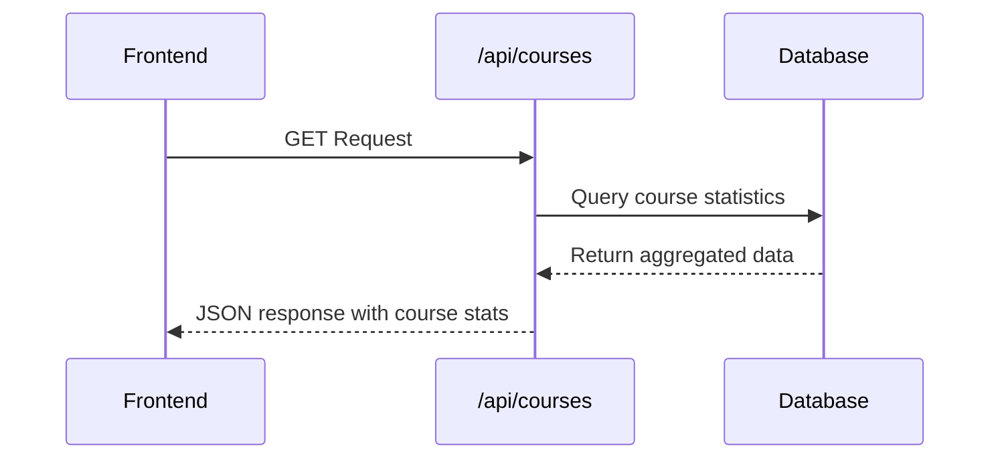
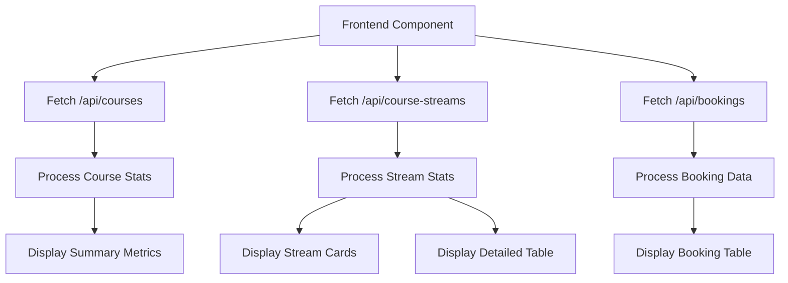

# Courses API

<cite>
**Referenced Files in This Document**   
- [route.ts](file://app/api/courses/route.ts)
- [queries.ts](file://lib/queries.ts)
- [page.tsx](file://app/workshops/page.tsx)
</cite>

## Table of Contents
1. [Introduction](#introduction)
2. [API Endpoint](#api-endpoint)
3. [Response Schema](#response-schema)
4. [Frontend Integration](#frontend-integration)
5. [Example Response](#example-response)
6. [Caching Strategy](#caching-strategy)
7. [Integration with Workflows](#integration-with-workflows)
8. [Administrative Use Cases](#administrative-use-cases)

## Introduction
The Courses API provides access to course catalog statistics, primarily used for displaying course enrollment data in the dashboard interface. The API endpoint `/api/courses` returns aggregated statistics about course registrations, including total counts, confirmed enrollments, pending payments, and cancellations. This documentation details the API functionality, response structure, integration points, and usage patterns within the application.

## API Endpoint
The `/api/courses` endpoint supports the GET method to retrieve course statistics. The endpoint does not accept query parameters for filtering or searching, as it returns a fixed set of course data based on the current database state.



**Diagram sources**
- [route.ts](file://app/api/courses/route.ts#L3-L14)
- [queries.ts](file://lib/queries.ts#L143-L175)

**Section sources**
- [route.ts](file://app/api/courses/route.ts#L3-L14)

## Response Schema
The API returns an array of course statistics objects. Each object contains the following properties:

| Field | Type | Description |
|-------|------|-------------|
| courseId | number | Unique identifier for the course |
| courseName | string | Display name of the course |
| total | number | Total number of registrations for the course |
| confirmed | number | Number of confirmed (paid) registrations |
| pending | number | Number of registrations awaiting payment confirmation |
| cancelled | number | Number of cancelled registrations |

The response does not include detailed course information such as description, duration, pricing, or availability status as specified in the documentation objective. Instead, it focuses on enrollment statistics. The API also does not support filtering by active/inactive status or searching by course name.

**Section sources**
- [queries.ts](file://lib/queries.ts#L9-L16)

## Frontend Integration
The course data is primarily used in the workshops analytics page to populate various UI components. The frontend fetches data from multiple endpoints including `/api/courses`, `/api/course-streams`, and `/api/bookings` to create a comprehensive view of course statistics.

The data is used to:
- Display total registration metrics in summary cards
- Show active course streams in grid cards
- Populate detailed course statistics tables
- Support booking management interfaces



**Diagram sources**
- [page.tsx](file://app/workshops/page.tsx#L50-L95)
- [page.tsx](file://app/workshops/page.tsx#L126-L150)

**Section sources**
- [page.tsx](file://app/workshops/page.tsx#L1-L243)

## Example Response
The API returns a JSON array with course statistics. For the current implementation, only one course is supported:

```json
[
  {
    "courseId": 1,
    "courseName": "Вайб кодинг",
    "total": 150,
    "confirmed": 120,
    "pending": 20,
    "cancelled": 10
  }
]
```

Note that the actual values will vary based on the current database state. The course name is hardcoded in the backend and mapped from the course ID.

**Section sources**
- [queries.ts](file://lib/queries.ts#L143-L175)

## Caching Strategy
The application implements a caching strategy through the UserCacheService, which caches user data including course stream information. The cache has a TTL (time-to-live) of 5 minutes and is used to improve performance when accessing user data across different parts of the application.

The course statistics themselves are not explicitly cached at the API level, but the underlying database queries are executed through connection pooling, which provides some performance benefits. The frontend also maintains state locally after the initial data fetch, reducing the need for repeated API calls unless explicitly refreshed by the user.

**Section sources**
- [userCache.ts](file://lib/userCache.ts#L161-L214)

## Integration with Workflows
The course data integrates with several workflows in the application:

1. **Booking Management**: Course statistics are used alongside booking data to provide a complete view of course enrollment status.
2. **Analytics Display**: The data is combined with course stream statistics to show detailed breakdowns by course and stream.
3. **User Interface Updates**: The workshop page uses the data to update UI components that display course metrics and stream information.

The API does not directly integrate with booking and enrollment workflows but provides read-only access to the resulting statistics after bookings have been processed through other mechanisms.

**Section sources**
- [page.tsx](file://app/workshops/page.tsx#L50-L95)

## Administrative Use Cases
The current implementation does not support administrative operations such as course updates or deactivation through this API endpoint. The `/api/courses` endpoint is read-only and only provides access to course statistics.

Administrative functions for managing courses are not evident in the provided codebase. The course data appears to be static, with only one course currently supported ("Вайб кодинг" with courseId 1). Course updates or deactivation would require modifications to the backend code rather than through API calls to this endpoint.

The application does include administrative interfaces for managing user bookings and streams, but these are separate from the course catalog management.

**Section sources**
- [queries.ts](file://lib/queries.ts#L143-L175)
- [route.ts](file://app/api/courses/route.ts#L3-L14)