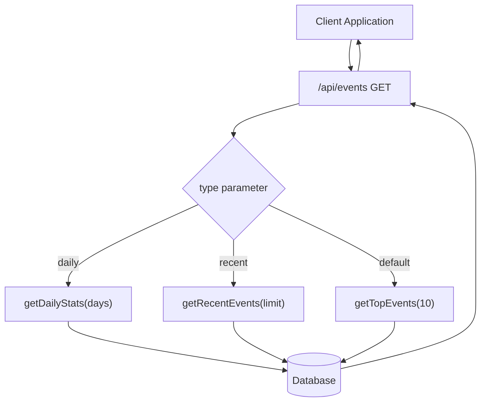
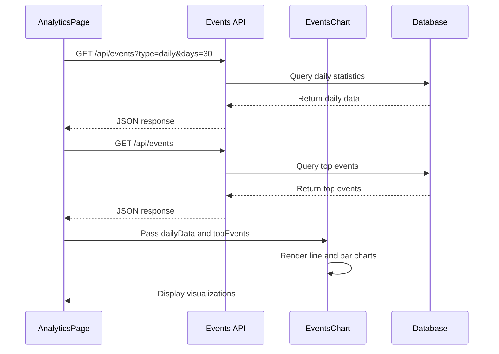
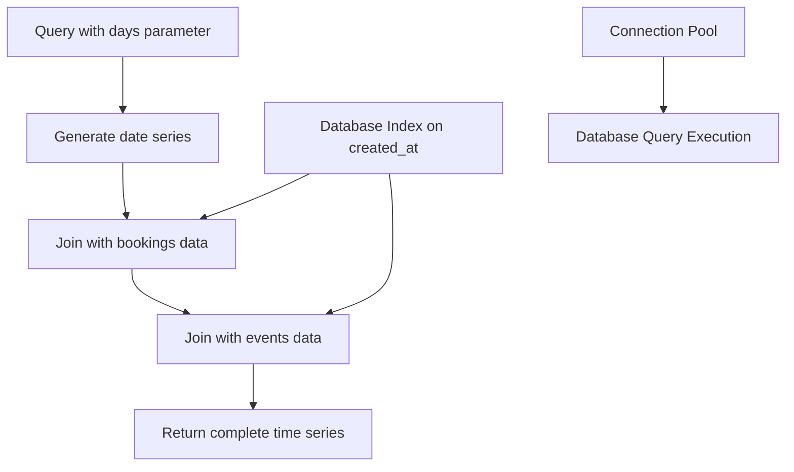
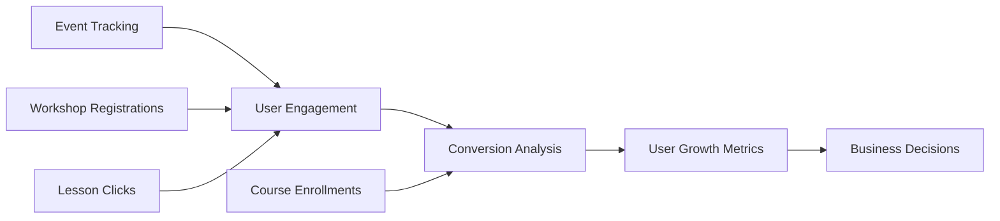

# Events API

<cite>
**Referenced Files in This Document**   
- [route.ts](file://app/api/events/route.ts)
- [queries.ts](file://lib/queries.ts)
- [EventsChart.tsx](file://components/EventsChart.tsx)
- [page.tsx](file://app/analytics/page.tsx)
</cite>

## Table of Contents
1. [Introduction](#introduction)
2. [Endpoint Overview](#endpoint-overview)
3. [Query Parameters](#query-parameters)
4. [Response Schema](#response-schema)
5. [Integration with EventsChart Component](#integration-with-eventschart-component)
6. [Example Responses](#example-responses)
7. [Error Handling](#error-handling)
8. [Performance Considerations](#performance-considerations)
9. [User Registration Integration](#user-registration-integration)
10. [User Growth Analytics](#user-growth-analytics)

## Introduction

The Events API provides access to workshop and event tracking data for analytics and reporting purposes. This documentation details the GET method for the `/api/events` endpoint, which retrieves event statistics including event types, counts, and temporal patterns. The data supports trend analysis, capacity planning, and user engagement monitoring across the platform.

**Section sources**
- [route.ts](file://app/api/events/route.ts#L3-L27)

## Endpoint Overview

The `/api/events` endpoint supports multiple data retrieval modes through the `type` query parameter. It serves three primary data views:
- **Top Events**: Most frequent event types (default)
- **Daily Statistics**: Time-series data for user activity
- **Recent Events**: Latest user actions with details

The endpoint integrates with database queries to aggregate event data and supports filtering through query parameters for customized data retrieval.



**Diagram sources**
- [route.ts](file://app/api/events/route.ts#L3-L27)
- [queries.ts](file://lib/queries.ts#L221-L241)
- [queries.ts](file://lib/queries.ts#L244-L292)
- [queries.ts](file://lib/queries.ts#L322-L367)

**Section sources**
- [route.ts](file://app/api/events/route.ts#L3-L27)

## Query Parameters

The endpoint accepts the following query parameters to customize the response:

| Parameter | Type | Required | Default | Description |
|---------|------|----------|---------|-------------|
| type | string | No | none | Data view type: "daily" or "recent" |
| days | number | No | 30 | Number of days for daily statistics |
| limit | number | No | 30 | Maximum number of records for recent events |

When no type is specified, the endpoint returns the top 10 most frequent event types. The `days` parameter controls the time window for daily statistics, while `limit` constrains the number of recent events returned.

**Section sources**
- [route.ts](file://app/api/events/route.ts#L3-L27)

## Response Schema

The response schema varies based on the requested data type:

### Top Events Response
```json
[
  {
    "eventType": "string",
    "count": "number"
  }
]
```

### Daily Statistics Response
```json
[
  {
    "date": "string",
    "newUsers": "number",
    "bookings": "number",
    "events": "number"
  }
]
```

### Recent Events Response
```json
[
  {
    "id": "number",
    "user_id": "number",
    "username": "string",
    "first_name": "string",
    "event_type": "string",
    "created_at": "string",
    "details": "object"
  }
]
```

The response always returns an array of objects with properties specific to the requested data view. All date fields are formatted as ISO date strings (YYYY-MM-DD).

**Section sources**
- [queries.ts](file://lib/queries.ts#L221-L241)
- [queries.ts](file://lib/queries.ts#L244-L292)
- [queries.ts](file://lib/queries.ts#L322-L367)

## Integration with EventsChart Component

The Events API data feeds directly into the EventsChart component for visualization. The component consumes two data streams:
- Daily statistics for time-series line charts
- Top events data for horizontal bar charts

The EventsChart displays user engagement trends over time, showing correlations between new users, bookings, and events. It also visualizes the distribution of event types to identify the most common user actions.



**Diagram sources**
- [EventsChart.tsx](file://components/EventsChart.tsx#L0-L125)
- [page.tsx](file://app/analytics/page.tsx#L0-L42)
- [route.ts](file://app/api/events/route.ts#L3-L27)

**Section sources**
- [EventsChart.tsx](file://components/EventsChart.tsx#L0-L125)
- [page.tsx](file://app/analytics/page.tsx#L0-L42)

## Example Responses

### Upcoming Events Example
```json
[
  {
    "date": "2024-01-15",
    "newUsers": 12,
    "bookings": 8,
    "events": 45
  },
  {
    "date": "2024-01-14",
    "newUsers": 15,
    "bookings": 12,
    "events": 52
  }
]
```

### Past Events Example
```json
[
  {
    "eventType": "lesson_link_clicked",
    "count": 156
  },
  {
    "eventType": "workshop_registration",
    "count": 89
  },
  {
    "eventType": "course_enrollment",
    "count": 67
  }
]
```

### Recent Events Example
```json
[
  {
    "id": 1234,
    "user_id": 5678,
    "username": "johndoe",
    "first_name": "John",
    "event_type": "lesson_link_clicked",
    "created_at": "2024-01-15T14:30:00.000Z",
    "details": {
      "lesson_type": "free_coding",
      "lesson_date": "2024-01-16"
    }
  }
]
```

**Section sources**
- [queries.ts](file://lib/queries.ts#L221-L241)
- [queries.ts](file://lib/queries.ts#L244-L292)
- [queries.ts](file://lib/queries.ts#L322-L367)

## Error Handling

The endpoint implements comprehensive error handling to ensure reliable operation:

- **Server Errors**: Returns HTTP 500 with error message when database operations fail
- **Invalid Parameters**: Gracefully handles invalid or missing parameters using defaults
- **Database Connection**: Logs errors and returns structured error responses

Error responses follow the format:
```json
{
  "error": "Failed to fetch events"
}
```

The error handling mechanism logs detailed error information to the server console while providing minimal, user-friendly error messages to clients to avoid exposing sensitive system information.

**Section sources**
- [route.ts](file://app/api/events/route.ts#L3-L27)

## Performance Considerations

The Events API implements several performance optimizations:

- **Time-based Indexing**: Database indexes on `created_at` column enable efficient date-range queries
- **Pre-aggregated Data**: Daily statistics use database-level aggregation to minimize processing
- **Caching Strategy**: Client-side caching in analytics pages reduces redundant requests
- **Connection Pooling**: Database connection reuse improves query performance

The `getDailyStats` function uses PostgreSQL's `generate_series` to create complete date series, ensuring consistent time-series data even with gaps in event records. This approach maintains data integrity while optimizing for analytical queries.



**Diagram sources**
- [queries.ts](file://lib/queries.ts#L244-L292)
- [db.ts](file://lib/db.ts#L0-L52)

**Section sources**
- [queries.ts](file://lib/queries.ts#L244-L292)
- [db.ts](file://lib/db.ts#L0-L52)

## User Registration Integration

The Events API integrates with user registration systems through shared database tables and user identification:

- **User Identification**: Events are linked to users via `user_id` field
- **Profile Enrichment**: Username and first name are joined from bookings and free lesson registrations
- **Cross-system Tracking**: Users are identified across multiple touchpoints (bookings, events, free lessons)

The `getRecentEvents` function uses LEFT JOINs to enrich event data with user profile information from both bookings and free lesson registrations, creating a comprehensive view of user activity regardless of their registration path.

**Section sources**
- [queries.ts](file://lib/queries.ts#L322-L367)

## User Growth Analytics

Event data directly influences user growth analytics by providing key engagement metrics:

- **Conversion Tracking**: Free lesson registrations to paid course conversions
- **Engagement Metrics**: Event frequency as a measure of user activity
- **Retention Analysis**: Longitudinal event patterns indicating user retention
- **Funnel Analysis**: Progression from initial events to course enrollment

The daily statistics include `newUsers` count derived from distinct user IDs in bookings, providing a direct measure of user acquisition that correlates with event activity. This data enables analysis of how event participation drives user growth and conversion.



**Diagram sources**
- [queries.ts](file://lib/queries.ts#L244-L292)
- [queries.ts](file://lib/queries.ts#L322-L367)

**Section sources**
- [queries.ts](file://lib/queries.ts#L244-L292)
- [queries.ts](file://lib/queries.ts#L322-L367)