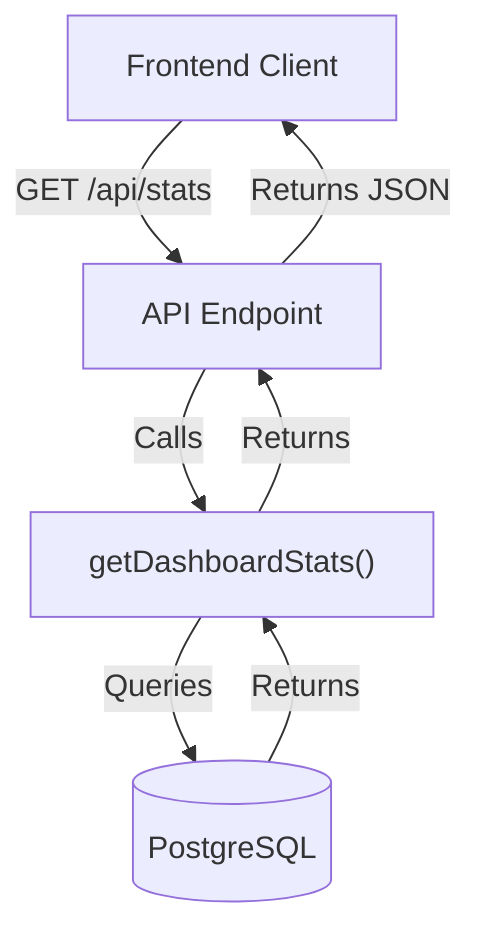
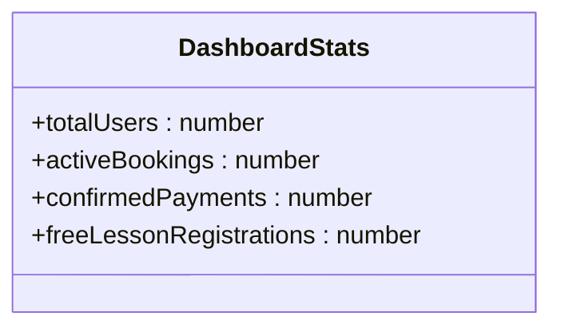
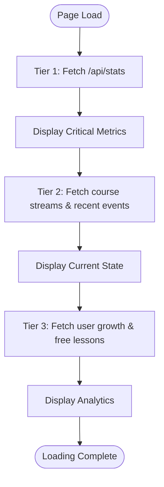
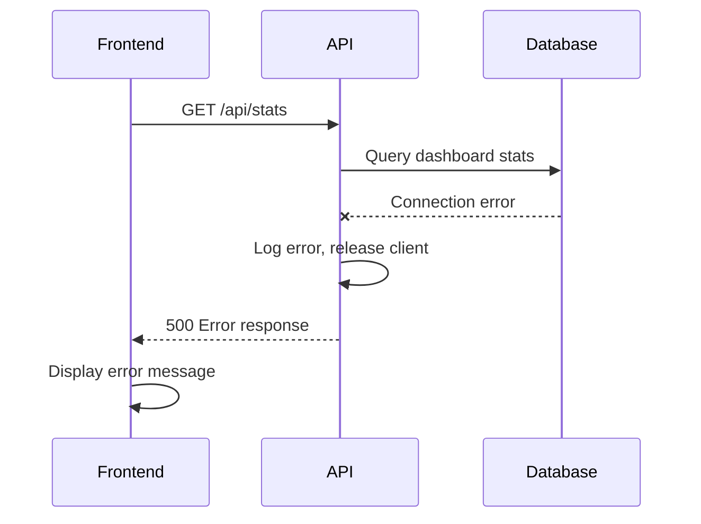

# Dashboard API

<cite>
**Referenced Files in This Document**   
- [stats/route.ts](file://app/api/stats/route.ts)
- [queries.ts](file://lib/queries.ts)
- [page.tsx](file://app/page.tsx)
- [db.ts](file://lib/db.ts)
</cite>

## Table of Contents
1. [Introduction](#introduction)
2. [API Endpoint Overview](#api-endpoint-overview)
3. [Request Parameters](#request-parameters)
4. [Response Schema](#response-schema)
5. [Tiered Data Loading Strategy](#tiered-data-loading-strategy)
6. [Example Responses](#example-responses)
7. [Error Handling](#error-handling)
8. [Caching Considerations](#caching-considerations)
9. [Integration with Dashboard Page](#integration-with-dashboard-page)
10. [Frontend Consumption Example](#frontend-consumption-example)
11. [Common Issues and Solutions](#common-issues-and-solutions)

## Introduction

The Dashboard API endpoint at `/api/stats` provides critical metrics for the main dashboard page of the HSL Dashboard application. This API serves as the primary data source for key performance indicators, enabling real-time monitoring of user engagement, conversion rates, and system health. The endpoint is designed with performance and reliability in mind, implementing a tiered data loading strategy that prioritizes critical metrics to ensure the fastest possible user experience.

The API is part of a Next.js application that integrates with a PostgreSQL database to retrieve aggregated statistics about users, bookings, payments, and free lesson registrations. It follows a server-side API route pattern common in Next.js applications, where API endpoints are colocated with the application's page components for better organization and easier maintenance.

**Section sources**
- [stats/route.ts](file://app/api/stats/route.ts#L4-L15)
- [queries.ts](file://lib/queries.ts#L102-L140)

## API Endpoint Overview

The `/api/stats` endpoint exposes a single GET method that retrieves a comprehensive set of dashboard statistics. This endpoint is designed to be lightweight and fast, focusing on aggregated metrics rather than detailed records to minimize response time and database load.

The endpoint is implemented as a Next.js API route, following the convention of colocating API handlers within the `app/api` directory structure. When a GET request is made to this endpoint, the handler function `GET()` is invoked, which in turn calls the `getDashboardStats()` function from the application's query library to retrieve the data from the database.

The API follows RESTful principles with a clear, descriptive URL path that indicates its purpose. It returns data in JSON format with appropriate HTTP status codes to indicate success or failure. The endpoint is stateless and does not require authentication for access within the application context, as it is intended to be consumed by the frontend dashboard component.



**Diagram sources**
- [stats/route.ts](file://app/api/stats/route.ts#L4-L15)
- [queries.ts](file://lib/queries.ts#L102-L140)

**Section sources**
- [stats/route.ts](file://app/api/stats/route.ts#L4-L15)

## Request Parameters

The `/api/stats` endpoint does not accept any request parameters. It is designed as a simple, parameterless endpoint that returns the current state of all key metrics. This design decision was made to optimize performance and simplify the frontend implementation, as the dashboard requires a consistent set of metrics on every load.

The absence of parameters means that the endpoint always returns the same set of aggregated statistics, representing the current totals across the entire dataset. This approach ensures consistency in the data presented to users and eliminates the need for parameter validation or complex query building on the server side.

While the endpoint itself doesn't accept parameters, it's worth noting that other related API endpoints in the application (such as `/api/events` or `/api/user-growth`) do support query parameters for filtering and pagination. However, for the core dashboard statistics, the design philosophy prioritizes speed and simplicity over flexibility.

**Section sources**
- [stats/route.ts](file://app/api/stats/route.ts#L4-L15)

## Response Schema

The `/api/stats` endpoint returns a JSON object containing four key metrics that represent the core performance indicators of the application. The response follows a consistent schema that is defined by the `DashboardStats` interface in the application's codebase.

The response schema includes the following properties:

| Property | Type | Description |
|---------|------|-------------|
| `totalUsers` | number | The total count of unique users across all systems (bookings, events, and free lesson registrations) |
| `activeBookings` | number | The count of bookings that are not cancelled (where confirmed status is not -1) |
| `confirmedPayments` | number | The count of bookings with confirmed payment status (where confirmed status is 2) |
| `freeLessonRegistrations` | number | The total count of registrations for free lessons |

The schema is designed to provide a high-level overview of the application's health and user engagement, focusing on conversion metrics that track users from initial registration through to paid enrollment. Each metric serves as a funnel indicator, showing progression from broader engagement (total users) to specific conversion points (confirmed payments).



**Diagram sources**
- [queries.ts](file://lib/queries.ts#L2-L7)

**Section sources**
- [queries.ts](file://lib/queries.ts#L2-L7)
- [page.tsx](file://app/page.tsx#L14-L19)

## Tiered Data Loading Strategy

The dashboard implements a sophisticated tiered data loading strategy that prioritizes critical metrics to optimize user experience. This strategy is implemented in the main dashboard page (`page.tsx`) and works in conjunction with the `/api/stats` endpoint to ensure the fastest possible rendering of essential information.

The loading strategy consists of three tiers:

1. **Tier 1 - Critical Data**: This tier includes the core metrics from the `/api/stats` endpoint (total users, active bookings, confirmed payments, and free lesson registrations). These metrics are loaded first because they represent the most important KPIs for the business and are displayed prominently on the dashboard.

2. **Tier 2 - Current State Data**: After the critical data is loaded, the application fetches current state information such as course stream statistics and recent events. This data provides context to the high-level metrics and helps users understand recent activity.

3. **Tier 3 - Analytics Data**: Finally, the application loads more detailed analytics data, including user growth trends and free lesson registration details. This data is less time-sensitive and supports deeper analysis.

The tiered approach is implemented using sequential `fetch` calls with a slight delay between tiers to ensure that critical data is prioritized. This prevents slower queries from blocking the rendering of essential metrics. The strategy significantly improves perceived performance, as users see meaningful data almost immediately upon page load, rather than waiting for all data to be retrieved before anything is displayed.



**Diagram sources**
- [page.tsx](file://app/page.tsx#L50-L150)

**Section sources**
- [page.tsx](file://app/page.tsx#L50-L150)

## Example Responses

The `/api/stats` endpoint returns a JSON response with the current values of the four key metrics. Below are example responses showing both successful and error scenarios.

**Successful Response Example:**
```json
{
  "totalUsers": 1247,
  "activeBookings": 89,
  "confirmedPayments": 42,
  "freeLessonRegistrations": 315
}
```

This example shows a typical response with realistic values. The data indicates that there are 1,247 total users in the system, with 315 registrations for free lessons. Of those, 89 have active bookings, and 42 have completed the payment process.

**Empty State Response Example:**
```json
{
  "totalUsers": 0,
  "activeBookings": 0,
  "confirmedPayments": 0,
  "freeLessonRegistrations": 0
}
```

This response might be seen in a newly initialized system with no data. All metrics return zero, which is a valid state that the frontend should handle gracefully.

**Error Response Example:**
```json
{
  "error": "Failed to fetch dashboard statistics"
}
```

This response is returned when an error occurs during data retrieval, with an HTTP status code of 500. The error message is generic to avoid exposing sensitive system information to potential attackers.

**Section sources**
- [stats/route.ts](file://app/api/stats/route.ts#L4-L15)
- [queries.ts](file://lib/queries.ts#L102-L140)

## Error Handling

The `/api/stats` endpoint implements robust error handling to ensure reliability and provide meaningful feedback when issues occur. The error handling strategy follows a layered approach that captures exceptions at multiple levels and provides appropriate responses.

At the API route level, the endpoint wraps the data retrieval call in a try-catch block. If any error occurs during the execution of `getDashboardStats()`, the catch block logs the error to the server console for debugging purposes and returns a standardized error response to the client. The error response includes a generic message "Failed to fetch dashboard statistics" with an HTTP 500 status code, which prevents sensitive error details from being exposed to the client.

The database query implementation in `getDashboardStats()` also includes error handling through the use of a try-finally block. This ensures that the database client is properly released back to the connection pool even if an error occurs during query execution. This is critical for preventing connection leaks that could eventually exhaust the database connection pool.

The frontend implementation complements the server-side error handling by displaying user-friendly error messages when API calls fail. The dashboard page shows a red error banner with the specific error message, allowing users to understand that data could not be loaded and providing them with the option to retry.



**Diagram sources**
- [stats/route.ts](file://app/api/stats/route.ts#L8-L15)
- [queries.ts](file://lib/queries.ts#L102-L140)

**Section sources**
- [stats/route.ts](file://app/api/stats/route.ts#L8-L15)
- [queries.ts](file://lib/queries.ts#L102-L140)
- [page.tsx](file://app/page.tsx#L70-L90)

## Caching Considerations

The current implementation of the `/api/stats` endpoint does not include explicit caching mechanisms. Each request to the endpoint triggers fresh database queries to ensure that the most up-to-date data is returned. This design prioritizes data freshness over performance, which is appropriate for a dashboard that users expect to reflect real-time changes.

However, the application does implement caching at other levels. The `UserCacheService` in `lib/userCache.ts` demonstrates that the application has a caching infrastructure that could potentially be leveraged for dashboard statistics if performance becomes a concern. This service uses in-memory caching to store user data and provides methods for searching and retrieving cached data quickly.

For high-traffic scenarios, implementing caching for the dashboard statistics could significantly improve performance. Potential caching strategies include:

1. **Time-based caching**: Cache the response for a short duration (e.g., 30-60 seconds) to reduce database load while maintaining acceptable data freshness.

2. **Event-driven invalidation**: Clear the cache whenever a relevant database change occurs (e.g., new booking, payment confirmation) to ensure the cache is updated promptly.

3. **Hybrid approach**: Use a combination of time-based caching with manual refresh options, allowing users to request fresh data when needed while serving cached data for regular polling.

The decision to not implement caching currently suggests that database performance is sufficient for the application's needs, and the priority is on data accuracy rather than response speed.

**Section sources**
- [stats/route.ts](file://app/api/stats/route.ts#L4-L15)
- [lib/userCache.ts](file://lib/userCache.ts#L161-L214)

## Integration with Dashboard Page

The `/api/stats` endpoint is tightly integrated with the main dashboard page (`page.tsx`), serving as the primary data source for the most critical metrics displayed to users. The integration follows a tiered loading strategy where the dashboard statistics are the first data to be loaded, ensuring that key performance indicators are displayed as quickly as possible.

The dashboard page uses React's `useState` and `useEffect` hooks to manage the data loading process. When the component mounts, it immediately calls `fetchTier1Data()` which retrieves data from the `/api/stats` endpoint. This function is specifically designed to load the most critical metrics first, providing immediate feedback to users.

The retrieved data is then used to populate `MetricCard` components that display each key metric with an appropriate icon and formatting. These components are arranged in a grid layout to provide a clear, at-a-glance view of the application's health. The integration is designed to handle loading states and errors gracefully, showing a loading indicator while data is being retrieved and an error message if the request fails.

The dashboard also implements a manual refresh functionality that allows users to update all data, including the statistics from this endpoint. When the refresh button is clicked, it calls `refreshAllData()` which sequentially reloads data from all tiers, starting with the `/api/stats` endpoint to ensure critical metrics are updated first.

```mermaid
flowchart TD
Dashboard["Dashboard Page"] --> |fetchTier1Data()| API["/api/stats"]
API --> |Returns| Dashboard
Dashboard --> |setStats()| State["Component State"]
State --> |stats.totalUsers| Metric1["MetricCard: Total Users"]
State --> |stats.activeBookings| Metric2["MetricCard: Active Bookings"]
State --> |stats.confirmedPayments| Metric3["MetricCard: Confirmed Payments"]
State --> |stats.freeLessonRegistrations| Metric4["MetricCard: Free Lesson Registrations"]
```

**Diagram sources**
- [page.tsx](file://app/page.tsx#L50-L150)

**Section sources**
- [page.tsx](file://app/page.tsx#L50-L150)

## Frontend Consumption Example

The frontend consumes data from the `/api/stats` endpoint using the browser's native `fetch` API within a React component. The consumption pattern follows best practices for handling asynchronous data in React applications, using state management to track loading status and error conditions.

Below is an example of how the data is consumed in the main dashboard page:

```typescript
const fetchTier1Data = async () => {
  try {
    setTier1Loading(true);
    const response = await fetch('/api/stats');
    
    if (!response.ok) {
      throw new Error('Failed to fetch stats');
    }
    
    const statsData = await response.json();
    setStats(statsData);
  } catch (err) {
    console.error('Tier 1 error:', err);
    setError(err instanceof Error ? err.message : 'Failed to load critical data');
  } finally {
    setTier1Loading(false);
  }
};
```

This code demonstrates several important patterns:
- The use of `try-catch` to handle potential errors during the fetch operation
- Setting loading states before and after the request to provide user feedback
- Checking the `response.ok` property to detect HTTP errors
- Using `response.json()` to parse the JSON response
- Updating component state with the retrieved data
- Proper error handling and logging

The data is then used to render UI components that display the metrics in a user-friendly format. The integration is designed to be resilient, with fallback states for loading and error conditions to ensure a good user experience even when data cannot be retrieved.

**Section sources**
- [page.tsx](file://app/page.tsx#L50-L90)

## Common Issues and Solutions

### Slow Response Times
**Issue**: The `/api/stats` endpoint may experience slow response times under heavy load or with large datasets.

**Solution**: Implement caching using a service like Redis to store the results for a short period (e.g., 30 seconds). This would significantly reduce database load and improve response times. The current `UserCacheService` implementation provides a pattern that could be adapted for this purpose.

### Data Consistency Issues
**Issue**: In high-concurrency scenarios, the data returned by the endpoint might not be perfectly consistent across all metrics, as each metric is calculated by a separate database query.

**Solution**: Wrap the multiple queries in a database transaction to ensure all metrics are calculated from a consistent snapshot of the data. This would prevent scenarios where some metrics reflect changes that others do not.

### Database Connection Exhaustion
**Issue**: Under heavy load, the application could exhaust the database connection pool, leading to failed requests.

**Solution**: Ensure proper connection management by using connection pooling (which is already implemented) and adding timeouts to database queries. The current implementation properly releases connections in a `finally` block, but adding query timeouts would provide additional protection.

### Error Handling Improvements
**Issue**: The current error handling returns a generic message, which may make debugging difficult.

**Solution**: Implement more granular error handling that distinguishes between different types of errors (e.g., database connection issues vs. query errors) and returns appropriate HTTP status codes. For production, maintain generic messages for clients but log detailed errors server-side.

### Frontend Loading States
**Issue**: The tiered loading strategy may create a jarring user experience as different parts of the dashboard appear at different times.

**Solution**: Implement skeleton loading states that show the layout of the dashboard with placeholder elements, providing a smoother visual transition as data becomes available.

**Section sources**
- [stats/route.ts](file://app/api/stats/route.ts#L4-L15)
- [queries.ts](file://lib/queries.ts#L102-L140)
- [db.ts](file://lib/db.ts#L0-L52)
- [page.tsx](file://app/page.tsx#L50-L150)