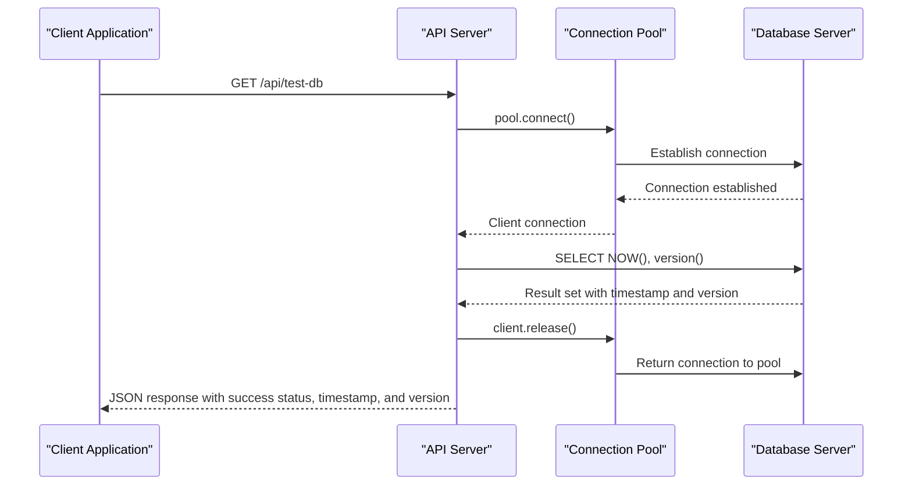
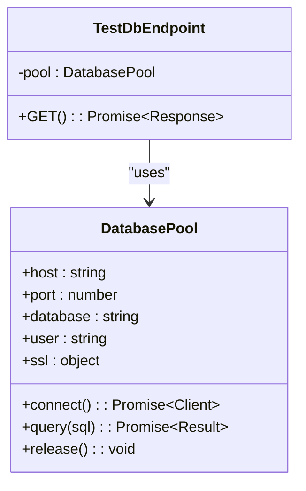
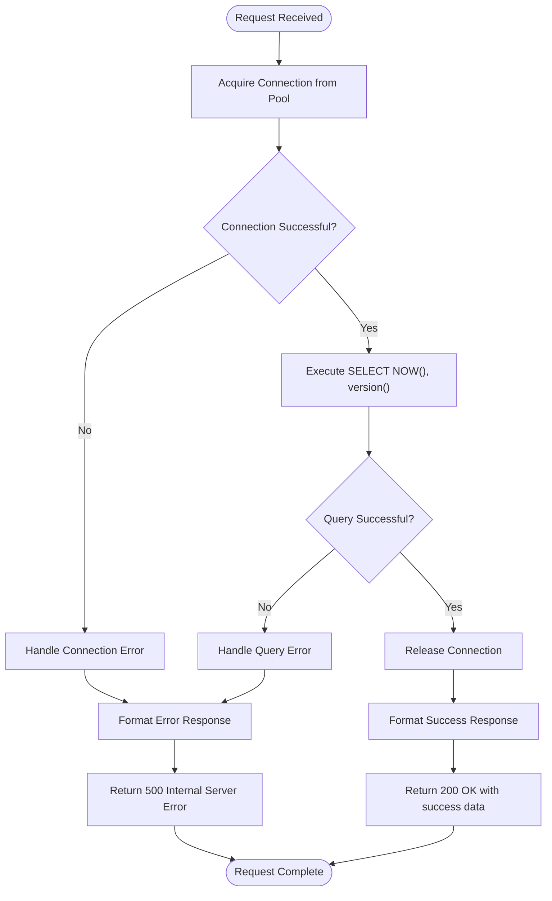

# Database Connection Testing API

<cite>
**Referenced Files in This Document**   
- [route.ts](file://app/api/test-db/route.ts)
- [db.ts](file://lib/db.ts)
- [DATABASE_MIGRATION_LOG.md](file://DATABASE_MIGRATION_LOG.md)
</cite>

## Table of Contents
1. [Introduction](#introduction)
2. [Endpoint Functionality](#endpoint-functionality)
3. [Implementation Details](#implementation-details)
4. [Response Structure](#response-structure)
5. [Integration with Connection Pooling](#integration-with-connection-pooling)
6. [Role in Migration Workflow](#role-in-migration-workflow)
7. [Error Handling Scenarios](#error-handling-scenarios)
8. [Security and Deployment Considerations](#security-and-deployment-considerations)

## Introduction
The `/api/test-db` endpoint serves as a critical health check mechanism for database connectivity within the application. This API endpoint performs a simple yet effective connectivity verification by executing a basic SQL query to confirm database availability and retrieve version information. As a fundamental component of the system's monitoring infrastructure, this endpoint enables deployment teams to verify database connectivity before and after critical operations such as schema migrations. The endpoint is designed to be safe for exposure in all environments due to its read-only nature and lack of access to sensitive data.

## Endpoint Functionality

The `/api/test-db` endpoint implements a GET request handler that verifies database connectivity by executing the SQL query `SELECT NOW(), version()`. This query serves dual purposes: retrieving the current timestamp from the database server and obtaining the database version information. The endpoint functions as a comprehensive health check that confirms not only network connectivity to the database server but also the ability to authenticate and execute queries successfully. This functionality is essential for deployment monitoring, allowing operations teams to validate database availability before proceeding with application updates or schema migrations.

**Section sources**
- [route.ts](file://app/api/test-db/route.ts#L3-L22)

## Implementation Details

The implementation of the `/api/test-db` endpoint follows a standard pattern for database interaction in the application. When a GET request is received, the endpoint attempts to acquire a client connection from the connection pool defined in `lib/db.ts`. Upon successful connection, it executes the diagnostic query and properly releases the client back to the pool. The response includes the timestamp returned by the database's `NOW()` function, the database version string, and a success status indicator. The implementation includes comprehensive error handling to capture and report any issues that occur during the connection process, such as network failures, authentication errors, or query execution problems.



**Diagram sources**
- [route.ts](file://app/api/test-db/route.ts#L3-L22)
- [db.ts](file://lib/db.ts#L0-L51)

**Section sources**
- [route.ts](file://app/api/test-db/route.ts#L3-L22)

## Response Structure

The `/api/test-db` endpoint returns responses in JSON format with distinct structures for successful and failed connection attempts. For successful connections, the response includes a success flag, the database server's current timestamp, the database version information, and a success message. In the event of connection failures, the response contains a success flag set to false and an error message describing the nature of the failure. This standardized response structure enables client applications to easily parse and interpret the health check results for monitoring and alerting purposes.

### Successful Response Example
```json
{
  "success": true,
  "timestamp": "2025-09-02T10:30:45.123Z",
  "database_version": "PostgreSQL 15.3 on x86_64-pc-linux-gnu, compiled by gcc (GCC) 10.3.1 20210424 (Red Hat 10.3.1-1), 64-bit",
  "message": "Database connection successful!"
}
```

### Failed Response Example
```json
{
  "success": false,
  "error": "Connection terminated unexpectedly"
}
```

**Section sources**
- [route.ts](file://app/api/test-db/route.ts#L3-L22)

## Integration with Connection Pooling

The `/api/test-db` endpoint integrates seamlessly with the application's connection pooling system implemented in `lib/db.ts`. The endpoint acquires database clients from the central pool, ensuring efficient resource utilization and preventing connection exhaustion. The connection pool is configured with appropriate settings for the PostgreSQL database, including host, port, database name, credentials, and SSL configuration. Notably, the pool implementation includes a proxy mechanism that handles cases where database environment variables are not configured, allowing the application to continue functioning during build-time tasks while providing meaningful warnings in non-production environments.



**Diagram sources**
- [db.ts](file://lib/db.ts#L0-L51)
- [route.ts](file://app/api/test-db/route.ts#L3-L22)

**Section sources**
- [db.ts](file://lib/db.ts#L0-L51)

## Role in Migration Workflow

The `/api/test-db` endpoint plays a crucial role in the database migration workflow as documented in `DATABASE_MIGRATION_LOG.md`. Before applying any schema changes, the migration process utilizes this endpoint to confirm database connectivity and availability. This pre-migration health check ensures that the database is accessible and responsive before initiating potentially disruptive schema modifications. The migration log specifically references the use of database connectivity verification as part of the implementation method, confirming that all migration operations were preceded by successful connectivity tests. This practice minimizes the risk of failed migrations due to underlying database connectivity issues.

**Section sources**
- [DATABASE_MIGRATION_LOG.md](file://DATABASE_MIGRATION_LOG.md#L0-L172)

## Error Handling Scenarios

The endpoint implements comprehensive error handling to address various failure scenarios that may occur during database connectivity checks. Common failure cases include network connectivity issues, authentication errors, database server unavailability, and query execution failures. When any error occurs, the endpoint captures the error message and returns a structured JSON response with success status set to false. The error handling mechanism includes logging the full error details to the server console for diagnostic purposes while only exposing the error message to the client, maintaining security by not revealing sensitive system information.



**Diagram sources**
- [route.ts](file://app/api/test-db/route.ts#L3-L22)

**Section sources**
- [route.ts](file://app/api/test-db/route.ts#L3-L22)

## Security and Deployment Considerations

The `/api/test-db` endpoint is designed with security and deployment best practices in mind. It performs only a basic read operation that does not access any application data, making it safe to expose in all environments including production. The query `SELECT NOW(), version()` retrieves only system-level information without exposing sensitive data or schema details. This safety profile allows operations teams to use the endpoint for continuous monitoring without security concerns. The endpoint's simplicity and reliability make it an ideal component for integration with monitoring systems, deployment pipelines, and health check configurations in container orchestration platforms.

**Section sources**
- [route.ts](file://app/api/test-db/route.ts#L3-L22)
- [DATABASE_MIGRATION_LOG.md](file://DATABASE_MIGRATION_LOG.md#L0-L172)