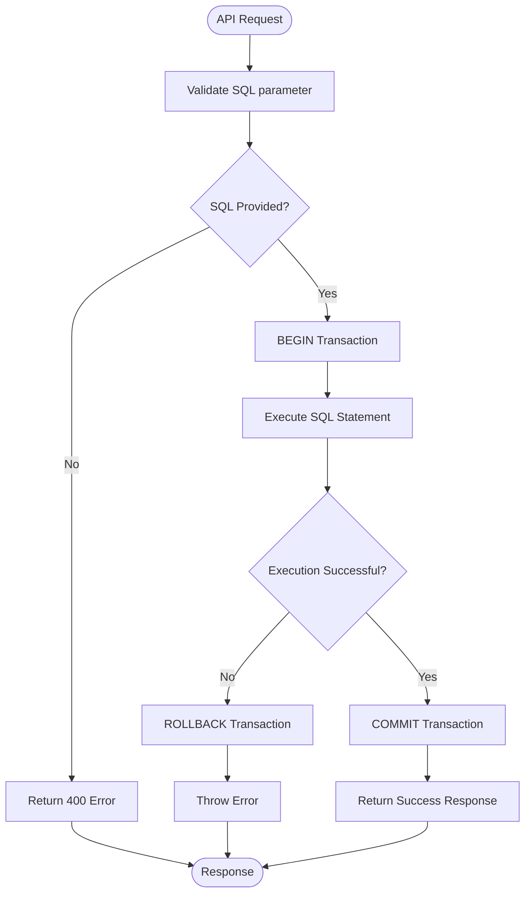

# Database Migration API

<cite>
**Referenced Files in This Document**   
- [route.ts](file://app/api/db-migrate/route.ts)
- [db.ts](file://lib/db.ts)
- [DATABASE_MIGRATION_LOG.md](file://DATABASE_MIGRATION_LOG.md)
</cite>

## Table of Contents
1. [Introduction](#introduction)
2. [API Endpoint Overview](#api-endpoint-overview)
3. [Request Structure](#request-structure)
4. [Transaction Management](#transaction-management)
5. [Security Restrictions](#security-restrictions)
6. [Migration Examples](#migration-examples)
7. [Error Handling](#error-handling)
8. [Rollback Mechanism](#rollback-mechanism)
9. [Common Issues](#common-issues)
10. [Usage Example](#usage-example)

## Introduction
The `/api/db-migrate` endpoint provides a secure interface for executing database schema migrations through API calls. This documentation details the endpoint's functionality, security constraints, transaction handling, and practical usage patterns. The endpoint is designed to support development workflows while preventing accidental schema changes in production environments.

## API Endpoint Overview
The `/api/db-migrate` endpoint accepts POST requests to execute SQL statements for database schema modifications. It serves as a controlled mechanism for applying database migrations during development, with built-in safeguards to maintain data integrity.

The endpoint is located at `/app/api/db-migrate/route.ts` and uses Next.js API routes to handle incoming requests. It leverages the PostgreSQL database connection pool configured in the application to execute SQL statements within transaction boundaries.

**Section sources**
- [route.ts](file://app/api/db-migrate/route.ts#L3-L54)

## Request Structure
The endpoint expects a JSON payload with specific fields for migration execution:

- `sql` (required): The SQL statement to execute for the migration
- `description` (optional): A descriptive label for the migration operation

The request must be a POST with Content-Type header set to application/json. The `sql` field is mandatory and must contain valid SQL syntax for the target database.

When a request is received, the endpoint parses the JSON body and validates the presence of the required `sql` parameter. If the parameter is missing, the endpoint returns a 400 Bad Request response with an appropriate error message.

**Section sources**
- [route.ts](file://app/api/db-migrate/route.ts#L3-L15)

## Transaction Management
The endpoint implements transaction-based execution to ensure data integrity during schema changes. Each migration runs within a transaction boundary using the standard BEGIN/COMMIT/ROLLBACK pattern:

1. **BEGIN**: The transaction is initiated before SQL execution
2. **Execution**: The provided SQL statement is executed
3. **COMMIT**: If successful, changes are committed to the database
4. **ROLLBACK**: On failure, all changes are rolled back automatically

This transactional approach ensures that schema modifications are atomic - either all changes are applied successfully, or none are applied in case of errors. This prevents partial migrations that could leave the database in an inconsistent state.

The transaction scope covers the entire migration operation, providing a safety net for potentially destructive schema changes.



**Diagram sources **
- [route.ts](file://app/api/db-migrate/route.ts#L20-L35)

**Section sources**
- [route.ts](file://app/api/db-migrate/route.ts#L20-L35)

## Security Restrictions
The endpoint includes environment-based security restrictions to prevent unauthorized schema modifications. The access control is enforced through the database configuration in `lib/db.ts`, which checks the application's environment settings.

The migration endpoint should only be accessible in development environments. In production, the endpoint is effectively disabled through the database configuration, which creates a stub connection when database environment variables are not configured.

The security mechanism relies on the `isDbConfigured` flag in `lib/db.ts`, which evaluates the presence of required database environment variables (POSTGRES_HOST and POSTGRES_PASSWORD). When these variables are not set and the environment is not production, the system continues with a stub connection for build-time tasks, but actual database operations are prevented.

This design ensures that schema migrations cannot be accidentally executed in production environments, protecting the integrity of live data.

**Section sources**
- [db.ts](file://lib/db.ts#L4-L6)
- [db.ts](file://lib/db.ts#L47-L49)

## Migration Examples
The DATABASE_MIGRATION_LOG.md file contains examples of successful migrations that demonstrate the endpoint's usage. These examples show the creation of tables required for message broadcasting functionality.

### Message Tables Implementation
A successful migration created two tables for message tracking:

**message_history**: Stores broadcast message records with delivery statistics
```sql
CREATE TABLE message_history (
    id SERIAL PRIMARY KEY,
    message_text TEXT NOT NULL,
    total_recipients INTEGER NOT NULL DEFAULT 0,
    successful_deliveries INTEGER DEFAULT 0,
    sent_at TIMESTAMP WITH TIME ZONE DEFAULT CURRENT_TIMESTAMP,
    created_at TIMESTAMP WITH TIME ZONE DEFAULT CURRENT_TIMESTAMP
);
```

**message_recipients**: Tracks individual message delivery status for each recipient
```sql
CREATE TABLE message_recipients (
    id SERIAL PRIMARY KEY,
    message_id INTEGER NOT NULL REFERENCES message_history(id) ON DELETE CASCADE,
    user_id BIGINT NOT NULL,
    username TEXT,
    delivery_status TEXT DEFAULT 'pending',
    created_at TIMESTAMP WITH TIME ZONE DEFAULT CURRENT_TIMESTAMP
);
```

These tables were created with appropriate indexes for performance optimization and foreign key constraints to maintain referential integrity.

**Section sources**
- [DATABASE_MIGRATION_LOG.md](file://DATABASE_MIGRATION_LOG.md#L7-L80)

## Error Handling
The endpoint implements comprehensive error handling for various failure scenarios:

### Missing SQL Parameter
When the `sql` field is missing from the request body, the endpoint returns:
```json
{
  "success": false,
  "error": "SQL statement is required"
}
```
With HTTP status code 400 (Bad Request).

### SQL Syntax Errors
If the provided SQL contains syntax errors, the database will reject the statement and the endpoint will return:
```json
{
  "success": false,
  "error": "relation 'message_history' does not exist"
}
```
With HTTP status code 500 (Internal Server Error).

### Constraint Violations
When SQL execution violates database constraints (e.g., duplicate primary keys, foreign key violations), the database raises an error which is propagated through the endpoint with appropriate error details.

All errors are caught in the outer try-catch block, logged to the console with appropriate error symbols, and returned as JSON responses with descriptive messages.

**Section sources**
- [route.ts](file://app/api/db-migrate/route.ts#L7-L15)
- [route.ts](file://app/api/db-migrate/route.ts#L45-L54)

## Rollback Mechanism
The endpoint implements an automatic rollback mechanism that activates when SQL execution fails. This ensures data integrity by reverting any partial changes made during a migration attempt.

When an error occurs during SQL execution, the catch block explicitly executes a ROLLBACK command:
```typescript
await client.query('ROLLBACK');
throw error;
```

This immediate rollback prevents the transaction from being left in an open state and ensures that no partial schema changes are committed to the database. The original error is then re-thrown to be caught by the outer error handler, which returns an appropriate error response to the client.

The finally block ensures that the database client is properly released back to the connection pool regardless of whether the operation succeeded or failed, preventing connection leaks.

For manual rollback operations, the endpoint can be used with DROP statements as shown in the migration log:
```bash
curl -X POST http://localhost:3000/api/db-migrate \
  -H "Content-Type: application/json" \
  -d '{
    "description": "ROLLBACK: Drop message tables",
    "sql": "DROP TABLE IF EXISTS message_recipients CASCADE; DROP TABLE IF EXISTS message_history CASCADE;"
  }'
```

**Section sources**
- [route.ts](file://app/api/db-migrate/route.ts#L37-L40)
- [DATABASE_MIGRATION_LOG.md](file://DATABASE_MIGRATION_LOG.md#L105-L123)

## Common Issues
Several common issues may arise when using the database migration endpoint:

### Migration Conflicts
Concurrent migration attempts can lead to conflicts, especially when multiple developers are working on the same database instance. To avoid conflicts:
- Coordinate migration timing among team members
- Use descriptive migration names to track who applied which changes
- Consider implementing a migration versioning system for production use

### Database Locking
Schema modifications can acquire locks on database objects, potentially blocking other operations. Long-running migrations may impact application performance. To mitigate:
- Schedule migrations during low-traffic periods
- Break large migrations into smaller, incremental changes
- Test migrations on a copy of production data first

### Environment Configuration
Ensure that database environment variables are properly configured in development environments. Missing POSTGRES_HOST or POSTGRES_PASSWORD variables will prevent the migration endpoint from functioning correctly, as the database connection will be stubbed.

**Section sources**
- [db.ts](file://lib/db.ts#L1-L10)
- [DATABASE_MIGRATION_LOG.md](file://DATABASE_MIGRATION_LOG.md#L79-L85)

## Usage Example
To execute a database migration using the `/api/db-migrate` endpoint, use the following curl command:

```bash
curl -X POST http://localhost:3000/api/db-migrate \
  -H "Content-Type: application/json" \
  -d '{
    "description": "Create message tables",
    "sql": "CREATE TABLE message_history (id SERIAL PRIMARY KEY, message_text TEXT NOT NULL); CREATE TABLE message_recipients (id SERIAL PRIMARY KEY, message_id INTEGER NOT NULL REFERENCES message_history(id) ON DELETE CASCADE, user_id BIGINT NOT NULL);"
  }'
```

On successful execution, the endpoint returns:
```json
{
  "success": true,
  "message": "Migration executed successfully: Create message tables",
  "rowsAffected": null,
  "command": "CREATE"
}
```

The console will display log messages indicating the migration progress:
```
🔧 Executing database migration: Create message tables
📝 SQL: CREATE TABLE message_history...
✅ Migration successful: Create message tables
```

**Section sources**
- [route.ts](file://app/api/db-migrate/route.ts#L17-L35)
- [DATABASE_MIGRATION_LOG.md](file://DATABASE_MIGRATION_LOG.md#L124-L172)