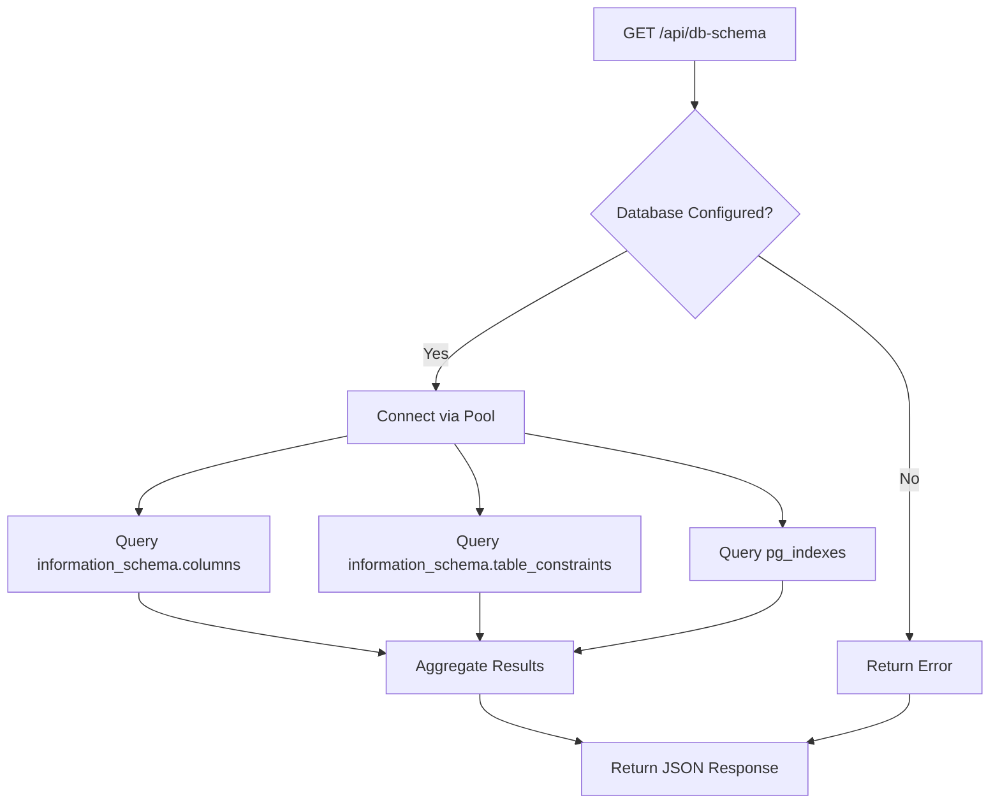
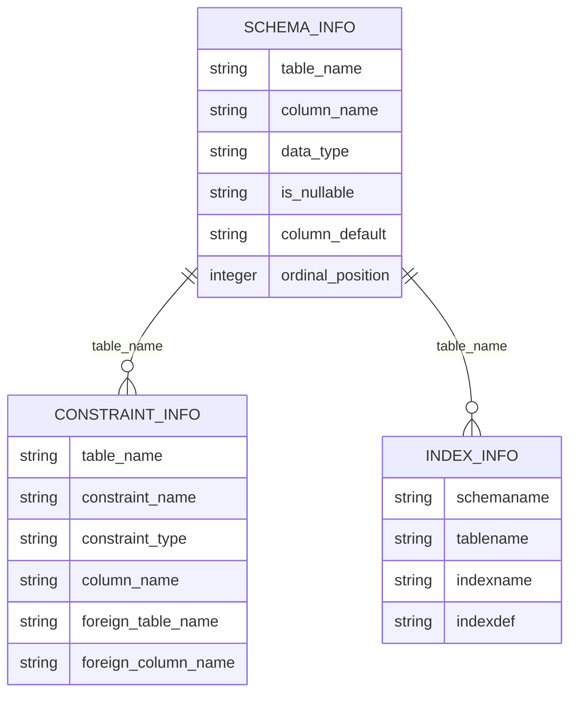
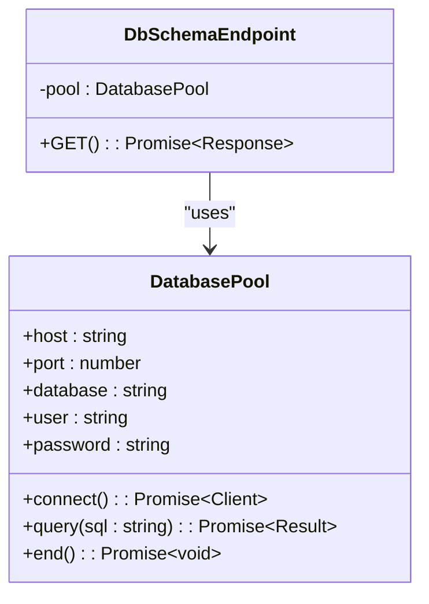

# Database Schema Inspection API

<cite>
**Referenced Files in This Document**   
- [app/api/db-schema/route.ts](file://app/api/db-schema/route.ts)
- [lib/db.ts](file://lib/db.ts)
- [DATABASE_MIGRATION_LOG.md](file://DATABASE_MIGRATION_LOG.md)
</cite>

## Table of Contents
1. [Introduction](#introduction)
2. [Endpoint Overview](#endpoint-overview)
3. [Query Structure](#query-structure)
4. [Response Format](#response-format)
5. [Practical Use Cases](#practical-use-cases)
6. [Security Considerations](#security-considerations)
7. [Integration with Database Connection](#integration-with-database-connection)
8. [Verification in Migration Workflow](#verification-in-migration-workflow)

## Introduction

The `/api/db-schema` endpoint provides a comprehensive view of the current database structure, enabling developers to inspect schema details without direct database access. This API is particularly valuable during development, debugging, and migration validation processes. It returns detailed metadata about tables, constraints, and indexes within the public schema, offering insight into the database's structural integrity and design.

**Section sources**
- [app/api/db-schema/route.ts](file://app/api/db-schema/route.ts#L3-L70)

## Endpoint Overview

The `/api/db-schema` endpoint accepts GET requests and returns a complete representation of the database schema. It connects to the PostgreSQL database using connection pooling from `lib/db.ts` and executes three distinct queries to gather comprehensive schema information:

1. Table and column definitions from `information_schema.columns`
2. Constraint relationships from `information_schema.table_constraints`
3. Index details from `pg_indexes`

The endpoint is designed to be resilient, with proper error handling that returns a 500 status code with descriptive messages if schema inspection fails. It does not expose any actual data content, only structural metadata.



**Diagram sources**
- [app/api/db-schema/route.ts](file://app/api/db-schema/route.ts#L3-L70)
- [lib/db.ts](file://lib/db.ts#L34-L45)

**Section sources**
- [app/api/db-schema/route.ts](file://app/api/db-schema/route.ts#L3-L70)

## Query Structure

The endpoint employs a three-part query structure to comprehensively capture the database schema:

### 1. Table Structure Query
The first query retrieves all tables and their columns from the `information_schema.columns` view, filtering for the public schema. It returns essential column metadata including name, data type, nullability, default values, and ordinal position.

### 2. Constraints Query
The second query extracts constraint information from `information_schema.table_constraints`, joined with key column usage and constraint column usage tables. This provides details about primary keys, foreign keys, and other constraints, including the relationships between tables.

### 3. Indexes Query
The third query fetches index information from the `pg_indexes` system catalog, specifically for the public schema. It returns the index definition, allowing developers to understand performance optimization strategies implemented in the database.



**Diagram sources**
- [app/api/db-schema/route.ts](file://app/api/db-schema/route.ts#L16-L48)

**Section sources**
- [app/api/db-schema/route.ts](file://app/api/db-schema/route.ts#L16-L48)

## Response Format

The endpoint returns a JSON response with a standardized format containing a success flag and a schema object with three main arrays:

```json
{
  "success": true,
  "schema": {
    "tables": [
      {
        "table_name": "string",
        "column_name": "string",
        "data_type": "string",
        "is_nullable": "string",
        "column_default": "string",
        "ordinal_position": "number"
      }
    ],
    "constraints": [
      {
        "table_name": "string",
        "constraint_name": "string",
        "constraint_type": "string",
        "column_name": "string",
        "foreign_table_name": "string",
        "foreign_column_name": "string"
      }
    ],
    "indexes": [
      {
        "schemaname": "string",
        "tablename": "string",
        "indexname": "string",
        "indexdef": "string"
      }
    ]
  }
}
```

The `tables` array contains detailed column information for each table, the `constraints` array documents all constraint relationships including foreign key mappings, and the `indexes` array provides the complete index definitions for performance analysis.

**Section sources**
- [app/api/db-schema/route.ts](file://app/api/db-schema/route.ts#L60-L68)

## Practical Use Cases

The `/api/db-schema` endpoint serves several practical purposes in the development and maintenance workflow:

### Debugging Schema Errors
When encountering errors like "relation does not exist," developers can use this endpoint to verify whether expected tables are present in the database. By comparing the returned schema with the application's expectations, teams can quickly identify migration issues or configuration problems.

### Verifying Foreign Key Relationships
The constraints section of the response allows developers to validate that foreign key relationships are properly established between tables. This is particularly useful after migrations to ensure referential integrity has been maintained.

### Performance Analysis
The indexes information enables performance optimization by revealing which columns are indexed and the index structure. Developers can identify missing indexes on frequently queried columns or detect redundant indexes that may impact write performance.

### Documentation and Onboarding
New team members can use this endpoint to quickly understand the database structure without requiring direct database access, accelerating onboarding and reducing the learning curve.

**Section sources**
- [app/api/db-schema/route.ts](file://app/api/db-schema/route.ts#L3-L70)
- [DATABASE_MIGRATION_LOG.md](file://DATABASE_MIGRATION_LOG.md#L1-L172)

## Security Considerations

While the `/api/db-schema` endpoint exposes structural information about the database, it does not reveal any actual data content, mitigating significant security risks. The information returned is metadata that would typically be accessible to database users with standard privileges.

The endpoint should be restricted in production environments to authorized personnel only, as schema information could potentially aid malicious actors in crafting more sophisticated attacks. However, the risk is substantially lower than exposing actual data records.

No sensitive information such as passwords, API keys, or personal data is included in the response, as the queries are specifically designed to retrieve only structural metadata from system catalogs.

**Section sources**
- [app/api/db-schema/route.ts](file://app/api/db-schema/route.ts#L3-L70)

## Integration with Database Connection

The endpoint integrates with the database connection pooling system implemented in `lib/db.ts`. It uses the shared pool instance to establish connections, ensuring efficient resource utilization and preventing connection exhaustion.

The connection pooling mechanism includes graceful degradation when the database is not configured, returning appropriate error responses rather than crashing. This allows the application to build and run in environments without a database connection, such as during static site generation or local development without database setup.



**Diagram sources**
- [lib/db.ts](file://lib/db.ts#L34-L45)
- [app/api/db-schema/route.ts](file://app/api/db-schema/route.ts#L3-L70)

**Section sources**
- [lib/db.ts](file://lib/db.ts#L34-L45)
- [app/api/db-schema/route.ts](file://app/api/db-schema/route.ts#L3-L70)

## Verification in Migration Workflow

The `/api/db-schema` endpoint played a crucial role in verifying the successful implementation of message tables as documented in `DATABASE_MIGRATION_LOG.md`. After executing the migration to create `message_history` and `message_recipients` tables, developers used this endpoint to confirm that:

1. Both tables were successfully created in the database
2. All required columns with correct data types were present
3. The foreign key relationship between `message_recipients.message_id` and `message_history.id` was properly established
4. All necessary indexes (e.g., `idx_message_recipients_message_id`) were created

This verification step ensured that the database schema matched the expected structure before proceeding with application-level testing, reducing the risk of runtime errors due to schema mismatches. The endpoint provided immediate feedback on the migration's success, complementing the functional tests performed through the `/api/test-messages` endpoint.

**Section sources**
- [app/api/db-schema/route.ts](file://app/api/db-schema/route.ts#L3-L70)
- [DATABASE_MIGRATION_LOG.md](file://DATABASE_MIGRATION_LOG.md#L1-L172)