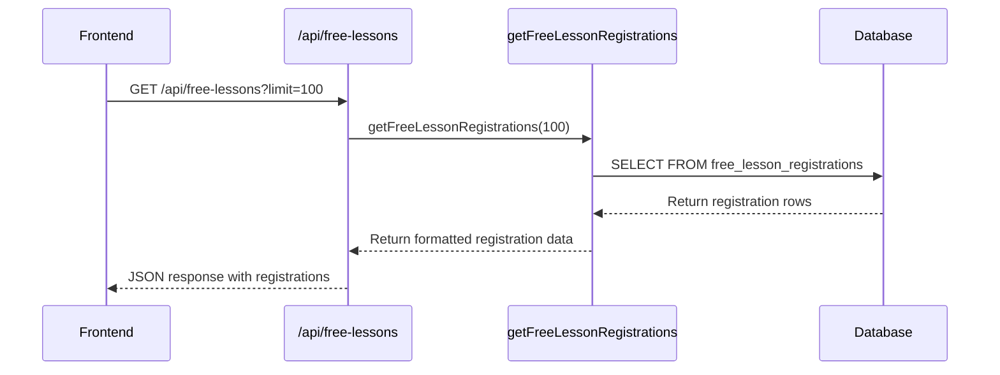
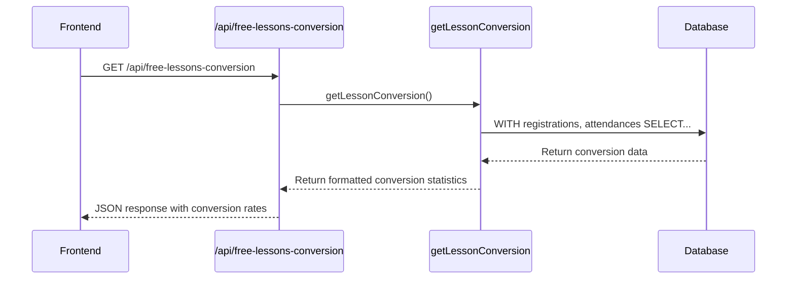
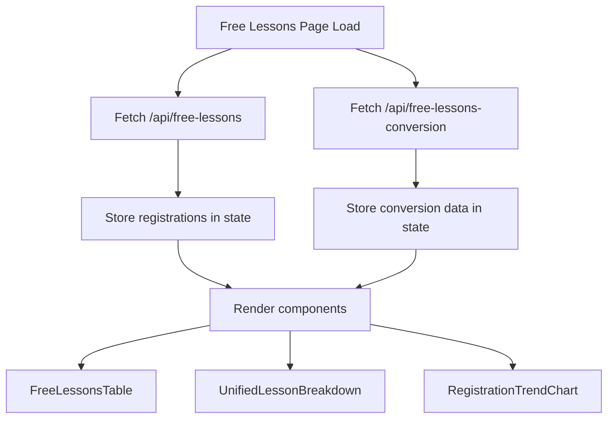
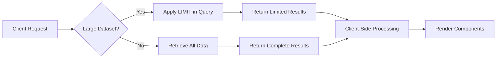

# Free Lessons API

<cite>
**Referenced Files in This Document**   
- [route.ts](file://app/api/free-lessons/route.ts)
- [route.ts](file://app/api/free-lessons-conversion/route.ts)
- [page.tsx](file://app/free-lessons/page.tsx)
- [FreeLessonsTable.tsx](file://components/FreeLessonsTable.tsx)
- [UnifiedLessonBreakdown.tsx](file://components/UnifiedLessonBreakdown.tsx)
- [RegistrationTrendChart.tsx](file://components/RegistrationTrendChart.tsx)
- [queries.ts](file://lib/queries.ts)
- [db.ts](file://lib/db.ts)
</cite>

## Table of Contents
1. [Introduction](#introduction)
2. [API Endpoints Overview](#api-endpoints-overview)
3. [Free Lessons Registration Endpoint](#free-lessons-registration-endpoint)
4. [Conversion Rate Analytics Endpoint](#conversion-rate-analytics-endpoint)
5. [Request/Response Schemas](#requestresponse-schemas)
6. [Query Parameters](#query-parameters)
7. [Integration with Frontend Dashboard](#integration-with-frontend-dashboard)
8. [Error Handling](#error-handling)
9. [Performance Considerations](#performance-considerations)
10. [Database Schema](#database-schema)

## Introduction

The Free Lessons API provides endpoints for tracking student registrations for free lessons and analyzing conversion rates from registration to attendance. This documentation covers the `/api/free-lessons` endpoint for registration tracking and the `/api/free-lessons-conversion` endpoint for conversion rate analytics. These endpoints support the free lessons dashboard, enabling data visualization and tracking of student engagement with free lesson offerings.

The API is built using Next.js App Router with TypeScript, connecting to a PostgreSQL database through the pg library. The endpoints are designed to support the free lessons page in the dashboard, providing data for registration tables, trend charts, and conversion analytics.

**Section sources**
- [route.ts](file://app/api/free-lessons/route.ts)
- [route.ts](file://app/api/free-lessons-conversion/route.ts)
- [page.tsx](file://app/free-lessons/page.tsx)

## API Endpoints Overview

The Free Lessons API consists of two primary endpoints:

1. **GET /api/free-lessons**: Retrieves free lesson registration data including student contact information, registration date, and lesson details.
2. **GET /api/free-lessons-conversion**: Provides conversion rate analytics showing the percentage of registered students who attended each lesson type.

These endpoints are consumed by the free lessons dashboard page, which displays registration data in a table format, shows registration trends over time, and presents conversion statistics for different lesson types. The API follows REST conventions with JSON responses and standard HTTP status codes.

```mermaid
graph TD
A[Frontend Dashboard] --> B[/api/free-lessons]
A --> C[/api/free-lessons-conversion]
B --> D[Database: free_lesson_registrations]
C --> D
C --> E[Database: events]
D --> F[Registration Data]
E --> G[Attendance Data]
F --> B
G --> C
```

**Diagram sources**
- [route.ts](file://app/api/free-lessons/route.ts)
- [route.ts](file://app/api/free-lessons-conversion/route.ts)
- [queries.ts](file://lib/queries.ts)

## Free Lessons Registration Endpoint

The `/api/free-lessons` endpoint retrieves registration data for free lessons, providing detailed information about students who have signed up for free introductory sessions.

### Endpoint Details
- **Method**: GET
- **Path**: `/api/free-lessons`
- **Purpose**: Retrieve free lesson registration records
- **Authentication**: None required (assumes dashboard authentication at page level)

### Request Parameters
The endpoint accepts a single query parameter:
- `limit` (optional, default: 50): Maximum number of registration records to return

### Response Structure
The endpoint returns an array of registration objects with the following fields:
- Student identification and contact information
- Registration timestamp
- Lesson type and scheduled date
- Notification status

The registrations are ordered by registration date in descending order (most recent first).

### Implementation
The endpoint calls the `getFreeLessonRegistrations` function from the queries module, which executes a PostgreSQL query to retrieve registration data from the `free_lesson_registrations` table. The function maps database rows to a consistent TypeScript interface, handling null values and formatting dates appropriately.



**Diagram sources**
- [route.ts](file://app/api/free-lessons/route.ts)
- [queries.ts](file://lib/queries.ts)
- [db.ts](file://lib/db.ts)

**Section sources**
- [route.ts](file://app/api/free-lessons/route.ts#L1-L19)
- [queries.ts](file://lib/queries.ts#L393-L426)

## Conversion Rate Analytics Endpoint

The `/api/free-lessons-conversion` endpoint provides conversion rate analytics, calculating the percentage of registered students who actually attended each type of free lesson.

### Endpoint Details
- **Method**: GET
- **Path**: `/api/free-lessons-conversion`
- **Purpose**: Retrieve lesson conversion statistics
- **Authentication**: None required (assumes dashboard authentication at page level)

### Response Structure
The endpoint returns an array of conversion statistics objects, each containing:
- Lesson type
- Total number of registrations
- Number of attendances (students who clicked the lesson link)
- Conversion rate as a percentage

Results are ordered by the number of registrations in descending order.

### Implementation
The endpoint calls the `getLessonConversion` function from the queries module, which uses a complex PostgreSQL query with Common Table Expressions (CTEs) to calculate conversion rates. The query joins registration data from the `free_lesson_registrations` table with attendance data from the `events` table (where event_type is 'lesson_link_clicked'). The conversion rate is calculated as (attendances / registrations) * 100, rounded to one decimal place.



**Diagram sources**
- [route.ts](file://app/api/free-lessons-conversion/route.ts)
- [queries.ts](file://lib/queries.ts#L429-L471)
- [db.ts](file://lib/db.ts)

**Section sources**
- [route.ts](file://app/api/free-lessons-conversion/route.ts#L1-L15)
- [queries.ts](file://lib/queries.ts#L429-L471)

## Request/Response Schemas

### Free Lessons Registration Schema

The `/api/free-lessons` endpoint returns an array of registration objects with the following structure:

```json
[
  {
    "id": 123,
    "user_id": 456,
    "username": "john_doe",
    "first_name": "John",
    "email": "john@example.com",
    "registered_at": "2023-12-01T10:30:00.000Z",
    "notification_sent": true,
    "lesson_type": "Introduction to Coding",
    "lesson_date": "2023-12-05"
  }
]
```

**Field Descriptions:**
- `id`: Unique identifier for the registration record
- `user_id`: Telegram user ID of the registrant
- `username`: Telegram username (without @ prefix)
- `first_name`: First name provided during registration
- `email`: Email address provided during registration
- `registered_at`: ISO 8601 timestamp of registration
- `notification_sent`: Boolean indicating if registration confirmation was sent
- `lesson_type`: Type/category of the free lesson
- `lesson_date`: Scheduled date of the lesson (YYYY-MM-DD format)

### Conversion Rate Analytics Schema

The `/api/free-lessons-conversion` endpoint returns an array of conversion statistics objects:

```json
[
  {
    "lesson_type": "Introduction to Coding",
    "registrations": 150,
    "attendances": 85,
    "conversion_rate": 56.7
  }
]
```

**Field Descriptions:**
- `lesson_type`: Type/category of the free lesson
- `registrations`: Total number of registrations for this lesson type
- `attendances`: Number of students who attended (clicked lesson link)
- `conversion_rate`: Percentage of registrations that converted to attendance

**Section sources**
- [queries.ts](file://lib/queries.ts#L33-L43)
- [queries.ts](file://lib/queries.ts#L43-L53)

## Query Parameters

### Free Lessons Endpoint Parameters

The `/api/free-lessons` endpoint supports the following query parameter:

| Parameter | Type | Required | Default | Description |
|---------|------|----------|---------|-------------|
| limit | number | No | 50 | Maximum number of registration records to return. Used for pagination and performance optimization when dealing with large datasets. |

**Example Usage:**
- `/api/free-lessons?limit=100` - Returns up to 100 most recent registrations
- `/api/free-lessons` - Returns up to 50 most recent registrations (default)

The `limit` parameter helps manage performance when retrieving large datasets, allowing the frontend to request only the number of records needed for display.

### Conversion Analytics Endpoint Parameters

The `/api/free-lessons-conversion` endpoint does not currently accept any query parameters. It returns conversion statistics for all lesson types. Future enhancements could include parameters for date ranges or specific lesson types.

**Section sources**
- [route.ts](file://app/api/free-lessons/route.ts#L5-L8)

## Integration with Frontend Dashboard

The Free Lessons API endpoints are integrated with the frontend dashboard through the `/app/free-lessons/page.tsx` component, which fetches data from both endpoints and renders it using various visualization components.

### Data Flow

When the free lessons page loads, it makes parallel requests to both API endpoints:



**Diagram sources**
- [page.tsx](file://app/free-lessons/page.tsx#L31-L60)

### Component Integration

The retrieved data is used by several components:

1. **FreeLessonsTable**: Displays registration data in a tabular format with search and export functionality
2. **UnifiedLessonBreakdown**: Shows lesson statistics grouped by lesson type and date, with conversion rates
3. **RegistrationTrendChart**: Visualizes registration trends over the last 30 days

The page uses React's useState and useEffect hooks to manage data fetching and state, with error handling to display appropriate messages if requests fail.

**Section sources**
- [page.tsx](file://app/free-lessons/page.tsx)
- [FreeLessonsTable.tsx](file://components/FreeLessonsTable.tsx)
- [UnifiedLessonBreakdown.tsx](file://components/UnifiedLessonBreakdown.tsx)
- [RegistrationTrendChart.tsx](file://components/RegistrationTrendChart.tsx)

## Error Handling

The API endpoints implement consistent error handling patterns to ensure reliable operation and meaningful error reporting.

### Server-Side Error Handling

Both endpoints use try-catch blocks to handle potential errors during database operations:

```typescript
try {
  // Database operations
} catch (error) {
  console.error('Error message describing the failure');
  return NextResponse.json(
    { error: 'User-friendly error message' },
    { status: 500 }
  );
}
```

When an error occurs:
1. The error is logged to the server console for debugging
2. A JSON response with an error message is returned
3. HTTP status code 500 (Internal Server Error) is set

Common error scenarios include:
- Database connection failures
- Query execution errors
- Network issues between the API and database

### Client-Side Error Handling

The frontend implements error handling in the `fetchData` function:

```typescript
try {
  const [registrationsResponse, conversionResponse] = await Promise.all([
    fetch('/api/free-lessons'),
    fetch('/api/free-lessons-conversion')
  ]);
  
  if (!registrationsResponse.ok || !conversionResponse.ok) {
    throw new Error('Failed to fetch free lessons data');
  }
  
  // Process successful responses
} catch (err) {
  setError(err instanceof Error ? err.message : 'An error occurred');
}
```

Error states are displayed to users with appropriate messaging, and loading states are managed to provide feedback during data retrieval.

**Section sources**
- [route.ts](file://app/api/free-lessons/route.ts#L9-L19)
- [route.ts](file://app/api/free-lessons-conversion/route.ts#L7-L15)
- [page.tsx](file://app/free-lessons/page.tsx#L45-L55)

## Performance Considerations

The Free Lessons API includes several performance optimizations to handle potentially large datasets efficiently.

### Database Query Optimization

The `getFreeLessonRegistrations` function includes a LIMIT clause to prevent excessive data retrieval:

```sql
SELECT 
  id,
  user_id,
  username,
  first_name,
  email,
  registered_at,
  notification_sent,
  lesson_type,
  lesson_date
FROM free_lesson_registrations
ORDER BY registered_at DESC
LIMIT $1
```

This ensures that only the requested number of records are retrieved from the database, reducing memory usage and response time.

### Connection Pooling

The application uses PostgreSQL connection pooling through the pg library's Pool class. This allows multiple database queries to reuse existing connections rather than creating new ones for each request, improving performance and reducing connection overhead.

### Frontend Data Management

The frontend dashboard implements several performance optimizations:

1. **Parallel Requests**: The registration and conversion data are fetched in parallel using Promise.all()
2. **Client-Side Filtering**: The FreeLessonsTable component implements search filtering on the client side after initial data load
3. **Efficient Rendering**: React's useEffect hook ensures data is only processed when the registrations prop changes

### Scalability Considerations

For very large datasets, additional optimizations could include:
- Implementing pagination with offset/limit parameters
- Adding database indexes on frequently queried columns (registered_at, lesson_type)
- Implementing caching strategies for conversion rate data
- Adding date range parameters to limit the time period of data retrieved



**Diagram sources**
- [queries.ts](file://lib/queries.ts#L393-L426)
- [db.ts](file://lib/db.ts)
- [page.tsx](file://app/free-lessons/page.tsx#L31-L60)

## Database Schema

The Free Lessons API interacts with the PostgreSQL database through two main tables:

### free_lesson_registrations Table

This table stores registration data for free lessons with the following columns:

| Column | Type | Description |
|-------|------|-------------|
| id | integer | Primary key, unique identifier |
| user_id | integer | Telegram user ID |
| username | text | Telegram username |
| first_name | text | User's first name |
| email | text | User's email address |
| registered_at | timestamp | When the registration was created |
| notification_sent | boolean | Whether confirmation was sent |
| lesson_type | text | Type/category of the free lesson |
| lesson_date | date | Scheduled date of the lesson |

### events Table

This table stores user activity events, including attendance data used for conversion tracking:

| Column | Type | Description |
|-------|------|-------------|
| id | integer | Primary key, unique identifier |
| user_id | integer | Telegram user ID |
| event_type | text | Type of event (e.g., 'lesson_link_clicked') |
| created_at | timestamp | When the event occurred |
| details | jsonb | Additional event-specific data |

The conversion rate calculation joins these tables by lesson type, counting registrations from the free_lesson_registrations table and attendances from the events table where event_type is 'lesson_link_clicked'.

**Section sources**
- [queries.ts](file://lib/queries.ts#L393-L471)
- [db.ts](file://lib/db.ts)