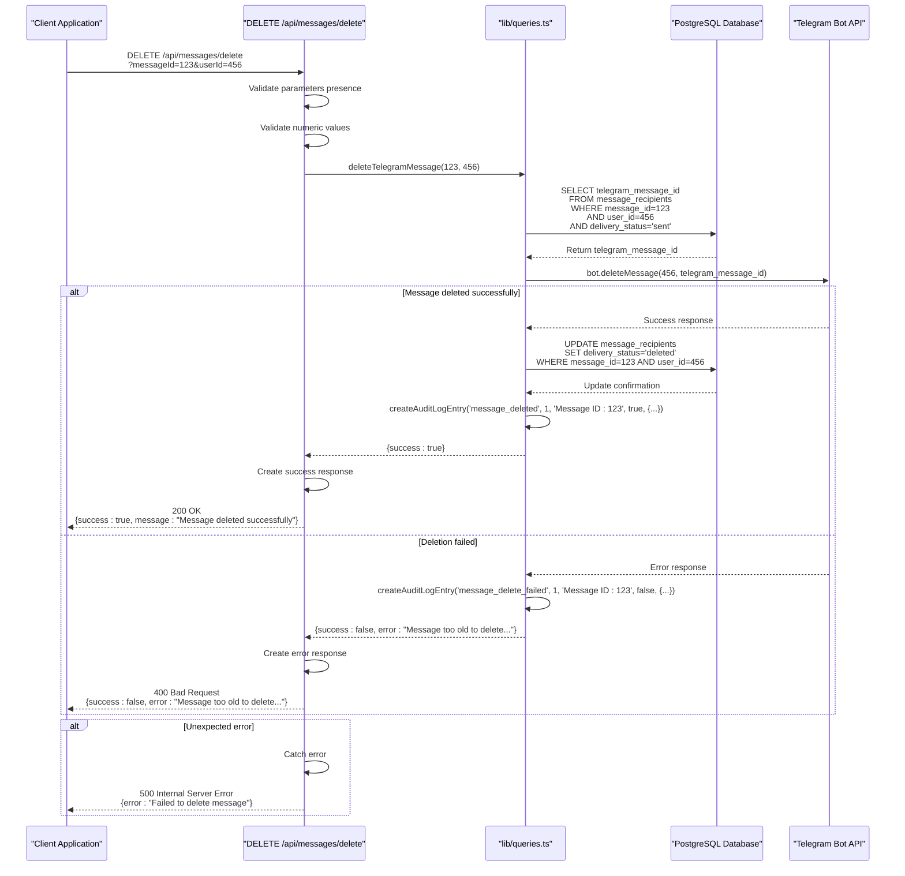

# Delete Message API

<cite>
**Referenced Files in This Document**   
- [app/api/messages/delete/route.ts](file://app/api/messages/delete/route.ts)
- [lib/queries.ts](file://lib/queries.ts)
- [DATABASE_MIGRATION_LOG.md](file://DATABASE_MIGRATION_LOG.md)
</cite>

## Table of Contents
1. [Introduction](#introduction)
2. [Endpoint Overview](#endpoint-overview)
3. [Request Validation](#request-validation)
4. [Message Deletion Process](#message-deletion-process)
5. [Audit Logging](#audit-logging)
6. [Response Schema](#response-schema)
7. [Database Schema](#database-schema)
8. [Error Handling](#error-handling)
9. [Sequence Diagram](#sequence-diagram)

## Introduction
This document provides comprehensive documentation for the `/api/messages/delete` endpoint, which enables the deletion of Telegram messages sent through the messaging system. The API endpoint handles the complete process of validating parameters, deleting messages via the Telegram Bot API, updating recipient status in the database, and creating audit logs for both successful and failed operations. The system integrates with the message broadcasting infrastructure and maintains data consistency across the application.

## Endpoint Overview
The `/api/messages/delete` endpoint provides a DELETE method for removing previously sent Telegram messages. The endpoint requires two query parameters: `messageId` and `userId`, which identify the specific message and recipient combination to be deleted. The API follows a structured process that includes parameter validation, message deletion through the Telegram Bot API, database updates, and audit logging. The endpoint is designed to be idempotent, meaning multiple requests to delete the same message will produce the same result without side effects.

**Section sources**
- [app/api/messages/delete/route.ts](file://app/api/messages/delete/route.ts#L1-L74)

## Request Validation
The API performs comprehensive validation of incoming requests to ensure data integrity and prevent invalid operations. The validation process occurs in two stages:

1. **Presence Validation**: The endpoint first checks that both `messageId` and `userId` parameters are present in the request. If either parameter is missing, the API returns a 400 Bad Request response with the error message "messageId and userId are required".

2. **Type Validation**: After confirming the presence of required parameters, the API attempts to parse both values as integers using `parseInt()`. If either value cannot be parsed as a valid number (resulting in `NaN`), the API returns a 400 Bad Request response with the error message "messageId and userId must be valid numbers".

This two-step validation ensures that only properly formatted numeric identifiers are processed by the system, preventing injection attacks and data type errors in subsequent operations.

**Section sources**
- [app/api/messages/delete/route.ts](file://app/api/messages/delete/route.ts#L10-L24)

## Message Deletion Process
The message deletion process involves coordination between the application logic and external Telegram services. When a valid request is received, the system follows these steps:

1. **Retrieve Telegram Message ID**: The system queries the `message_recipients` table to find the corresponding `telegram_message_id` for the specified `messageId` and `userId` combination. The query only considers messages with a delivery status of 'sent', ensuring that only successfully delivered messages can be deleted.

2. **Delete via Telegram Bot API**: Using the `node-telegram-bot-api` library, the system creates a bot instance with the configured `BOT_TOKEN` and calls the `deleteMessage()` method with the recipient's user ID and the retrieved Telegram message ID.

3. **Update Recipient Status**: Upon successful deletion, the system updates the recipient's delivery status in the database to 'deleted' using the `updateRecipientStatus` function.

4. **Handle Deletion Failures**: If the Telegram API call fails, the system captures the error and returns appropriate error information to the client.

The process ensures that message deletion is atomic and maintains consistency between the external Telegram service and the internal database state.

**Section sources**
- [app/api/messages/delete/route.ts](file://app/api/messages/delete/route.ts#L26-L50)
- [lib/queries.ts](file://lib/queries.ts#L914-L965)

## Audit Logging
The system implements comprehensive audit logging to track all message deletion attempts, both successful and failed. The `createAuditLogEntry` function is called in both success and failure scenarios to maintain a complete record of operations:

- **Successful Deletions**: When a message is successfully deleted, an audit log entry is created with the action type `message_deleted`, success status `true`, and details including the messageId, userId, and timestamp.

- **Failed Deletions**: When a deletion attempt fails, an audit log entry is created with the action type `message_delete_failed`, success status `false`, and additional details including the error message from the Telegram API.

Currently, audit logs are written to the console with detailed information including action type, user count, message preview, success status, and JSON-formatted details. The log entries include a timestamp for traceability. In a production environment, these logs would be stored in a dedicated `audit_log` table for compliance and analysis purposes.

**Section sources**
- [app/api/messages/delete/route.ts](file://app/api/messages/delete/route.ts#L38-L58)
- [lib/queries.ts](file://lib/queries.ts#L968-L1003)

## Response Schema
The API returns JSON responses with different structures depending on the outcome of the operation:

### Successful Response
For successful message deletions, the API returns a 200 OK status with the following JSON structure:
```json
{
  "success": true,
  "message": "Message deleted successfully"
}
```

### Error Responses
The API returns various error responses with appropriate HTTP status codes:

**Missing Parameters (400 Bad Request)**
```json
{
  "error": "messageId and userId are required"
}
```

**Invalid Parameter Types (400 Bad Request)**
```json
{
  "error": "messageId and userId must be valid numbers"
}
```

**Deletion Failure (400 Bad Request)**
```json
{
  "success": false,
  "error": "Message too old to delete or message not found"
}
```

**Internal Server Error (500 Internal Server Error)**
```json
{
  "error": "Failed to delete message"
}
```

The response schema provides clear feedback to clients about the outcome of their requests, enabling appropriate error handling and user feedback.

**Section sources**
- [app/api/messages/delete/route.ts](file://app/api/messages/delete/route.ts#L25-L74)

## Database Schema
The message deletion functionality relies on two core database tables that store message history and recipient information:

### message_history Table
The `message_history` table stores records of all broadcast messages sent through the system:
- `id`: Primary key (SERIAL)
- `message_text`: Text content of the message (TEXT, NOT NULL)
- `total_recipients`: Number of recipients (INTEGER)
- `successful_deliveries`: Count of successfully delivered messages (INTEGER)
- `sent_at`: Timestamp when message was sent (TIMESTAMP WITH TIME ZONE)
- `created_at`: Record creation timestamp (TIMESTAMP WITH TIME ZONE)

### message_recipients Table
The `message_recipients` table tracks delivery status for individual message recipients:
- `id`: Primary key (SERIAL)
- `message_id`: Foreign key referencing message_history.id (INTEGER, NOT NULL, CASCADE DELETE)
- `user_id`: Telegram user ID (BIGINT, NOT NULL)
- `username`: Telegram username (TEXT, nullable)
- `delivery_status`: Current status ('pending', 'sent', 'failed', 'deleted') (TEXT, DEFAULT 'pending')
- `created_at`: Record creation timestamp (TIMESTAMP WITH TIME ZONE)
- `telegram_message_id`: The message ID assigned by Telegram (added implicitly through updateRecipientStatus)

The tables are optimized with indexes on `message_id`, `delivery_status`, and `user_id` fields to ensure fast lookups during message deletion operations.

**Section sources**
- [DATABASE_MIGRATION_LOG.md](file://DATABASE_MIGRATION_LOG.md#L0-L67)

## Error Handling
The API implements comprehensive error handling at multiple levels to ensure robust operation and meaningful error reporting:

### Client-Side Validation Errors
- **Missing Parameters**: Returns 400 Bad Request when either messageId or userId is missing
- **Invalid Data Types**: Returns 400 Bad Request when parameters cannot be parsed as valid numbers

### Application-Level Errors
- **Message Not Found**: Returns failure response when no record exists for the specified messageId and userId combination, or when the message was not successfully delivered (delivery_status ≠ 'sent')
- **No Telegram Message ID**: Returns failure response when the telegram_message_id field is missing from the database record

### External API Errors
- **Telegram API Failures**: Catches errors from the Telegram Bot API and translates them into user-friendly messages:
  - Error code 400: "Message too old to delete or message not found"
  - Other errors: Extracts description from response body when available, otherwise uses "Unknown Telegram error"

### Server-Side Errors
- **Internal Server Errors**: Catches unexpected exceptions and returns 500 Internal Server Error with a generic error message to prevent information disclosure

The error handling strategy provides specific feedback for recoverable errors while maintaining system security and stability in the face of unexpected conditions.

**Section sources**
- [app/api/messages/delete/route.ts](file://app/api/messages/delete/route.ts#L59-L74)
- [lib/queries.ts](file://lib/queries.ts#L914-L965)

## Sequence Diagram
The following sequence diagram illustrates the complete flow of the message deletion process, from the initial API request to the final response:



**Diagram sources**
- [app/api/messages/delete/route.ts](file://app/api/messages/delete/route.ts#L1-L74)
- [lib/queries.ts](file://lib/queries.ts#L914-L1003)