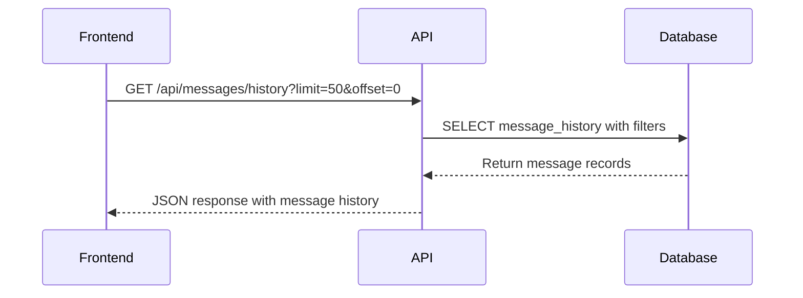
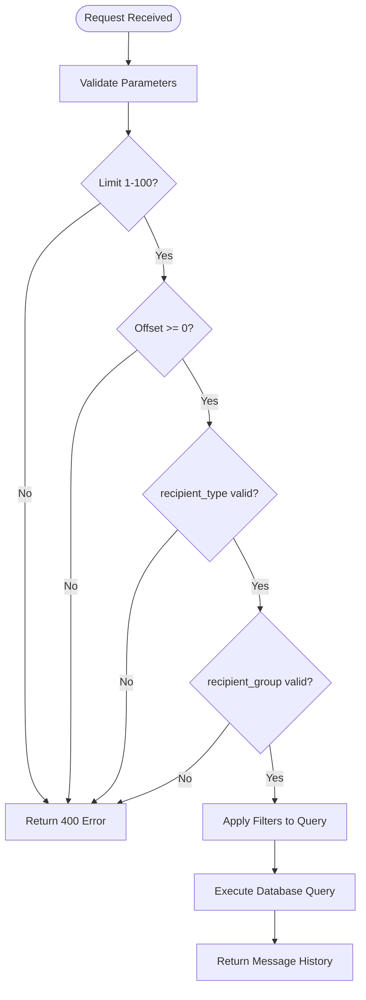
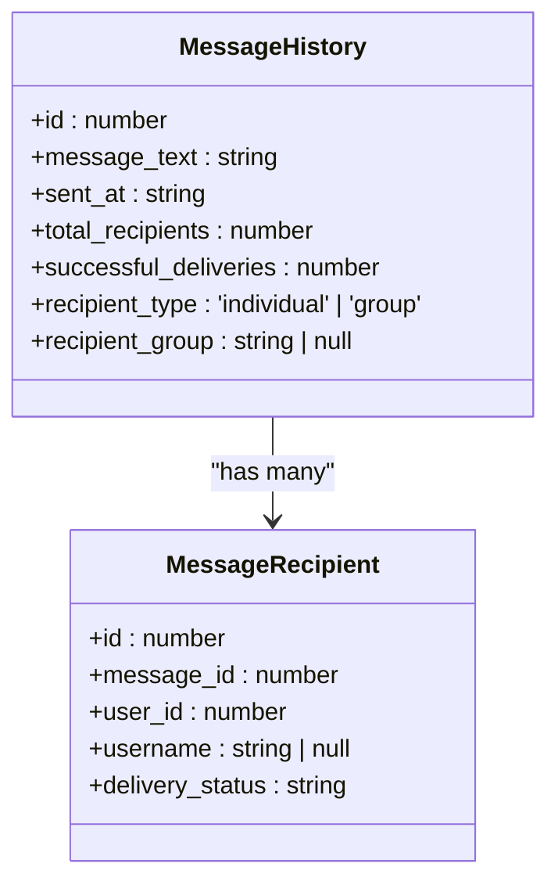
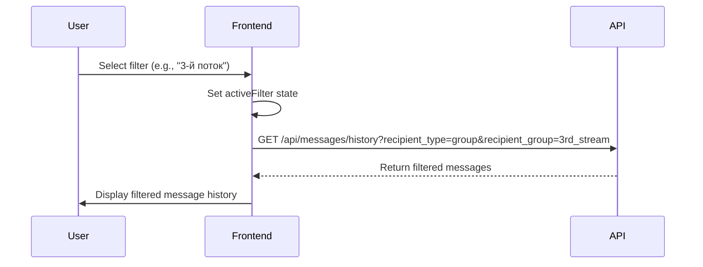
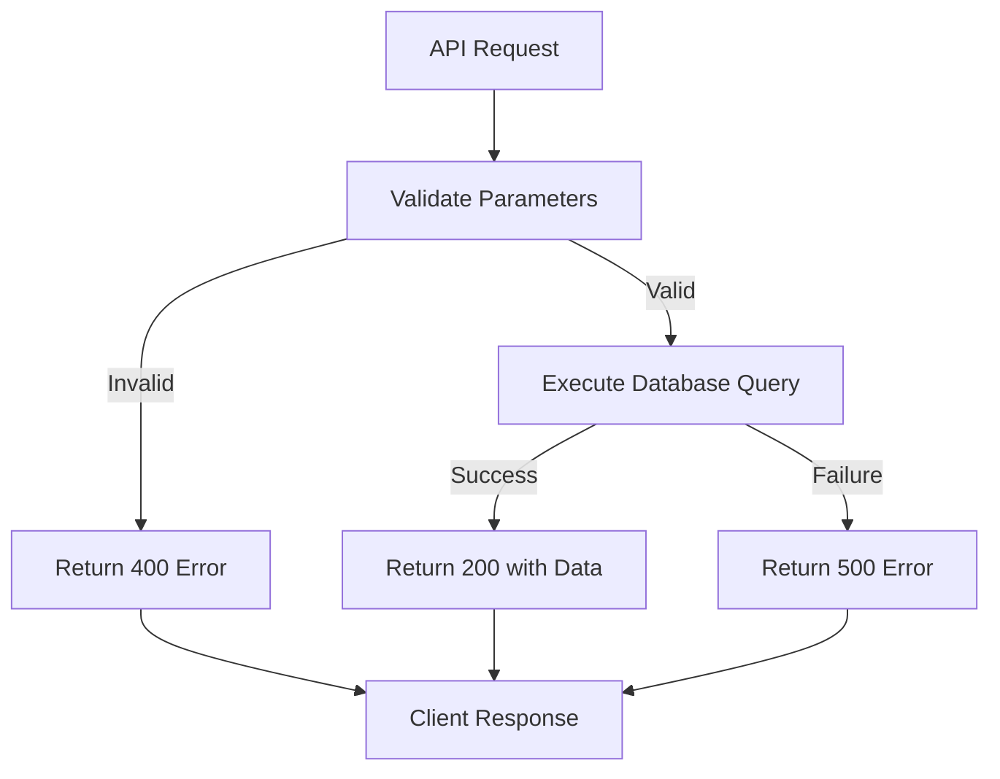

# Message History API

<cite>
**Referenced Files in This Document**   
- [route.ts](file://app/api/messages/history/route.ts)
- [page.tsx](file://app/messages/history/page.tsx)
- [queries.ts](file://lib/queries.ts)
</cite>

## Table of Contents
1. [Introduction](#introduction)
2. [Endpoint Overview](#endpoint-overview)
3. [Query Parameters](#query-parameters)
4. [Response Format](#response-format)
5. [Frontend Integration](#frontend-integration)
6. [Usage Examples](#usage-examples)
7. [Error Responses](#error-responses)

## Introduction
The Message History API provides access to sent message records with delivery statistics. This documentation details the `/api/messages/history` endpoint, which allows retrieval of message history with filtering capabilities for recipient type and course stream. The API is used by the messaging interface to track sent messages and their delivery status.

## Endpoint Overview
The `/api/messages/history` endpoint supports the GET method for retrieving message history records. The endpoint returns message records with delivery statistics and supports pagination and filtering based on recipient type and group.



**Diagram sources**
- [route.ts](file://app/api/messages/history/route.ts)
- [queries.ts](file://lib/queries.ts)

**Section sources**
- [route.ts](file://app/api/messages/history/route.ts)

## Query Parameters
The endpoint accepts the following query parameters for filtering and pagination:

### limit
- **Type**: Integer
- **Required**: No
- **Default**: 50
- **Valid Range**: 1-100
- **Description**: Specifies the maximum number of records to return per request.

### offset
- **Type**: Integer
- **Required**: No
- **Default**: 0
- **Valid Range**: Non-negative values
- **Description**: Specifies the number of records to skip before returning results (used for pagination).

### recipient_type
- **Type**: String
- **Required**: No
- **Valid Values**: "individual", "group"
- **Description**: Filters messages by recipient type. When specified, only messages sent to the specified recipient type are returned.

### recipient_group
- **Type**: String
- **Required**: No
- **Valid Values**: "3rd_stream", "4th_stream", "5th_stream"
- **Description**: Filters messages by recipient group (course stream). Only valid when recipient_type is "group".

**Validation Rules**:
- The limit parameter must be between 1 and 100 (inclusive)
- The offset parameter must be non-negative
- recipient_type must be either "individual" or "group" if specified
- recipient_group must be one of the valid stream values if specified

**Filtering Behavior**:
When both recipient_type and recipient_group parameters are specified, the API applies both filters to return messages that match both criteria. If only recipient_type is specified, all messages of that type are returned regardless of group. If only recipient_group is specified, it is ignored unless recipient_type is also set to "group".



**Diagram sources**
- [route.ts](file://app/api/messages/history/route.ts)
- [queries.ts](file://lib/queries.ts)

**Section sources**
- [route.ts](file://app/api/messages/history/route.ts#L10-L60)

## Response Format
The API returns an array of message history records in JSON format. Each record contains the following fields:

| Field | Type | Description |
|-------|------|-------------|
| id | number | Unique identifier for the message |
| message_text | string | The content of the sent message |
| sent_at | string | Timestamp when the message was sent (ISO format) |
| total_recipients | number | Total number of recipients for the message |
| successful_deliveries | number | Number of successfully delivered messages |
| recipient_type | string | Type of recipients ("individual" or "group") |
| recipient_group | string or null | Group/Stream designation for group messages, null for individual messages |

The response is an array of MessageHistory objects sorted by sent_at in descending order (most recent first).



**Diagram sources**
- [queries.ts](file://lib/queries.ts#L83-L91)
- [queries.ts](file://lib/queries.ts#L93-L99)

**Section sources**
- [queries.ts](file://lib/queries.ts#L83-L91)

## Frontend Integration
The messaging interface uses this endpoint to display sent messages and their delivery statistics. The frontend implements a filtering system that maps UI selections to API parameters.



The frontend component handles the following workflow:
1. User selects a filter option (All, Individual, or specific stream)
2. The component constructs the appropriate query parameters
3. The API is called with the constructed parameters
4. Results are displayed in the message history list
5. When a message is selected, recipient details are fetched from a related endpoint

**Section sources**
- [page.tsx](file://app/messages/history/page.tsx#L28-L313)

## Usage Examples
### Retrieve Recent Messages
To retrieve the 20 most recent messages:

```
GET /api/messages/history?limit=20&offset=0
```

### Filter by Individual Recipients
To retrieve messages sent to individual recipients:

```
GET /api/messages/history?recipient_type=individual
```

### Filter by Course Stream
To retrieve messages sent to the 4th stream group:

```
GET /api/messages/history?recipient_type=group&recipient_group=4th_stream
```

### Paginated Request
To retrieve the second page of results with 30 messages per page:

```
GET /api/messages/history?limit=30&offset=30
```

**Section sources**
- [page.tsx](file://app/messages/history/page.tsx#L100-L120)

## Error Responses
The API returns appropriate error responses for invalid parameter values:

### Invalid Limit
When the limit parameter is outside the valid range:

```json
{
  "error": "Limit must be between 1 and 100"
}
```
**Status Code**: 400 Bad Request

### Invalid Offset
When the offset parameter is negative:

```json
{
  "error": "Offset must be non-negative"
}
```
**Status Code**: 400 Bad Request

### Invalid Recipient Type
When recipient_type has an invalid value:

```json
{
  "error": "recipient_type must be either \"individual\" or \"group\""
}
```
**Status Code**: 400 Bad Request

### Invalid Recipient Group
When recipient_group has an invalid value:

```json
{
  "error": "recipient_group must be one of: 3rd_stream, 4th_stream, 5th_stream"
}
```
**Status Code**: 400 Bad Request

### Server Error
When an internal error occurs:

```json
{
  "error": "Failed to fetch message history"
}
```
**Status Code**: 500 Internal Server Error



**Diagram sources**
- [route.ts](file://app/api/messages/history/route.ts#L10-L65)

**Section sources**
- [route.ts](file://app/api/messages/history/route.ts#L10-L65)