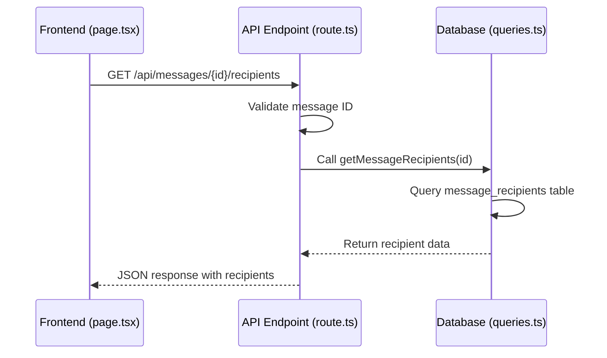
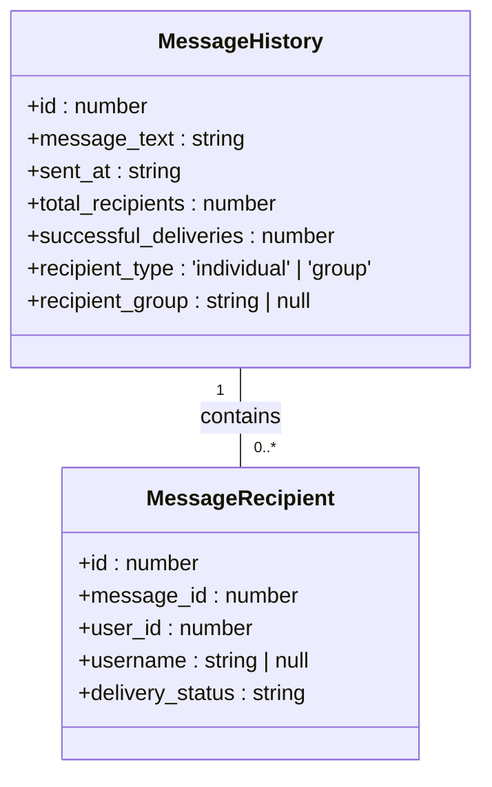
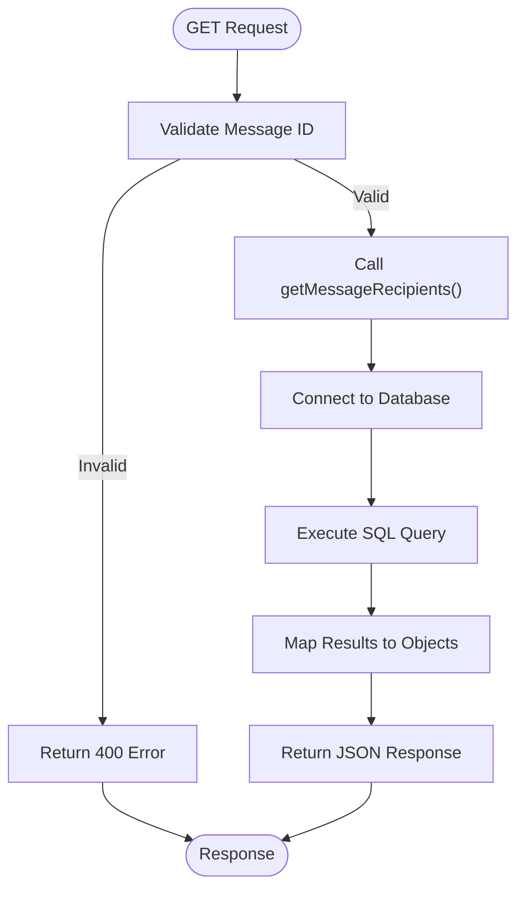
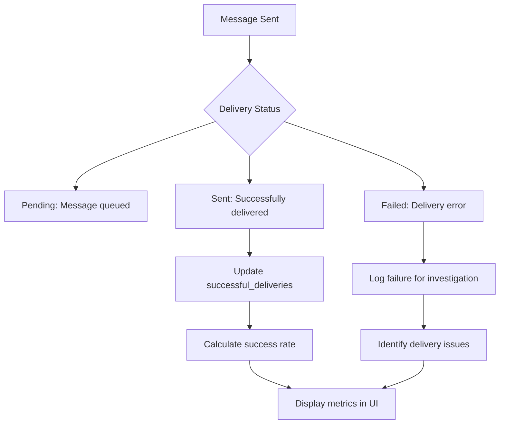

# Message Recipients API

<cite>
**Referenced Files in This Document**   
- [route.ts](file://app/api/messages/[id]/recipients/route.ts)
- [queries.ts](file://lib/queries.ts)
- [page.tsx](file://app/messages/history/page.tsx)
</cite>

## Table of Contents
1. [Introduction](#introduction)
2. [Endpoint Overview](#endpoint-overview)
3. [Request Validation](#request-validation)
4. [Response Format](#response-format)
5. [Database Integration](#database-integration)
6. [Frontend Implementation](#frontend-implementation)
7. [Use Cases](#use-cases)
8. [Error Handling](#error-handling)
9. [Conclusion](#conclusion)

## Introduction

The `/api/messages/[id]/recipients` endpoint provides a critical functionality for message tracking and delivery verification within the messaging interface. This API allows administrators to retrieve detailed recipient information for specific messages, enabling comprehensive monitoring of message delivery status across the platform. The endpoint serves as a bridge between the frontend interface and the database, facilitating real-time feedback on message delivery performance.

**Section sources**
- [route.ts](file://app/api/messages/[id]/recipients/route.ts#L1-L27)

## Endpoint Overview

The GET method of the `/api/messages/[id]/recipients` endpoint retrieves recipient information for a specific message identified by its ID. This endpoint is designed to support message tracking and delivery verification by providing detailed information about each recipient's delivery status.

The endpoint follows a standard RESTful pattern with the message ID as a path parameter. When a request is made to this endpoint, it validates the message ID, queries the database for recipient information, and returns the results in a structured JSON format.

**Diagram sources**
- [route.ts](file://app/api/messages/[id]/recipients/route.ts#L1-L27)
- [queries.ts](file://lib/queries.ts#L797-L818)
- [page.tsx](file://app/messages/history/page.tsx#L39-L86)

**Section sources**
- [route.ts](file://app/api/messages/[id]/recipients/route.ts#L1-L27)

## Request Validation

The endpoint implements robust validation for the message ID parameter to ensure data integrity and prevent invalid database queries. The validation process includes:

1. **Type Conversion**: The message ID parameter is extracted from the URL path and converted from a string to an integer using `parseInt()`.
2. **Numeric Validation**: The endpoint checks if the parsed ID is a valid number using `isNaN()`.
3. **Range Validation**: The ID must be a positive integer greater than zero.

If the message ID fails validation, the endpoint returns a 400 Bad Request response with an appropriate error message. This validation ensures that only valid message IDs are processed, preventing potential database errors and improving system reliability.

**Section sources**
- [route.ts](file://app/api/messages/[id]/recipients/route.ts#L10-L17)

## Response Format

The endpoint returns recipient information in a structured JSON format containing the following fields:

- `id`: The unique identifier for the recipient record
- `message_id`: The ID of the associated message
- `user_id`: The Telegram user ID of the recipient
- `username`: The Telegram username of the recipient (nullable)
- `delivery_status`: The current delivery status of the message to this recipient

The delivery status can have one of three values:
- `pending`: Message has been queued but not yet delivered
- `sent`: Message has been successfully delivered
- `failed`: Message delivery has failed

**Diagram sources**
- [queries.ts](file://lib/queries.ts#L93-L99)
- [queries.ts](file://lib/queries.ts#L750-L795)

**Section sources**
- [queries.ts](file://lib/queries.ts#L93-L99)

## Database Integration

The endpoint integrates with the database through the `getMessageRecipients` function defined in `lib/queries.ts`. This function establishes a connection to the PostgreSQL database using a connection pool and executes a parameterized SQL query to retrieve recipient information.

The SQL query selects all fields from the `message_recipients` table where the `message_id` matches the provided parameter. Results are ordered by the recipient ID to ensure consistent ordering across requests. The function maps the database rows to TypeScript objects that conform to the `MessageRecipient` interface, providing type safety and data consistency.

The integration follows best practices for database operations, including proper connection management with try-finally blocks to ensure connections are released back to the pool even if an error occurs.

**Diagram sources**
- [route.ts](file://app/api/messages/[id]/recipients/route.ts#L18-L24)
- [queries.ts](file://lib/queries.ts#L797-L818)

**Section sources**
- [queries.ts](file://lib/queries.ts#L797-L818)

## Frontend Implementation

The frontend implementation in `app/messages/history/page.tsx` demonstrates how the API is used to provide a comprehensive message tracking interface. The `fetchRecipients` function is called when a user selects a message from the history list, triggering a request to the `/api/messages/[id]/recipients` endpoint.

The frontend uses the retrieved data to display delivery success rates and identify failed message deliveries. For each message, it shows the total number of recipients and breaks down the delivery status with visual indicators:
- Green badges with checkmarks for successfully delivered messages
- Red badges with X marks for failed deliveries
- Secondary badges for pending deliveries

The interface allows administrators to drill down into individual recipient details, viewing each recipient's username, user ID, and specific delivery status. This enables quick identification of delivery issues and facilitates troubleshooting.

**Section sources**
- [page.tsx](file://app/messages/history/page.tsx#L39-L86)

## Use Cases

The `/api/messages/[id]/recipients` endpoint supports several critical use cases for message tracking and delivery verification:

1. **Delivery Success Rate Calculation**: Administrators can calculate the delivery success rate for each message by comparing the number of recipients with 'sent' status to the total number of recipients.

2. **Failed Delivery Identification**: The endpoint enables identification of specific recipients for whom message delivery failed, allowing administrators to investigate and resolve delivery issues.

3. **Message Performance Monitoring**: By analyzing delivery status patterns across multiple messages, administrators can identify systemic issues with the messaging system.

4. **Recipient Verification**: Administrators can verify that messages were sent to the intended recipients by reviewing the complete recipient list.

5. **Audit and Compliance**: The detailed recipient information provides an audit trail for message delivery, supporting compliance requirements.

**Diagram sources**
- [queries.ts](file://lib/queries.ts#L80-L99)
- [page.tsx](file://app/messages/history/page.tsx#L150-L250)

## Error Handling

The endpoint implements comprehensive error handling to ensure reliability and provide meaningful feedback. Two primary error scenarios are handled:

1. **Validation Errors**: When an invalid message ID is provided (non-numeric, negative, or zero), the endpoint returns a 400 Bad Request response with the message "Invalid message ID".

2. **Server Errors**: If an error occurs during database operations or while fetching recipient data, the endpoint catches the exception, logs it to the console for debugging, and returns a 500 Internal Server Error response with the message "Failed to fetch message recipients".

This error handling strategy ensures that clients receive appropriate HTTP status codes and error messages, while sensitive error details are not exposed to the frontend.

**Section sources**
- [route.ts](file://app/api/messages/[id]/recipients/route.ts#L25-L34)

## Conclusion

The `/api/messages/[id]/recipients` endpoint provides essential functionality for message tracking and delivery verification in the messaging interface. By integrating with the `getMessageRecipients` function from `lib/queries.ts`, it delivers detailed recipient information that enables administrators to monitor message delivery performance, calculate success rates, and identify delivery issues.

The endpoint's robust validation, clear response format, and comprehensive error handling make it a reliable component of the messaging system. Its integration with the frontend interface allows for intuitive visualization of delivery metrics, supporting effective administration and troubleshooting of the messaging platform.