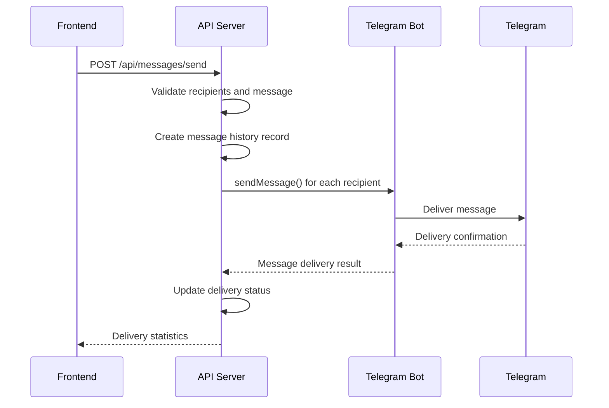
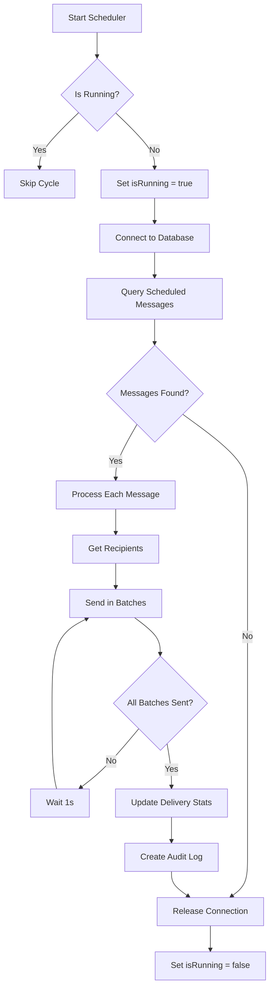
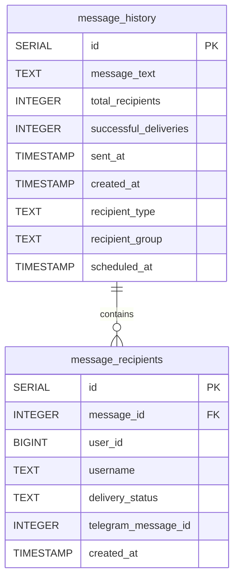

# Messaging API

<cite>
**Referenced Files in This Document**   
- [send/route.ts](file://app/api/messages/send/route.ts)
- [history/route.ts](file://app/api/messages/history/route.ts)
- [delete/route.ts](file://app/api/messages/delete/route.ts)
- [recipients/route.ts](file://app/api/messages/[id]/recipients/route.ts)
- [messageScheduler.ts](file://lib/messageScheduler.ts)
- [queries.ts](file://lib/queries.ts)
- [send/page.tsx](file://app/messages/send/page.tsx)
- [history/page.tsx](file://app/messages/history/page.tsx)
- [DATABASE_MIGRATION_LOG.md](file://DATABASE_MIGRATION_LOG.md)
- [node-telegram-bot-api.md](file://docs/node-telegram-bot-api.md)
</cite>

## Table of Contents
1. [Introduction](#introduction)
2. [API Endpoints](#api-endpoints)
3. [Request Payload Structure](#request-payload-structure)
4. [Integration with node-telegram-bot-api](#integration-with-node-telegram-bot-api)
5. [Background Processing via messageScheduler.ts](#background-processing-via-messageschedulerts)
6. [Error Responses](#error-responses)
7. [Rate Limiting](#rate-limiting)
8. [Database Schema](#database-schema)
9. [Usage Examples](#usage-examples)
10. [Conclusion](#conclusion)

## Introduction

The Messaging API provides a comprehensive system for sending, tracking, and managing Telegram messages to users. This API enables both individual and batch messaging capabilities, with support for message scheduling, delivery tracking, and recipient management. The system integrates with the Telegram Bot API to deliver messages and uses a background scheduler to handle delayed messages. This documentation details the endpoints, request structures, integration points, and database schema that power the messaging functionality.

**Section sources**
- [send/route.ts](file://app/api/messages/send/route.ts)
- [history/route.ts](file://app/api/messages/history/route.ts)
- [delete/route.ts](file://app/api/messages/delete/route.ts)
- [recipients/route.ts](file://app/api/messages/[id]/recipients/route.ts)

## API Endpoints

The Messaging API provides four primary endpoints for message management:

- **POST /api/messages/send**: Sends messages to Telegram users, supporting both individual and batch messaging modes. This endpoint handles immediate and scheduled messages, with validation for recipients and message content.

- **GET /api/messages/history**: Retrieves message history with delivery statistics, supporting pagination and filtering by recipient type and group. This endpoint provides a comprehensive view of sent messages and their delivery status.

- **DELETE /api/messages/delete**: Cancels messages that have been sent to users by deleting them from the Telegram chat. This endpoint requires both message ID and user ID to identify the specific message to delete.

- **GET /api/messages/[id]/recipients**: Retrieves detailed recipient information for a specific message, including delivery status for each recipient. This endpoint is used to track the delivery status of individual messages.

**Section sources**
- [send/route.ts](file://app/api/messages/send/route.ts)
- [history/route.ts](file://app/api/messages/history/route.ts)
- [delete/route.ts](file://app/api/messages/delete/route.ts)
- [recipients/route.ts](file://app/api/messages/[id]/recipients/route.ts)

## Request Payload Structure

The request payload for the `/api/messages/send` endpoint includes the following structure:

```json
{
  "recipients": [
    {
      "user_id": 12345,
      "username": "user",
      "first_name": "Name"
    }
  ],
  "message": {
    "type": "text",
    "text": "Hello",
    "parse_mode": "HTML",
    "buttons": [
      {
        "text": "Button Text",
        "url": "https://example.com",
        "row": 0
      }
    ]
  },
  "scheduled_at": "2025-09-11T20:30:00.000Z"
}
```

The payload includes:
- **recipients**: Array of TelegramUser objects with user_id, username, and first_name
- **message**: Object containing message type, text, parse_mode, and optional buttons
- **scheduled_at**: Optional ISO timestamp for scheduling message delivery

For stream-based targeting, the frontend automatically loads users from specific course streams (3rd_stream, 4th_stream, 5th_stream) and includes them in the recipients array.

**Section sources**
- [send/route.ts](file://app/api/messages/send/route.ts)
- [send/page.tsx](file://app/messages/send/page.tsx)

## Integration with node-telegram-bot-api

The Messaging API integrates with the `node-telegram-bot-api` library to send messages to Telegram users. The integration is configured with the following key aspects:

- **Bot Initialization**: The bot is initialized with the BOT_TOKEN from environment variables and configured with polling set to false for API routes.

- **Message Sending**: Messages are sent using the `bot.sendMessage()` method with HTML parse mode for formatting support. For media messages, `bot.sendVideo()` and `bot.sendDocument()` methods are used.

- **Inline Keyboard Support**: Messages can include inline buttons with URLs or callback data, structured according to Telegram's inline keyboard format.

- **Error Handling**: The integration includes comprehensive error handling for common Telegram API errors:
  - 403 Forbidden: User has blocked the bot
  - 400 Bad Request: Invalid user ID or message content
  - 429 Too Many Requests: Rate limiting by Telegram

- **Message Deletion**: The API can delete messages using `bot.deleteMessage()` with the user ID and Telegram message ID.



**Diagram sources**
- [send/route.ts](file://app/api/messages/send/route.ts)
- [node-telegram-bot-api.md](file://docs/node-telegram-bot-api.md)

## Background Processing via messageScheduler.ts

The message scheduler handles delayed message delivery through a cron-based background process:

- **Cron Job**: The scheduler runs every minute (`* * * * *`) to check for messages that are due for delivery.

- **Message Detection**: The scheduler queries the database for messages where `scheduled_at <= NOW()` and `successful_deliveries = 0`.

- **Batch Processing**: Messages are sent in batches of 10 recipients with a 1-second delay between batches to respect Telegram's rate limits.

- **Status Updates**: After sending, the scheduler updates the delivery status for each recipient and the overall message statistics.

- **Error Handling**: Failed deliveries are logged with specific error messages (e.g., "User blocked bot", "Invalid user or message").

- **Singleton Pattern**: The scheduler uses a singleton pattern to ensure only one instance runs at a time.



**Diagram sources**
- [messageScheduler.ts](file://lib/messageScheduler.ts)

## Error Responses

The Messaging API returns specific error responses for various failure scenarios:

- **Validation Errors**:
  - 400 Bad Request: Missing recipients, invalid message text length, or invalid scheduled timestamp
  - Response: `{ error: "Message text too long (max 4096 characters)" }`

- **Recipient Validation**:
  - 400 Bad Request: Some user IDs not found in database
  - Response: `{ error: "Some user IDs are not found in database", invalid_user_ids: [123, 456] }`

- **Scheduled Message Errors**:
  - 400 Bad Request: Scheduled time in the past or invalid format
  - Response: `{ error: "scheduled_at must be in the future" }`

- **Message Sending Errors**:
  - 500 Internal Server Error: Failed to send messages
  - Response: `{ error: "Failed to send messages" }`

- **Message Deletion Errors**:
  - 400 Bad Request: Message not found or too old to delete
  - Response: `{ success: false, error: "Message too old to delete or message not found" }`

- **Successful Responses**:
  - 200 OK: Message sent successfully
  - Response: `{ success: true, sent_count: 5, failed_count: 1, errors: [...] }`
  - For scheduled messages: `{ success: true, scheduled: true, scheduled_at: "2025-09-11T20:30:00.000Z" }`

**Section sources**
- [send/route.ts](file://app/api/messages/send/route.ts)
- [delete/route.ts](file://app/api/messages/delete/route.ts)

## Rate Limiting

The Messaging API implements rate limiting to prevent violations of Telegram's API limits:

- **Batch Processing**: Messages are sent in batches of 10 recipients to avoid overwhelming the Telegram API.

- **Inter-Batch Delay**: A 1-second delay is implemented between batches to respect Telegram's rate limits.

- **Recipient Deduplication**: The system prevents duplicate messages to the same user by checking user_id before adding recipients.

- **User Validation**: All recipients are validated against the database before sending to ensure only valid users receive messages.

- **Telegram Rate Limits**: The implementation respects Telegram's documented rate limits:
  - 30 messages per second to different users
  - 1 message per second to the same user

The rate limiting strategy ensures reliable message delivery while maintaining compliance with Telegram's API usage policies.

**Section sources**
- [send/route.ts](file://app/api/messages/send/route.ts)
- [messageScheduler.ts](file://lib/messageScheduler.ts)

## Database Schema

The messaging system uses two primary tables to track messages and their delivery status:

### message_history
Stores broadcast message records with delivery statistics:
- **id**: SERIAL PRIMARY KEY
- **message_text**: TEXT NOT NULL (message content)
- **total_recipients**: INTEGER NOT NULL DEFAULT 0
- **successful_deliveries**: INTEGER DEFAULT 0
- **sent_at**: TIMESTAMP WITH TIME ZONE DEFAULT CURRENT_TIMESTAMP
- **created_at**: TIMESTAMP WITH TIME ZONE DEFAULT CURRENT_TIMESTAMP
- **recipient_type**: 'individual' | 'group'
- **recipient_group**: string | null (e.g., '3rd_stream')
- **scheduled_at**: TIMESTAMP WITH TIME ZONE (for scheduled messages)

### message_recipients
Tracks individual message delivery status:
- **id**: SERIAL PRIMARY KEY
- **message_id**: INTEGER NOT NULL REFERENCES message_history(id) ON DELETE CASCADE
- **user_id**: BIGINT NOT NULL (Telegram user ID)
- **username**: TEXT (Telegram username)
- **delivery_status**: TEXT DEFAULT 'pending' ('pending', 'sent', 'failed', 'deleted')
- **telegram_message_id**: INTEGER (Telegram's message ID for deletion)
- **created_at**: TIMESTAMP WITH TIME ZONE DEFAULT CURRENT_TIMESTAMP

### Indexes
- **idx_message_recipients_message_id**: Fast lookups by message_id
- **idx_message_recipients_status**: Composite index for delivery status counting
- **idx_message_recipients_user_id**: Fast user lookups



**Diagram sources**
- [DATABASE_MIGRATION_LOG.md](file://DATABASE_MIGRATION_LOG.md)
- [queries.ts](file://lib/queries.ts)

## Usage Examples

### Sending a Message to Individual Users
```javascript
fetch('/api/messages/send', {
  method: 'POST',
  headers: { 'Content-Type': 'application/json' },
  body: JSON.stringify({
    recipients: [
      { user_id: 12345, username: 'user1', first_name: 'John' },
      { user_id: 67890, username: 'user2', first_name: 'Jane' }
    ],
    message: {
      text: 'Hello from HSL Dashboard!',
      parse_mode: 'HTML'
    }
  })
});
```

### Sending a Message to a Course Stream
```javascript
fetch('/api/messages/send', {
  method: 'POST',
  headers: { 'Content-Type': 'application/json' },
  body: JSON.stringify({
    recipients: streamUsers, // Users from 3rd_stream
    message: {
      text: '<b>New lesson available!</b>\nCheck out our latest content.',
      parse_mode: 'HTML',
      buttons: [
        { text: 'View Lesson', url: 'https://example.com/lesson', row: 0 }
      ]
    }
  })
});
```

### Scheduling a Message
```javascript
fetch('/api/messages/send', {
  method: 'POST',
  headers: { 'Content-Type': 'application/json' },
  body: JSON.stringify({
    recipients: allUsers,
    message: {
      text: 'Reminder: Workshop starts in 1 hour!',
      parse_mode: 'HTML'
    },
    scheduled_at: new Date('2025-09-11T20:30:00Z').toISOString()
  })
});
```

### Deleting a Message
```javascript
fetch('/api/messages/delete?messageId=123&userId=456', {
  method: 'DELETE'
});
```

### Retrieving Message History
```javascript
// Get all messages
fetch('/api/messages/history');

// Get messages for a specific stream
fetch('/api/messages/history?recipient_type=group&recipient_group=3rd_stream');
```

**Section sources**
- [send/page.tsx](file://app/messages/send/page.tsx)
- [history/page.tsx](file://app/messages/history/page.tsx)

## Conclusion

The Messaging API provides a robust system for sending, tracking, and managing Telegram messages to users. It supports both individual and batch messaging modes with comprehensive delivery tracking and recipient management. The integration with the Telegram Bot API ensures reliable message delivery, while the background scheduler enables delayed message sending. The system implements proper rate limiting to respect Telegram's API limits and includes comprehensive error handling for various failure scenarios. The database schema efficiently tracks message history and delivery status, enabling detailed analytics and reporting. This API forms a critical component of the HSL Dashboard's communication capabilities, enabling targeted messaging to users based on their course streams and other criteria.