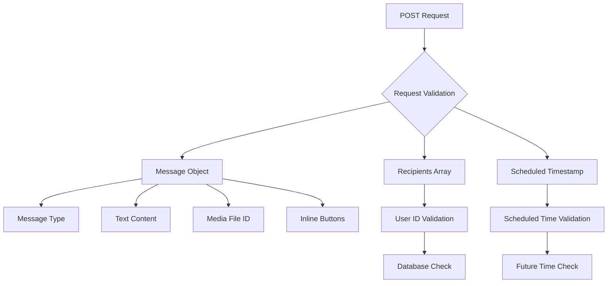
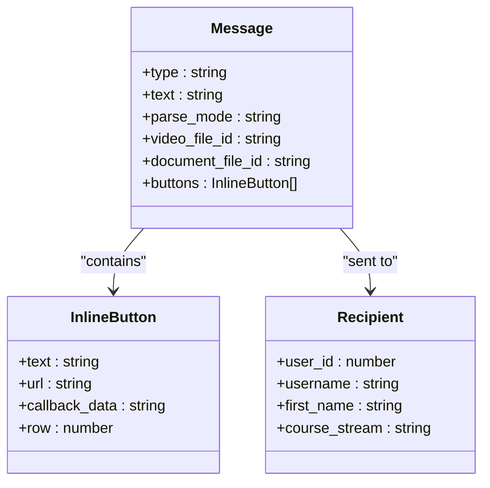
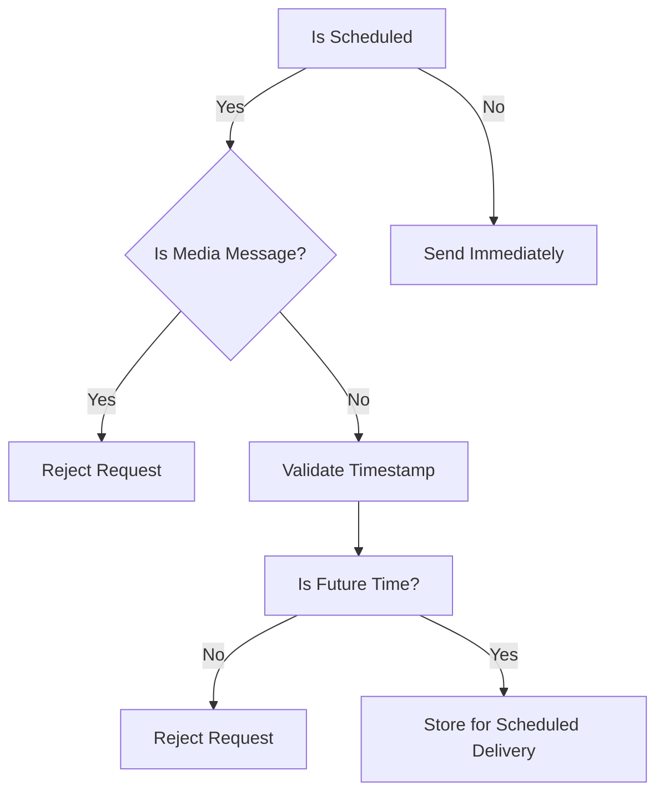
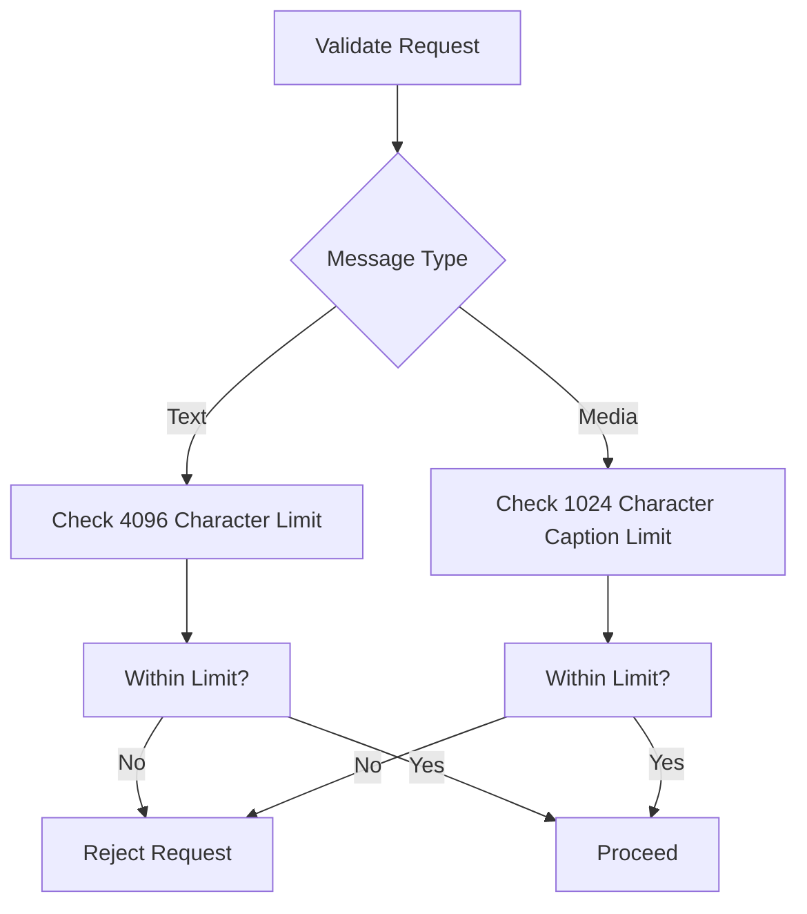
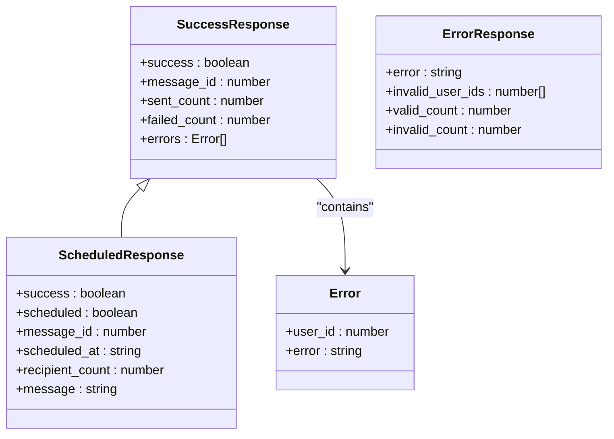
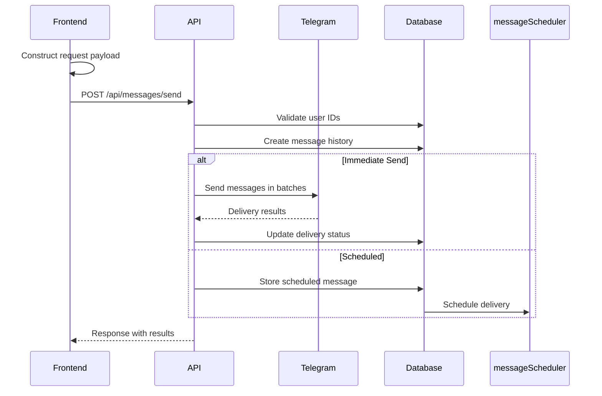

# Send Message API

<cite>
**Referenced Files in This Document**   
- [route.ts](file://app/api/messages/send/route.ts)
- [page.tsx](file://app/messages/send/page.tsx)
- [messageScheduler.ts](file://lib/messageScheduler.ts)
- [queries.ts](file://lib/queries.ts)
</cite>

## Table of Contents
1. [Introduction](#introduction)
2. [Request Structure](#request-structure)
3. [Message Types](#message-types)
4. [Scheduling Messages](#scheduling-messages)
5. [Validation and Constraints](#validation-and-constraints)
6. [Telegram Integration](#telegram-integration)
7. [Response Schema](#response-schema)
8. [Frontend Implementation](#frontend-implementation)
9. [Error Handling](#error-handling)

## Introduction
The Send Message API provides a robust interface for sending personalized messages to Telegram users through the HSL Dashboard application. This endpoint supports various message types including text, video, and document messages, with capabilities for message scheduling, recipient targeting, and rich inline keyboard interactions. The API integrates with the node-telegram-bot-api library to deliver messages and maintains comprehensive message history and delivery tracking.

**Section sources**
- [route.ts](file://app/api/messages/send/route.ts#L1-L50)

## Request Structure
The API endpoint accepts POST requests to `/api/messages/send` with a JSON payload containing recipients and message details. The request structure is designed to support flexible message composition with various media types and interactive elements.

**Diagram sources**
- [route.ts](file://app/api/messages/send/route.ts#L16-L32)
- [queries.ts](file://lib/queries.ts#L76-L81)

## Message Types
The API supports three message types: text, video, and document. Each type has specific requirements and constraints that must be met for successful delivery.

### Text Messages
Text messages are the default message type and support HTML formatting. They can include inline keyboard buttons for interactive responses.

### Media Messages
Media messages require a Telegram file_id for the specific media type. Video messages use the `video_file_id` field, while document messages use the `document_file_id` field. Media messages can include optional captions with HTML formatting.

**Diagram sources**
- [route.ts](file://app/api/messages/send/route.ts#L20-L28)
- [page.tsx](file://app/messages/send/page.tsx#L30-L40)

## Scheduling Messages
The API supports message scheduling through the `scheduled_at` parameter, which accepts an ISO timestamp for future message delivery. However, scheduling has specific limitations when working with media messages.

### Scheduling Limitations
Scheduled message delivery is not supported for media messages (video and document types). This restriction is enforced both in the frontend interface and backend validation. When a user selects a media message type, the scheduling option is automatically disabled.

### Scheduling Validation
Scheduled messages must meet the following criteria:
- The `scheduled_at` timestamp must be in the future
- The timestamp must be in valid ISO format
- Only text messages can be scheduled

**Diagram sources**
- [route.ts](file://app/api/messages/send/route.ts#L135-L155)
- [page.tsx](file://app/messages/send/page.tsx#L200-L215)

## Validation and Constraints
The API implements comprehensive validation to ensure message integrity and prevent delivery failures.

### User ID Validation
All recipient user IDs are validated against the database to ensure they exist in the system. The validation checks multiple tables including bookings, free lesson registrations, and events to confirm user existence.

### Content Length Constraints
The API enforces strict content length limits to comply with Telegram's API restrictions:
- Text messages: maximum 4096 characters
- Media captions: maximum 1024 characters

**Section sources**
- [route.ts](file://app/api/messages/send/route.ts#L60-L100)
- [queries.ts](file://lib/queries.ts#L821-L900)

## Telegram Integration
The API integrates with the node-telegram-bot-api library to deliver messages to Telegram users. The integration handles various message types and provides error handling for common delivery issues.

### Message Delivery Process
Messages are sent in batches of 10 recipients to respect Telegram's rate limits. The API includes a 1-second delay between batches to prevent rate limiting. Each message delivery is tracked in the database with success or failure status.

### Inline Keyboard Configuration
The API supports inline keyboard buttons with two interaction types:
- URL buttons that open external links
- Callback buttons that trigger bot interactions

The button configuration includes text, URL or callback data, and row positioning for layout control.

**Section sources**
- [route.ts](file://app/api/messages/send/route.ts#L250-L300)
- [messageScheduler.ts](file://lib/messageScheduler.ts#L1-L50)

## Response Schema
The API returns structured responses for both successful and failed message operations.

### Successful Response
For immediate message sends, the API returns:
- `success`: boolean indicating operation success
- `message_id`: unique identifier for the message
- `sent_count`: number of successfully delivered messages
- `failed_count`: number of failed deliveries
- `errors`: array of user-specific delivery errors

For scheduled messages, the response includes:
- `scheduled`: boolean indicating scheduled delivery
- `scheduled_at`: ISO timestamp of scheduled delivery
- `recipient_count`: total number of recipients

### Error Response
The API returns appropriate HTTP status codes and error details:
- 400 Bad Request: validation errors
- 500 Internal Server Error: system errors
- Specific error messages for different failure scenarios

**Diagram sources**
- [route.ts](file://app/api/messages/send/route.ts#L300-L370)
- [page.tsx](file://app/messages/send/page.tsx#L100-L110)

## Frontend Implementation
The SendMessagePage component provides a user interface for constructing and sending messages through the API.

### Request Payload Construction
The frontend constructs the request payload based on user selections:
- Recipients are selected through search or stream-based targeting
- Message content is configured with type, text, and media options
- Inline buttons are configured with text, URL/callback data, and row positioning
- Scheduling options are enabled or disabled based on message type

### Stream-Based Targeting
The interface supports targeting users by course stream (3rd, 4th, 5th) or non-course users. This allows for group messaging to specific user segments.

**Diagram sources**
- [page.tsx](file://app/messages/send/page.tsx#L259-L315)
- [route.ts](file://app/api/messages/send/route.ts#L34-L371)

## Error Handling
The API implements comprehensive error handling for various failure scenarios.

### Common Error Scenarios
- Invalid user IDs: recipient not found in database
- Message length violations: content exceeds character limits
- Invalid scheduled times: past dates or invalid formats
- Media scheduling attempts: trying to schedule video/document messages
- Telegram API errors: user blocked bot, invalid messages

### Error Response Structure
The API returns specific error messages and codes to help diagnose issues:
- 400 errors for client-side validation failures
- 500 errors for server-side processing issues
- Detailed error descriptions for troubleshooting

**Section sources**
- [route.ts](file://app/api/messages/send/route.ts#L350-L370)
- [page.tsx](file://app/messages/send/page.tsx#L180-L200)