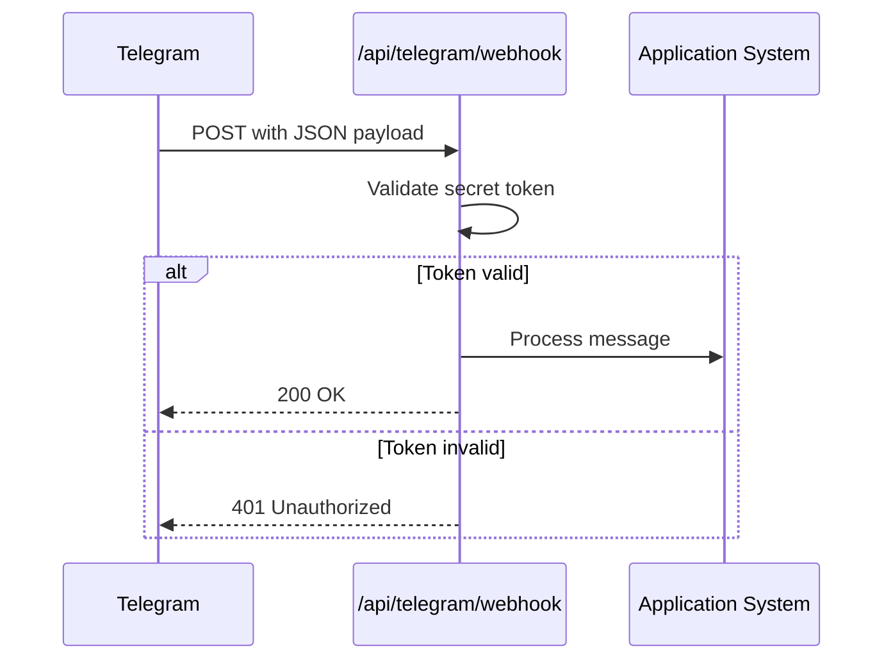
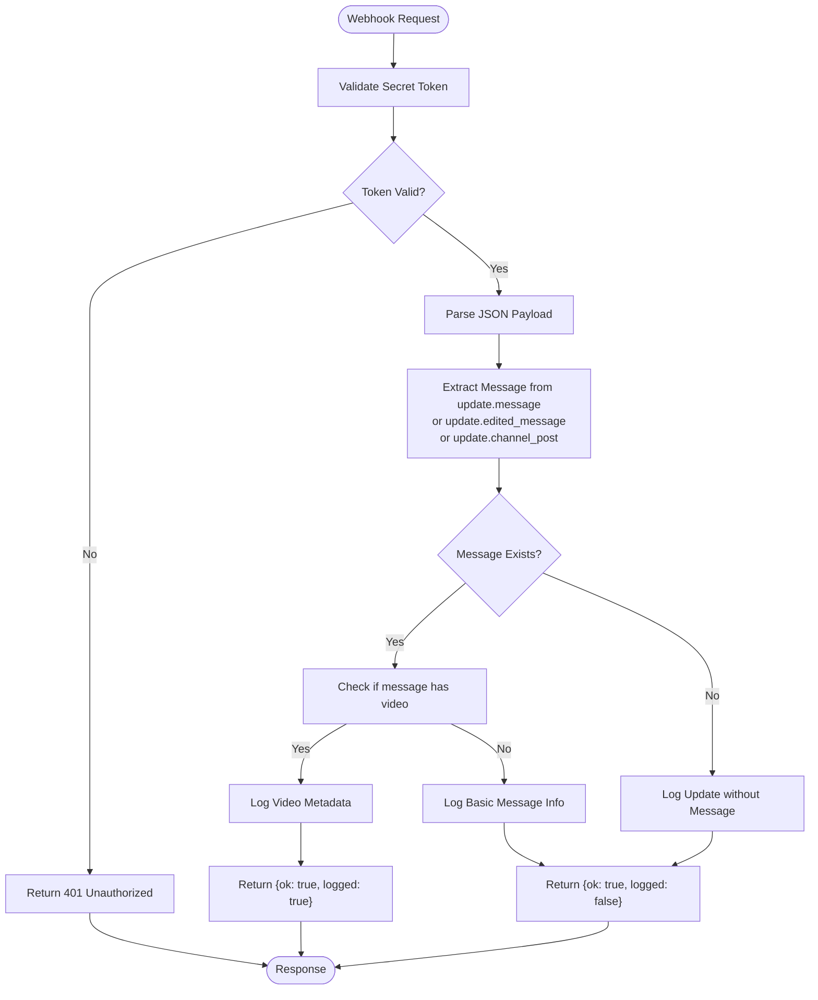
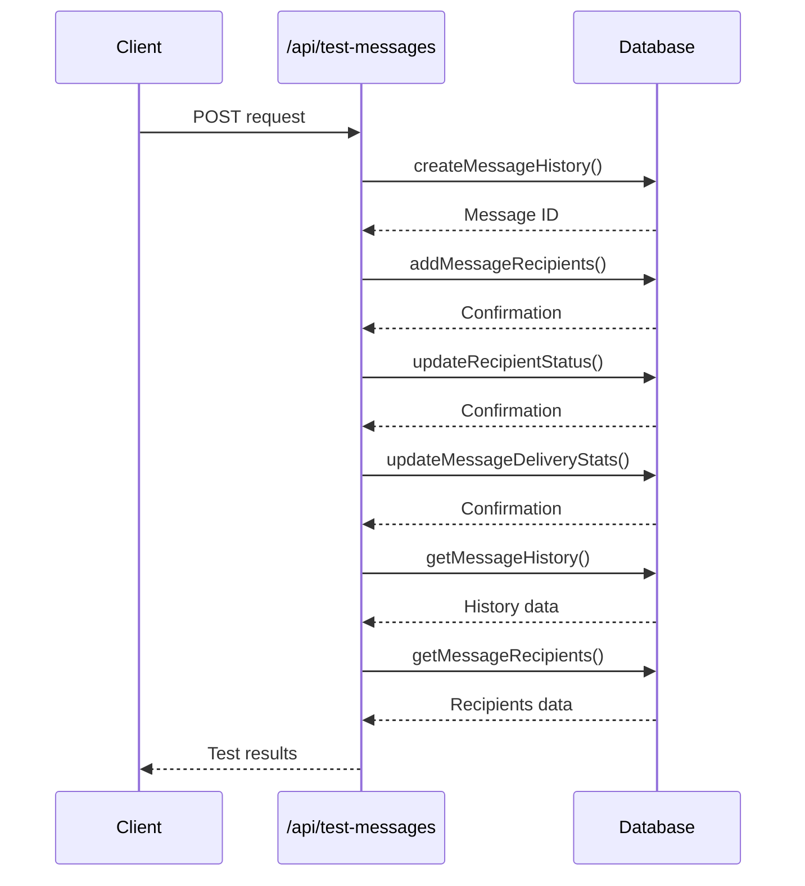
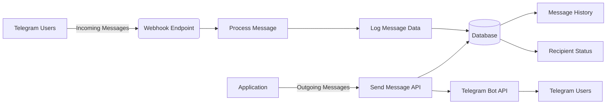
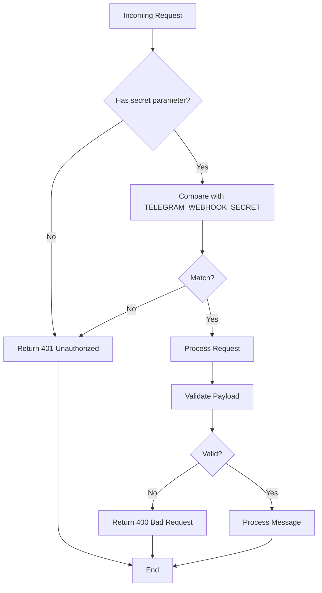
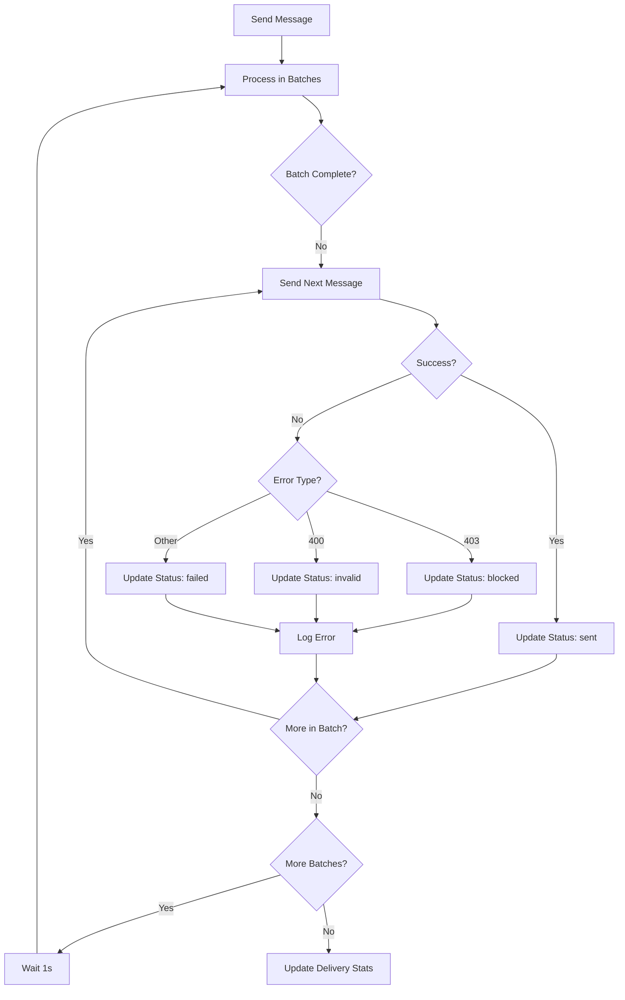
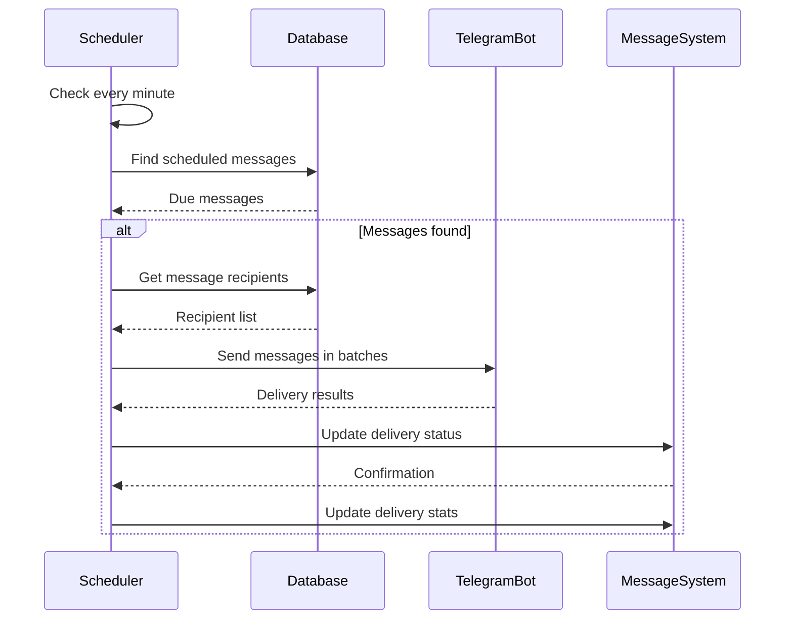

# Telegram Integration API

<cite>
**Referenced Files in This Document**   
- [webhook/route.ts](file://app/api/telegram/webhook/route.ts)
- [test-messages/route.ts](file://app/api/test-messages/route.ts)
- [messageScheduler.ts](file://lib/messageScheduler.ts)
- [queries.ts](file://lib/queries.ts)
- [send/route.ts](file://app/api/messages/send/route.ts)
</cite>

## Table of Contents
1. [Introduction](#introduction)
2. [Webhook Configuration](#webhook-configuration)
3. [Incoming Message Handling](#incoming-message-handling)
4. [Telegram Connectivity Testing](#telegram-connectivity-testing)
5. [Two-Way Integration Pattern](#two-way-integration-pattern)
6. [Security Measures](#security-measures)
7. [Error Handling and Rate Limiting](#error-handling-and-rate-limiting)
8. [Message Scheduler Integration](#message-scheduler-integration)
9. [Common Issues and Troubleshooting](#common-issues-and-troubleshooting)

## Introduction
The Telegram Integration API provides bidirectional communication between the application and Telegram users. It enables the system to receive messages from Telegram via webhooks and send messages to users through the Telegram Bot API. This documentation covers the webhook endpoint for receiving messages, the test endpoint for connectivity verification, and the integration patterns that support message processing and delivery.

**Section sources**
- [webhook/route.ts](file://app/api/telegram/webhook/route.ts)
- [test-messages/route.ts](file://app/api/test-messages/route.ts)

## Webhook Configuration
The webhook endpoint `/api/telegram/webhook` receives incoming updates from Telegram when users interact with the bot. To configure the webhook, Telegram must be directed to this endpoint with a secret token for authentication. The secret token is validated against the `TELEGRAM_WEBHOOK_SECRET` environment variable before processing any payload.

The webhook expects a POST request with JSON payload from Telegram. Authentication is performed by comparing the `secret` query parameter with the configured secret token. If the token is missing or invalid, the endpoint returns a 401 Unauthorized response.

**Diagram sources**
- [webhook/route.ts](file://app/api/telegram/webhook/route.ts#L33-L53)

**Section sources**
- [webhook/route.ts](file://app/api/telegram/webhook/route.ts#L1-L95)

## Incoming Message Handling
The webhook processes incoming messages from Telegram, extracting relevant information from the payload. The system handles different types of updates including regular messages, edited messages, and channel posts. The payload structure follows Telegram's update format, containing message details such as chat information, sender details, and media content.

When a video message is received, the system logs detailed video metadata including file ID, duration, resolution, and MIME type. For non-video messages, basic message information is logged without storing the content. The webhook responds with appropriate status information indicating whether the message was processed and logged.

**Diagram sources**
- [webhook/route.ts](file://app/api/telegram/webhook/route.ts#L55-L94)

**Section sources**
- [webhook/route.ts](file://app/api/telegram/webhook/route.ts#L1-L95)

## Telegram Connectivity Testing
The `/api/test-messages` endpoint provides a comprehensive test of the message system's database functionality. This endpoint verifies that all message-related database operations are functioning correctly by executing a complete message lifecycle test.

The test performs the following operations in sequence:
1. Creates a message history entry
2. Adds message recipients to the database
3. Updates recipient delivery statuses
4. Updates message delivery statistics
5. Retrieves message history and recipients

This endpoint serves as both a connectivity test and a database integrity check, ensuring that the message system can properly store and retrieve message data.

**Diagram sources**
- [test-messages/route.ts](file://app/api/test-messages/route.ts#L1-L70)

**Section sources**
- [test-messages/route.ts](file://app/api/test-messages/route.ts#L1-L70)

## Two-Way Integration Pattern
The system implements a two-way integration pattern with Telegram, enabling both inbound and outbound communication. Incoming messages are received through the webhook endpoint, while outgoing messages are sent using the Telegram Bot API.

For outbound messaging, the system follows a structured workflow:
1. Message creation with recipients and content
2. Message history storage in the database
3. Delivery to recipients via Telegram Bot API
4. Status tracking and delivery confirmation

The integration uses the `node-telegram-bot-api` library to interface with Telegram's API, sending messages with HTML parsing enabled for formatted content. Message delivery status is tracked in the database, allowing for delivery confirmation and error handling.

**Diagram sources**
- [webhook/route.ts](file://app/api/telegram/webhook/route.ts#L1-L95)
- [send/route.ts](file://app/api/messages/send/route.ts#L1-L372)

**Section sources**
- [webhook/route.ts](file://app/api/telegram/webhook/route.ts#L1-L95)
- [send/route.ts](file://app/api/messages/send/route.ts#L1-L372)

## Security Measures
The Telegram integration implements several security measures to protect against unauthorized access and ensure data integrity:

1. **Webhook Secret Verification**: The webhook endpoint validates a secret token passed as a query parameter against an environment variable. This prevents unauthorized parties from triggering the webhook.

2. **Environment Variable Protection**: Sensitive credentials like the Telegram bot token and webhook secret are stored in environment variables, preventing exposure in the codebase.

3. **Input Validation**: All incoming requests are validated for required fields and proper data types before processing.

4. **Error Handling**: Comprehensive error handling prevents information leakage and ensures graceful degradation when errors occur.

The security implementation follows best practices for API security, ensuring that only authorized requests are processed and sensitive information is protected.

**Diagram sources**
- [webhook/route.ts](file://app/api/telegram/webhook/route.ts#L33-L53)

**Section sources**
- [webhook/route.ts](file://app/api/telegram/webhook/route.ts#L1-L95)

## Error Handling and Rate Limiting
The system implements robust error handling for both incoming and outgoing message processing. For incoming webhook requests, the system catches and logs any errors during JSON parsing or message processing, returning appropriate HTTP status codes.

For outgoing messages, the system handles various Telegram API error conditions:
- **403 errors**: User has blocked the bot
- **400 errors**: Invalid user ID or message content
- **Network errors**: Temporary connectivity issues

The message sending implementation includes rate limiting by sending messages in batches of 10 with a 1-second delay between batches. This prevents overwhelming Telegram's API and respects rate limits. Failed message deliveries are tracked in the database with error details for troubleshooting.

**Diagram sources**
- [messageScheduler.ts](file://lib/messageScheduler.ts#L191-L230)
- [send/route.ts](file://app/api/messages/send/route.ts#L300-L350)

**Section sources**
- [messageScheduler.ts](file://lib/messageScheduler.ts#L10-L262)
- [send/route.ts](file://app/api/messages/send/route.ts#L1-L372)

## Message Scheduler Integration
The message scheduler handles the delivery of scheduled messages through a cron-based system that runs every minute. The scheduler checks the database for messages with a scheduled time in the past and zero successful deliveries, indicating they are due for sending.

When a scheduled message is found, the system retrieves its recipients and sends the message through the Telegram Bot API. Delivery status is updated in the database, and delivery statistics are recalculated. The scheduler runs as a singleton service to prevent multiple instances from processing the same messages.

The integration with the message system ensures that scheduled messages are delivered reliably and their status is properly tracked in the database.

**Diagram sources**
- [messageScheduler.ts](file://lib/messageScheduler.ts#L22-L48)
- [messageScheduler.ts](file://lib/messageScheduler.ts#L66-L72)

**Section sources**
- [messageScheduler.ts](file://lib/messageScheduler.ts#L10-L262)

## Common Issues and Troubleshooting
This section addresses common issues encountered with the Telegram integration and provides troubleshooting guidance.

### Webhook Timeouts
Webhook timeouts can occur when the processing time exceeds Telegram's timeout threshold. To prevent this:
- Ensure the webhook endpoint responds quickly
- Move intensive processing to background jobs
- Implement proper error handling to avoid hanging requests

### Message Queuing
The system implements message queuing through the message scheduler, which processes scheduled messages in batches. Messages are stored in the database with their recipients and delivery status. The scheduler ensures messages are delivered in a controlled manner, respecting Telegram's rate limits.

### Failed Deliveries
Common causes of failed deliveries include:
- Users blocking the bot (403 errors)
- Invalid user IDs (400 errors)
- Network connectivity issues
- Message content exceeding length limits

The system logs detailed error information for troubleshooting failed deliveries, including the error type and affected user IDs.

### Configuration Issues
Ensure the following environment variables are properly configured:
- `BOT_TOKEN`: Telegram bot token for API access
- `TELEGRAM_WEBHOOK_SECRET`: Secret token for webhook authentication
- Database connection parameters for message storage

Regular monitoring of system logs can help identify and resolve integration issues promptly.

**Section sources**
- [webhook/route.ts](file://app/api/telegram/webhook/route.ts#L1-L95)
- [messageScheduler.ts](file://lib/messageScheduler.ts#L10-L262)
- [send/route.ts](file://app/api/messages/send/route.ts#L1-L372)