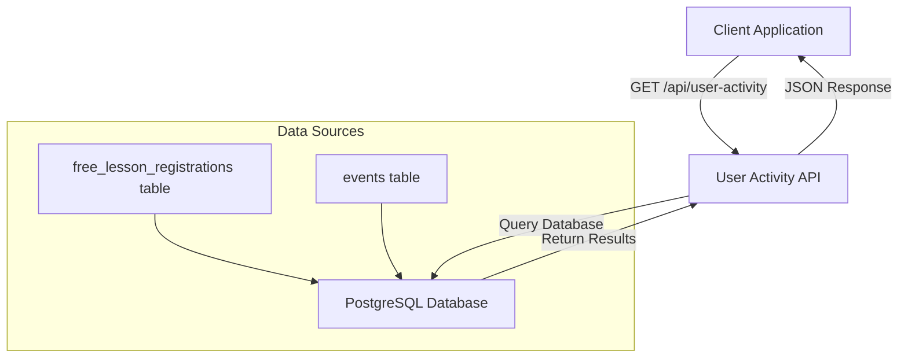
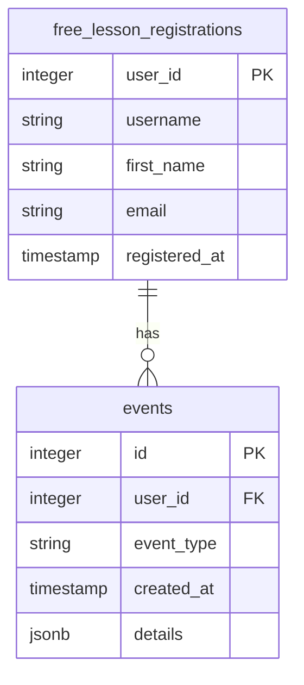
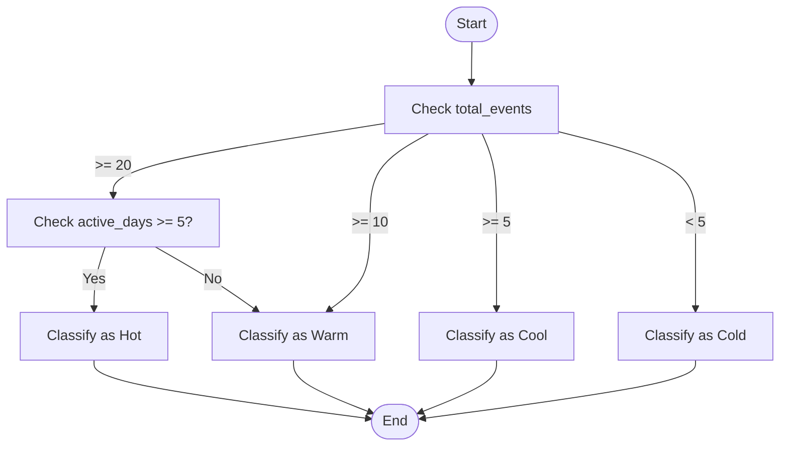
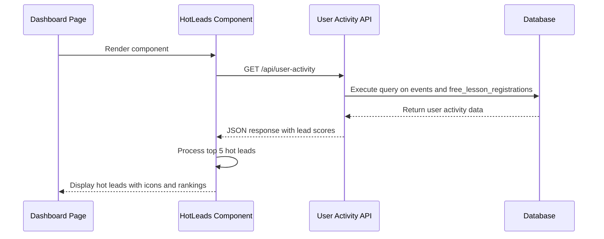
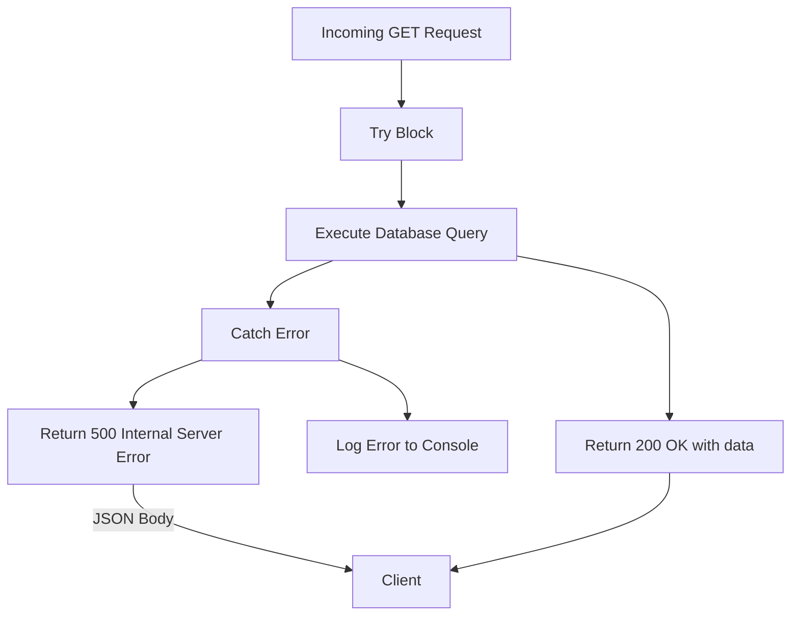

# User Activity API

<cite>
**Referenced Files in This Document**   
- [user-activity/route.ts](file://app/api/user-activity/route.ts)
- [HotLeads.tsx](file://components/HotLeads.tsx)
- [queries.ts](file://lib/queries.ts)
- [CLAUDE.md](file://CLAUDE.md)
</cite>

## Table of Contents
1. [Introduction](#introduction)
2. [API Endpoint Overview](#api-endpoint-overview)
3. [Data Model and Calculation](#data-model-and-calculation)
4. [Lead Scoring Algorithm](#lead-scoring-algorithm)
5. [Response Format](#response-format)
6. [Integration with Dashboard](#integration-with-dashboard)
7. [Marketing Use Cases](#marketing-use-cases)
8. [Error Handling](#error-handling)
9. [Performance Considerations](#performance-considerations)

## Introduction

The User Activity API provides a comprehensive lead scoring system that identifies high-potential users based on their engagement patterns. This documentation details the `/api/user-activity` endpoint that powers the lead scoring functionality, enabling marketing teams to prioritize outreach efforts and improve conversion rates. The API analyzes user behavior from the events table to calculate engagement metrics and classify users into lead categories (Hot, Warm, Cool, Cold) based on predefined criteria.

## API Endpoint Overview

The User Activity API exposes a single GET endpoint that returns user engagement metrics for lead scoring purposes. The endpoint processes data from free lesson registrations and associated user events to calculate activity scores and determine lead quality.



**Diagram sources**
- [user-activity/route.ts](file://app/api/user-activity/route.ts#L3-L50)

**Section sources**
- [user-activity/route.ts](file://app/api/user-activity/route.ts#L3-L50)

## Data Model and Calculation

The API calculates user activity metrics by joining data from the free_lesson_registrations and events tables. The data model focuses on two key engagement indicators: total event count and active days within a 7-day window.



The calculation process uses a Common Table Expression (CTE) to first aggregate user activity data, then applies the lead scoring logic to classify users. The key metrics calculated include:

- **total_events**: Count of distinct events per user in the last 7 days
- **active_days**: Count of distinct days with user activity in the last 7 days
- **last_activity**: Timestamp of the user's most recent event

**Section sources**
- [user-activity/route.ts](file://app/api/user-activity/route.ts#L7-L25)
- [CLAUDE.md](file://CLAUDE.md#L109-L115)

## Lead Scoring Algorithm

The lead scoring algorithm implements a tiered classification system based on user engagement metrics. The algorithm follows the PRD specification with Hot leads requiring both high event frequency and consistent daily engagement.



The algorithm implements the following scoring criteria:
- **Hot Lead**: 20+ events AND 5+ active days
- **Warm Lead**: 10+ events AND 3+ active days
- **Cool Lead**: 5+ events
- **Cold Lead**: Less than 5 events

This multi-dimensional approach ensures that Hot leads demonstrate both high volume and consistent engagement, reducing false positives from users who might have many events concentrated on a single day.

**Diagram sources**
- [user-activity/route.ts](file://app/api/user-activity/route.ts#L35-L42)
- [CLAUDE.md](file://CLAUDE.md#L109-L115)

**Section sources**
- [user-activity/route.ts](file://app/api/user-activity/route.ts#L35-L42)
- [CLAUDE.md](file://CLAUDE.md#L109-L115)

## Response Format

The API returns a JSON array of user activity objects, sorted by total events in descending order, with a limit of 100 records. Each object contains comprehensive user information and engagement metrics.

### Response Structure
```json
[
  {
    "user_id": 123,
    "username": "johndoe",
    "first_name": "John",
    "email": "john@example.com",
    "total_events": 25,
    "active_days": 6,
    "last_activity": "2025-09-10T14:30:00.000Z",
    "lead_score": "hot"
  }
]
```

### Field Definitions
| Field | Type | Description |
|-------|------|-------------|
| user_id | integer | Unique identifier for the user |
| username | string | Telegram username of the user |
| first_name | string | First name of the user |
| email | string | Email address from free lesson registration |
| total_events | integer | Count of distinct events in the last 7 days |
| active_days | integer | Count of distinct days with activity in the last 7 days |
| last_activity | string (ISO 8601) | Timestamp of the most recent user event |
| lead_score | string | Lead classification (hot, warm, cool, cold) |

**Section sources**
- [user-activity/route.ts](file://app/api/user-activity/route.ts#L30-L45)

## Integration with Dashboard

The User Activity API powers the 'Hot Leads' section on the dashboard through the HotLeads component. This integration enables real-time visibility of high-potential leads for immediate follow-up.



The HotLeads component fetches data from the API and displays the top 5 hottest leads with visual indicators, Telegram links, and engagement metrics. The component handles loading states and error conditions gracefully, ensuring a smooth user experience.

**Diagram sources**
- [user-activity/route.ts](file://app/api/user-activity/route.ts#L3-L50)
- [HotLeads.tsx](file://components/HotLeads.tsx#L10-L25)

**Section sources**
- [user-activity/route.ts](file://app/api/user-activity/route.ts#L3-L50)
- [HotLeads.tsx](file://components/HotLeads.tsx#L10-L25)

## Marketing Use Cases

Marketing teams leverage the User Activity API data to optimize campaign targeting and improve conversion rates. The lead scoring system enables data-driven decision making for outreach strategies.

### Targeted Campaign Examples

**Hot Lead Campaign**
- **Target**: Users with 'hot' lead_score
- **Strategy**: Immediate personal outreach via Telegram
- **Content**: Exclusive offer for course enrollment with limited-time discount
- **Channel**: Direct message with priority follow-up

**Warm Lead Nurturing**
- **Target**: Users with 'warm' lead_score
- **Strategy**: Educational content series
- **Content**: Value-driven messages about course benefits and success stories
- **Channel**: Automated message sequence over 3-5 days

**Cool Lead Reactivation**
- **Target**: Users with 'cool' lead_score
- **Strategy**: Re-engagement campaign
- **Content**: Reminder about missed opportunities and new cohort announcement
- **Channel**: Broadcast message to segmented group

The API data also supports A/B testing of messaging strategies by allowing marketing teams to compare conversion rates across different lead score segments. This enables continuous optimization of campaign effectiveness.

**Section sources**
- [user-activity/route.ts](file://app/api/user-activity/route.ts#L3-L50)
- [CLAUDE.md](file://CLAUDE.md#L109-L115)

## Error Handling

The API implements robust error handling to ensure reliability and provide meaningful feedback when issues occur.



When a database query fails, the API returns a 500 Internal Server Error with a JSON response containing an error message. The error is also logged to the console for debugging purposes. Client applications consuming this API should implement appropriate error handling to manage these failure scenarios gracefully.

**Diagram sources**
- [user-activity/route.ts](file://app/api/user-activity/route.ts#L47-L50)

**Section sources**
- [user-activity/route.ts](file://app/api/user-activity/route.ts#L47-L50)

## Performance Considerations

The User Activity API is optimized for performance with several key considerations:

1. **Time Window**: The query limits event analysis to the last 7 days, ensuring fast execution even as the events table grows.
2. **Result Limiting**: The response is limited to 100 records, preventing excessive data transfer.
3. **Efficient Joins**: The LEFT JOIN between free_lesson_registrations and events is optimized with appropriate indexing on user_id and created_at columns.
4. **CTE Usage**: The Common Table Expression structure allows the database to optimize the query plan effectively.

For high-traffic scenarios, consider implementing caching at the application level to reduce database load, especially since user activity data doesn't require real-time updates for most use cases.

**Section sources**
- [user-activity/route.ts](file://app/api/user-activity/route.ts#L15-L18)
- [user-activity/route.ts](file://app/api/user-activity/route.ts#L44-L45)