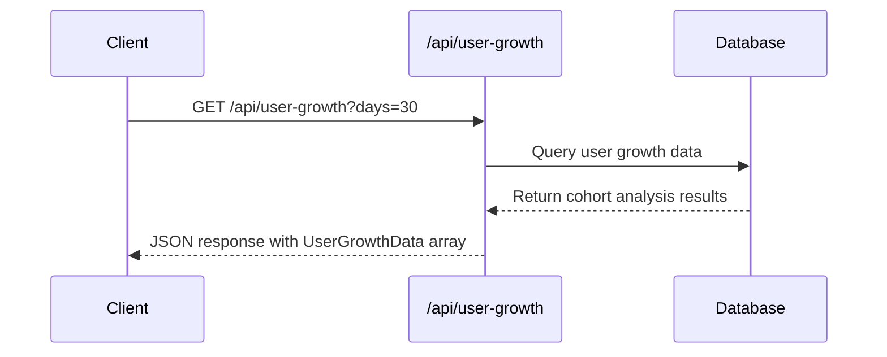
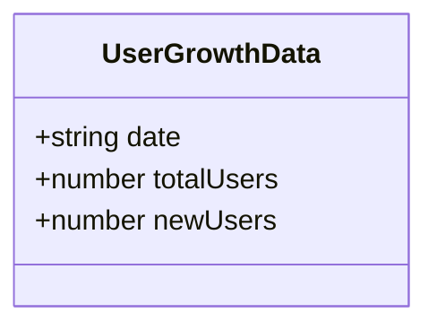
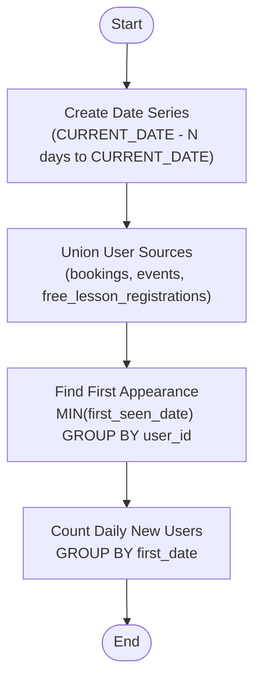
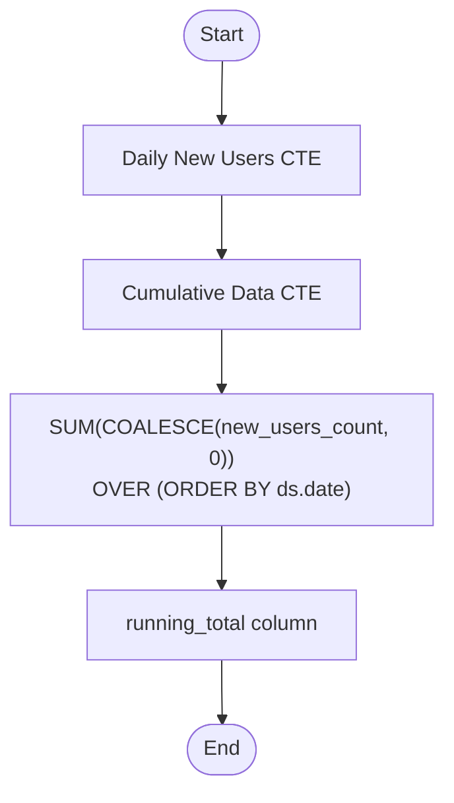
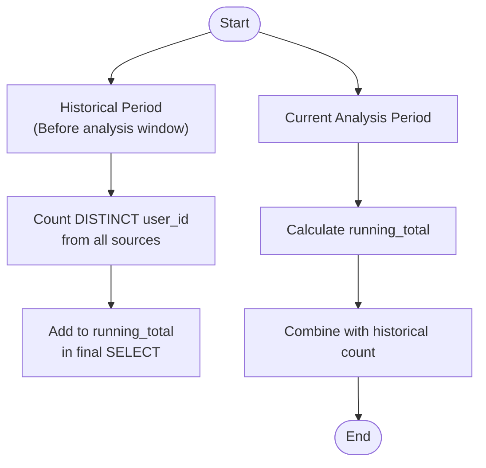
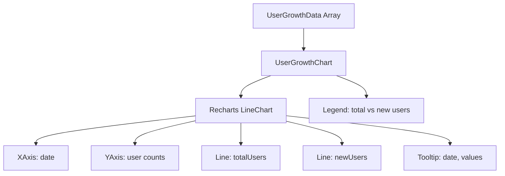
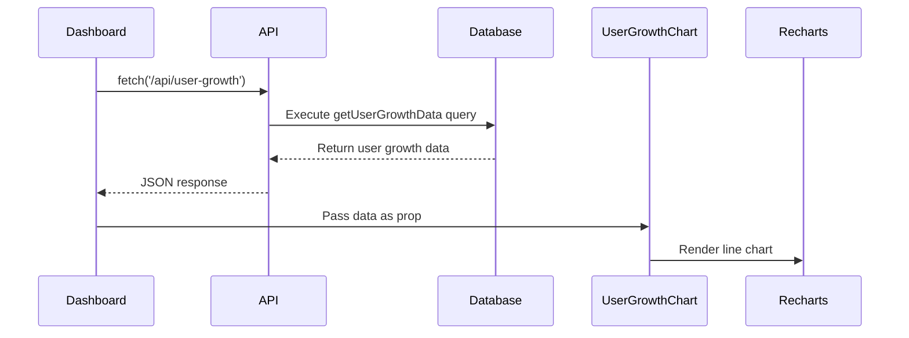

# User Growth API

<cite>
**Referenced Files in This Document**   
- [app/api/user-growth/route.ts](file://app/api/user-growth/route.ts)
- [lib/queries.ts](file://lib/queries.ts)
- [components/UserGrowthChart.tsx](file://components/UserGrowthChart.tsx)
- [app/page.tsx](file://app/page.tsx)
</cite>

## Table of Contents
1. [Introduction](#introduction)
2. [API Endpoint](#api-endpoint)
3. [Response Format](#response-format)
4. [Cohort Analysis Logic](#cohort-analysis-logic)
5. [Running Total Calculation](#running-total-calculation)
6. [Historical Data Integration](#historical-data-integration)
7. [Data Visualization](#data-visualization)
8. [Integration with Analytics Dashboard](#integration-with-analytics-dashboard)
9. [Use Cases](#use-cases)

## Introduction
The `/api/user-growth` endpoint provides comprehensive user acquisition analytics for the HSL Dashboard. This API enables tracking of new user growth over time by analyzing first appearances across multiple data sources including bookings, events, and free lesson registrations. The endpoint supports strategic decision-making by delivering cohort-based insights into user acquisition trends.

**Section sources**
- [app/api/user-growth/route.ts](file://app/api/user-growth/route.ts#L1-L17)
- [lib/queries.ts](file://lib/queries.ts#L474-L539)

## API Endpoint
The `/api/user-growth` endpoint exposes a GET method that returns user growth data over a specified time period. The endpoint accepts an optional `days` parameter to define the analysis window, defaulting to 30 days when not specified. The API serves as a critical data source for monitoring user acquisition trends and evaluating marketing campaign effectiveness.

**Diagram sources**
- [app/api/user-growth/route.ts](file://app/api/user-growth/route.ts#L1-L17)

**Section sources**
- [app/api/user-growth/route.ts](file://app/api/user-growth/route.ts#L1-L17)

## Response Format
The API returns an array of `UserGrowthData` objects, each containing three key properties:
- `date`: The date in ISO format (YYYY-MM-DD)
- `totalUsers`: The cumulative count of all users up to and including that date
- `newUsers`: The number of new users acquired on that specific date

The response is ordered chronologically from oldest to newest date, enabling straightforward time-series analysis and visualization.

**Diagram sources**
- [lib/queries.ts](file://lib/queries.ts#L52-L56)

**Section sources**
- [lib/queries.ts](file://lib/queries.ts#L52-L56)

## Cohort Analysis Logic
The cohort analysis identifies new user acquisition by determining the first appearance of each user across three data sources: bookings, events, and free lesson registrations. Using Common Table Expressions (CTEs), the query creates a unified view of all user first appearances, then groups them by date to calculate daily new user counts.

The analysis logic follows these steps:
1. Create a date series for the requested time period
2. Union user records from bookings, events, and free lesson registrations
3. Identify the first appearance date for each unique user
4. Count new users by their first appearance date

**Diagram sources**
- [lib/queries.ts](file://lib/queries.ts#L474-L539)

**Section sources**
- [lib/queries.ts](file://lib/queries.ts#L474-L539)

## Running Total Calculation
The running total of users is calculated using a window function that sums the daily new user counts in chronological order. This cumulative sum represents the total user base growth over time. The calculation is performed within the `cumulative_data` CTE using the `SUM() OVER (ORDER BY ds.date)` window function, which ensures that each day's total includes all previous days' new users.

**Diagram sources**
- [lib/queries.ts](file://lib/queries.ts#L474-L539)

**Section sources**
- [lib/queries.ts](file://lib/queries.ts#L474-L539)

## Historical Data Integration
The API incorporates historical user data from before the analysis period to provide accurate total user counts. This is achieved by adding a base count of users who existed prior to the analysis window to the running total. The historical count is calculated by querying all three data sources (bookings, events, and free lesson registrations) for users created before the start of the analysis period.

The integration ensures that the total user count on the first day of the analysis period reflects the actual user base size, rather than starting from zero. This approach provides a complete picture of user growth that accounts for the entire user history.

**Diagram sources**
- [lib/queries.ts](file://lib/queries.ts#L474-L539)

**Section sources**
- [lib/queries.ts](file://lib/queries.ts#L474-L539)

## Data Visualization
The user growth data is visualized in the `UserGrowthChart` component, which renders a line chart displaying both total users and new users over time. The chart uses Recharts to create an interactive visualization with tooltips and responsive design. The x-axis represents dates, while the y-axis shows user counts.

The visualization features:
- A primary line (in the application's primary color) showing the total user count trend
- A secondary line (in green) showing daily new user counts
- Date formatting in a readable short format (e.g., "Jan 15")
- A legend explaining both data series
- Tooltips that display detailed information on hover

**Diagram sources**
- [components/UserGrowthChart.tsx](file://components/UserGrowthChart.tsx#L5-L9)
- [components/UserGrowthChart.tsx](file://components/UserGrowthChart.tsx#L25-L86)

**Section sources**
- [components/UserGrowthChart.tsx](file://components/UserGrowthChart.tsx#L5-L86)

## Integration with Analytics Dashboard
The `/api/user-growth` endpoint is integrated into the main dashboard (`app/page.tsx`) where it powers the User Growth Chart component. The dashboard fetches this data as part of its Tier 3 analytics data, loading after critical and current state data to optimize performance.

The integration follows a tiered data loading strategy:
1. Tier 1: Critical data (dashboard stats)
2. Tier 2: Current state data (course streams, recent events)
3. Tier 3: Analytics data (user growth, free lesson registrations)

This prioritization ensures that essential information loads quickly while analytics data enhances the user experience without blocking initial page rendering.

**Diagram sources**
- [app/page.tsx](file://app/page.tsx#L112-L120)
- [components/UserGrowthChart.tsx](file://components/UserGrowthChart.tsx#L5-L9)

**Section sources**
- [app/page.tsx](file://app/page.tsx#L112-L120)

## Use Cases
The `/api/user-growth` endpoint supports several key business use cases:

### Strategic Planning
The historical user growth data enables long-term strategic planning by revealing trends in user acquisition. Stakeholders can identify growth patterns, seasonality effects, and inflection points in user adoption.

### Marketing Campaign Evaluation
By analyzing user growth spikes, marketing teams can evaluate the effectiveness of specific campaigns. The daily new user count serves as a direct metric for campaign impact assessment.

### Resource Allocation
Understanding user growth patterns helps in allocating resources for customer support, infrastructure scaling, and content creation based on projected user base expansion.

### Performance Benchmarking
The API provides baseline metrics for comparing current performance against historical periods, enabling data-driven decision making for product and marketing teams.

**Section sources**
- [app/page.tsx](file://app/page.tsx#L112-L120)
- [app/analytics/page.tsx](file://app/analytics/page.tsx#L41-L77)