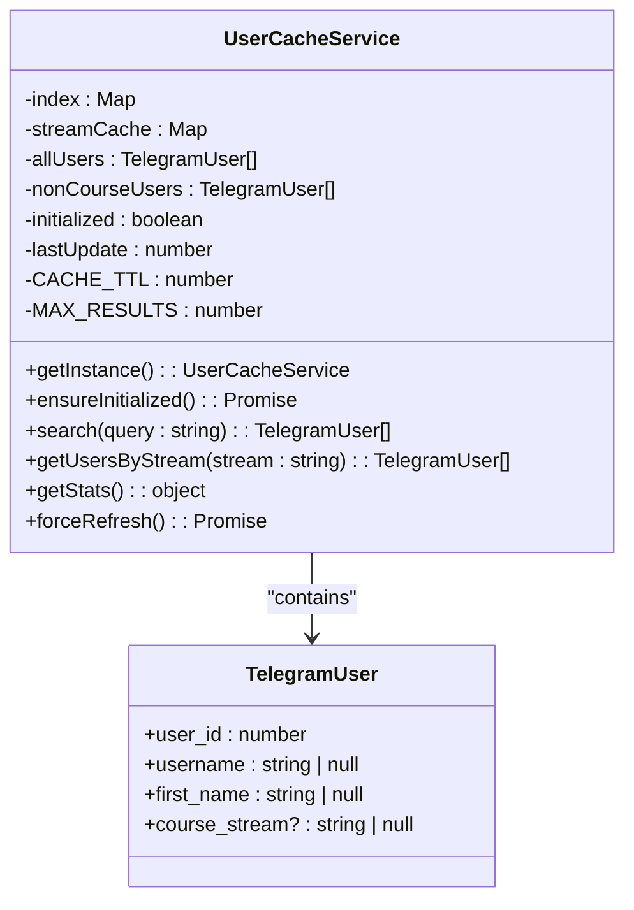
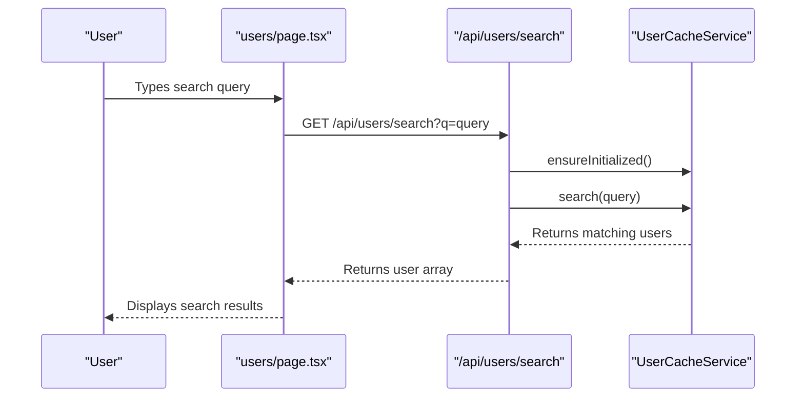

# User Management API

<cite>
**Referenced Files in This Document**   
- [userCache.ts](file://lib/userCache.ts)
- [search/route.ts](file://app/api/users/search/route.ts)
- [by-stream/route.ts](file://app/api/users/by-stream/route.ts)
- [user-activity/route.ts](file://app/api/user-activity/route.ts)
- [user-growth/route.ts](file://app/api/user-growth/route.ts)
- [queries.ts](file://lib/queries.ts)
- [users/page.tsx](file://app/users/page.tsx)
- [UserDetailsDialog.tsx](file://components/UserDetailsDialog.tsx)
- [UserGrowthChart.tsx](file://components/UserGrowthChart.tsx)
- [HotLeads.tsx](file://components/HotLeads.tsx)
</cite>

## Table of Contents
1. [Introduction](#introduction)
2. [API Endpoints Overview](#api-endpoints-overview)
3. [User Search API](#user-search-api)
4. [Stream-Based User Filtering API](#stream-based-user-filtering-api)
5. [User Activity Tracking API](#user-activity-tracking-api)
6. [User Growth Analytics API](#user-growth-analytics-api)
7. [Redis Caching Strategy](#redis-caching-strategy)
8. [Frontend Integration Examples](#frontend-integration-examples)
9. [Security and Validation](#security-and-validation)
10. [Error Handling](#error-handling)
11. [Performance Considerations](#performance-considerations)

## Introduction
The User Management API provides a comprehensive set of endpoints for managing and analyzing user data within the HSL Dashboard application. This documentation covers the core user management endpoints that power the user search interface and analytics visualizations. The API is designed to support efficient user lookup, cohort analysis, engagement tracking, and growth monitoring through a combination of database queries and in-memory caching.

The system integrates with Redis through a custom caching layer to optimize search performance, particularly for the user search functionality. The APIs are consumed by both administrative interfaces and analytics dashboards, providing real-time insights into user behavior and system metrics.

**Section sources**
- [userCache.ts](file://lib/userCache.ts)
- [users/page.tsx](file://app/users/page.tsx)

## API Endpoints Overview
The User Management API consists of four primary endpoints that serve different purposes in user data management and analysis:

- **/api/users/search**: Provides instant user search with Redis-backed caching for optimal performance
- **/api/users/by-stream**: Enables stream-based filtering of users for targeted messaging and cohort analysis
- **/api/user-activity**: Tracks user engagement and calculates lead scores based on activity patterns
- **/api/user-growth**: Provides cohort analysis of user growth over time with daily metrics

These endpoints follow a consistent pattern of authentication, input validation, and error handling while serving specialized data retrieval needs. Each endpoint is designed to be consumed by frontend components that visualize the data in various ways, from search results to analytical charts.

```mermaid
graph TD
A[Frontend Components] --> B[/api/users/search]
A --> C[/api/users/by-stream]
A --> D[/api/user-activity]
A --> E[/api/user-growth]
B --> F[UserCacheService]
C --> F
D --> G[Database Query]
E --> G
F --> H[Redis Cache]
G --> I[PostgreSQL Database]
```

**Diagram sources**
- [search/route.ts](file://app/api/users/search/route.ts)
- [by-stream/route.ts](file://app/api/users/by-stream/route.ts)
- [user-activity/route.ts](file://app/api/user-activity/route.ts)
- [user-growth/route.ts](file://app/api/user-growth/route.ts)
- [userCache.ts](file://lib/userCache.ts)

## User Search API
The /api/users/search endpoint provides instant user search capabilities with Redis integration for optimal performance. This endpoint is designed to support the user search interface, enabling administrators to quickly find users by username or first name.

### Request Parameters
- **q** (string, required): Search query for username or first name
- **stats** (boolean, optional): When true, returns cache statistics instead of search results

### Response Schema
The endpoint returns an array of user objects with the following structure:
- **user_id**: Unique identifier for the user
- **username**: Telegram username (nullable)
- **first_name**: User's first name (nullable)
- **course_stream**: Current course stream (nullable)

### Authentication Requirements
This endpoint requires authentication via the application's standard authentication mechanism. Users must have administrative privileges to access this endpoint.

### Example Usage
```
GET /api/users/search?q=john
GET /api/users/search?stats=true
```

The search functionality is case-insensitive and supports partial matching. When the 'stats' parameter is provided, the endpoint returns detailed cache statistics including total users, index size, and stream distribution.

**Section sources**
- [search/route.ts](file://app/api/users/search/route.ts)
- [userCache.ts](file://lib/userCache.ts)

## Stream-Based User Filtering API
The /api/users/by-stream endpoint enables filtering of users based on their course stream, supporting targeted messaging and cohort analysis. This endpoint is used to retrieve users belonging to specific educational streams for group communications and analytics.

### Request Parameters
- **stream** (string, required): Course stream identifier. Must be one of: 3rd_stream, 4th_stream, 5th_stream

### Response Schema
The endpoint returns an array of user objects with the following structure:
- **user_id**: Unique identifier for the user
- **username**: Telegram username (nullable)
- **first_name**: User's first name (nullable)
- **course_stream**: Current course stream

### Authentication Requirements
This endpoint requires authentication and appropriate permissions to access user data. Only users with administrative or messaging privileges can access this endpoint.

### Validation Rules
The endpoint validates that the provided stream parameter is one of the valid stream identifiers. Invalid stream values return a 400 Bad Request response with details of the acceptable values.

### Example Usage
```
GET /api/users/by-stream?stream=3rd_stream
GET /api/users/by-stream?stream=4th_stream
```

The endpoint logs detailed information about each request, including timestamp and user count, for monitoring and debugging purposes.

**Section sources**
- [by-stream/route.ts](file://app/api/users/by-stream/route.ts)
- [queries.ts](file://lib/queries.ts)

## User Activity Tracking API
The /api/user-activity endpoint tracks user engagement and calculates lead scores based on activity patterns. This endpoint powers the "Hot Leads" visualization, identifying users with the highest engagement levels.

### Request Parameters
This endpoint accepts no query parameters and returns the top 100 most active users.

### Response Schema
The endpoint returns an array of user activity objects with the following structure:
- **user_id**: Unique identifier for the user
- **username**: Telegram username
- **first_name**: User's first name
- **email**: User's email address
- **total_events**: Count of events in the last 7 days
- **active_days**: Count of unique days with activity in the last 7 days
- **last_activity**: Timestamp of the most recent activity
- **lead_score**: Engagement level classification (hot, warm, cool, cold)

### Lead Scoring Algorithm
The lead score is calculated using the following criteria:
- **hot**: 20+ events and 5+ active days in the last 7 days
- **warm**: 10+ events and 3+ active days in the last 7 days
- **cool**: 5+ events in the last 7 days
- **cold**: Fewer than 5 events in the last 7 days

### Authentication Requirements
This endpoint requires authentication with analytics or administrative privileges.

### Example Usage
```
GET /api/user-activity
```

The endpoint queries the database for free lesson registrations and recent events, joining this data to calculate engagement metrics for each user.

**Section sources**
- [user-activity/route.ts](file://app/api/user-activity/route.ts)
- [HotLeads.tsx](file://components/HotLeads.tsx)

## User Growth Analytics API
The /api/user-growth endpoint provides cohort analysis of user growth over time, supporting data-driven decision making and trend analysis. This endpoint powers the user growth visualization in the analytics dashboard.

### Request Parameters
- **days** (integer, optional): Number of days to include in the analysis. Defaults to 30.

### Response Schema
The endpoint returns an array of daily growth data objects with the following structure:
- **date**: Date in YYYY-MM-DD format
- **totalUsers**: Cumulative count of users up to and including this date
- **newUsers**: Count of new users acquired on this date

### Authentication Requirements
This endpoint requires authentication with analytics or administrative privileges.

### Data Processing
The endpoint uses a complex SQL query with Common Table Expressions (CTEs) to:
1. Generate a date series for the requested time period
2. Identify all user appearances across bookings, events, and free lesson registrations
3. Determine the first appearance date for each user
4. Calculate daily new user counts
5. Compute cumulative totals with historical baseline

### Example Usage
```
GET /api/user-growth
GET /api/user-growth?days=90
```

The data is used to visualize user acquisition trends and measure the effectiveness of marketing and engagement initiatives.

**Section sources**
- [user-growth/route.ts](file://app/api/user-growth/route.ts)
- [queries.ts](file://lib/queries.ts)
- [UserGrowthChart.tsx](file://components/UserGrowthChart.tsx)

## Redis Caching Strategy
The user search functionality is optimized through a sophisticated Redis caching strategy implemented in the UserCacheService class. This caching layer dramatically improves search performance by maintaining an in-memory index of user data.

### Cache Initialization
The cache uses lazy initialization with a 5-minute TTL (Time To Live). When a search request arrives:
1. The system checks if the cache is initialized or if the TTL has expired
2. If initialization is needed, it loads user data from the database
3. It builds an optimized search index and caches stream-specific user lists

### Data Structures
The cache maintains several data structures:
- **index**: Map of first letters to user arrays for fast prefix matching
- **streamCache**: Map of stream identifiers to user arrays for stream-based filtering
- **allUsers**: Complete list of users for comprehensive searches
- **nonCourseUsers**: Users who haven't paid for courses

### Search Algorithm
The search algorithm follows these steps:
1. Extract the first letter of the search query
2. Retrieve the candidate user bucket from the index
3. Filter candidates by username and first name prefix matching
4. Limit results to 50 entries
5. Return the filtered results

### Cache Statistics
The cache provides detailed statistics through the getStats() method, including:
- Total number of users cached
- Index size (number of letter buckets)
- Stream cache size and distribution
- Count of non-course users
- Cache initialization status and last update time



**Diagram sources**
- [userCache.ts](file://lib/userCache.ts)
- [queries.ts](file://lib/queries.ts)

**Section sources**
- [userCache.ts](file://lib/userCache.ts)

## Frontend Integration Examples
The User Management APIs are integrated into various frontend components that provide user interfaces for searching, analyzing, and managing users.

### User Search Interface
The main users page (users/page.tsx) implements a comprehensive user search interface with:
- Real-time search as the user types
- Stream and status filtering
- Pagination for large result sets
- User detail dialogs for viewing comprehensive information



**Diagram sources**
- [users/page.tsx](file://app/users/page.tsx)
- [search/route.ts](file://app/api/users/search/route.ts)
- [userCache.ts](file://lib/userCache.ts)

### Analytics Visualizations
The analytics dashboard integrates with the user activity and growth APIs to provide visual insights:

- **HotLeads Component**: Consumes /api/user-activity to display the most engaged users with emoji indicators for lead scores
- **UserGrowthChart Component**: Consumes /api/user-growth to display a line chart of user acquisition trends

The frontend components handle loading states, error conditions, and automatic data refresh to provide a seamless user experience.

**Section sources**
- [users/page.tsx](file://app/users/page.tsx)
- [UserDetailsDialog.tsx](file://components/UserDetailsDialog.tsx)
- [UserGrowthChart.tsx](file://components/UserGrowthChart.tsx)
- [HotLeads.tsx](file://components/HotLeads.tsx)

## Security and Validation
The User Management API implements comprehensive security measures and input validation to protect user data and prevent abuse.

### Input Validation
Each endpoint validates incoming parameters:
- **Search API**: Validates that the query parameter is present and at least one character long
- **Stream Filtering API**: Validates that the stream parameter is one of the allowed values (3rd_stream, 4th_stream, 5th_stream)
- **Growth API**: Validates that the days parameter, if provided, can be parsed as an integer

### Authentication
All endpoints require authentication through the application's middleware. The specific implementation details are not visible in the provided code, but the pattern suggests token-based authentication with role-based access control.

### Rate Limiting
While not explicitly implemented in the provided code, rate limiting considerations include:
- The search endpoint's Redis cache reduces database load from frequent searches
- The 5-minute cache TTL prevents excessive database queries
- The search results are limited to 50 entries to prevent large data transfers

### Data Protection
The API follows the principle of least privilege, only exposing necessary user information. Sensitive data like passwords is not included in the response payloads.

**Section sources**
- [search/route.ts](file://app/api/users/search/route.ts)
- [by-stream/route.ts](file://app/api/users/by-stream/route.ts)
- [user-activity/route.ts](file://app/api/user-activity/route.ts)
- [user-growth/route.ts](file://app/api/user-growth/route.ts)

## Error Handling
The User Management API implements robust error handling to ensure reliability and provide meaningful feedback for troubleshooting.

### Error Response Format
All endpoints follow a consistent error response format:
```json
{
  "error": "Descriptive error message"
}
```
With an appropriate HTTP status code (typically 400 for client errors, 500 for server errors).

### Search API Error Handling
The /api/users/search endpoint handles errors by:
- Returning an empty array for invalid or empty queries
- Catching and logging exceptions during search execution
- Returning a 500 status code with an error message if the search fails

### Stream Filtering Error Handling
The /api/users/by-stream endpoint handles errors by:
- Validating the stream parameter and returning 400 for invalid values
- Catching and logging database query errors
- Returning a 500 status code with an error message if the query fails

### Activity and Growth API Error Handling
Both analytics endpoints follow similar patterns:
- Catching and logging database query errors
- Returning a 500 status code with an error message if data retrieval fails
- Providing detailed error information in the server logs for debugging

The comprehensive logging includes timestamps, error messages, and stack traces to facilitate troubleshooting.

**Section sources**
- [search/route.ts](file://app/api/users/search/route.ts)
- [by-stream/route.ts](file://app/api/users/by-stream/route.ts)
- [user-activity/route.ts](file://app/api/user-activity/route.ts)
- [user-growth/route.ts](file://app/api/user-growth/route.ts)

## Performance Considerations
The User Management API is designed with performance as a primary consideration, particularly for the search functionality which is critical to the user experience.

### Caching Strategy
The Redis-based caching strategy provides significant performance benefits:
- **5-minute TTL**: Balances data freshness with performance
- **Lazy initialization**: Prevents unnecessary database queries when the cache is not needed
- **Pre-built indexes**: Enables O(1) access to first-letter buckets
- **In-memory data**: Eliminates database round-trips for search operations

### Database Query Optimization
The underlying database queries are optimized for performance:
- **Index usage**: The search query uses LIKE patterns that can leverage database indexes
- **Limited result sets**: Results are capped at 50 entries to prevent large data transfers
- **Efficient joins**: The queries use appropriate JOIN conditions and filtering

### Frontend Performance
The frontend implementation includes several performance optimizations:
- **Debounced search**: Reduces the frequency of API calls as the user types
- **Client-side caching**: The React components maintain state to avoid unnecessary re-fetching
- **Conditional rendering**: Components only render when data is available

### Scalability Considerations
The current implementation can be scaled by:
- Increasing the Redis cache size for larger user bases
- Implementing pagination for the search results
- Adding rate limiting to prevent abuse
- Using connection pooling for database access

The architecture supports horizontal scaling of the application servers while maintaining consistent cache behavior.

**Section sources**
- [userCache.ts](file://lib/userCache.ts)
- [search/route.ts](file://app/api/users/search/route.ts)
- [queries.ts](file://lib/queries.ts)