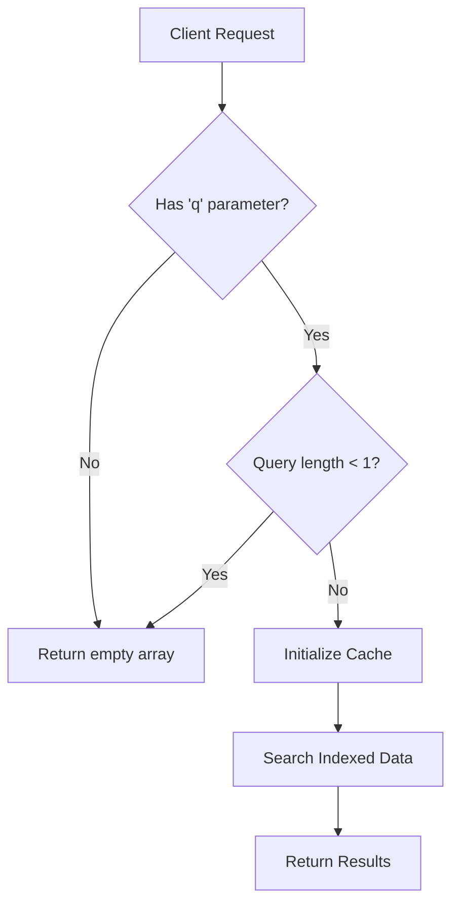
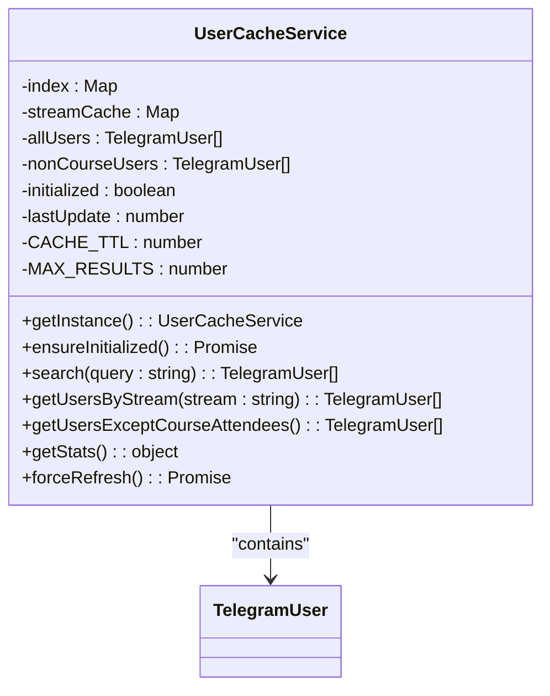
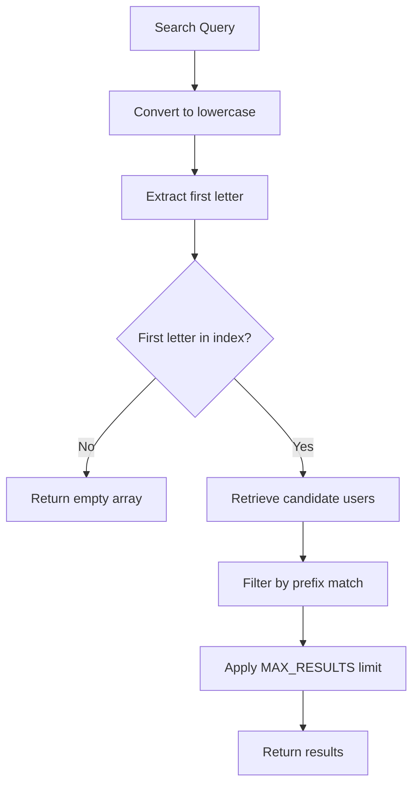
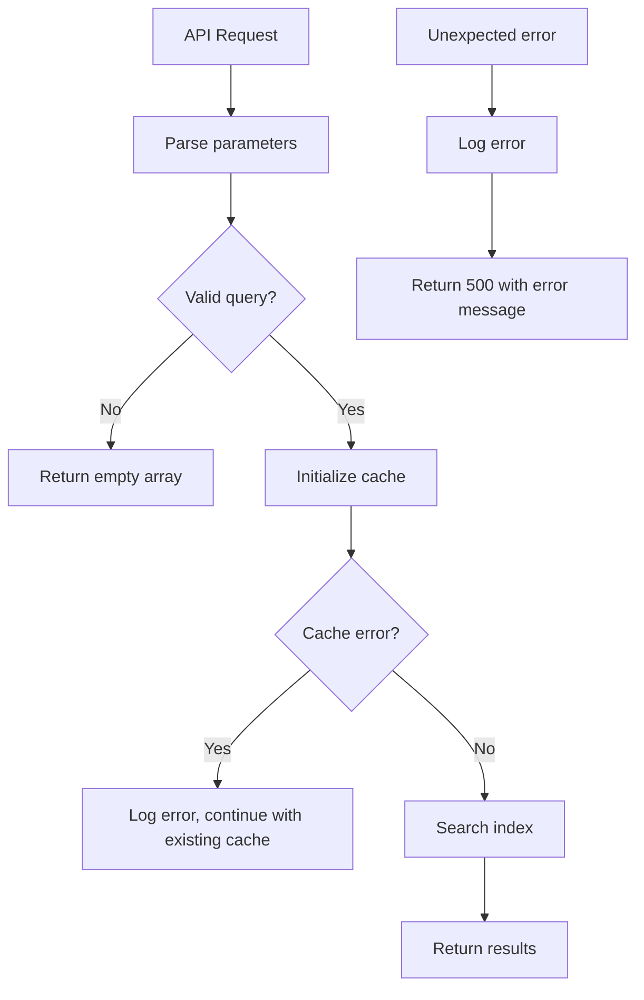
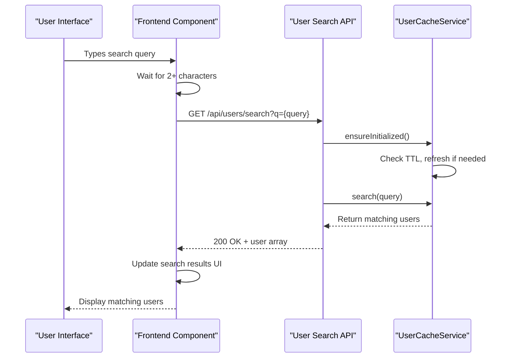
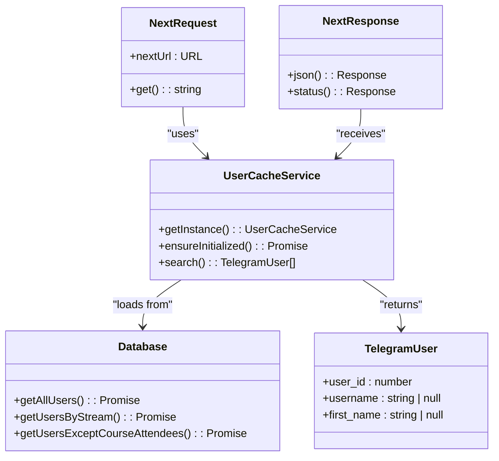
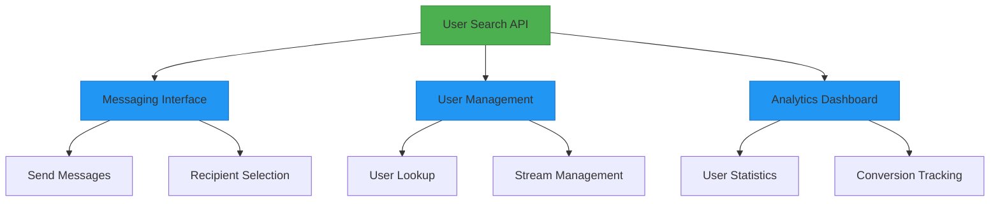

# User Search API

<cite>
**Referenced Files in This Document**   
- [app/api/users/search/route.ts](file://app/api/users/search/route.ts)
- [lib/userCache.ts](file://lib/userCache.ts)
- [lib/queries.ts](file://lib/queries.ts)
- [app/messages/send/page.tsx](file://app/messages/send/page.tsx)
</cite>

## Table of Contents
1. [Introduction](#introduction)
2. [API Endpoint Specification](#api-endpoint-specification)
3. [Request Parameters](#request-parameters)
4. [Response Format](#response-format)
5. [Caching Strategy](#caching-strategy)
6. [Search Algorithm](#search-algorithm)
7. [Performance Characteristics](#performance-characteristics)
8. [Error Handling](#error-handling)
9. [Usage Examples](#usage-examples)
10. [Frontend Integration](#frontend-integration)
11. [Backend Implementation](#backend-implementation)
12. [System Integration](#system-integration)

## Introduction

The User Search API provides a high-performance search capability for Telegram users within the HSL Dashboard application. This API endpoint powers real-time user search functionality in both the messaging interface and user management system, enabling administrators to quickly find and interact with users. The endpoint implements a sophisticated caching strategy using in-memory data structures to deliver sub-second response times, even with large user datasets. The search functionality indexes users by the first letter of their username and first name, then applies prefix matching to efficiently filter results. This documentation provides comprehensive details about the API's functionality, implementation, and integration points.

## API Endpoint Specification

The User Search API is exposed as a GET endpoint that accepts query parameters and returns a JSON response containing matching user records.

**Endpoint**: `GET /api/users/search`

**Method**: GET

**Purpose**: Search for Telegram users by username or first name with Redis-backed caching for optimal performance.

**Section sources**
- [app/api/users/search/route.ts](file://app/api/users/search/route.ts#L1-L36)

## Request Parameters

The API accepts the following query parameters:

| Parameter | Type | Required | Description |
|---------|------|----------|-------------|
| `q` | string | Yes | Search term to match against usernames and first names |
| `stats` | boolean | No | When set to 'true', returns cache statistics instead of search results |

The search term must be at least one character long to return results. The API performs case-insensitive prefix matching on both username and first name fields.



**Diagram sources**
- [app/api/users/search/route.ts](file://app/api/users/search/route.ts#L1-L36)

**Section sources**
- [app/api/users/search/route.ts](file://app/api/users/search/route.ts#L1-L36)

## Response Format

The API returns an array of TelegramUser objects in JSON format. Each user object contains the following properties:

| Field | Type | Description |
|------|------|-------------|
| `user_id` | number | Unique identifier for the Telegram user |
| `username` | string \| null | Telegram username (may be null) |
| `first_name` | string \| null | User's first name (may be null) |

**Example Response**:
```json
[
  {
    "user_id": 123456789,
    "username": "john_doe",
    "first_name": "John"
  },
  {
    "user_id": 987654321,
    "username": "jane_smith",
    "first_name": "Jane"
  }
]
```

When the `stats=true` parameter is included, the API returns cache statistics:

| Field | Type | Description |
|------|------|-------------|
| `totalUsers` | number | Total number of users in cache |
| `indexSize` | number | Number of letter buckets in search index |
| `streamCacheSize` | number | Number of course streams cached |
| `streamStats` | object | User count by course stream |
| `nonCourseUsers` | number | Number of users not enrolled in courses |
| `initialized` | boolean | Whether cache is initialized |
| `lastUpdate` | string | Timestamp of last cache update |

**Section sources**
- [lib/queries.ts](file://lib/queries.ts#L76-L81)
- [app/api/users/search/route.ts](file://app/api/users/search/route.ts#L1-L36)

## Caching Strategy

The User Search API implements a sophisticated in-memory caching strategy through the UserCacheService class, which enables sub-second search responses with a 5-minute TTL (Time To Live). The caching mechanism follows a lazy initialization pattern, loading data only when first accessed and refreshing it automatically when the TTL expires.



**Diagram sources**
- [lib/userCache.ts](file://lib/userCache.ts#L2-L212)

**Section sources**
- [lib/userCache.ts](file://lib/userCache.ts#L2-L212)

The cache stores multiple datasets:
- All users (from bookings and free lesson registrations)
- Users grouped by course stream (3rd, 4th, 5th)
- Non-course users (those who haven't paid for courses)

The cache is initialized with a 5-minute TTL, after which it automatically refreshes from the database. This balance between freshness and performance ensures users see relatively current data while maintaining fast response times.

## Search Algorithm

The search algorithm implements a two-phase approach that combines indexing for speed with prefix matching for accuracy. The algorithm indexes users by the first letter of their username and first name, creating letter-based buckets that dramatically reduce the search space.



**Diagram sources**
- [lib/userCache.ts](file://lib/userCache.ts#L150-L184)

**Section sources**
- [lib/userCache.ts](file://lib/userCache.ts#L150-L184)

The algorithm works as follows:
1. When the cache is initialized, it builds an index by iterating through all users
2. For each user, it adds them to buckets based on the first letter of their username and first name
3. During search, it retrieves only users from the bucket corresponding to the first letter of the search term
4. It then filters these candidates using prefix matching on both username and first name
5. Results are limited to a maximum of 50 entries

This approach reduces search complexity from O(n) to approximately O(k) where k is the average number of users per letter bucket, resulting in significantly faster searches.

## Performance Characteristics

The User Search API is optimized for high performance with sub-second response times. The caching strategy and indexing algorithm work together to deliver fast search results even with large datasets.

| Metric | Value | Description |
|--------|-------|-------------|
| Response Time | < 100ms | Typical response time for cached searches |
| Cache TTL | 5 minutes | Time-to-live for cached data |
| Max Results | 50 | Maximum number of results returned |
| Index Buckets | 26 | One per letter of the alphabet (a-z) |
| Data Sources | 2 | Bookings and free lesson registrations |

The API automatically handles cache initialization and refresh, ensuring consistent performance. When the cache expires, subsequent requests trigger a background refresh while still serving results from the previous cache state to maintain responsiveness.

**Section sources**
- [lib/userCache.ts](file://lib/userCache.ts#L2-L212)
- [app/api/users/search/route.ts](file://app/api/users/search/route.ts#L1-L36)

## Error Handling

The API implements comprehensive error handling to ensure reliability and provide meaningful feedback when issues occur.



**Diagram sources**
- [app/api/users/search/route.ts](file://app/api/users/search/route.ts#L1-L36)

**Section sources**
- [app/api/users/search/route.ts](file://app/api/users/search/route.ts#L1-L36)

The error handling strategy includes:
- Graceful degradation: If cache initialization fails, the API continues to serve results from the existing cache
- Comprehensive logging: All search operations and errors are logged with contextual information
- Client-friendly responses: Errors return appropriate HTTP status codes and descriptive messages
- Empty results for invalid queries: Rather than throwing errors for short queries, the API returns an empty array

Database errors during cache initialization are caught and logged, but do not prevent the API from serving existing cached data, ensuring high availability.

## Usage Examples

### Valid Requests

**Search for users with username or first name starting with "john":**
```
GET /api/users/search?q=john
```

**Search with case-insensitive matching:**
```
GET /api/users/search?q=JOHN
```

**Retrieve cache statistics for debugging:**
```
GET /api/users/search?stats=true
```

### Example Responses

**Search results for "john":**
```json
[
  {
    "user_id": 123456789,
    "username": "john_doe",
    "first_name": "John"
  },
  {
    "user_id": 987654321,
    "username": "johnny",
    "first_name": "Jonathan"
  }
]
```

**Cache statistics:**
```json
{
  "totalUsers": 1500,
  "indexSize": 26,
  "streamCacheSize": 3,
  "streamStats": {
    "3rd_stream": 500,
    "4th_stream": 600,
    "5th_stream": 400
  },
  "nonCourseUsers": 200,
  "initialized": true,
  "lastUpdate": "2025-01-15T10:30:00.000Z"
}
```

**Section sources**
- [app/api/users/search/route.ts](file://app/api/users/search/route.ts#L1-L36)
- [lib/userCache.ts](file://lib/userCache.ts#L2-L212)

## Frontend Integration

The User Search API is integrated into the messaging interface, providing real-time search functionality for user selection.



**Diagram sources**
- [app/messages/send/page.tsx](file://app/messages/send/page.tsx#L131-L162)
- [app/api/users/search/route.ts](file://app/api/users/search/route.ts#L1-L36)

**Section sources**
- [app/messages/send/page.tsx](file://app/messages/send/page.tsx#L131-L162)

The frontend implementation in `page.tsx` includes:
- Debounced search to reduce API calls
- Loading states during search operations
- Error handling with user-friendly messages
- Result display in a scrollable list
- User selection functionality

The search is triggered only after the user has entered at least two characters, reducing unnecessary API calls and improving user experience.

## Backend Implementation

The backend implementation consists of the API route handler and the UserCacheService class that manages data retrieval and indexing.



**Diagram sources**
- [app/api/users/search/route.ts](file://app/api/users/search/route.ts#L1-L36)
- [lib/userCache.ts](file://lib/userCache.ts#L2-L212)
- [lib/queries.ts](file://lib/queries.ts#L76-L81)

**Section sources**
- [app/api/users/search/route.ts](file://app/api/users/search/route.ts#L1-L36)
- [lib/userCache.ts](file://lib/userCache.ts#L2-L212)
- [lib/queries.ts](file://lib/queries.ts#L544-L573)

The implementation follows these key patterns:
- Singleton pattern for UserCacheService to ensure a single cache instance
- Lazy initialization to defer database loading until first use
- Dynamic imports to avoid circular dependencies
- Comprehensive logging for monitoring and debugging
- Error boundaries to maintain service availability

## System Integration

The User Search API is a critical component that integrates with multiple parts of the HSL Dashboard system, primarily powering the messaging interface and user management features.



**Diagram sources**
- [app/api/users/search/route.ts](file://app/api/users/search/route.ts#L1-L36)
- [app/messages/send/page.tsx](file://app/messages/send/page.tsx#L131-L162)

**Section sources**
- [app/api/users/search/route.ts](file://app/api/users/search/route.ts#L1-L36)
- [app/messages/send/page.tsx](file://app/messages/send/page.tsx#L131-L162)

The API serves as the primary search mechanism for:
- Selecting message recipients in the messaging interface
- Looking up users in the user management system
- Providing user statistics for analytics
- Supporting conversion tracking for free lessons

The tight integration between the search API and the messaging interface enables administrators to quickly find and communicate with users, enhancing the overall efficiency of user management and communication workflows.