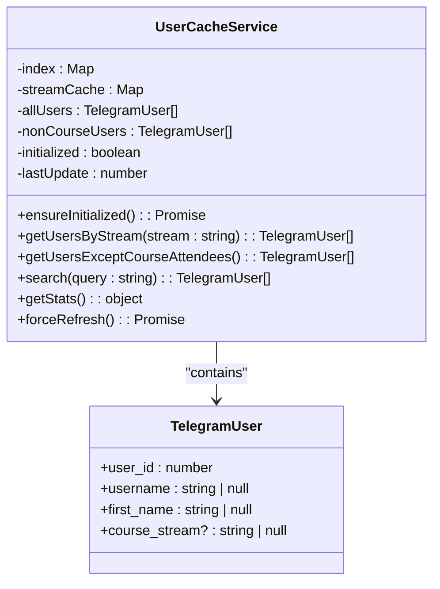
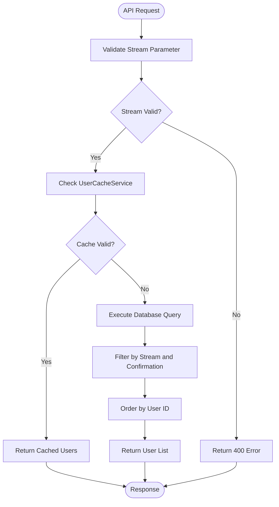
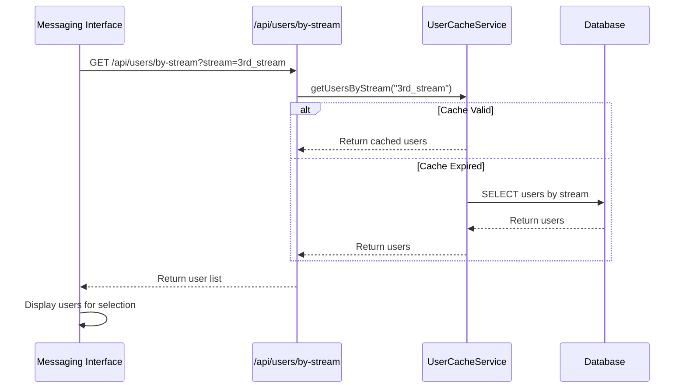

# User Stream API

<cite>
**Referenced Files in This Document**   
- [app/api/users/by-stream/route.ts](file://app/api/users/by-stream/route.ts)
- [lib/userCache.ts](file://lib/userCache.ts)
- [lib/queries.ts](file://lib/queries.ts)
</cite>

## Table of Contents
1. [Introduction](#introduction)
2. [API Endpoint Details](#api-endpoint-details)
3. [Caching Mechanism](#caching-mechanism)
4. [Database Query Logic](#database-query-logic)
5. [Request and Response Examples](#request-and-response-examples)
6. [Integration with Messaging System](#integration-with-messaging-system)
7. [Security Considerations](#security-considerations)
8. [Performance Optimization](#performance-optimization)
9. [Conclusion](#conclusion)

## Introduction
The `/api/users/by-stream` endpoint is a critical component of the HSL Dashboard system, designed to efficiently retrieve lists of users based on their course stream affiliation. This API enables targeted messaging to specific course cohorts by providing a performant way to access stream-specific user data. The endpoint leverages a sophisticated caching mechanism to ensure optimal performance while maintaining data consistency. This documentation provides a comprehensive overview of the API's functionality, implementation details, and integration points within the broader system.

## API Endpoint Details

The `/api/users/by-stream` endpoint provides a GET method for retrieving users filtered by their course stream. The endpoint requires a query parameter to specify which stream's users should be returned.

### HTTP Method and Path
- **Method**: GET
- **Path**: `/api/users/by-stream`

### Query Parameters
The endpoint requires one query parameter:

| Parameter | Type | Required | Description | Valid Values |
|---------|------|----------|-------------|-------------|
| `stream` | string | Yes | Specifies which course stream to retrieve users for | `3rd_stream`, `4th_stream`, `5th_stream` |

### Response Format
The endpoint returns a JSON array of `TelegramUser` objects, each containing the following properties:

| Field | Type | Description |
|------|------|-------------|
| `user_id` | number | Unique identifier for the user |
| `username` | string or null | Telegram username |
| `first_name` | string or null | User's first name |
| `course_stream` | string or null | The course stream the user belongs to |

### Error Responses
The API returns appropriate HTTP status codes and error messages for invalid requests:

- **400 Bad Request**: When the `stream` parameter is missing or contains an invalid value
- **500 Internal Server Error**: When an unexpected error occurs during processing

**Section sources**
- [app/api/users/by-stream/route.ts](file://app/api/users/by-stream/route.ts#L1-L47)

## Caching Mechanism

The system employs a sophisticated caching mechanism through the `UserCacheService` class to optimize performance for user data retrieval operations. This caching layer significantly reduces database load and improves response times for frequently accessed user data.



**Diagram sources**
- [lib/userCache.ts](file://lib/userCache.ts#L2-L212)
- [lib/queries.ts](file://lib/queries.ts#L76-L81)

### Cache Initialization
The `UserCacheService` implements a singleton pattern and initializes its data when first accessed or when the cache has expired. The cache has a TTL (Time To Live) of 5 minutes, after which it will be refreshed on the next request.

The initialization process loads data from multiple sources:
1. All users from bookings and free lesson registrations
2. Stream-specific user lists for each valid stream
3. Users who have not paid for courses

### Stream-Specific Caching
The service maintains a `streamCache` Map that stores user lists pre-loaded for each valid stream (`3rd_stream`, `4th_stream`, `5th_stream`). During initialization, the service calls the `getUsersByStream` database function for each stream and stores the results in the cache.

When a request is made to retrieve users by stream, the service first checks if the requested stream is valid, then returns the pre-loaded user list from the cache without making a database query.

### Cache Benefits
- **Reduced Database Load**: Eliminates repeated database queries for the same data
- **Improved Response Times**: Data is served from memory rather than requiring database round-trips
- **Consistent Data**: Provides a consistent view of user data for the duration of the cache TTL
- **Scalability**: Enables the system to handle high request volumes without proportional database load increases

**Section sources**
- [lib/userCache.ts](file://lib/userCache.ts#L2-L212)

## Database Query Logic

The underlying database query in the `getUsersByStream` function filters confirmed course attendees by stream, ensuring that only relevant users are returned in the API response.



**Diagram sources**
- [app/api/users/by-stream/route.ts](file://app/api/users/by-stream/route.ts#L1-L47)
- [lib/queries.ts](file://lib/queries.ts#L576-L599)

### Query Implementation
The `getUsersByStream` function in `queries.ts` executes a PostgreSQL query that:

1. Selects distinct users from the bookings table
2. Filters by the specified course stream
3. Ensures only confirmed attendees are included (confirmed = 2)
4. Orders results by user ID, username, and first name

The SQL query uses a parameterized query to prevent SQL injection and includes the following conditions:
- `b.course_stream = $1`: Matches the requested stream parameter
- `b.user_id IS NOT NULL`: Ensures valid user IDs
- `b.confirmed = 2`: Filters for only confirmed course attendees

### Data Selection
The query selects the following fields:
- `user_id`: The unique identifier for the user
- `username`: The user's Telegram username
- `first_name`: The user's first name
- `course_stream`: The stream to which the user belongs

These fields are mapped to the `TelegramUser` interface and returned as a JSON array.

**Section sources**
- [lib/queries.ts](file://lib/queries.ts#L576-L599)

## Request and Response Examples

### Valid Request Examples
The following are examples of valid requests to the `/api/users/by-stream` endpoint:

**Request for 3rd Stream Users**
```
GET /api/users/by-stream?stream=3rd_stream
```

**Request for 4th Stream Users**
```
GET /api/users/by-stream?stream=4th_stream
```

**Request for 5th Stream Users**
```
GET /api/users/by-stream?stream=5th_stream
```

### Response Example
A successful response returns a JSON array of `TelegramUser` objects:

```json
[
  {
    "user_id": 123456,
    "username": "alex_smith",
    "first_name": "Alex",
    "course_stream": "3rd_stream"
  },
  {
    "user_id": 789012,
    "username": "jane_doe",
    "first_name": "Jane",
    "course_stream": "3rd_stream"
  },
  {
    "user_id": 345678,
    "username": null,
    "first_name": "Bob",
    "course_stream": "3rd_stream"
  }
]
```

### Error Response Examples
**Missing Stream Parameter**
```json
{
  "error": "Stream parameter is required"
}
```
HTTP Status: 400

**Invalid Stream Value**
```json
{
  "error": "Invalid stream. Must be one of: 3rd_stream, 4th_stream, 5th_stream"
}
```
HTTP Status: 400

**Internal Server Error**
```json
{
  "error": "Failed to fetch users by stream"
}
```
HTTP Status: 500

**Section sources**
- [app/api/users/by-stream/route.ts](file://app/api/users/by-stream/route.ts#L1-L47)

## Integration with Messaging System

The `/api/users/by-stream` endpoint plays a crucial role in enabling targeted messaging to specific course cohorts through integration with the messaging system's group selection feature.

### Workflow Integration
When a user wants to send a message to a specific course stream, the messaging interface uses this API to populate the group selection dropdown. The workflow is as follows:



**Diagram sources**
- [app/api/users/by-stream/route.ts](file://app/api/users/by-stream/route.ts#L1-L47)
- [lib/userCache.ts](file://lib/userCache.ts#L2-L212)

### Use Cases
1. **Announcements**: Sending course updates, schedule changes, or resource links to specific streams
2. **Reminders**: Notifying users about upcoming sessions or deadlines
3. **Surveys**: Collecting feedback from specific course cohorts
4. **Support**: Providing targeted assistance to users in particular streams

The integration allows administrators to efficiently communicate with specific user groups without manually selecting individual recipients, improving both efficiency and message relevance.

**Section sources**
- [app/api/users/by-stream/route.ts](file://app/api/users/by-stream/route.ts#L1-L47)
- [lib/userCache.ts](file://lib/userCache.ts#L2-L212)

## Security Considerations

The `/api/users/by-stream` endpoint incorporates several security measures to protect data integrity and prevent abuse.

### Stream Validation
The endpoint implements strict validation of the stream parameter to prevent unauthorized access to user data:

1. **Presence Check**: Verifies that the stream parameter is provided
2. **Whitelist Validation**: Confirms the stream value is one of the allowed values (`3rd_stream`, `4th_stream`, `5th_stream`)

This prevents attackers from attempting to access data for non-existent or unauthorized streams.

### Input Sanitization
Although the endpoint uses parameterized queries that inherently protect against SQL injection, the application layer provides additional protection by:

- Validating input before database access
- Using TypeScript types to ensure data consistency
- Implementing proper error handling that doesn't expose sensitive information

### Access Control
While this documentation doesn't show authentication mechanisms, the endpoint is part of a protected API route that likely requires appropriate authentication and authorization before access is granted.

### Error Handling
The endpoint provides informative but non-revealing error messages that help legitimate users understand issues without exposing system internals:

- Generic error messages for internal server errors
- Specific but limited information for validation errors
- Comprehensive logging for debugging (server-side only)

**Section sources**
- [app/api/users/by-stream/route.ts](file://app/api/users/by-stream/route.ts#L1-L47)

## Performance Optimization

The system employs multiple performance optimization strategies to ensure the `/api/users/by-stream` endpoint remains responsive even under heavy load.

### Caching Strategy
The primary performance optimization is the 5-minute TTL cache implemented by `UserCacheService`. This strategy provides several benefits:

- **Reduced Database Queries**: Eliminates repeated identical queries within the cache window
- **Faster Response Times**: Serves data from memory rather than waiting for database round-trips
- **Lower Server Load**: Reduces CPU and memory usage on the database server

### Pre-loading Mechanism
The cache service proactively loads data for all valid streams during initialization, rather than loading on-demand. This ensures that when a request comes in for any stream, the data is already available in memory.

### Efficient Data Structures
The cache uses optimized data structures:
- `Map<string, TelegramUser[]>` for O(1) lookup of stream-specific user lists
- Pre-sorted results to avoid sorting on each request
- Deduplicated user data to minimize memory usage

### Monitoring and Logging
The system includes comprehensive logging to monitor performance:
- Timestamps for API requests and responses
- User counts for each stream query
- Cache age and refresh information
- Error tracking for troubleshooting

These optimizations ensure that the endpoint can handle high request volumes while maintaining consistent performance, which is critical for the messaging system's functionality.

**Section sources**
- [lib/userCache.ts](file://lib/userCache.ts#L2-L212)

## Conclusion
The `/api/users/by-stream` endpoint provides a robust and efficient solution for retrieving users by their course stream affiliation. Through a combination of strict validation, database optimization, and an intelligent caching mechanism, the API delivers high performance while maintaining data accuracy. The integration with the messaging system enables targeted communication with specific course cohorts, enhancing the platform's ability to support its users effectively. The implementation demonstrates thoughtful consideration of security, performance, and usability requirements, making it a critical component of the HSL Dashboard ecosystem.