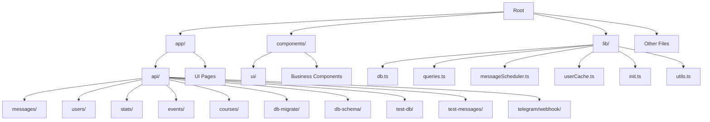
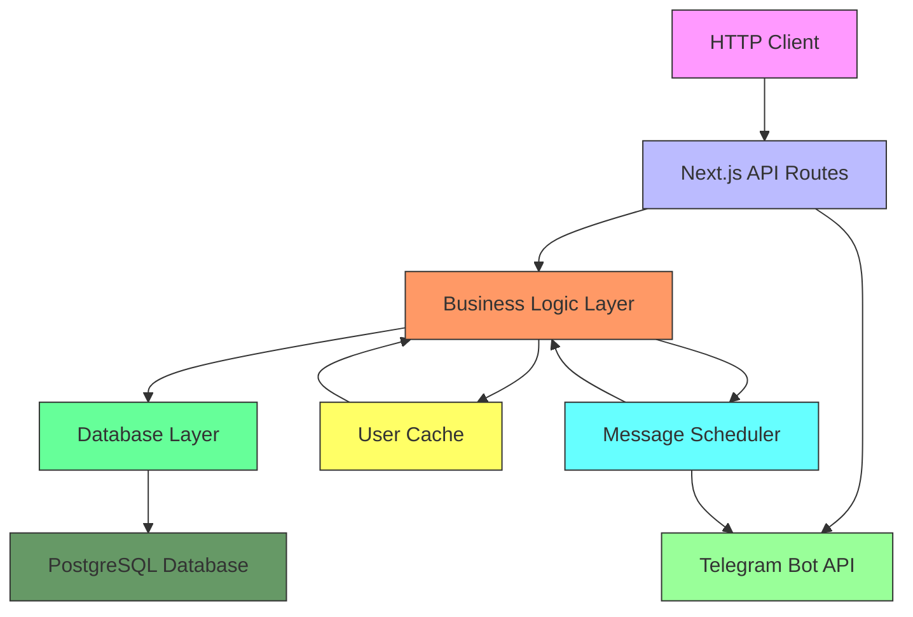
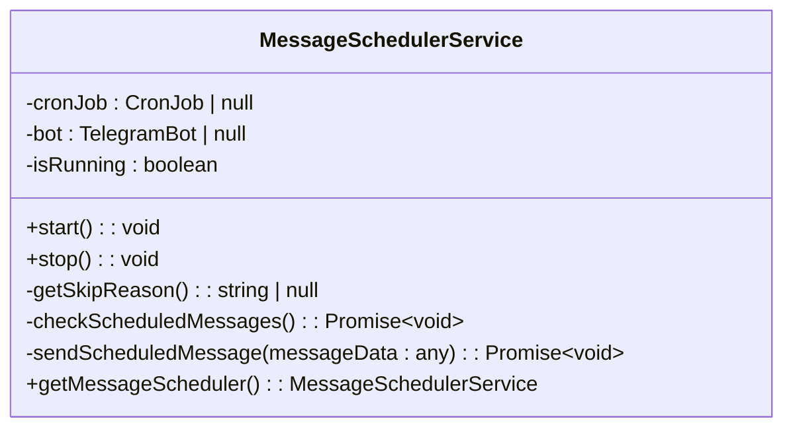
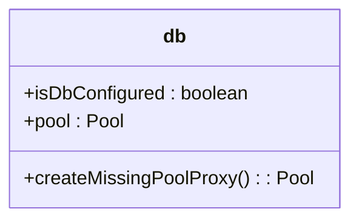
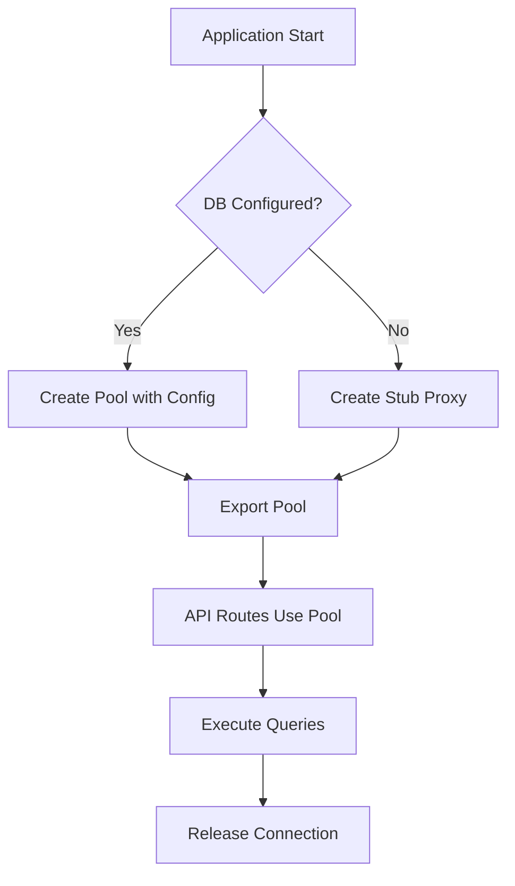
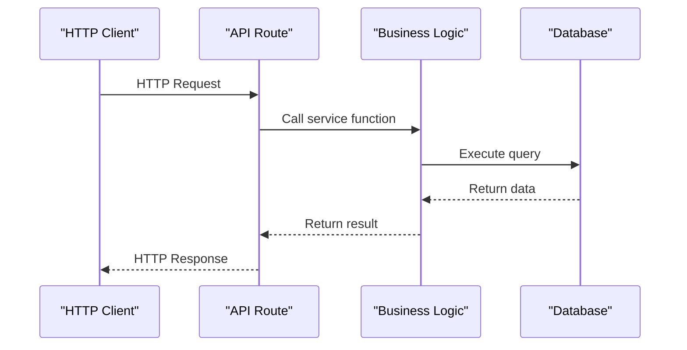
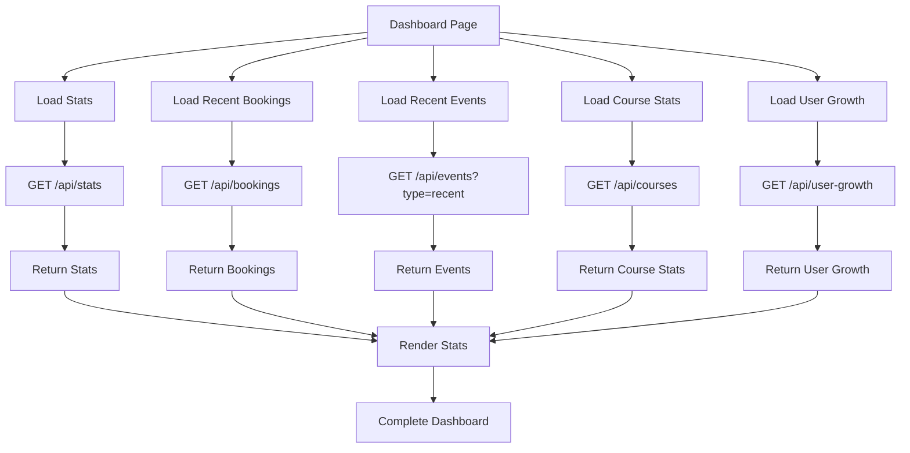
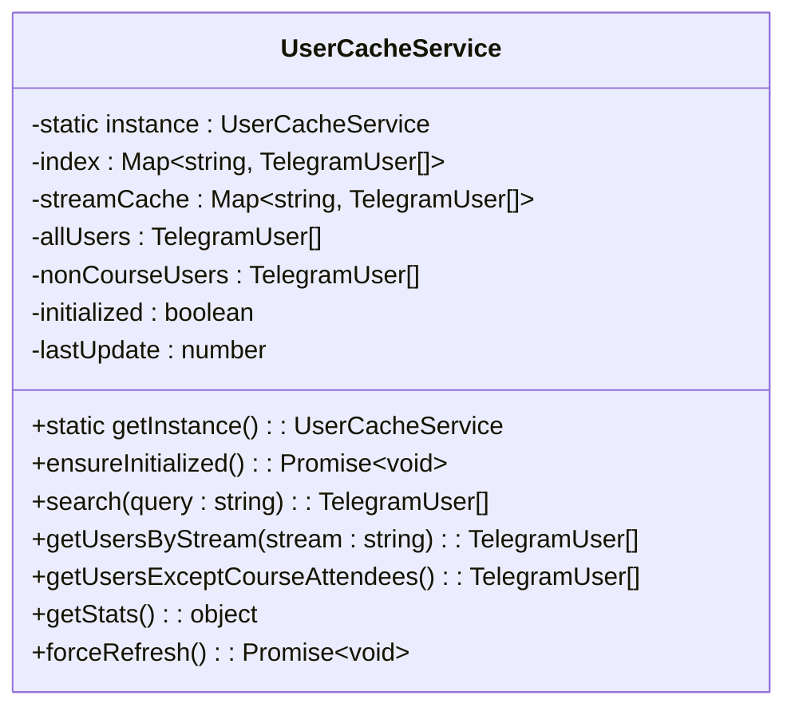
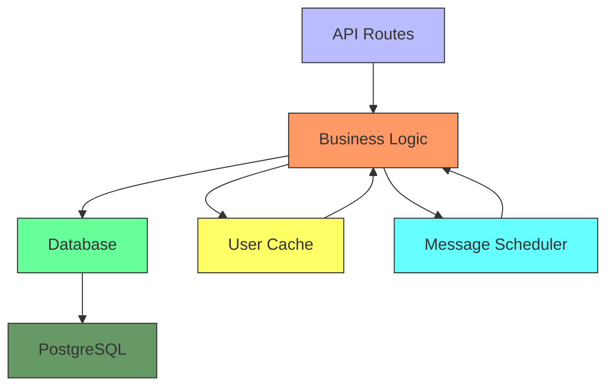

# Backend Architecture

<cite>
**Referenced Files in This Document**   
- [app/api/messages/send/route.ts](file://app/api/messages/send/route.ts)
- [app/api/users/search/route.ts](file://app/api/users/search/route.ts)
- [app/api/users/[id]/route.ts](file://app/api/users/[id]/route.ts)
- [app/api/stats/route.ts](file://app/api/stats/route.ts)
- [app/api/events/route.ts](file://app/api/events/route.ts)
- [app/api/courses/route.ts](file://app/api/courses/route.ts)
- [app/api/db-schema/route.ts](file://app/api/db-schema/route.ts)
- [app/api/db-migrate/route.ts](file://app/api/db-migrate/route.ts)
- [app/api/test-db/route.ts](file://app/api/test-db/route.ts)
- [app/api/test-messages/route.ts](file://app/api/test-messages/route.ts)
- [app/api/telegram/webhook/route.ts](file://app/api/telegram/webhook/route.ts)
- [lib/db.ts](file://lib/db.ts)
- [lib/queries.ts](file://lib/queries.ts)
- [lib/messageScheduler.ts](file://lib/messageScheduler.ts)
- [lib/userCache.ts](file://lib/userCache.ts)
- [lib/init.ts](file://lib/init.ts)
</cite>

## Table of Contents
1. [Introduction](#introduction)
2. [Project Structure](#project-structure)
3. [Core Components](#core-components)
4. [Architecture Overview](#architecture-overview)
5. [Detailed Component Analysis](#detailed-component-analysis)
6. [Dependency Analysis](#dependency-analysis)
7. [Performance Considerations](#performance-considerations)
8. [Troubleshooting Guide](#troubleshooting-guide)
9. [Conclusion](#conclusion)

## Introduction
The hsl-dashboard backend is a Next.js application that provides a comprehensive dashboard for managing user data, messaging, and analytics. The system is designed with a clear separation of concerns, featuring RESTful API endpoints, a business logic layer, and database connectivity. This documentation provides a detailed analysis of the backend architecture, focusing on API design, business logic implementation, database connectivity, and key architectural patterns.

## Project Structure

The project follows a Next.js App Router structure with a clear separation between API routes, UI components, and business logic:



**Diagram sources**
- [app/api/messages/send/route.ts](file://app/api/messages/send/route.ts)
- [lib/db.ts](file://lib/db.ts)
- [lib/queries.ts](file://lib/queries.ts)

**Section sources**
- [app/api/messages/send/route.ts](file://app/api/messages/send/route.ts)
- [lib/db.ts](file://lib/db.ts)
- [lib/queries.ts](file://lib/queries.ts)

## Core Components

The backend architecture consists of several key components that work together to provide the dashboard functionality:

1. **API Routes**: RESTful endpoints under app/api/ that handle HTTP requests
2. **Business Logic Layer**: Functions in lib/ that implement core functionality
3. **Database Connectivity**: Connection management and query execution in db.ts
4. **Caching System**: UserCacheService for efficient user lookups
5. **Background Processing**: MessageScheduler for handling scheduled messages

These components follow a tiered architecture where API routes delegate to service functions in the business logic layer, which in turn interact with the database.

**Section sources**
- [app/api/messages/send/route.ts](file://app/api/messages/send/route.ts)
- [lib/queries.ts](file://lib/queries.ts)
- [lib/userCache.ts](file://lib/userCache.ts)
- [lib/messageScheduler.ts](file://lib/messageScheduler.ts)

## Architecture Overview

The hsl-dashboard backend follows a layered architecture with clear separation between presentation, business logic, and data access layers:



**Diagram sources**
- [app/api/messages/send/route.ts](file://app/api/messages/send/route.ts)
- [lib/queries.ts](file://lib/queries.ts)
- [lib/userCache.ts](file://lib/userCache.ts)
- [lib/messageScheduler.ts](file://lib/messageScheduler.ts)

## Detailed Component Analysis

### API Design and RESTful Patterns

The API design follows RESTful principles with clear endpoint patterns for different resources. The system uses Next.js route handlers under app/api/ to define endpoints.

#### Messages API
The messages API provides endpoints for sending, managing, and retrieving message history:

```mermaid
graph TD
A[/api/messages/send] --> B[POST]
A --> C[Send message to recipients]
D[/api/messages/history] --> E[GET]
D --> F[Retrieve message history]
G[/api/messages/[id]/recipients] --> H[GET]
G --> I[Get recipients for message]
J[/api/messages/delete] --> K[POST]
J --> L[Delete message]
style A fill:#bbf,stroke:#333
style D fill:#bbf,stroke:#333
style G fill:#bbf,stroke:#333
style J fill:#bbf,stroke:#333
classDef endpoint fill:#bbf,stroke:#333;
class A,D,G,J endpoint;
```

**Diagram sources**
- [app/api/messages/send/route.ts](file://app/api/messages/send/route.ts)
- [app/api/messages/history/route.ts](file://app/api/messages/history/route.ts)
- [app/api/messages/delete/route.ts](file://app/api/messages/delete/route.ts)

#### Users API
The users API provides endpoints for searching, retrieving, and managing user data:

```mermaid
graph TD
A[/api/users/search] --> B[GET]
A --> C[Search users by name/username]
D[/api/users/[id]] --> E[GET]
D --> F[Get user details by ID]
G[/api/users/list] --> H[GET]
G --> I[Get paginated list of users]
J[/api/users/[id]/bookings] --> K[GET]
J --> L[Get user's bookings]
M[/api/users/[id]/stream] --> N[GET]
M --> O[Get user's stream]
style A fill:#bbf,stroke:#333
style D fill:#bbf,stroke:#333
style G fill:#bbf,stroke:#333
style J fill:#bbf,stroke:#333
style M fill:#bbf,stroke:#333
classDef endpoint fill:#bbf,stroke:#333;
class A,D,G,J,M endpoint;
```

**Diagram sources**
- [app/api/users/search/route.ts](file://app/api/users/search/route.ts)
- [app/api/users/[id]/route.ts](file://app/api/users/[id]/route.ts)
- [app/api/users/list/route.ts](file://app/api/users/list/route.ts)

### Business Logic Layer

The business logic layer in lib/ contains the core functionality of the application, with modules for data access and background processing.

#### Data Access with queries.ts
The queries.ts module provides a comprehensive set of functions for accessing and manipulating data:

```mermaid
classDiagram
class queries {
+getDashboardStats() Promise~DashboardStats~
+getCourseStats() Promise~CourseStats[]~
+getCourseStreamStats() Promise~CourseStreamStats[]~
+getTopEvents(limit) Promise~EventStats[]~
+getDailyStats(days) Promise~DailyStats[]~
+getRecentBookings(limit) Promise~any~
+getRecentEvents(limit) Promise~RecentEvent[]~
+getReferralStats() Promise~any~
+getFreeLessonRegistrations(limit) Promise~FreeLessonRegistration[]~
+getLessonConversion() Promise~LessonConversionStats[]~
+getUserGrowthData(days) Promise~UserGrowthData[]~
+getAllUsers() Promise~TelegramUser[]~
+getUsersByStream(stream) Promise~TelegramUser[]~
+getUsersExceptCourseAttendees() Promise~TelegramUser[]~
+searchUsers(query) Promise~TelegramUser[]~
+createMessageHistory(messageText, totalRecipients, recipientType, recipientGroup, scheduledAt) Promise~number~
+addMessageRecipients(messageId, recipients) Promise~void~
+updateRecipientStatus(messageId, userId, status, telegramMessageId) Promise~void~
+updateMessageDeliveryStats(messageId) Promise~void~
+getMessageHistory(limit, offset, recipientType, recipientGroup) Promise~MessageHistory[]~
+getMessageRecipients(messageId) Promise~MessageRecipient[]~
+validateUserIds(userIds) Promise~{valid : TelegramUser[], invalid : number[]}~
+deleteTelegramMessage(messageId, userId) Promise~{success : boolean, error? : string}~
+createAuditLogEntry(actionType, userCount, messagePreview, success, details) Promise~number~
+getUsers(limit, offset, searchQuery, streamFilter, statusFilter) Promise~{users : UserDetailInfo[], total : number}~
+getUserById(userId) Promise~UserDetailInfo | null~
+getUserBookings(userId) Promise~UserBookingInfo[]~
+getUserEvents(userId, limit) Promise~UserEventInfo[]~
+getUserFreeLessons(userId) Promise~UserFreeLessonInfo[]~
+updateUserBooking(bookingId, updates) Promise~boolean~
+updateUserStream(userId, newStream) Promise~{success : boolean, bookingId? : number, error? : string}~
}
```

**Diagram sources**
- [lib/queries.ts](file://lib/queries.ts#L1-L1431)

#### Background Processing with messageScheduler.ts
The messageScheduler.ts module handles scheduled message delivery using cron jobs:



**Diagram sources**
- [lib/messageScheduler.ts](file://lib/messageScheduler.ts#L1-L281)

### Database Connectivity

The database connectivity is managed through db.ts, which provides connection pooling and error handling:



The database module implements connection pooling with PostgreSQL and includes error handling for missing configuration:



**Diagram sources**
- [lib/db.ts](file://lib/db.ts#L1-L53)

### Component Breakdown

The API routes delegate to service functions in the lib/ directory, creating a clean separation of concerns:



**Diagram sources**
- [app/api/messages/send/route.ts](file://app/api/messages/send/route.ts)
- [lib/queries.ts](file://lib/queries.ts)

### Architectural Patterns

#### Tiered Data Loading
The main dashboard implements tiered data loading, where different components load data independently:



**Diagram sources**
- [app/api/stats/route.ts](file://app/api/stats/route.ts)
- [app/api/bookings/route.ts](file://app/api/bookings/route.ts)
- [app/api/events/route.ts](file://app/api/events/route.ts)
- [app/api/courses/route.ts](file://app/api/courses/route.ts)
- [app/api/user-growth/route.ts](file://app/api/user-growth/route.ts)

#### Singleton Services for Caching
The userCache.ts module implements a singleton pattern for caching user data:



**Diagram sources**
- [lib/userCache.ts](file://lib/userCache.ts#L1-L215)

## Dependency Analysis

The backend components have a clear dependency hierarchy:



Key dependencies:
- API routes depend on business logic functions
- Business logic depends on database connectivity
- UserCacheService is used by API routes for efficient user lookups
- MessageSchedulerService handles background message delivery
- All components ultimately depend on the PostgreSQL database

**Diagram sources**
- [app/api/messages/send/route.ts](file://app/api/messages/send/route.ts)
- [lib/queries.ts](file://lib/queries.ts)
- [lib/userCache.ts](file://lib/userCache.ts)
- [lib/messageScheduler.ts](file://lib/messageScheduler.ts)
- [lib/db.ts](file://lib/db.ts)

## Performance Considerations

The backend architecture includes several performance optimizations:

1. **Caching**: UserCacheService reduces database queries for user lookups
2. **Connection Pooling**: Database connections are pooled to reduce overhead
3. **Batch Processing**: Messages are sent in batches to respect rate limits
4. **Lazy Initialization**: Services are initialized on first use
5. **Efficient Queries**: Database queries are optimized for performance

The system also implements rate limiting considerations through batched message sending with delays between batches.

## Troubleshooting Guide

Common issues and their solutions:

1. **Database Connection Issues**: Ensure POSTGRES_HOST and POSTGRES_PASSWORD environment variables are set
2. **Message Sending Failures**: Check BOT_TOKEN configuration and user permissions
3. **Cache Invalidation**: Use the forceRefresh method to refresh the user cache
4. **Scheduled Message Issues**: Verify the messageScheduler is running and has proper configuration

Error handling is implemented throughout the backend layers with appropriate logging and error responses.

**Section sources**
- [lib/db.ts](file://lib/db.ts)
- [lib/queries.ts](file://lib/queries.ts)
- [lib/messageScheduler.ts](file://lib/messageScheduler.ts)
- [lib/userCache.ts](file://lib/userCache.ts)

## Conclusion

The hsl-dashboard backend architecture demonstrates a well-structured Next.js application with clear separation of concerns. The system effectively uses RESTful API design, a dedicated business logic layer, and robust database connectivity. Key architectural patterns like singleton services for caching and tiered data loading contribute to a performant and maintainable system. The implementation of background processing for scheduled messages and comprehensive error handling further enhances the reliability of the application.