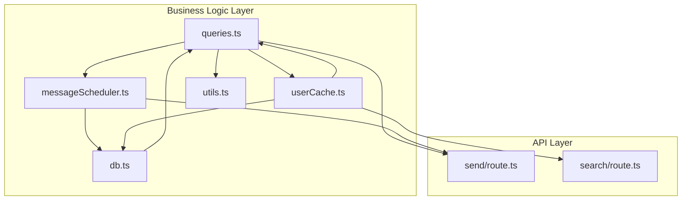
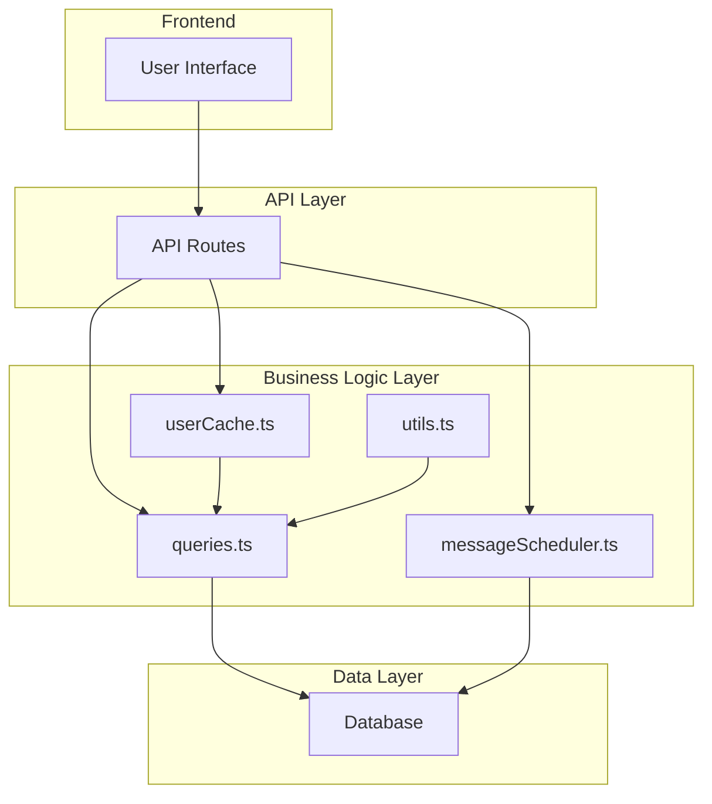
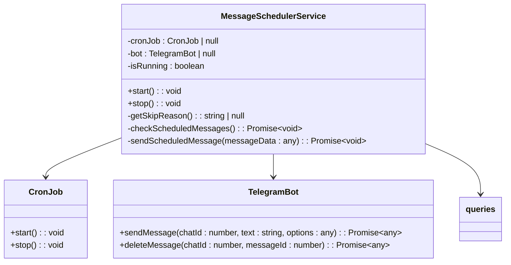
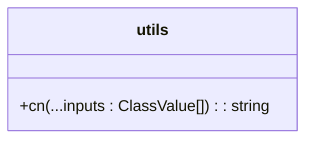
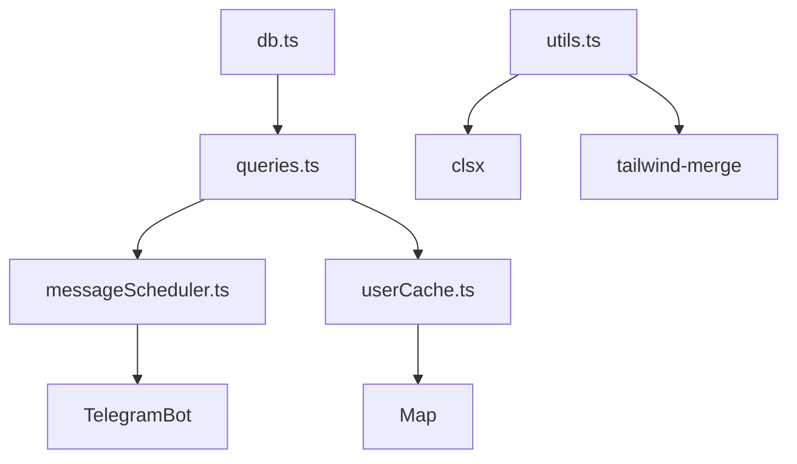

# Business Logic Layer

<cite>
**Referenced Files in This Document**   
- [queries.ts](file://lib/queries.ts)
- [messageScheduler.ts](file://lib/messageScheduler.ts)
- [userCache.ts](file://lib/userCache.ts)
- [utils.ts](file://lib/utils.ts)
- [db.ts](file://lib/db.ts)
- [route.ts](file://app/api/messages/send/route.ts)
- [route.ts](file://app/api/users/search/route.ts)
</cite>

## Table of Contents
1. [Introduction](#introduction)
2. [Project Structure](#project-structure)
3. [Core Components](#core-components)
4. [Architecture Overview](#architecture-overview)
5. [Detailed Component Analysis](#detailed-component-analysis)
6. [Dependency Analysis](#dependency-analysis)
7. [Performance Considerations](#performance-considerations)
8. [Troubleshooting Guide](#troubleshooting-guide)
9. [Conclusion](#conclusion)

## Introduction
The hsl-dashboard application implements a robust business logic layer that orchestrates database operations, background processing, and user interface interactions. This documentation details the key components of this layer, focusing on the centralized data access through queries.ts, the message scheduling system using node-cron, the UserCacheService for optimized user search, and utility functions for data transformation. These components work together to provide efficient, scalable, and maintainable functionality for managing user data and messaging operations.

## Project Structure
The business logic layer is organized within the lib directory, containing specialized modules for different concerns. The queries.ts file serves as the centralized data access layer, while messageScheduler.ts handles background processing of Telegram messages. The userCache.ts module implements a singleton pattern for optimized user search performance, and utils.ts contains utility functions for common operations. These components are consumed by API routes in the app/api directory, which expose endpoints for various operations.



**Diagram sources**
- [queries.ts](file://lib/queries.ts)
- [messageScheduler.ts](file://lib/messageScheduler.ts)
- [userCache.ts](file://lib/userCache.ts)
- [utils.ts](file://lib/utils.ts)
- [db.ts](file://lib/db.ts)
- [route.ts](file://app/api/messages/send/route.ts)
- [route.ts](file://app/api/users/search/route.ts)

**Section sources**
- [queries.ts](file://lib/queries.ts)
- [messageScheduler.ts](file://lib/messageScheduler.ts)
- [userCache.ts](file://lib/userCache.ts)
- [utils.ts](file://lib/utils.ts)
- [db.ts](file://lib/db.ts)

## Core Components
The business logic layer consists of four main components: queries.ts as the centralized data access layer, messageScheduler.ts for background processing of Telegram messages, UserCacheService for optimized user search performance, and utils.ts for common utility functions. These components work together to provide a cohesive and efficient system for managing user data and messaging operations.

**Section sources**
- [queries.ts](file://lib/queries.ts)
- [messageScheduler.ts](file://lib/messageScheduler.ts)
- [userCache.ts](file://lib/userCache.ts)
- [utils.ts](file://lib/utils.ts)

## Architecture Overview
The architecture of the business logic layer follows a layered pattern with clear separation of concerns. The queries.ts module serves as the data access layer, providing typed interfaces for database operations. The messageScheduler.ts module handles background processing of Telegram messages using node-cron integration. The UserCacheService implements a singleton pattern for optimized user search performance with 5-minute TTL caching. Utility functions in utils.ts handle common operations like date formatting and data transformation.



**Diagram sources**
- [queries.ts](file://lib/queries.ts)
- [messageScheduler.ts](file://lib/messageScheduler.ts)
- [userCache.ts](file://lib/userCache.ts)
- [utils.ts](file://lib/utils.ts)
- [db.ts](file://lib/db.ts)

## Detailed Component Analysis

### queries.ts Analysis
The queries.ts module serves as the centralized data access layer for the application, providing typed interfaces for database operations. It exports a comprehensive set of functions for retrieving various types of statistics and user information, as well as functions for managing message history and recipients.

```mermaid
classDiagram
class queries {
+getDashboardStats() Promise~DashboardStats~
+getCourseStats() Promise~CourseStats[]~
+getCourseStreamStats() Promise~CourseStreamStats[]~
+getTopEvents(limit : number) Promise~EventStats[]~
+getDailyStats(days : number) Promise~DailyStats[]~
+getRecentBookings(limit : number) Promise~any~
+getRecentEvents(limit : number) Promise~RecentEvent[]~
+getReferralStats() Promise~any~
+getFreeLessonRegistrations(limit : number) Promise~FreeLessonRegistration[]~
+getLessonConversion() Promise~LessonConversionStats[]~
+getUserGrowthData(days : number) Promise~UserGrowthData[]~
+getAllUsers() Promise~TelegramUser[]~
+getUsersByStream(courseStream : string) Promise~TelegramUser[]~
+getUsersExceptCourseAttendees() Promise~TelegramUser[]~
+searchUsers(query : string) Promise~TelegramUser[]~
+createMessageHistory(messageText : string, totalRecipients : number, recipientType : 'individual' | 'group', recipientGroup : string | null, scheduledAt : string | null) Promise~number~
+addMessageRecipients(messageId : number, recipients : TelegramUser[]) Promise~void~
+updateRecipientStatus(messageId : number, userId : number, status : string, telegramMessageId? : number) Promise~void~
+updateMessageDeliveryStats(messageId : number) Promise~void~
+getMessageHistory(limit : number, offset : number, recipientType? : 'individual' | 'group', recipientGroup? : string) Promise~MessageHistory[]~
+getMessageRecipients(messageId : number) Promise~MessageRecipient[]~
+validateUserIds(userIds : (number | string)[]) Promise~{valid : TelegramUser[], invalid : number[]}~
+deleteTelegramMessage(messageId : number, userId : number) Promise~{success : boolean, error? : string}~
+createAuditLogEntry(actionType : string, userCount : number, messagePreview : string, success : boolean, details : object) Promise~number~
+getUsers(limit : number, offset : number, searchQuery? : string, streamFilter? : string, statusFilter? : number) Promise~{users : UserDetailInfo[], total : number}~
+getUserById(userId : number) Promise~UserDetailInfo | null~
+getUserBookings(userId : number) Promise~UserBookingInfo[]~
+getUserEvents(userId : number, limit : number) Promise~UserEventInfo[]~
+getUserFreeLessons(userId : number) Promise~UserFreeLessonInfo[]~
+updateUserBooking(bookingId : number, updates : {course_stream? : string, confirmed? : number, referral_code? : string, discount_percent? : number}) Promise~boolean~
+updateUserStream(userId : number, newStream : string) Promise~{success : boolean, bookingId? : number, error? : string}~
}
class DashboardStats {
+totalUsers : number
+activeBookings : number
+confirmedPayments : number
+freeLessonRegistrations : number
}
class CourseStats {
+courseId : number
+courseName : string
+total : number
+confirmed : number
+pending : number
+cancelled : number
}
class CourseStreamStats {
+courseId : number
+courseName : string
+courseStream : string
+total : number
+confirmed : number
+pending : number
+cancelled : number
}
class EventStats {
+eventType : string
+count : number
}
class FreeLessonRegistration {
+id : number
+user_id : number
+username : string
+first_name : string
+email : string
+registered_at : string
+notification_sent : boolean
+lesson_type : string
+lesson_date : string
}
class DailyStats {
+date : string
+newUsers : number
+bookings : number
+events : number
}
class UserGrowthData {
+date : string
+totalUsers : number
+newUsers : number
}
class LessonConversionStats {
+lesson_type : string
+registrations : number
+attendances : number
+conversion_rate : number
}
class RecentEvent {
+id : number
+user_id : number
+username : string | null
+first_name : string | null
+event_type : string
+created_at : string
+details : any
}
class TelegramUser {
+user_id : number
+username : string | null
+first_name : string | null
+course_stream? : string | null
}
class MessageHistory {
+id : number
+message_text : string
+sent_at : string
+total_recipients : number
+successful_deliveries : number
+recipient_type : 'individual' | 'group'
+recipient_group : string | null
}
class MessageRecipient {
+id : number
+message_id : number
+user_id : number
+username : string | null
+delivery_status : string
}
class AuditLogEntry {
+id : number
+action_type : string
+user_count : number
+message_preview : string
+test_mode : boolean
+success : boolean
+created_at : string
+details : string
}
class UserDetailInfo {
+user_id : number
+username : string | null
+first_name : string | null
+last_activity? : string
+total_bookings : number
+total_events : number
+total_free_lessons : number
+latest_stream : string | null
+latest_payment_status : number | null
}
class UserBookingInfo {
+id : number
+user_id : number
+course_id : number
+course_stream : string | null
+confirmed : number
+created_at : string
+referral_code : string | null
+discount_percent : number | null
}
class UserEventInfo {
+id : number
+event_type : string
+created_at : string
+details : any
}
class UserFreeLessonInfo {
+id : number
+user_id : number
+email : string | null
+registered_at : string
+notification_sent : boolean
+lesson_type : string | null
+lesson_date : string | null
}
queries --> DashboardStats
queries --> CourseStats
queries --> CourseStreamStats
queries --> EventStats
queries --> FreeLessonRegistration
queries --> DailyStats
queries --> UserGrowthData
queries --> LessonConversionStats
queries --> RecentEvent
queries --> TelegramUser
queries --> MessageHistory
queries --> MessageRecipient
queries --> AuditLogEntry
queries --> UserDetailInfo
queries --> UserBookingInfo
queries --> UserEventInfo
queries --> UserFreeLessonInfo
```

**Diagram sources**
- [queries.ts](file://lib/queries.ts)

**Section sources**
- [queries.ts](file://lib/queries.ts)

### messageScheduler.ts Analysis
The messageScheduler.ts module implements a background processing system for Telegram messages using node-cron integration. It follows the singleton pattern to ensure only one instance of the scheduler runs at a time, preventing duplicate message sending.



**Diagram sources**
- [messageScheduler.ts](file://lib/messageScheduler.ts)
- [queries.ts](file://lib/queries.ts)

**Section sources**
- [messageScheduler.ts](file://lib/messageScheduler.ts)

### UserCacheService Analysis
The UserCacheService implements a singleton pattern for optimized user search performance with 5-minute TTL caching. It maintains multiple caches for different use cases, including a general user index, stream-specific caches, and a cache for users who haven't paid for courses.

```mermaid
classDiagram
class UserCacheService {
-instance : UserCacheService
-index : Map~string, TelegramUser[]~
-streamCache : Map~string, TelegramUser[]~
-allUsers : TelegramUser[]
-nonCourseUsers : TelegramUser[]
-initialized : boolean
-lastUpdate : number
-CACHE_TTL : number
-MAX_RESULTS : number
-VALID_STREAMS : string[]
+getInstance() : UserCacheService
+ensureInitialized() : Promise~void~
-loadUsers() : Promise~void~
-loadUsersByStreams() : Promise~void~
-loadNonCourseUsers() : Promise~void~
-buildIndex() : void
-addToIndex(letter : string, user : TelegramUser) : void
+search(query : string) : TelegramUser[]
+getUsersByStream(stream : string) : TelegramUser[]
+getUsersExceptCourseAttendees() : TelegramUser[]
+getStreamStats() : { [stream : string] : number }
+getStats() : { totalUsers : number, indexSize : number, streamCacheSize : number, streamStats : { [stream : string] : number }, nonCourseUsers : number, initialized : boolean, lastUpdate : Date | null }
+forceRefresh() : Promise~void~
}
class TelegramUser {
+user_id : number
+username : string | null
+first_name : string | null
+course_stream? : string | null
}
UserCacheService --> TelegramUser
```

**Diagram sources**
- [userCache.ts](file://lib/userCache.ts)

**Section sources**
- [userCache.ts](file://lib/userCache.ts)

### utils.ts Analysis
The utils.ts module contains utility functions for common operations. Currently, it exports a single function `cn` that combines class names using clsx and tailwind-merge, which is commonly used for conditional class name composition in React components.



**Diagram sources**
- [utils.ts](file://lib/utils.ts)

**Section sources**
- [utils.ts](file://lib/utils.ts)

## Dependency Analysis
The business logic layer components have well-defined dependencies that follow a clear hierarchy. The queries.ts module depends on db.ts for database connectivity, while other components depend on queries.ts for data access. The messageScheduler.ts module depends on both queries.ts and the Telegram bot library, while the UserCacheService depends on queries.ts for initial data loading.



**Diagram sources**
- [db.ts](file://lib/db.ts)
- [queries.ts](file://lib/queries.ts)
- [messageScheduler.ts](file://lib/messageScheduler.ts)
- [userCache.ts](file://lib/userCache.ts)
- [utils.ts](file://lib/utils.ts)

**Section sources**
- [db.ts](file://lib/db.ts)
- [queries.ts](file://lib/queries.ts)
- [messageScheduler.ts](file://lib/messageScheduler.ts)
- [userCache.ts](file://lib/userCache.ts)
- [utils.ts](file://lib/utils.ts)

## Performance Considerations
The business logic layer incorporates several performance optimizations. The UserCacheService uses a 5-minute TTL cache to minimize database queries for user search operations. The message sending functionality processes recipients in batches of 10 with a 1-second delay between batches to respect Telegram's rate limits. Database queries are optimized with appropriate indexing and use of DISTINCT ON clauses to eliminate duplicates. The singleton pattern used by both the message scheduler and user cache ensures efficient resource utilization.

**Section sources**
- [userCache.ts](file://lib/userCache.ts)
- [messageScheduler.ts](file://lib/messageScheduler.ts)
- [queries.ts](file://lib/queries.ts)

## Troubleshooting Guide
Common issues in the business logic layer include database connection problems, Telegram bot token configuration errors, and cache initialization failures. Database connection issues can be diagnosed by checking the POSTGRES_HOST and POSTGRES_PASSWORD environment variables. Telegram bot issues can be identified by verifying the BOT_TOKEN environment variable and checking the bot's authorization status. Cache initialization problems may occur if the getAllUsers query fails, which can be diagnosed by examining the database connection and query performance.

**Section sources**
- [db.ts](file://lib/db.ts)
- [messageScheduler.ts](file://lib/messageScheduler.ts)
- [userCache.ts](file://lib/userCache.ts)

## Conclusion
The business logic layer of hsl-dashboard demonstrates a well-architected approach to handling complex operations with clear separation of concerns. The centralized data access layer in queries.ts provides a consistent interface for database operations, while the messageScheduler.ts module enables reliable background processing of Telegram messages. The UserCacheService optimizes user search performance through strategic caching, and the utility functions in utils.ts support common operations. Together, these components create a robust foundation for the application's functionality, with attention to performance, scalability, and maintainability.