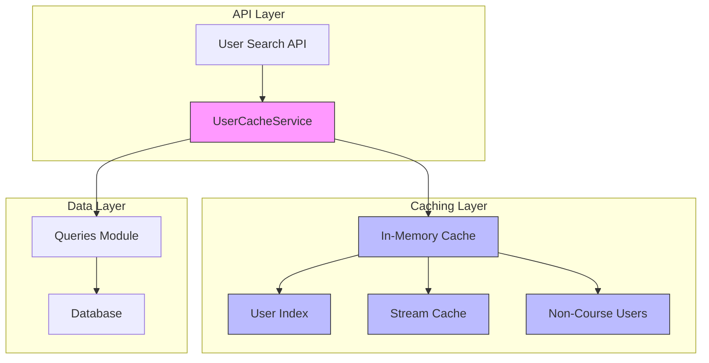
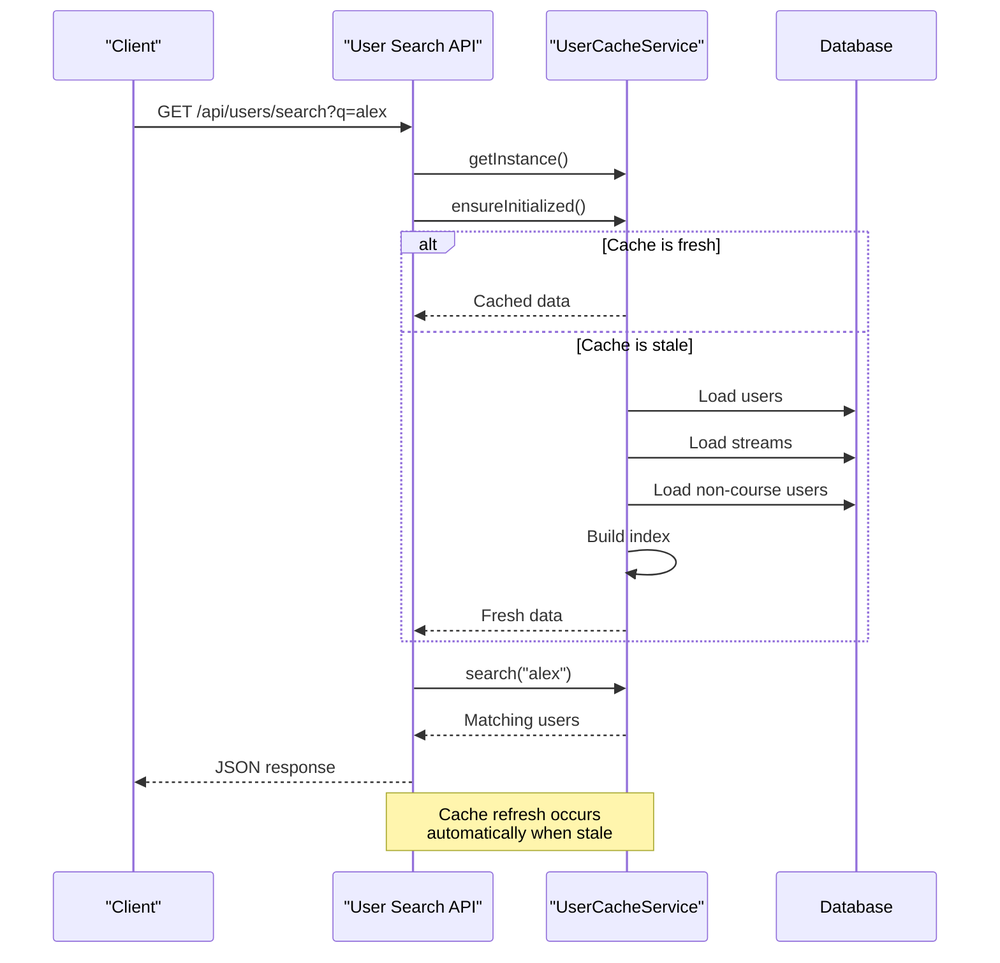

# Caching Service

<cite>
**Referenced Files in This Document**   
- [userCache.ts](file://lib/userCache.ts)
- [route.ts](file://app/api/users/search/route.ts)
- [queries.ts](file://lib/queries.ts)
</cite>

## Table of Contents
1. [Introduction](#introduction)
2. [Architecture Overview](#architecture-overview)
3. [Core Components](#core-components)
4. [Cache Implementation Details](#cache-implementation-details)
5. [Integration with API Routes](#integration-with-api-routes)
6. [Performance Monitoring and Statistics](#performance-monitoring-and-statistics)
7. [Scalability and Memory Considerations](#scalability-and-memory-considerations)
8. [Trade-offs and Design Decisions](#trade-offs-and-design-decisions)
9. [Conclusion](#conclusion)

## Introduction

The Caching Service in hsl-dashboard implements an in-memory caching solution designed to optimize user search performance and reduce database load. The service centers around the UserCacheService class, which employs the singleton pattern to ensure a single shared instance across the application. With a 5-minute time-to-live (TTL) for cache validity, the service provides a balance between data freshness and performance optimization. This documentation details the implementation, integration, and operational characteristics of the caching service, focusing on how it enhances the user search functionality while managing memory usage and consistency trade-offs.

## Architecture Overview

The caching service follows a layered architecture with clear separation of concerns between data retrieval, caching logic, and API integration. The UserCacheService acts as the central component, managing in-memory data structures and providing optimized access patterns for user data. The service integrates with the application's API routes through a well-defined interface, allowing controllers to access cached data without knowledge of the underlying implementation details.



**Diagram sources**
- [userCache.ts](file://lib/userCache.ts#L2-L212)
- [route.ts](file://app/api/users/search/route.ts#L1-L36)

**Section sources**
- [userCache.ts](file://lib/userCache.ts#L2-L212)
- [route.ts](file://app/api/users/search/route.ts#L1-L36)

## Core Components

The caching service comprises several key components that work together to provide efficient user data access. The UserCacheService class serves as the primary interface, implementing the singleton pattern to ensure a single instance throughout the application lifecycle. The service maintains multiple in-memory data structures, including a search index, stream-specific caches, and a collection of users who have not paid for courses. These structures are populated from the database through the queries module, which provides the necessary data access functions.

The service employs lazy initialization, meaning the cache is only populated when first accessed, reducing startup overhead. The 5-minute TTL ensures that data remains reasonably fresh while preventing excessive database queries. The cache automatically invalidates and refreshes when the TTL expires, providing a simple yet effective mechanism for maintaining data consistency.

**Section sources**
- [userCache.ts](file://lib/userCache.ts#L2-L212)
- [queries.ts](file://lib/queries.ts#L544-L641)

## Cache Implementation Details

### Singleton Pattern Implementation

The UserCacheService implements the singleton pattern through a static instance property and a private constructor. This ensures that only one instance of the service exists throughout the application, allowing all components to share the same cached data. The getInstance method provides global access to the singleton instance, creating it if it doesn't already exist.

```mermaid
classDiagram
class UserCacheService {
-static instance : UserCacheService
-index : Map<string, TelegramUser[]>
-streamCache : Map<string, TelegramUser[]>
-allUsers : TelegramUser[]
-nonCourseUsers : TelegramUser[]
-initialized : boolean
-lastUpdate : number
-CACHE_TTL : number
-MAX_RESULTS : number
+getInstance() : UserCacheService
+ensureInitialized() : Promise<void>
+search(query : string) : TelegramUser[]
+getUsersByStream(stream : string) : TelegramUser[]
+getUsersExceptCourseAttendees() : TelegramUser[]
+getStats() : object
+forceRefresh() : Promise<void>
}
note right of UserCacheService
Implements singleton pattern with
lazy initialization and 5-minute TTL
end note
```

**Diagram sources**
- [userCache.ts](file://lib/userCache.ts#L2-L212)

**Section sources**
- [userCache.ts](file://lib/userCache.ts#L2-L212)

### In-Memory Caching Strategy

The caching strategy employs multiple specialized data structures to optimize different access patterns. The primary search functionality uses a letter-based index, where users are grouped by the first letter of their username or first name. This allows for efficient prefix matching during search operations. The index is implemented as a Map with string keys (letters) and arrays of TelegramUser objects as values.

For stream-specific queries, the service maintains a separate streamCache Map that stores users grouped by their course stream. This enables rapid retrieval of users belonging to specific educational streams without requiring additional database queries. Additionally, the service caches users who have not paid for courses, supporting targeted messaging and analytics use cases.

The caching strategy follows a write-through approach during initialization, where data is loaded from the database into memory structures. Subsequent reads are served entirely from memory, providing sub-millisecond response times for search operations.

### Cache Key Generation and Indexing

Cache key generation in the UserCacheService follows a simple but effective pattern based on the first letter of user identifiers. When building the search index, the service extracts the first letter of each user's username and first name (when available), converts it to lowercase, and uses it as a key in the index Map. This approach creates "letter buckets" that significantly reduce the search space for prefix queries.

The addToIndex method ensures that users are not duplicated within a letter bucket, even if they qualify for indexing under both username and first name criteria. This deduplication is performed by checking the user_id against existing entries in the bucket. The indexing strategy prioritizes search performance over memory efficiency, as the letter-based partitioning allows the service to quickly narrow down potential matches before applying more expensive string matching operations.

### Automatic Invalidation Mechanisms

The service implements automatic cache invalidation through a time-based mechanism. The CACHE_TTL constant is set to 5 minutes (300,000 milliseconds), after which the cache is considered stale. The ensureInitialized method checks both the initialized flag and the time elapsed since the last update, triggering a refresh when either the cache has never been initialized or the TTL has expired.

During the refresh process, the service sequentially loads data from the database through the queries module, updating all internal data structures atomically from the perspective of external callers. The refresh operation is designed to be idempotent, allowing multiple concurrent calls to ensureInitialized to safely participate in the initialization process without causing race conditions. The lastUpdate timestamp is only updated after all data has been successfully loaded and indexed, ensuring that subsequent requests will either use the complete old cache or wait for the complete new cache.

**Section sources**
- [userCache.ts](file://lib/userCache.ts#L23-L111)

## Integration with API Routes

The caching service integrates seamlessly with the user search API route, providing a high-performance interface for user discovery. The integration follows a clean separation of concerns, with the API route handling HTTP request/response concerns while delegating data access to the caching service.



**Diagram sources**
- [route.ts](file://app/api/users/search/route.ts#L1-L36)
- [userCache.ts](file://lib/userCache.ts#L23-L111)

**Section sources**
- [route.ts](file://app/api/users/search/route.ts#L1-L36)
- [userCache.ts](file://lib/userCache.ts#L23-L111)

The API route first checks for a stats parameter, which allows administrators to retrieve cache performance metrics. For regular search requests, the route obtains an instance of the UserCacheService and ensures it is initialized before performing the search. This lazy initialization pattern means that the cache is only loaded when actually needed, reducing resource usage during application startup.

The search method returns a maximum of 50 results, as defined by the MAX_RESULTS constant, preventing excessive data transfer and ensuring consistent response times. Error handling is implemented at the API level, with any exceptions during the search process resulting in a 500 error response to the client.

## Performance Monitoring and Statistics

The caching service includes comprehensive monitoring capabilities through its getStats method, which provides detailed insights into cache performance and utilization. The method returns a structured object containing metrics such as total user count, index size, stream cache statistics, and cache freshness information.

The service also implements detailed logging for key operations, including cache loading, search execution, and stream lookups. Each log entry includes contextual information such as query parameters, result counts, and cache age, enabling effective performance analysis and troubleshooting. The logging strategy strikes a balance between visibility and noise, providing sufficient information for monitoring without overwhelming log files.

For debugging purposes, the API route supports a stats query parameter that returns the full cache statistics when requested. This feature allows developers and administrators to inspect the current state of the cache, verify its contents, and diagnose potential issues. The forceRefresh method provides a way to manually trigger cache invalidation and reloading, useful for testing or recovering from potential data inconsistencies.

**Section sources**
- [userCache.ts](file://lib/userCache.ts#L175-L212)
- [route.ts](file://app/api/users/search/route.ts#L6-L15)

## Scalability and Memory Considerations

The current implementation demonstrates good scalability characteristics for the expected user base, but several considerations should be addressed as the application grows. The in-memory caching approach provides excellent performance but consumes RAM proportional to the size of the user dataset. With no explicit memory limits or eviction policies beyond the time-based invalidation, the service could potentially consume significant memory as the user base expands.

The implementation avoids race conditions through careful design of the initialization process. The ensureInitialized method uses simple boolean and timestamp checks that are atomic operations, preventing multiple concurrent refresh operations from corrupting the cache state. However, during the refresh window, some requests may experience higher latency as they wait for the cache to reload.

For improved scalability, potential enhancements could include:
- Implementing a soft TTL with background refresh to prevent request blocking
- Adding memory usage monitoring and adaptive eviction policies
- Supporting distributed caching for multi-instance deployments
- Implementing partial updates instead of full reloads when possible

The service currently loads all users into memory, which may become problematic with very large datasets. A more scalable approach might involve sharding the cache or implementing a tiered caching strategy with hot/cold data separation.

**Section sources**
- [userCache.ts](file://lib/userCache.ts#L2-L212)

## Trade-offs and Design Decisions

The caching service represents a series of thoughtful trade-offs between performance, consistency, and complexity. The 5-minute TTL strikes a balance between data freshness and database load, acknowledging that user data changes relatively infrequently while search operations are frequent. This eventual consistency model is appropriate for the use case, where slightly stale data is preferable to the performance cost of real-time database queries.

The decision to use in-memory caching rather than a distributed cache like Redis simplifies deployment and reduces operational complexity, at the cost of limiting scalability to a single application instance. The singleton pattern ensures data consistency across the application but creates a potential bottleneck under high concurrency.

The letter-based indexing strategy optimizes for the most common search patterns (prefix matching by name) while accepting that exact match or full-text search capabilities are limited. This focused optimization aligns with the primary use case of user discovery in the dashboard interface.

The service prioritizes simplicity and maintainability over advanced features, avoiding complex cache invalidation logic or distributed coordination. This design philosophy makes the service easier to understand, test, and debug, which is valuable for a critical infrastructure component.

**Section sources**
- [userCache.ts](file://lib/userCache.ts#L2-L212)

## Conclusion

The Caching Service in hsl-dashboard effectively addresses the performance requirements of user search operations through a well-designed in-memory caching solution. By implementing the singleton pattern with a 5-minute TTL, the service reduces database load while maintaining acceptable data freshness. The integration with API routes is clean and efficient, providing fast response times for user searches and related queries.

The service demonstrates strong architectural principles, including separation of concerns, lazy initialization, and comprehensive monitoring. While the current implementation is well-suited for the existing scale, future enhancements could address scalability limitations and expand the caching capabilities to support additional use cases. The thoughtful trade-offs between performance, consistency, and complexity result in a robust and maintainable solution that effectively serves the application's needs.