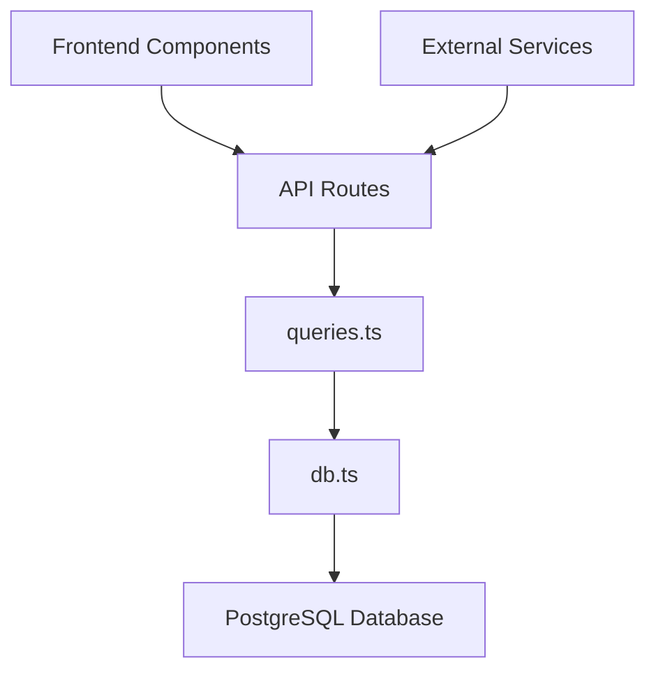
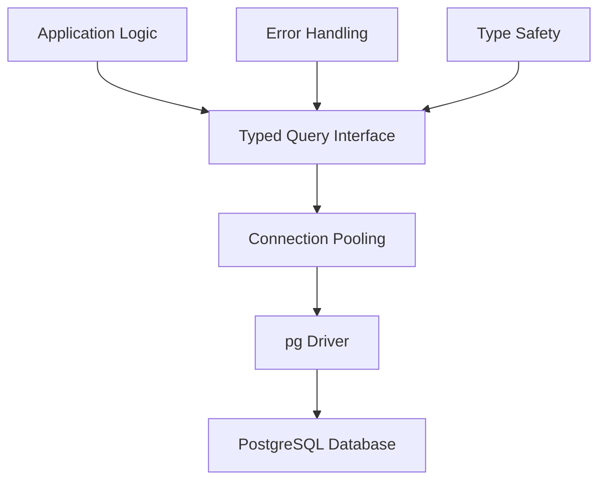
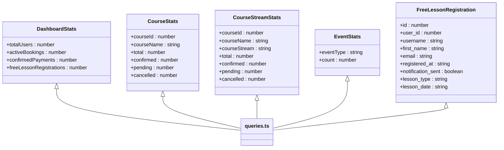
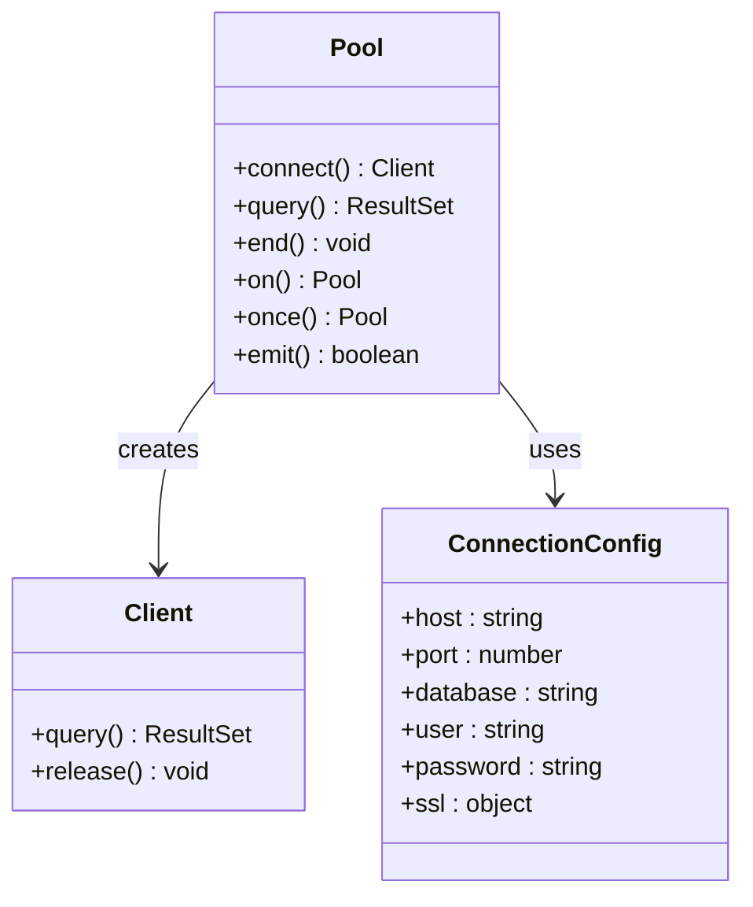
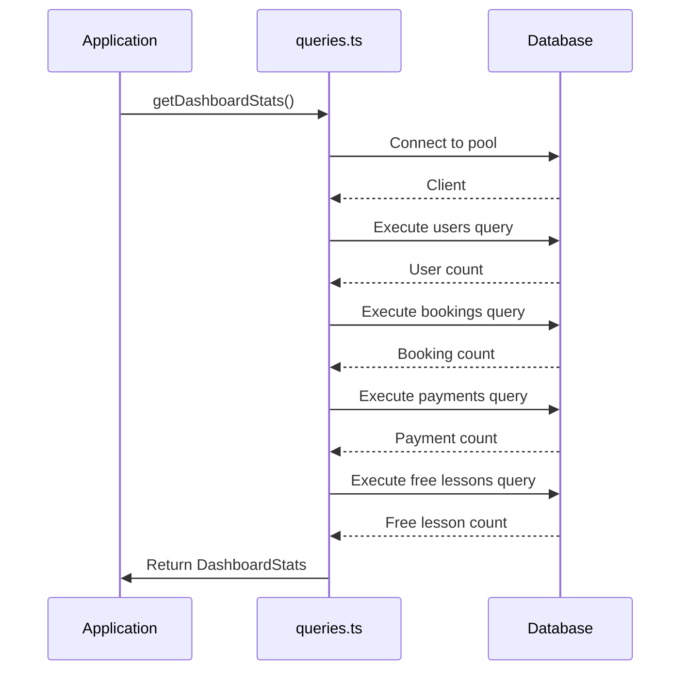
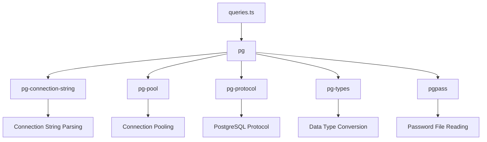

# Data Access Layer

<cite>
**Referenced Files in This Document**   
- [queries.ts](file://lib/queries.ts)
- [db.ts](file://lib/db.ts)
- [route.ts](file://app/api/db-schema/route.ts)
- [package.json](file://package.json)
</cite>

## Table of Contents
1. [Introduction](#introduction)
2. [Project Structure](#project-structure)
3. [Core Components](#core-components)
4. [Architecture Overview](#architecture-overview)
5. [Detailed Component Analysis](#detailed-component-analysis)
6. [Dependency Analysis](#dependency-analysis)
7. [Performance Considerations](#performance-considerations)
8. [Troubleshooting Guide](#troubleshooting-guide)
9. [Conclusion](#conclusion)

## Introduction
The Data Access Layer (DAL) in hsl-dashboard provides a centralized, typed interface for all database operations through the queries.ts module. This documentation details the implementation of this layer, which serves as the primary interface between the application and PostgreSQL database. The DAL ensures type safety through TypeScript interfaces, implements connection pooling for performance, and provides a comprehensive set of functions for retrieving and manipulating data related to users, bookings, events, and messaging. The layer is designed to be extensible, allowing for the addition of new queries while maintaining type consistency across the application.

## Project Structure
The Data Access Layer is organized within the lib directory of the hsl-dashboard application, with primary components in db.ts and queries.ts. The db.ts file handles database connection management and pooling, while queries.ts contains all database query functions and their corresponding TypeScript interfaces. These components are consumed by API routes in the app/api directory, which expose the data to the frontend application. The structure follows a clean separation of concerns, with the data access logic isolated from the presentation and business logic layers.

**Diagram sources**
- [queries.ts](file://lib/queries.ts)
- [db.ts](file://lib/db.ts)

**Section sources**
- [queries.ts](file://lib/queries.ts)
- [db.ts](file://lib/db.ts)

## Core Components
The Data Access Layer consists of two core components: the connection management system in db.ts and the query interface in queries.ts. The db.ts module exports a connection pool that handles database connectivity, while queries.ts provides a comprehensive set of functions for data retrieval and manipulation. These components work together to provide a type-safe, efficient interface for database operations. The layer includes functions for retrieving dashboard statistics, user information, booking details, event data, and messaging history, all with proper error handling and connection management.

**Section sources**
- [queries.ts](file://lib/queries.ts)
- [db.ts](file://lib/db.ts)

## Architecture Overview
The Data Access Layer architecture is built around a centralized query interface that abstracts all database interactions. The architecture follows a layered pattern with the PostgreSQL database at the base, the pg driver handling the database connection, connection pooling for performance optimization, and the queries.ts module providing a typed interface for all data operations. This design ensures that all database interactions are consistent, type-safe, and maintainable. The architecture supports both simple queries and complex data aggregations, with proper error handling and connection management throughout.

**Diagram sources**
- [queries.ts](file://lib/queries.ts)
- [db.ts](file://lib/db.ts)

## Detailed Component Analysis

### Query Interface Analysis
The queries.ts file serves as the centralized, typed interface for all database operations in the hsl-dashboard application. It exports a comprehensive set of functions for retrieving and manipulating data, each with clearly defined parameters and return types. The file begins with a series of TypeScript interfaces that define the shape of the data returned by the queries, ensuring type safety between the database and application layers. These interfaces include DashboardStats, CourseStats, CourseStreamStats, EventStats, FreeLessonRegistration, DailyStats, UserGrowthData, and LessonConversionStats, among others.

**Diagram sources**
- [queries.ts](file://lib/queries.ts#L1-L100)

**Section sources**
- [queries.ts](file://lib/queries.ts#L1-L100)

### Connection Management Analysis
The db.ts file implements connection management and pooling for the PostgreSQL database using the pg driver. It exports a connection pool that handles database connectivity, with configuration options for host, port, database name, user, and password obtained from environment variables. The file includes error handling for missing environment variables and provides a stub connection for build-time tasks when the database is not configured. The connection pool ensures efficient database access by reusing connections, reducing the overhead of establishing new connections for each query.

**Diagram sources**
- [db.ts](file://lib/db.ts#L1-L50)

**Section sources**
- [db.ts](file://lib/db.ts#L1-L50)

### Key Function Analysis
The queries.ts file contains several key functions for retrieving data from the database. The getDashboardStats function retrieves overall dashboard statistics, including total users, active bookings, confirmed payments, and free lesson registrations. The getCourseStats function retrieves statistics by course, while getCourseStreamStats provides detailed statistics by course and stream. The getTopEvents function returns the most frequent event types, and getDailyStats provides daily statistics for the last N days. These functions use parameterized queries to prevent SQL injection and include proper error handling and connection management.

**Diagram sources**
- [queries.ts](file://lib/queries.ts#L101-L200)

**Section sources**
- [queries.ts](file://lib/queries.ts#L101-L200)

## Dependency Analysis
The Data Access Layer has dependencies on several external packages, as defined in the package.json file. The primary dependency is the pg package, which provides the PostgreSQL client for Node.js. This package handles the low-level database communication, connection pooling, and query execution. The pg package depends on several other packages, including pg-connection-string for parsing connection strings, pg-pool for connection pooling, pg-protocol for the PostgreSQL protocol implementation, pg-types for data type conversion, and pgpass for reading PostgreSQL password files. These dependencies work together to provide a robust and efficient interface to the PostgreSQL database.

**Diagram sources**
- [package.json](file://package.json)
- [queries.ts](file://lib/queries.ts)

**Section sources**
- [package.json](file://package.json)
- [queries.ts](file://lib/queries.ts)

## Performance Considerations
The Data Access Layer includes several performance optimizations to ensure efficient database access. Connection pooling is implemented through the pg-pool package, which reuses database connections to reduce the overhead of establishing new connections for each query. The queries are designed to be efficient, using appropriate indexes on the database tables to speed up data retrieval. The getDailyStats and getUserGrowthData functions use Common Table Expressions (CTEs) to generate date series and calculate cumulative data, which can be more efficient than multiple separate queries. The layer also includes pagination for functions that return large result sets, such as getRecentBookings and getRecentEvents, to prevent memory issues and improve response times.

**Section sources**
- [queries.ts](file://lib/queries.ts)
- [db.ts](file://lib/db.ts)

## Troubleshooting Guide
When troubleshooting issues with the Data Access Layer, start by checking the database connection configuration in environment variables. Ensure that POSTGRES_HOST and POSTGRES_PASSWORD are set correctly, as the application will use a stub connection if these variables are missing. Check the database logs for any connection errors or query failures. For performance issues, examine the query execution plans to identify slow queries and ensure that appropriate indexes are in place. Use the db-schema API route to inspect the database schema and verify that the expected tables and columns exist. For type-related issues, ensure that the TypeScript interfaces in queries.ts match the actual database schema.

**Section sources**
- [db.ts](file://lib/db.ts)
- [queries.ts](file://lib/queries.ts)
- [route.ts](file://app/api/db-schema/route.ts)

## Conclusion
The Data Access Layer in hsl-dashboard provides a robust, type-safe interface for database operations. By centralizing all queries in the queries.ts file and using TypeScript interfaces to define data shapes, the layer ensures consistency and maintainability across the application. The connection pooling implementation in db.ts provides efficient database access, while the comprehensive set of query functions supports all the data retrieval needs of the application. The layer is designed to be extensible, allowing for the addition of new queries while maintaining type consistency. With proper error handling and performance optimizations, the Data Access Layer forms a solid foundation for the hsl-dashboard application.