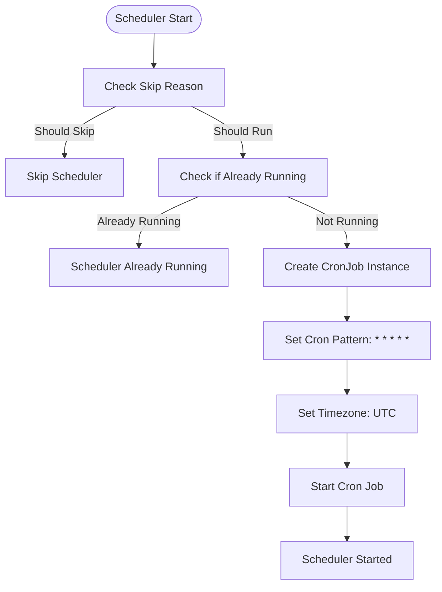
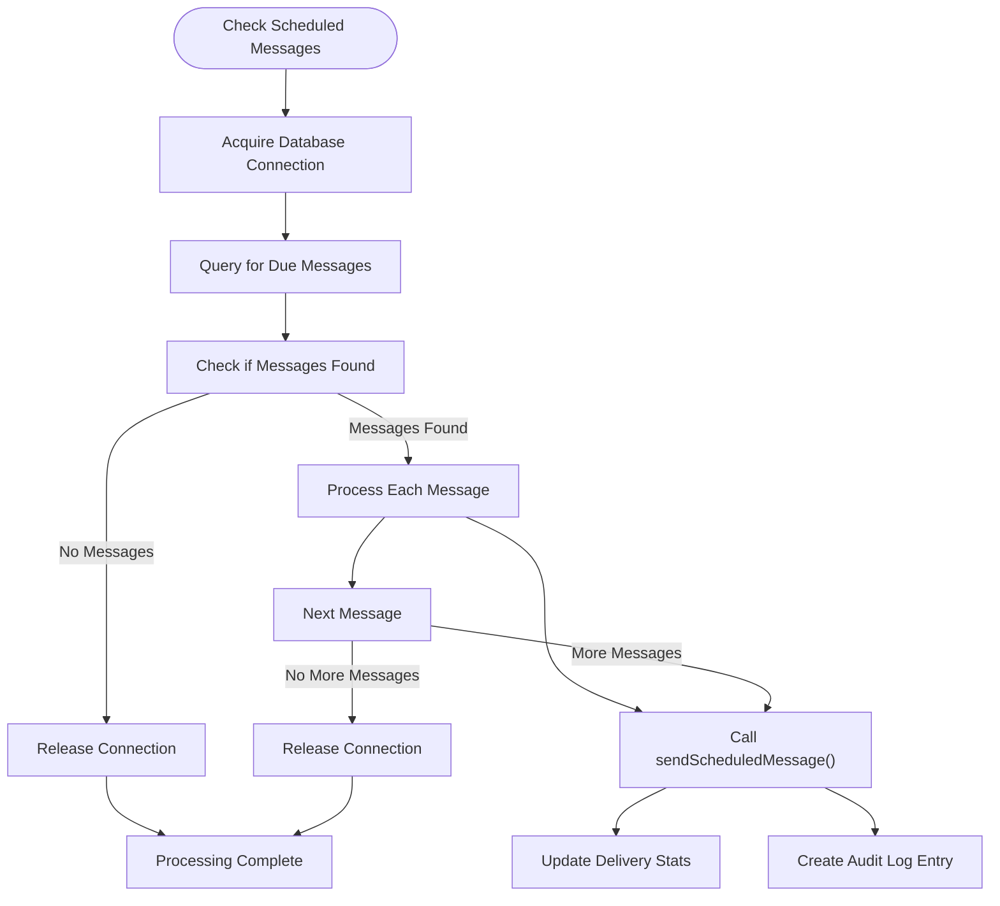
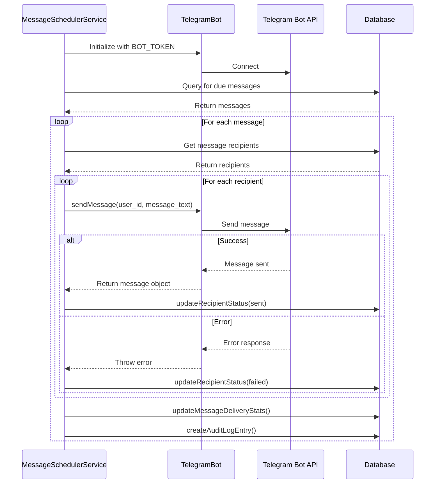
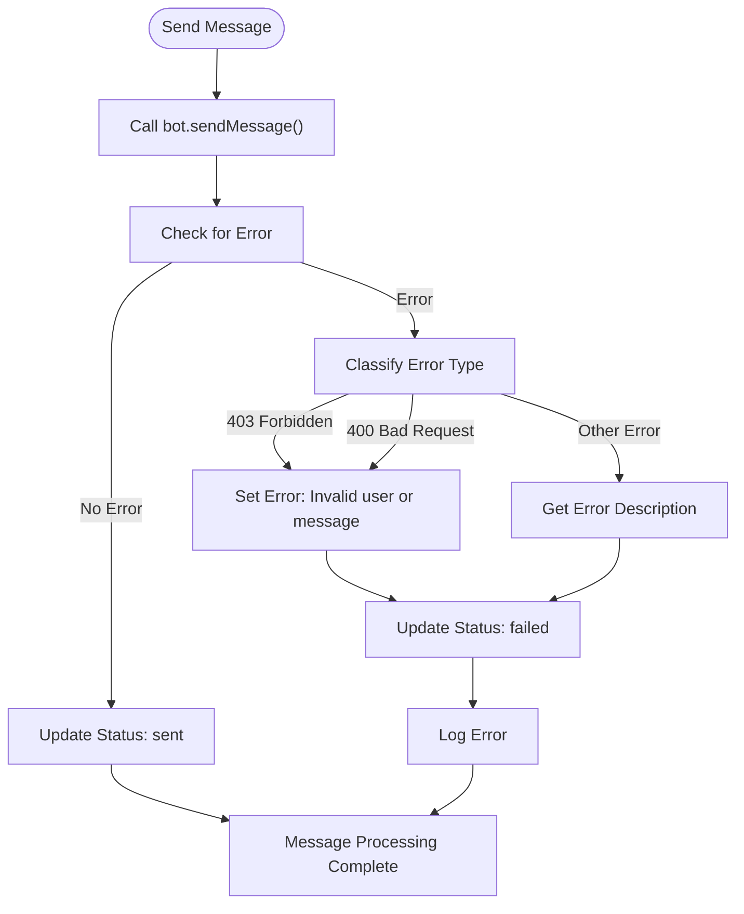
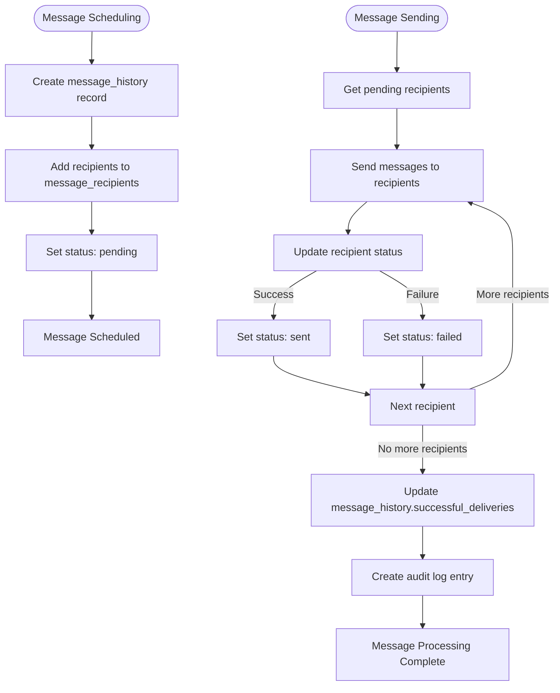

# Messaging Service

<cite>
**Referenced Files in This Document**   
- [messageScheduler.ts](file://lib/messageScheduler.ts)
- [send/route.ts](file://app/api/messages/send/route.ts)
- [queries.ts](file://lib/queries.ts)
- [init.ts](file://lib/init.ts)
- [db.ts](file://lib/db.ts)
</cite>

## Table of Contents
1. [Introduction](#introduction)
2. [Core Components](#core-components)
3. [Scheduling Patterns and Job Configuration](#scheduling-patterns-and-job-configuration)
4. [Message Queue Processing Logic](#message-queue-processing-logic)
5. [Integration with Telegram Bot API](#integration-with-telegram-bot-api)
6. [Error Handling and Retry Mechanisms](#error-handling-and-retry-mechanisms)
7. [Status Tracking and Audit Logging](#status-tracking-and-audit-logging)
8. [Common Issues and Troubleshooting](#common-issues-and-troubleshooting)
9. [Performance Optimization Tips](#performance-optimization-tips)
10. [Conclusion](#conclusion)

## Introduction
The Messaging Service in hsl-dashboard provides a robust system for sending Telegram messages to users, with support for both immediate and scheduled delivery. The service leverages node-cron for background processing of scheduled messages, ensuring reliable message delivery at specified times. This document details the implementation of the message scheduler, covering scheduling patterns, job configuration, message queue processing, integration with the Telegram Bot API, error handling, status tracking, and performance optimization strategies.

**Section sources**
- [messageScheduler.ts](file://lib/messageScheduler.ts#L1-L280)
- [send/route.ts](file://app/api/messages/send/route.ts#L1-L372)

## Core Components

The Messaging Service consists of several key components that work together to provide a comprehensive messaging solution. The core components include the MessageSchedulerService class, which handles the scheduling and sending of messages, the Telegram Bot API integration for message delivery, database queries for message and recipient management, and utility functions for message formatting and delivery timing.

The MessageSchedulerService class is responsible for checking for scheduled messages every minute and sending them to the appropriate recipients. It uses the node-cron library to schedule the periodic checking of messages. The service integrates with the Telegram Bot API to send messages and handles error cases such as message throttling, delivery failures, and rate limiting.

**Section sources**
- [messageScheduler.ts](file://lib/messageScheduler.ts#L10-L262)
- [queries.ts](file://lib/queries.ts#L710-L748)

## Scheduling Patterns and Job Configuration

The message scheduler uses a cron pattern of `* * * * *` to check for scheduled messages every minute. This pattern runs the scheduler at the beginning of each minute, ensuring that messages are sent as close to their scheduled time as possible. The scheduler is configured to run in UTC timezone for consistency across different environments.

The job configuration includes several key aspects:
- The scheduler runs every minute to check for messages that are due for sending
- It uses UTC timezone to avoid issues with daylight saving time and different timezones
- The scheduler is implemented as a singleton to prevent multiple instances from running simultaneously
- It includes checks to prevent concurrent execution of the message processing logic

The scheduler is started by calling the `start()` method on the MessageSchedulerService instance. This method first checks if the scheduler should be skipped based on environment variables, then creates a new CronJob instance with the specified pattern and callback function.

**Diagram sources**
- [messageScheduler.ts](file://lib/messageScheduler.ts#L25-L45)

**Section sources**
- [messageScheduler.ts](file://lib/messageScheduler.ts#L25-L45)
- [init.ts](file://lib/init.ts#L24-L24)

## Message Queue Processing Logic

The message queue processing logic is implemented in the `checkScheduledMessages()` method of the MessageSchedulerService class. This method is called every minute by the cron job and performs the following steps:

1. Acquires a database connection from the pool
2. Queries the database for messages that are scheduled and due for sending
3. Processes each due message by calling the `sendScheduledMessage()` method
4. Releases the database connection

The query to find due messages checks for messages where:
- `scheduled_at` is not null (indicating the message is scheduled)
- `scheduled_at` is less than or equal to the current time (indicating the message is due)
- `successful_deliveries` is 0 or null (indicating the message hasn't been sent yet)

The processing of each message is done sequentially to avoid overwhelming the Telegram Bot API with too many requests at once. The scheduler limits the number of messages processed in each cycle to 10 to prevent excessive load on the system.

**Diagram sources**
- [messageScheduler.ts](file://lib/messageScheduler.ts#L80-L149)

**Section sources**
- [messageScheduler.ts](file://lib/messageScheduler.ts#L80-L149)
- [queries.ts](file://lib/queries.ts#L914-L927)

## Integration with Telegram Bot API

The Messaging Service integrates with the Telegram Bot API to send messages to users. The integration is implemented using the node-telegram-bot-api library, which provides a convenient interface for interacting with the Telegram Bot API.

The integration process involves the following steps:
1. Initializing the TelegramBot instance with the BOT_TOKEN from environment variables
2. Sending messages using the bot.sendMessage() method
3. Handling errors that may occur during message sending
4. Updating the message delivery status in the database

The bot instance is initialized in the constructor of the MessageSchedulerService class, but only if the BOT_TOKEN environment variable is set. This allows the service to be disabled when the bot token is not configured.

When sending a message, the service uses the HTML parse mode to allow for formatted messages. It also includes error handling to deal with common issues such as users blocking the bot or invalid user IDs.

**Diagram sources**
- [messageScheduler.ts](file://lib/messageScheduler.ts#L181-L230)
- [send/route.ts](file://app/api/messages/send/route.ts#L300-L350)

**Section sources**
- [messageScheduler.ts](file://lib/messageScheduler.ts#L181-L230)
- [send/route.ts](file://app/api/messages/send/route.ts#L300-L350)

## Error Handling and Retry Mechanisms

The Messaging Service includes comprehensive error handling to deal with various issues that may occur during message sending. The error handling is implemented in the `sendScheduledMessage()` method and includes the following features:

1. **Error Detection**: The service catches errors that occur during message sending and logs them for debugging purposes.
2. **Error Classification**: Errors are classified based on their type, with specific handling for common Telegram API errors:
   - 403 Forbidden: User has blocked the bot
   - 400 Bad Request: Invalid user ID or message format
   - Other errors: Generic error message with description from the API response
3. **Recipient Status Update**: When a message fails to send, the recipient's status is updated to 'failed' in the database.
4. **Error Logging**: Failed sends are logged with the user ID and error message for troubleshooting.

The service does not implement automatic retries for failed messages. Instead, it relies on the application logic to handle retries if needed. This approach prevents infinite loops in cases where a message will never succeed (e.g., user has blocked the bot).

**Diagram sources**
- [messageScheduler.ts](file://lib/messageScheduler.ts#L191-L230)

**Section sources**
- [messageScheduler.ts](file://lib/messageScheduler.ts#L191-L230)
- [CLAUDE.md](file://CLAUDE.md#L229-L247)

## Status Tracking and Audit Logging

The Messaging Service includes robust status tracking and audit logging to monitor message delivery and provide a record of all messaging activities. The status tracking is implemented using several database fields and queries:

1. **Message History**: The `message_history` table stores information about each message, including the message text, scheduled time, total recipients, and successful deliveries count.
2. **Recipient Status**: The `message_recipients` table tracks the delivery status for each recipient (pending, sent, failed, deleted).
3. **Delivery Statistics**: The `successful_deliveries` field in the `message_history` table is updated after each message send to reflect the number of successful deliveries.
4. **Audit Logging**: The service creates audit log entries for important events such as message scheduling, sending, and failures.

The status tracking process works as follows:
1. When a message is scheduled, a record is created in the `message_history` table with `successful_deliveries` set to 0.
2. As messages are sent, the `updateRecipientStatus()` function updates the status for each recipient.
3. After all recipients have been processed, the `updateMessageDeliveryStats()` function updates the `successful_deliveries` count in the `message_history` table.
4. An audit log entry is created to record the outcome of the message sending operation.

**Diagram sources**
- [messageScheduler.ts](file://lib/messageScheduler.ts#L232-L279)
- [queries.ts](file://lib/queries.ts#L710-L748)

**Section sources**
- [messageScheduler.ts](file://lib/messageScheduler.ts#L232-L279)
- [queries.ts](file://lib/queries.ts#L710-L748)

## Common Issues and Troubleshooting

The Messaging Service may encounter several common issues that require troubleshooting. This section addresses the most frequent problems and provides guidance on how to resolve them.

### Message Throttling
Telegram API has rate limits that can cause message throttling. The service implements a batching mechanism with a 1-second delay between batches to avoid hitting rate limits. If throttling occurs, the following steps can be taken:
1. Increase the delay between batches
2. Reduce the batch size
3. Monitor the error logs for rate limit errors

### Delivery Failures
Message delivery can fail for several reasons:
- **User blocked bot (403 error)**: The user has blocked the Telegram bot. No further messages can be sent to this user.
- **Invalid user or message (400 error)**: The user ID is invalid or the message format is incorrect.
- **Network errors**: Temporary network issues that may resolve on retry.

To troubleshoot delivery failures:
1. Check the error logs for specific error messages
2. Verify the user IDs are valid and exist in the database
3. Ensure the BOT_TOKEN is correctly configured

### Rate Limiting
The service is designed to respect Telegram's rate limits by sending messages in batches with delays. If rate limiting issues occur:
1. Increase the delay between batches in the code
2. Monitor the number of messages sent per minute
3. Consider spreading out scheduled messages to avoid peaks in message volume

### Scheduler Not Running
If the message scheduler is not running, check the following:
1. Ensure the BOT_TOKEN environment variable is set
2. Verify the database configuration is correct
3. Check if the SKIP_MESSAGE_SCHEDULER environment variable is set
4. Review the application logs for error messages

## Performance Optimization Tips

To optimize the performance of the Messaging Service, especially when handling high-volume messaging campaigns, consider the following tips:

### Database Optimization
1. **Indexing**: Ensure proper indexes are in place on frequently queried columns such as `scheduled_at` in the `message_history` table and `delivery_status` in the `message_recipients` table.
2. **Connection Pooling**: The service uses connection pooling, but ensure the pool size is adequate for the expected load.
3. **Query Optimization**: The current queries can be optimized by adding appropriate indexes and reviewing execution plans.

### Message Processing
1. **Batch Size**: Adjust the batch size (currently 10) based on performance testing. Larger batches may be more efficient but could increase the risk of hitting rate limits.
2. **Delay Between Batches**: The 1-second delay between batches can be adjusted based on Telegram's rate limits and performance requirements.
3. **Parallel Processing**: Consider processing multiple messages in parallel if the system resources allow, but be cautious of hitting Telegram's rate limits.

### Error Handling
1. **Retry Logic**: Implement a retry mechanism for transient errors (e.g., network issues) while avoiding retries for permanent errors (e.g., user blocked bot).
2. **Error Aggregation**: Aggregate error messages to reduce the volume of log entries for large campaigns.

### Monitoring and Scaling
1. **Monitoring**: Implement monitoring to track the number of messages processed, success/failure rates, and processing time.
2. **Scaling**: For very high-volume campaigns, consider scaling the service horizontally by running multiple instances, ensuring proper coordination to avoid duplicate message sending.

## Conclusion
The Messaging Service in hsl-dashboard provides a robust solution for sending Telegram messages with support for scheduling, error handling, and status tracking. The service leverages node-cron for background processing and integrates with the Telegram Bot API for reliable message delivery. Key features include minute-by-minute scheduling checks, batched message sending with rate limit considerations, comprehensive error handling, and detailed audit logging.

The implementation follows best practices for reliability and maintainability, with proper error handling, database transaction safety, and clear separation of concerns. For high-volume messaging campaigns, the service can be optimized through database indexing, batch size adjustments, and careful monitoring of rate limits.

By understanding the architecture and implementation details of the Messaging Service, developers can effectively use and extend the system to meet their messaging needs while avoiding common pitfalls such as message throttling, delivery failures, and rate limiting.