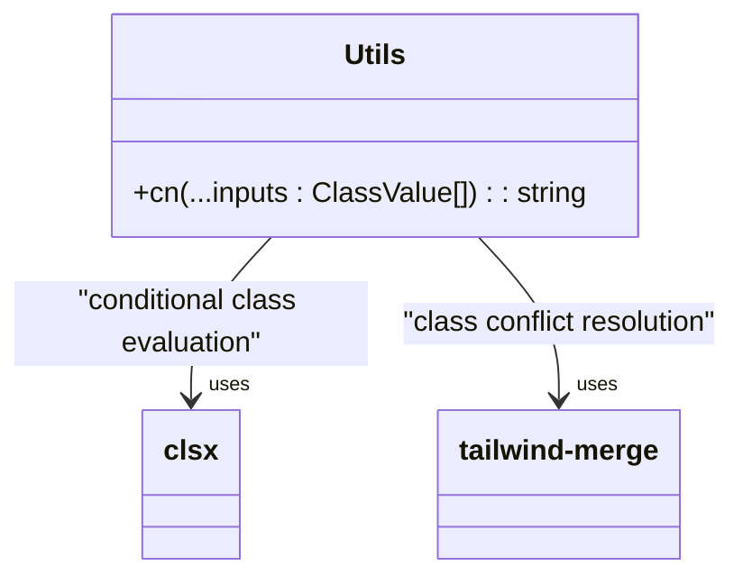
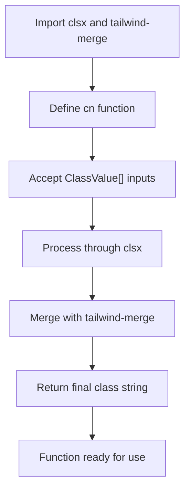
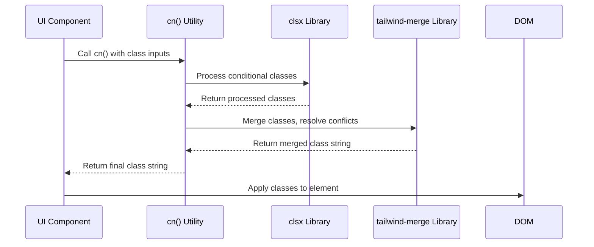

# Utility Functions

<cite>
**Referenced Files in This Document**   
- [utils.ts](file://lib/utils.ts)
- [button.tsx](file://components/ui/button.tsx)
- [card.tsx](file://components/ui/card.tsx)
- [alert.tsx](file://components/ui/alert.tsx)
- [Navigation.tsx](file://components/Navigation.tsx)
- [MessagesNavigation.tsx](file://components/MessagesNavigation.tsx)
</cite>

## Table of Contents
1. [Introduction](#introduction)
2. [Core Utility Function](#core-utility-function)
3. [Implementation and Usage](#implementation-and-usage)
4. [Design Principles](#design-principles)
5. [Integration Across Components](#integration-across-components)
6. [Best Practices](#best-practices)

## Introduction
The utility functions in the hsl-dashboard application provide essential helper functionality for common operations across the codebase. Located in the `lib/utils.ts` file, these utilities focus primarily on enhancing UI development through efficient class name management and composition. The utility library supports the application's component-based architecture by enabling consistent styling, improving code readability, and ensuring type safety across various UI elements.

**Section sources**
- [utils.ts](file://lib/utils.ts)

## Core Utility Function

The primary utility function in the hsl-dashboard is the `cn()` function, which serves as a wrapper for combining Tailwind CSS classes with support for conditional class application and class name merging. This function leverages two external libraries: `clsx` for conditional class evaluation and `tailwind-merge` for intelligent merging of conflicting Tailwind classes.

The `cn()` function accepts a variable number of arguments (`...inputs`) of type `ClassValue[]`, which can include strings, objects with boolean values, or arrays of class values. It processes these inputs through `clsx` to resolve conditional classes and then passes the result to `twMerge` to eliminate conflicting Tailwind classes and ensure the most specific styles take precedence.

**Diagram sources**
- [utils.ts](file://lib/utils.ts#L3-L5)

**Section sources**
- [utils.ts](file://lib/utils.ts#L1-L7)

## Implementation and Usage

The `cn()` utility function is implemented as a simple but powerful composition of two specialized libraries. The `clsx` library handles the evaluation of conditional classes, allowing developers to pass objects where the key is a class name and the value is a boolean condition. The `tailwind-merge` library then processes the resulting class string to resolve any conflicting Tailwind CSS classes, ensuring that the most specific or intended styles are applied.

This implementation pattern follows the principle of composition over inheritance, leveraging well-maintained external libraries for specific concerns rather than implementing complex class manipulation logic within the application codebase. The function signature is type-safe, utilizing TypeScript's `ClassValue` type from the `clsx` library to provide proper type checking and IDE support.

**Section sources**
- [utils.ts](file://lib/utils.ts#L3-L5)

## Design Principles

The design of the utility library in hsl-dashboard follows several key principles that contribute to its effectiveness and maintainability:

### Type Safety
The utility function maintains full type safety through the use of TypeScript's type system and the imported `ClassValue` type from `clsx`. This ensures that developers receive proper type checking and autocomplete support when using the `cn()` function in their components.

### Reusability
The `cn()` function is designed to be universally applicable across all components in the application. Its simple interface and powerful functionality make it suitable for any scenario where class names need to be conditionally applied or merged.

### Performance
The utility function is optimized for performance by leveraging highly optimized external libraries. Both `clsx` and `tailwind-merge` are lightweight and performant, ensuring that class name processing does not become a bottleneck in the application's rendering pipeline.

### Maintainability
By delegating complex class manipulation logic to dedicated libraries, the utility function remains simple and easy to maintain. Updates to class name handling logic can be managed through dependency updates rather than modifying application code.

**Diagram sources**
- [utils.ts](file://lib/utils.ts#L1-L7)

**Section sources**
- [utils.ts](file://lib/utils.ts#L1-L7)

## Integration Across Components

The `cn()` utility function is extensively used throughout the component library to manage class names in a consistent and maintainable way. It is imported and utilized in various UI components to combine base styles with conditional classes and component-specific overrides.

In button components, the utility is used to merge variant-specific styles with size-specific styles and any additional class names passed as props. In card components, it combines the base card styling with any custom classes provided by the parent component. Alert components use the utility to apply different styles based on the variant (default or destructive) while maintaining consistent base styling.

The Navigation and MessagesNavigation components demonstrate how the utility function supports dynamic styling based on the current route, applying active states to navigation items by conditionally including specific class names.

**Diagram sources**
- [utils.ts](file://lib/utils.ts#L3-L5)
- [button.tsx](file://components/ui/button.tsx#L4)
- [card.tsx](file://components/ui/card.tsx#L4)
- [Navigation.tsx](file://components/Navigation.tsx#L8)
- [MessagesNavigation.tsx](file://components/MessagesNavigation.tsx#L6)

**Section sources**
- [utils.ts](file://lib/utils.ts#L3-L5)
- [button.tsx](file://components/ui/button.tsx)
- [card.tsx](file://components/ui/card.tsx)
- [alert.tsx](file://components/ui/alert.tsx)
- [Navigation.tsx](file://components/Navigation.tsx)
- [MessagesNavigation.tsx](file://components/MessagesNavigation.tsx)

## Best Practices

When extending and maintaining the utility library in hsl-dashboard, several best practices should be followed to ensure consistency and reliability:

### Backward Compatibility
Any additions or modifications to the utility functions should maintain backward compatibility. This includes preserving existing function signatures and ensuring that existing code continues to work without modifications.

### Minimal Surface Area
New utility functions should only be added when there is a clear and recurring need across multiple components. The library should maintain a minimal surface area to avoid unnecessary complexity.

### Documentation
All utility functions should be thoroughly documented with JSDoc comments that explain their purpose, parameters, return values, and usage patterns. This documentation should be maintained alongside the code.

### Testing
Critical utility functions should be accompanied by comprehensive unit tests to ensure reliability and prevent regressions when modifications are made.

### Performance Monitoring
The performance impact of utility functions should be monitored, especially when processing large numbers of classes or when used in frequently rendered components.

The current implementation of the `cn()` function exemplifies these best practices by providing a simple, well-documented, and performant solution to a common problem in UI development, while leveraging established libraries to ensure reliability and maintainability.

**Section sources**
- [utils.ts](file://lib/utils.ts)