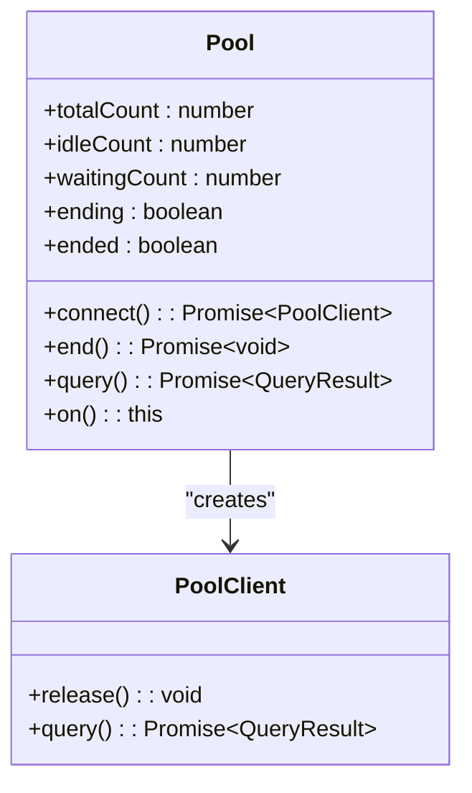
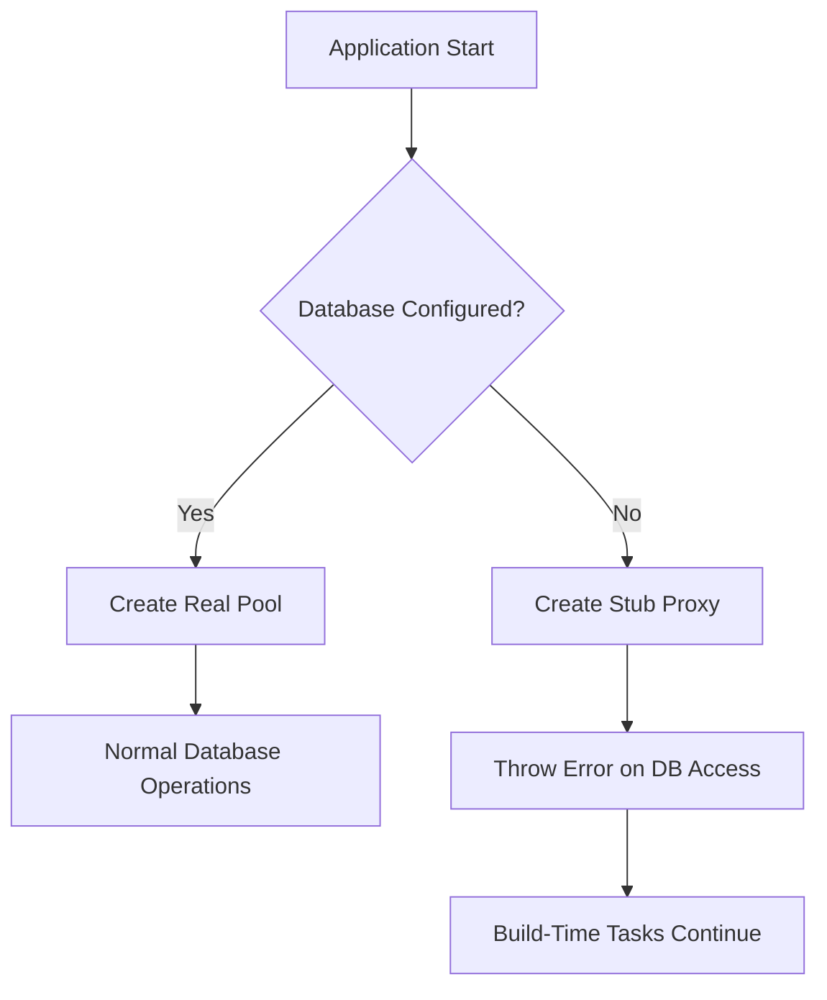
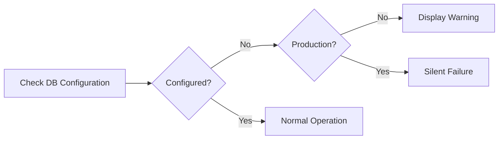
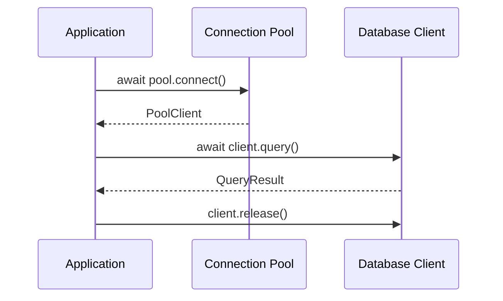

# Connection Management

<cite>
**Referenced Files in This Document**   
- [db.ts](file://lib/db.ts)
- [queries.ts](file://lib/queries.ts)
- [test-db/route.ts](file://app/api/test-db/route.ts)
- [db-schema/route.ts](file://app/api/db-schema/route.ts)
</cite>

## Table of Contents
1. [Introduction](#introduction)
2. [Database Configuration and Environment Variables](#database-configuration-and-environment-variables)
3. [Connection Pool Implementation](#connection-pool-implementation)
4. [Graceful Degradation with Stub Proxy](#graceful-degradation-with-stub-proxy)
5. [SSL Configuration for Railway Deployment](#ssl-configuration-for-railway-deployment)
6. [Error Handling and Warning Messages](#error-handling-and-warning-messages)
7. [Connection Usage Patterns](#connection-usage-patterns)
8. [Performance Benefits of Connection Pooling](#performance-benefits-of-connection-pooling)
9. [Best Practices for Connection Management](#best-practices-for-connection-management)
10. [Conclusion](#conclusion)

## Introduction

The hsl-dashboard application implements a robust database connection management system using the PostgreSQL client library (pg) with connection pooling. This documentation details the architecture and implementation of the database connection system, focusing on connection pooling, graceful degradation strategies, SSL configuration, and proper usage patterns. The system is designed to handle both production deployments and development/build-time scenarios, ensuring reliability and flexibility across different environments.

**Section sources**
- [db.ts](file://lib/db.ts)

## Database Configuration and Environment Variables

The database connection system relies on environment variables for configuration, allowing for flexible deployment across different environments. The primary configuration variables are:

- `POSTGRES_HOST`: Database server hostname or IP address
- `POSTGRES_PORT`: Database server port (defaults to 5432 if not specified)
- `POSTGRES_DB`: Database name (defaults to 'railway' if not specified)
- `POSTGRES_USER`: Database username (defaults to 'postgres' if not specified)
- `POSTGRES_PASSWORD`: Database password (required)

The system specifically checks for the presence of `POSTGRES_HOST` and `POSTGRES_PASSWORD` to determine if the database is properly configured. This selective validation ensures that the most critical connection parameters are present while allowing defaults for less critical ones.

**Section sources**
- [db.ts](file://lib/db.ts#L6-L8)

## Connection Pool Implementation

The core of the database connection system is implemented using the pg library's Pool class, which provides connection pooling capabilities. Connection pooling is a technique that maintains a cache of database connections that can be reused, eliminating the overhead of establishing a new connection for each database operation.



**Diagram sources**
- [db.ts](file://lib/db.ts#L34-L45)
- [node_modules/@types/pg/index.d.ts](file://node_modules/@types/pg/index.d.ts#L176-L232)

The pool is configured with the following parameters:
- Host: from `POSTGRES_HOST` environment variable
- Port: from `POSTGRES_PORT` environment variable (parsed as integer, defaulting to 5432)
- Database: from `POSTGRES_DB` environment variable (defaulting to 'railway')
- User: from `POSTGRES_USER` environment variable (defaulting to 'postgres')
- Password: from `POSTGRES_PASSWORD` environment variable
- SSL: configured with `rejectUnauthorized: false` for Railway deployment

The connection pool automatically manages the lifecycle of connections, handling creation, reuse, and cleanup. This approach significantly improves performance by avoiding the overhead of establishing new connections for each database operation.

**Section sources**
- [db.ts](file://lib/db.ts#L34-L45)

## Graceful Degradation with Stub Proxy

A key feature of the connection management system is its graceful degradation strategy when database environment variables are missing. Instead of failing immediately, the system creates a stub connection proxy that allows build-time operations to continue.



**Diagram sources**
- [db.ts](file://lib/db.ts#L8-L32)

When the required environment variables are not present, the system creates a proxy object that implements the Pool interface but throws errors when any database operation is attempted. This approach enables the application to start and perform build-time tasks even without a database connection, while still failing fast if actual database access is attempted.

The stub proxy implements key Pool methods:
- `connect()`: Throws an error indicating missing database environment variables
- `query()`: Throws an error indicating missing database environment variables
- `end()`: No-op (returns undefined)
- `on()` and `once()`: Throw an error but return the proxy to maintain chainability
- `emit()`: Throws an error and returns false

This implementation ensures that any attempt to use the database will fail with a clear error message, while allowing the application to function for non-database operations.

**Section sources**
- [db.ts](file://lib/db.ts#L8-L32)

## SSL Configuration for Railway Deployment

The connection pool is configured with SSL settings specifically tailored for Railway deployment. The SSL configuration includes:

```typescript
ssl: {
  rejectUnauthorized: false
}
```

This setting disables certificate verification, which is necessary for connecting to PostgreSQL databases on Railway. While this reduces security by accepting any certificate (including self-signed ones), it is appropriate for the deployment environment where the connection is already secured by other means.

The SSL configuration is applied only when a real connection pool is created (i.e., when the database is properly configured). The stub proxy does not include SSL configuration since it doesn't establish actual connections.

**Section sources**
- [db.ts](file://lib/db.ts#L42-L44)

## Error Handling and Warning Messages

The system implements comprehensive error handling for database configuration issues. When required environment variables are missing, the system displays a conditional warning message:



**Diagram sources**
- [db.ts](file://lib/db.ts#L47-L51)

The warning message is displayed only in non-production environments to avoid exposing configuration details in production logs. The message clearly indicates which environment variables are missing and explains that a stub connection is being used for build-time tasks.

The error handling strategy follows these principles:
- Fail fast with clear error messages when database operations are attempted without proper configuration
- Provide informative warnings during startup to help developers identify configuration issues
- Suppress potentially sensitive information in production environments
- Use consistent error messages across the application

**Section sources**
- [db.ts](file://lib/db.ts#L47-L51)

## Connection Usage Patterns

The connection pool is imported and used throughout the application in various modules. The primary usage pattern involves acquiring a client from the pool, performing database operations, and releasing the client back to the pool.



**Diagram sources**
- [db.ts](file://lib/db.ts#L51-L51)
- [queries.ts](file://lib/queries.ts#L103-L103)

Key usage examples include:

### API Route Usage
In API routes, the pool is used to test database connectivity:

```typescript
const client = await pool.connect();
const result = await client.query('SELECT NOW(), version()');
client.release();
```

This pattern is used in the test-db API route to verify database connectivity.

### Query Module Usage
In the queries module, the pool is used extensively for various database operations:

```typescript
const client = await pool.connect();
try {
  const result = await client.query('SELECT ...');
  return result.rows;
} finally {
  client.release();
}
```

The try-finally pattern ensures that the client is always released back to the pool, even if an error occurs during the database operation.

**Section sources**
- [db.ts](file://lib/db.ts#L51-L51)
- [queries.ts](file://lib/queries.ts#L103-L103)
- [test-db/route.ts](file://app/api/test-db/route.ts#L5-L7)
- [db-schema/route.ts](file://app/api/db-schema/route.ts#L5-L6)

## Performance Benefits of Connection Pooling

Connection pooling provides significant performance benefits for the hsl-dashboard application:

1. **Reduced Connection Overhead**: Establishing a new database connection involves network handshake, authentication, and session initialization. Connection pooling eliminates this overhead for subsequent operations.

2. **Improved Response Times**: By reusing existing connections, database queries can be executed immediately without waiting for connection establishment.

3. **Resource Efficiency**: The pool limits the number of concurrent connections to the database, preventing resource exhaustion on both the application and database servers.

4. **Better Scalability**: With connection pooling, the application can handle more concurrent requests without overwhelming the database with connection requests.

5. **Consistent Performance**: Connection pooling provides more predictable performance by eliminating the variable latency of connection establishment.

The pg library's pool implementation automatically manages connection lifecycle, including:
- Creating new connections as needed
- Reusing idle connections
- Closing connections that have been idle for too long
- Handling connection failures and retries

**Section sources**
- [db.ts](file://lib/db.ts)

## Best Practices for Connection Management

The implementation follows several best practices for connection management:

1. **Always Release Connections**: Every acquired client must be released back to the pool using try-finally blocks to ensure release even if an error occurs.

2. **Use Parameterized Queries**: When executing queries, use parameterized queries to prevent SQL injection attacks.

3. **Handle Errors Gracefully**: Implement proper error handling around database operations to prevent unhandled promise rejections.

4. **Monitor Pool Statistics**: The pg pool provides statistics (totalCount, idleCount, waitingCount) that can be monitored to detect connection leaks or performance issues.

5. **Configure Appropriate Pool Size**: While not explicitly configured in this implementation, the default pool size should be reviewed and adjusted based on expected load.

6. **Implement Timeout Handling**: Consider implementing query timeouts to prevent long-running queries from consuming pool connections.

7. **Use Transactions Appropriately**: For multiple related operations, use transactions to ensure data consistency and proper connection usage.

8. **Avoid Long-Running Operations**: Minimize the time that connections are held to maximize pool efficiency.

The current implementation could be enhanced by:
- Adding explicit pool size configuration
- Implementing connection timeout settings
- Adding monitoring for pool statistics
- Implementing retry logic for transient failures

**Section sources**
- [db.ts](file://lib/db.ts)
- [queries.ts](file://lib/queries.ts)

## Conclusion

The database connection management system in hsl-dashboard provides a robust foundation for database interactions. By leveraging connection pooling with the pg library, the system achieves optimal performance and resource utilization. The graceful degradation strategy with a stub proxy ensures that build-time operations can continue even without database configuration, while still failing fast if database access is attempted.

The SSL configuration with `rejectUnauthorized: false` enables seamless deployment on Railway, and the comprehensive error handling provides clear feedback for configuration issues. The consistent usage patterns throughout the application ensure proper connection lifecycle management and prevent connection leaks.

Overall, the implementation demonstrates a thoughtful approach to database connectivity that balances performance, reliability, and developer experience.