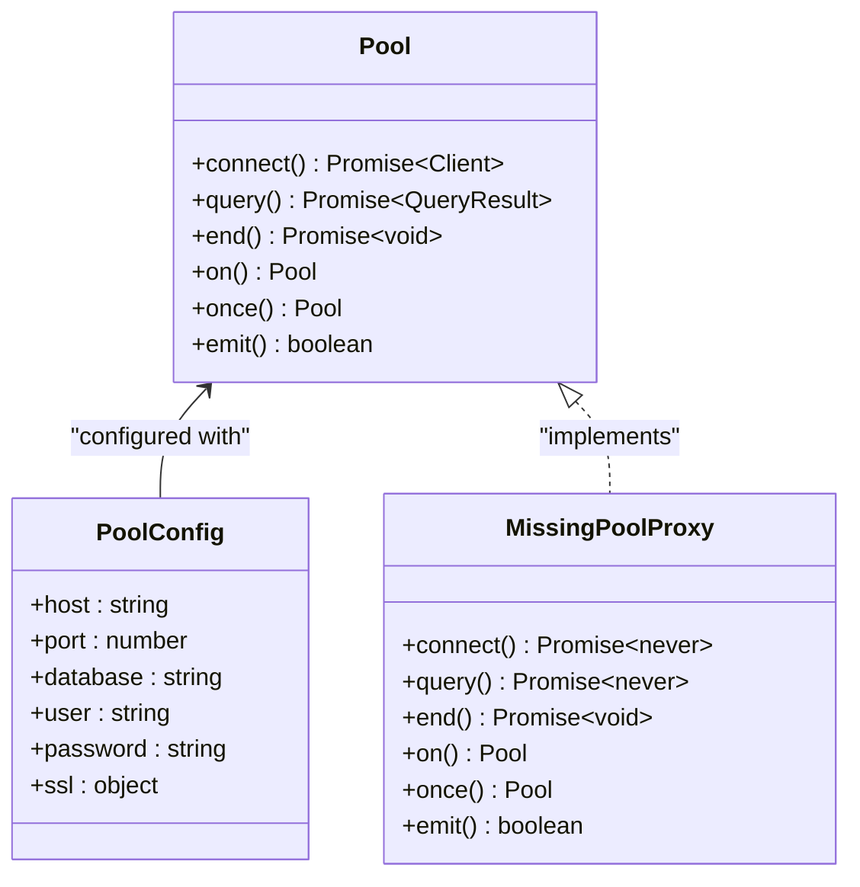
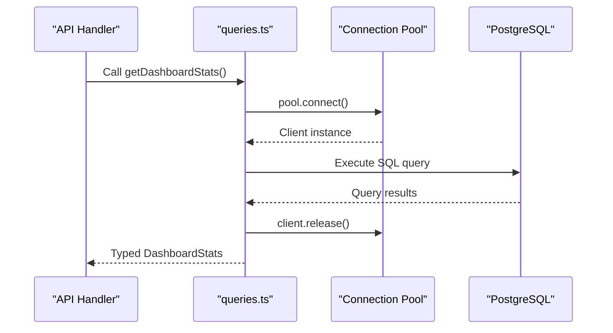
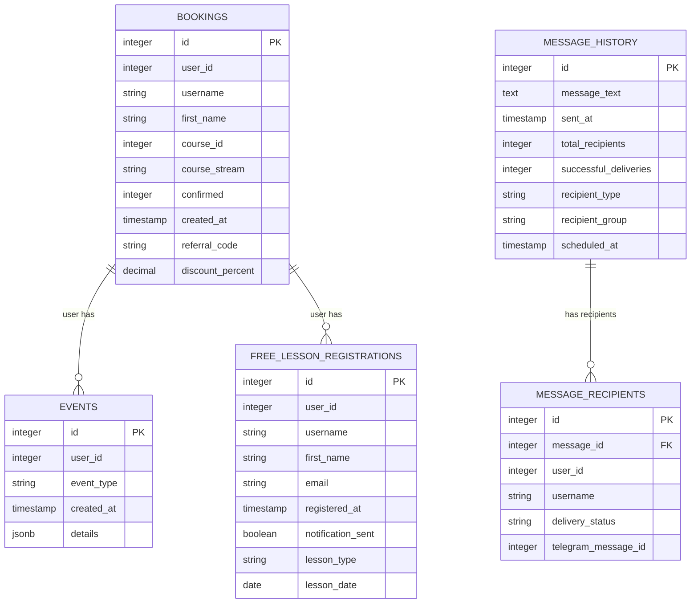
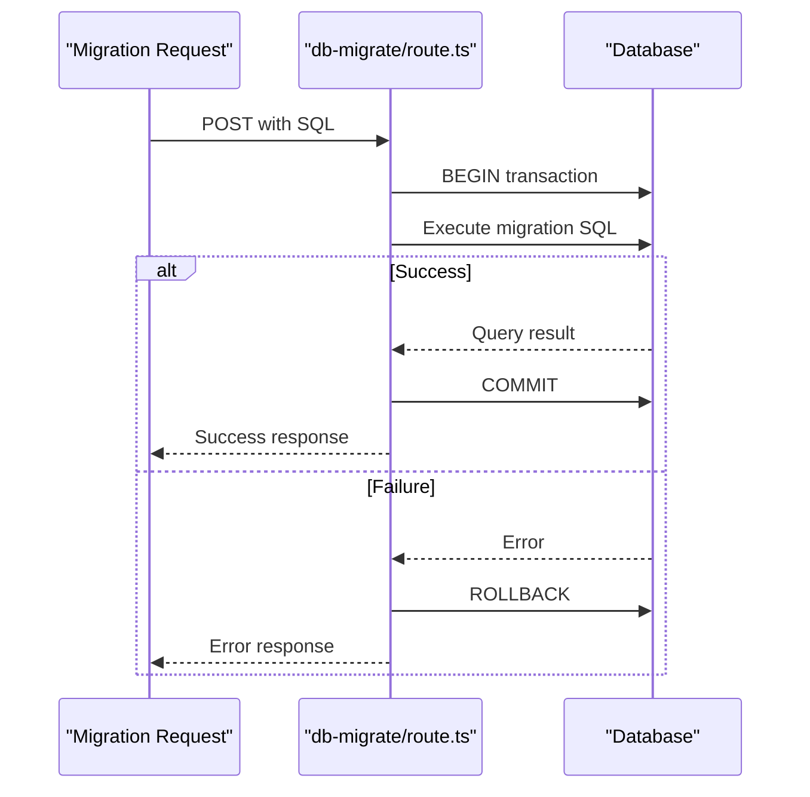
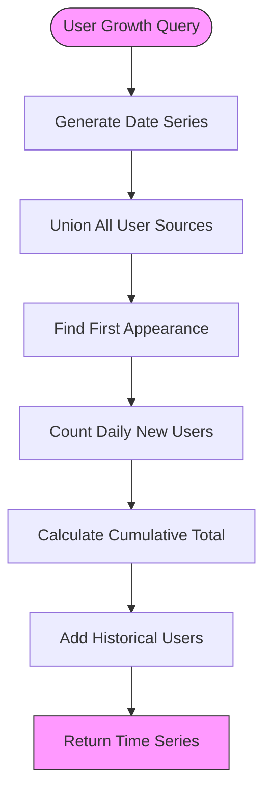

# Data Access Patterns

<cite>
**Referenced Files in This Document**   
- [db.ts](file://lib/db.ts)
- [queries.ts](file://lib/queries.ts)
- [db-migrate/route.ts](file://app/api/db-migrate/route.ts)
- [db-schema/route.ts](file://app/api/db-schema/route.ts)
</cite>

## Table of Contents
1. [Introduction](#introduction)
2. [Connection Pooling Implementation](#connection-pooling-implementation)
3. [Raw SQL Query Architecture](#raw-sql-query-architecture)
4. [Database Schema Overview](#database-schema-overview)
5. [Query Optimization and Indexing](#query-optimization-and-indexing)
6. [Transaction Management](#transaction-management)
7. [Database Migration Process](#database-migration-process)
8. [Schema Inspection Capabilities](#schema-inspection-capabilities)
9. [Complex Analytics Queries](#complex-analytics-queries)
10. [Security Practices](#security-practices)
11. [Conclusion](#conclusion)

## Introduction
This document provides comprehensive documentation for the data access architecture in the hsl-dashboard application. It details the implementation of connection pooling, raw SQL query patterns, database schema design, query optimization techniques, and security practices. The architecture emphasizes performance, reliability, and maintainability through thoughtful design patterns and robust error handling.

**Section sources**
- [db.ts](file://lib/db.ts)
- [queries.ts](file://lib/queries.ts)

## Connection Pooling Implementation
The application implements connection pooling through the PostgreSQL client library with graceful degradation and comprehensive error handling. The connection pool is configured with SSL encryption and environment-based configuration validation.

The pooling mechanism creates a singleton `Pool` instance that manages database connections efficiently. When database environment variables are properly configured, the pool connects to PostgreSQL with SSL disabled for certificate verification. In development environments without proper configuration, the system creates a proxy pool that gracefully handles missing configuration by throwing descriptive errors only when database operations are attempted.



**Diagram sources**
- [db.ts](file://lib/db.ts#L34-L45)

**Section sources**
- [db.ts](file://lib/db.ts#L1-L52)

## Raw SQL Query Architecture
The data access layer utilizes raw SQL queries instead of an ORM, with TypeScript interfaces defining the expected result structures. This approach provides full control over query optimization while maintaining type safety through interface contracts.

All database queries are encapsulated in functions within the `queries.ts` file, each returning strongly-typed Promise results. The architecture follows a consistent pattern: acquire a client from the pool, execute the query with proper error handling, and release the client back to the pool in a `finally` block to ensure proper resource management.



**Diagram sources**
- [queries.ts](file://lib/queries.ts#L102-L140)
- [db.ts](file://lib/db.ts)

**Section sources**
- [queries.ts](file://lib/queries.ts#L1-L1431)

## Database Schema Overview
The database schema consists of core operational tables, messaging tables, and supports analytics aggregations through complex queries. The schema is designed to support the application's business logic for user management, bookings, events, and messaging.

### Core Tables
The application maintains three primary data tables for tracking user interactions:

- **users**: Implicitly tracked through user_id across multiple tables
- **bookings**: Course enrollment and payment status
- **events**: User activity and engagement tracking

### Messaging Tables
Specialized tables support the messaging functionality:

- **message_history**: Stores message content and metadata
- **message_recipients**: Tracks delivery status for individual recipients

### Analytics Aggregations
The system generates analytics through SQL aggregations rather than storing pre-computed values, ensuring data freshness while maintaining storage efficiency.



**Diagram sources**
- [queries.ts](file://lib/queries.ts)
- [db-schema/route.ts](file://app/api/db-schema/route.ts)

**Section sources**
- [queries.ts](file://lib/queries.ts)
- [db-schema/route.ts](file://app/api/db-schema/route.ts)

## Query Optimization and Indexing
The application employs several query optimization techniques to ensure performance at scale. Complex queries use Common Table Expressions (CTEs) for readability and optimization, while parameterized queries prevent SQL injection and enable query plan caching.

The architecture leverages PostgreSQL's powerful aggregation capabilities to compute analytics on-the-fly rather than storing redundant data. Date series generation with `generate_series` enables gap-free time series data for analytics, while window functions support complex ranking operations.

Key optimization patterns include:
- Using CTEs for complex multi-stage queries
- Employing `DISTINCT ON` for efficient deduplication
- Utilizing `UNION` operations to consolidate data from multiple sources
- Implementing proper filtering and indexing strategies

```mermaid
flowchart TD
Start([Query Execution]) --> Plan["Query Planning"]
Plan --> Optimize["Optimization Phase"]
Optimize --> CTE["CTE Materialization"]
CTE --> Join["Join Operations"]
Join --> Filter["Filtering & Sorting"]
Filter --> Aggregate["Aggregation"]
Aggregate --> Return["Return Results"]
subgraph Optimization Techniques
CTE -.-> "Common Table Expressions"
Join -.-> "Efficient JOINs"
Filter -.-> "Index Utilization"
Aggregate -.-> "Window Functions"
end
```

**Diagram sources**
- [queries.ts](file://lib/queries.ts#L474-L539)
- [queries.ts](file://lib/queries.ts#L429-L471)

**Section sources**
- [queries.ts](file://lib/queries.ts)

## Transaction Management
The application implements proper transaction management for data integrity, particularly in the database migration endpoint. All migration operations are wrapped in explicit transactions with appropriate error handling to ensure atomicity.

The transaction pattern follows the standard BEGIN-COMMIT-ROLLBACK workflow. When executing migration SQL, the system begins a transaction, attempts to execute the provided SQL statement, and commits only if successful. In case of errors, the transaction is rolled back to maintain database consistency.



**Diagram sources**
- [db-migrate/route.ts](file://app/api/db-migrate/route.ts#L20-L45)

**Section sources**
- [db-migrate/route.ts](file://app/api/db-migrate/route.ts)

## Database Migration Process
Database migrations are managed through a dedicated API endpoint that accepts SQL statements for execution. This approach provides maximum flexibility for schema changes while maintaining a controlled interface for database modifications.

The migration process requires:
1. A POST request to the `/api/db-migrate` endpoint
2. JSON payload containing the SQL statement and optional description
3. Proper authentication (implied by endpoint protection)
4. Transactional execution with rollback on failure

Migration operations are logged with descriptive messages, including success or error details. The system validates that SQL statements are provided and returns appropriate HTTP status codes for validation and execution errors.

**Section sources**
- [db-migrate/route.ts](file://app/api/db-migrate/route.ts)

## Schema Inspection Capabilities
The application provides schema inspection capabilities through the `/api/db-schema` endpoint, which returns comprehensive metadata about the database structure. This feature enables dynamic schema analysis and debugging without direct database access.

The endpoint queries PostgreSQL's information schema to retrieve:
- Table and column definitions
- Constraints (primary keys, foreign keys)
- Index information
- Data types and nullability

This introspection capability supports development, debugging, and monitoring use cases by providing a programmatic way to examine the database structure.

**Section sources**
- [db-schema/route.ts](file://app/api/db-schema/route.ts)

## Complex Analytics Queries
The system implements several complex analytics queries for business intelligence purposes, particularly in user growth and conversion rate calculations.

### User Growth Analytics
The user growth query combines data from multiple sources (bookings, events, free lesson registrations) to calculate daily new users and cumulative totals. It uses a date series generation to ensure continuous time series data, even on days with no activity.

### Conversion Rate Calculations
The lesson conversion query performs a full outer join between registration and attendance data to calculate conversion rates. It handles cases where there are registrations without attendances (and vice versa) and computes percentages with proper decimal precision.



**Diagram sources**
- [queries.ts](file://lib/queries.ts#L474-L539)
- [queries.ts](file://lib/queries.ts#L429-L471)

**Section sources**
- [queries.ts](file://lib/queries.ts#L429-L539)

## Security Practices
The application implements several security best practices in its data access layer:

### Parameterized Queries
All queries that accept external input use parameterized queries with the PostgreSQL client's parameter binding. This prevents SQL injection attacks by properly escaping input values.

### SSL Connections
Database connections use SSL encryption with the configuration `ssl: { rejectUnauthorized: false }`. This ensures data in transit is encrypted, though certificate verification is disabled to accommodate various deployment environments.

### Input Validation
The system validates user IDs and other inputs before database operations, ensuring data integrity and preventing injection attempts.

### Error Handling
Comprehensive error handling prevents sensitive information leakage while providing meaningful error messages for debugging.

### Environment Protection
Database credentials are managed through environment variables, preventing hardcoded credentials in the source code.

**Section sources**
- [db.ts](file://lib/db.ts)
- [queries.ts](file://lib/queries.ts)

## Conclusion
The hsl-dashboard data access architecture demonstrates a thoughtful balance between performance, security, and maintainability. By leveraging raw SQL with TypeScript interfaces, the system achieves optimal query performance while maintaining type safety. The connection pooling implementation ensures efficient resource utilization, while comprehensive error handling and graceful degradation improve system reliability.

The schema design supports the application's core functionality with specialized tables for operational data and messaging, while complex analytics queries provide business intelligence without requiring redundant data storage. Security practices including parameterized queries, SSL connections, and proper error handling protect data integrity and confidentiality.

This architecture provides a solid foundation for the application's data needs, with extensibility for future enhancements and scalability for growing data volumes.

**Section sources**
- [db.ts](file://lib/db.ts)
- [queries.ts](file://lib/queries.ts)
- [db-migrate/route.ts](file://app/api/db-migrate/route.ts)
- [db-schema/route.ts](file://app/api/db-schema/route.ts)