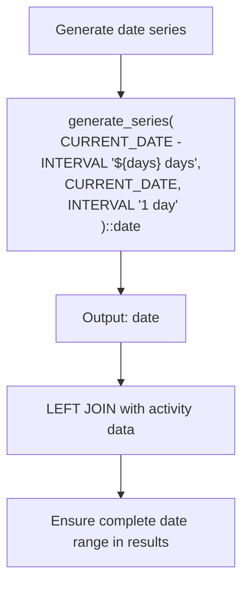
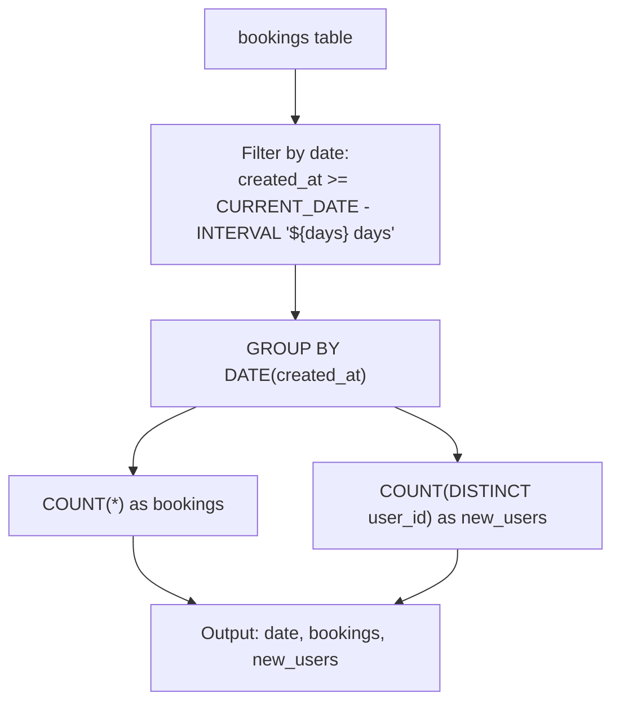
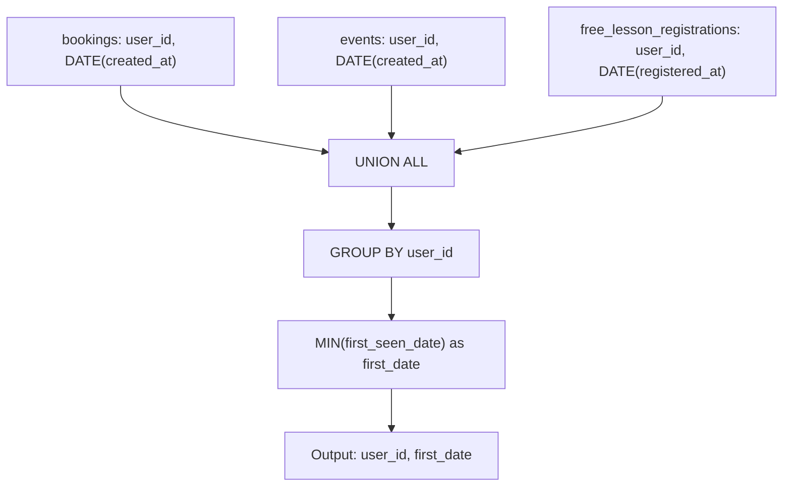
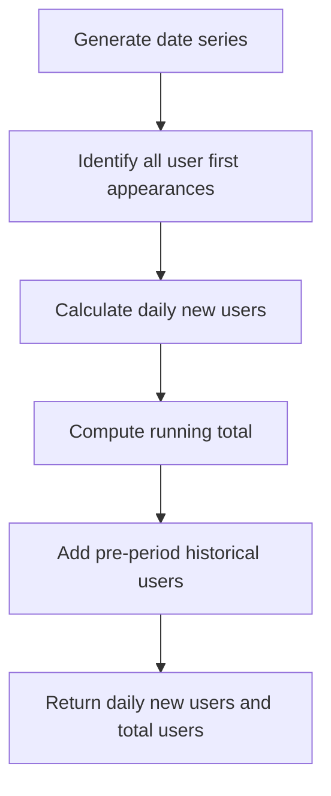
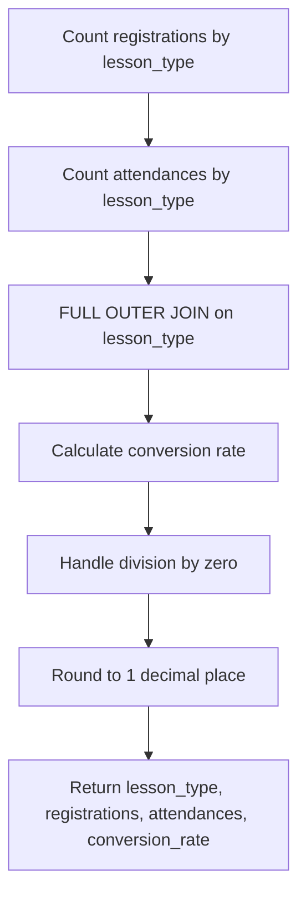

# Analytics Aggregations

<cite>
**Referenced Files in This Document**   
- [lib/queries.ts](file://lib/queries.ts)
- [DATABASE_MIGRATION_LOG.md](file://DATABASE_MIGRATION_LOG.md)
</cite>

## Table of Contents
1. [Introduction](#introduction)
2. [Core Analytics Functions](#core-analytics-functions)
3. [Common Table Expressions (CTEs)](#common-table-expressions-ctes)
4. [Data Aggregation Patterns](#data-aggregation-patterns)
5. [Query Performance and Optimization](#query-performance-and-optimization)
6. [Schema Evolution and Compatibility](#schema-evolution-and-compatibility)

## Introduction

The analytics system in the HSL Dashboard provides comprehensive reporting capabilities for tracking user growth, daily statistics, and lesson conversion metrics. The system leverages PostgreSQL's Common Table Expressions (CTEs) to create complex, readable, and maintainable SQL queries that transform raw data into meaningful analytics. These queries are implemented in the `lib/queries.ts` file and are used by various API endpoints to power dashboard visualizations and reporting features.

The analytics framework is designed to handle time-series analysis, user cohort tracking, and conversion funnel metrics, providing insights into user acquisition, engagement, and retention patterns. The system uses CTEs extensively to break down complex queries into logical, reusable components that can be easily understood and maintained.

## Core Analytics Functions

The analytics system provides three primary functions for generating key metrics: `getUserGrowthData`, `getDailyStats`, and `getLessonConversion`. These functions are implemented as asynchronous functions that execute complex SQL queries against the PostgreSQL database and return structured data that can be consumed by the frontend dashboard.

### getUserGrowthData

The `getUserGrowthData` function calculates user growth metrics over a specified time period, providing both daily new user counts and cumulative total user counts. This function is essential for tracking user acquisition trends and understanding the growth trajectory of the platform.

**Section sources**
- [lib/queries.ts](file://lib/queries.ts#L474-L539)

### getDailyStats

The `getDailyStats` function retrieves daily statistics for new users, bookings, and events. This function provides a comprehensive view of daily platform activity, enabling analysis of user engagement patterns and operational metrics.

**Section sources**
- [lib/queries.ts](file://lib/queries.ts#L244-L292)

### getLessonConversion

The `getLessonConversion` function calculates conversion rates for free lesson registrations to actual attendance. This function is critical for measuring the effectiveness of marketing campaigns and understanding user engagement with educational content.

**Section sources**
- [lib/queries.ts](file://lib/queries.ts#L429-L471)

## Common Table Expressions (CTEs)

The analytics queries leverage Common Table Expressions (CTEs) to create modular, readable, and efficient SQL queries. CTEs allow complex queries to be broken down into logical components that can be referenced and combined in subsequent query steps.

### date_series CTE

The `date_series` CTE generates a continuous series of dates for the specified time period. This is essential for ensuring that the analytics results include data for every day in the requested range, even days with no activity. The CTE uses PostgreSQL's `generate_series` function to create a sequence of dates from the start date to the current date.

**Diagram sources**
- [lib/queries.ts](file://lib/queries.ts#L247-L281)
- [lib/queries.ts](file://lib/queries.ts#L477-L529)

### daily_bookings CTE

The `daily_bookings` CTE aggregates booking data by date, calculating the number of bookings and new users for each day. This CTE filters bookings to include only those within the requested time period and groups the results by date.

**Diagram sources**
- [lib/queries.ts](file://lib/queries.ts#L247-L281)

### first_user_appearances CTE

The `first_user_appearances` CTE identifies the first appearance date for each user across multiple data sources (bookings, events, and free lesson registrations). This CTE is crucial for accurate user growth calculations, as it ensures that users are counted on their first interaction with the platform rather than on subsequent activities.

**Diagram sources**
- [lib/queries.ts](file://lib/queries.ts#L477-L529)

## Data Aggregation Patterns

The analytics system employs several consistent patterns for data aggregation, ensuring reliable and meaningful metrics across different reporting dimensions.

### User Growth Calculation

The user growth calculation follows a multi-step process that combines historical data with recent activity to provide accurate total user counts. The process begins with creating a date series, then identifying first user appearances, calculating daily new users, and finally computing cumulative totals.

**Diagram sources**
- [lib/queries.ts](file://lib/queries.ts#L474-L539)

### Conversion Rate Calculation

The lesson conversion rate calculation follows a pattern of calculating registrations and attendances separately, then combining them to compute conversion rates. The calculation handles cases where there are registrations but no attendances (resulting in 0% conversion) and uses decimal arithmetic to ensure precision.

**Diagram sources**
- [lib/queries.ts](file://lib/queries.ts#L429-L471)

## Query Performance and Optimization

The analytics queries are designed with performance considerations in mind, leveraging PostgreSQL features and best practices to ensure efficient execution.

### Index Utilization

The queries are structured to take advantage of existing database indexes, particularly on date columns and user identifiers. The use of CTEs allows the query planner to optimize execution by materializing intermediate results when beneficial.

### Window Functions

The user growth query employs a window function (`SUM() OVER (ORDER BY ds.date)`) to calculate the running total of new users. This approach is more efficient than alternative methods that would require self-joins or procedural logic.

### Data Type Handling

The queries use appropriate data types and casting to ensure accurate calculations. For example, the conversion rate calculation uses decimal arithmetic to maintain precision and avoid floating-point errors that could occur with integer division.

## Schema Evolution and Compatibility

The analytics system has been designed to accommodate schema evolution while maintaining backward compatibility. The `DATABASE_MIGRATION_LOG.md` file documents recent changes to the database schema, including the addition of message tracking tables that support the analytics functionality.

The analytics queries are resilient to schema changes through the use of explicit column selection and parameterized queries. This approach minimizes the impact of schema modifications on the analytics calculations and ensures that the system can adapt to evolving data models.

**Section sources**
- [DATABASE_MIGRATION_LOG.md](file://DATABASE_MIGRATION_LOG.md#L0-L172)