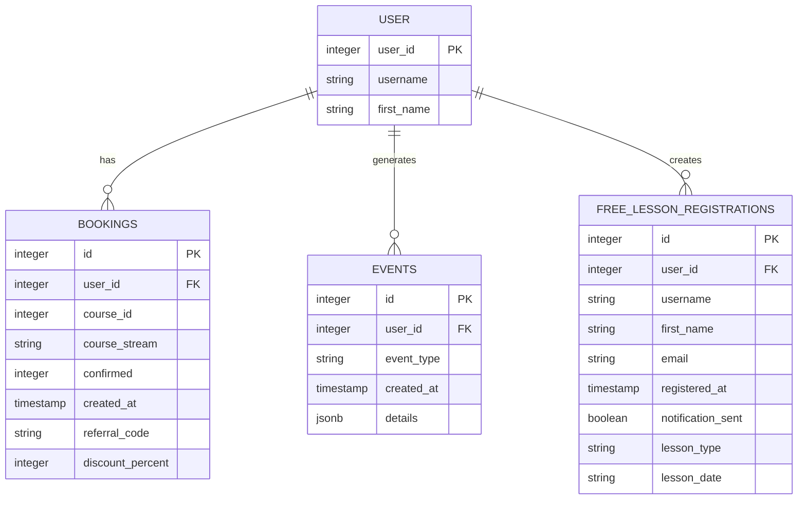

# Core Data Models

<cite>
**Referenced Files in This Document**   
- [lib/queries.ts](file://lib/queries.ts)
- [DATABASE_MIGRATION_LOG.md](file://DATABASE_MIGRATION_LOG.md)
</cite>

## Table of Contents
1. [Introduction](#introduction)
2. [Bookings Table](#bookings-table)
3. [Events Table](#events-table)
4. [Free Lesson Registrations Table](#free-lesson-registrations-table)
5. [Data Relationships](#data-relationships)
6. [Query Patterns and Data Access](#query-patterns-and-data-access)
7. [Indexing and Performance](#indexing-and-performance)
8. [Data Validation and Retention](#data-validation-and-retention)

## Introduction
The hsl-dashboard system maintains four core data entities: users, bookings, events, and free_lesson_registrations. These tables form the foundation of the analytics and management capabilities for HashSlash School's educational programs. The data model is designed to track user engagement across multiple touchpoints, from initial free lesson registrations through course bookings and ongoing interactions. User identity is established through the user_id field, which serves as a foreign key across all interaction tables, enabling comprehensive user journey analysis and personalized communication. The system leverages PostgreSQL as its database backend, with careful attention to data integrity, query performance, and security.

## Bookings Table
The bookings table tracks course enrollment and payment status for users. It serves as the primary record of paid course participation and contains critical information about user commitments to educational programs. The table includes a composite structure with both user identification and course-specific details.

**Table Structure:**
- id: Primary key (integer)
- user_id: Foreign key to user identity (integer)
- course_id: Identifier for the specific course (integer)
- course_stream: Designation of the course cohort or session (string)
- confirmed: Payment and booking status indicator (integer)
- created_at: Timestamp of booking creation (timestamp)
- referral_code: Optional referral identifier (string)
- discount_percent: Applied discount percentage (integer)

The confirmed field uses a numeric status system where -1 indicates a cancelled booking, 1 represents a pending confirmation, and 2 signifies a confirmed payment. This status tracking enables the system to differentiate between active enrollments and cancelled registrations when calculating metrics like active bookings and confirmed payments. The course_stream field categorizes users into specific program cohorts (e.g., 3rd_stream, 4th_stream), which is essential for targeted communication and cohort-based analytics.

**Section sources**
- [lib/queries.ts](file://lib/queries.ts#L102-L140)
- [lib/queries.ts](file://lib/queries.ts#L178-L218)

## Events Table
The events table captures user interactions and behavioral data within the system. It functions as an event logging mechanism that records various user activities, providing insights into engagement patterns and user behavior. This table is critical for understanding how users interact with the platform beyond formal course enrollments.

**Table Structure:**
- id: Primary key (integer)
- user_id: Foreign key to user identity (integer)
- event_type: Categorization of the event (string)
- created_at: Timestamp of event occurrence (timestamp)
- details: Additional contextual information stored as JSON (jsonb)

The event_type field contains descriptive labels for different user actions, such as "lesson_link_clicked" which indicates when a user has accessed a lesson. The details column stores structured JSON data that can contain additional context about the event, including nested information like lesson_type. This flexible schema allows the system to capture diverse interaction types without requiring schema changes for new event categories. The events table supports the lead scoring system by tracking user engagement frequency and patterns, which are used to classify leads as hot, warm, cool, or cold based on activity levels.

**Section sources**
- [lib/queries.ts](file://lib/queries.ts#L322-L367)
- [lib/queries.ts](file://lib/queries.ts#L1289-L1305)

## Free Lesson Registrations Table
The free_lesson_registrations table manages lead capture from free lesson offerings. It serves as the primary mechanism for collecting prospective student information and tracking their journey from initial interest to potential paid enrollment. This table is essential for measuring the effectiveness of marketing initiatives and conversion funnels.

**Table Structure:**
- id: Primary key (integer)
- user_id: Foreign key to user identity (integer)
- username: User's Telegram username (string)
- first_name: User's first name (string)
- email: Contact email address (string)
- registered_at: Timestamp of registration (timestamp)
- notification_sent: Boolean flag indicating confirmation delivery (boolean)
- lesson_type: Category of the free lesson (string)
- lesson_date: Scheduled date of the lesson (date)

This table captures both user identification information and engagement metrics. The notification_sent field tracks whether a confirmation message has been delivered to the user, enabling the system to monitor communication effectiveness. The lesson_type and lesson_date fields allow for segmentation of leads by program type and scheduling, which supports conversion rate analysis by lesson format. The email field provides a direct contact method for marketing follow-ups and is a key component in the lead nurturing process.

**Section sources**
- [lib/queries.ts](file://lib/queries.ts#L1313-L1335)
- [lib/queries.ts](file://lib/queries.ts#L429-L471)

## Data Relationships
The core data entities in the hsl-dashboard system are interconnected through the user_id field, which establishes user identity across multiple interaction points. This shared foreign key enables comprehensive user journey analysis by linking booking history, event interactions, and free lesson registrations to individual users. The relationships between tables follow a star schema pattern with user_id as the central dimension.

The system establishes referential integrity through foreign key constraints, ensuring data consistency across related records. When a user engages with the platform, their activities are recorded across multiple tables: initial interest captured in free_lesson_registrations, course enrollments tracked in bookings, and ongoing interactions logged in events. This multi-table approach allows for detailed analytics while maintaining data normalization principles.

The relationships support complex queries that aggregate user behavior across different touchpoints. For example, the system can calculate conversion rates by joining free_lesson_registrations with events to determine attendance rates, or analyze booking patterns by combining user data from multiple sources. The design prevents orphaned records through CASCADE DELETE operations and uses parameterized queries to prevent SQL injection attacks, ensuring both data integrity and security.

**Diagram sources**
- [lib/queries.ts](file://lib/queries.ts#L1198-L1261)
- [DATABASE_MIGRATION_LOG.md](file://DATABASE_MIGRATION_LOG.md#L146-L152)

## Query Patterns and Data Access
The hsl-dashboard system implements a comprehensive set of query patterns through the lib/queries.ts file, which exports functions for accessing and analyzing data from the core tables. These queries follow a consistent pattern of connection management, parameterized execution, and result transformation to ensure security and reliability.

Common data access patterns include user-centric queries that aggregate information across multiple tables. The getUserById function combines data from bookings and free_lesson_registrations to create a comprehensive user profile, while getUserBookings, getUserEvents, and getUserFreeLessons provide filtered access to specific interaction types. Aggregation queries like getDashboardStats calculate key metrics by combining data from multiple tables, such as counting total users across all interaction types using UNION operations.

The system employs Common Table Expressions (CTEs) for complex analytical queries, such as getLessonConversion which calculates conversion rates by joining registration data with attendance events. Date-based queries use PostgreSQL's generate_series function to create time series data for trend analysis, as seen in getUserGrowthData. All queries use parameterized statements to prevent SQL injection and follow the principle of least privilege in data access.

**Section sources**
- [lib/queries.ts](file://lib/queries.ts#L1048-L1196)
- [lib/queries.ts](file://lib/queries.ts#L474-L539)

## Indexing and Performance
The data model incorporates several performance optimization strategies to ensure responsive query execution and efficient data retrieval. While specific index definitions are not visible in the provided code, the query patterns suggest the presence of strategic indexing on key fields. The system likely employs indexes on user_id across all interaction tables to accelerate JOIN operations and WHERE clause filtering.

The use of DISTINCT ON (user_id) in multiple queries indicates that user_id is a critical access path, and indexing this field would significantly improve query performance. Similarly, timestamp fields like created_at and registered_at are frequently used in ORDER BY and WHERE clauses, suggesting they are likely indexed to support time-based queries and sorting operations. The course_stream field appears in filtering conditions, indicating it may be indexed to optimize cohort-based queries.

The system implements connection pooling through the pg library, which helps manage database connections efficiently and reduces connection overhead. For high-frequency operations, the application uses caching strategies with a 5-minute TTL (time-to-live) to reduce database load. The queries are designed to retrieve only necessary fields rather than using SELECT *, minimizing data transfer and improving response times.

**Section sources**
- [lib/queries.ts](file://lib/queries.ts#L102-L140)
- [lib/queries.ts](file://lib/queries.ts#L322-L367)

## Data Validation and Retention
The hsl-dashboard system implements multiple layers of data validation and retention considerations to ensure data quality and compliance. The database schema includes constraints that prevent orphaned records through foreign key relationships with CASCADE DELETE operations, maintaining referential integrity across related tables.

Data validation occurs at multiple levels: the application uses parameterized queries to prevent SQL injection attacks, and business logic enforces data consistency rules. For example, the updateUserStream function validates that a user has an active booking before allowing stream changes. The system also implements user validation through the validateUserIds function, which checks that user IDs exist in the database before processing operations.

Retention considerations are reflected in the query patterns that use date-based filtering and aggregation. The system appears to retain historical data for trend analysis and user growth tracking, with queries spanning configurable time periods (e.g., 30 days). The use of CTEs for historical data calculations suggests that older records are preserved for analytics purposes. Security measures include SSL connections for database communication and audit logging for critical operations, ensuring data protection and compliance with privacy regulations.

**Section sources**
- [DATABASE_MIGRATION_LOG.md](file://DATABASE_MIGRATION_LOG.md#L146-L152)
- [lib/queries.ts](file://lib/queries.ts#L820-L861)