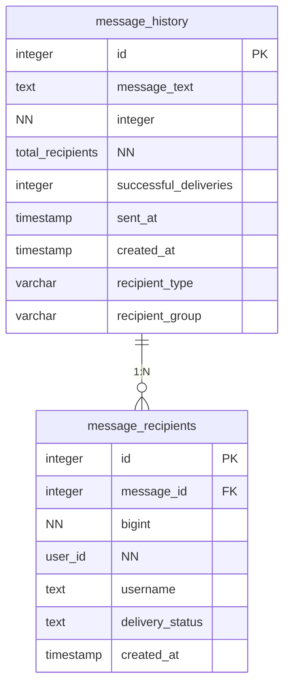
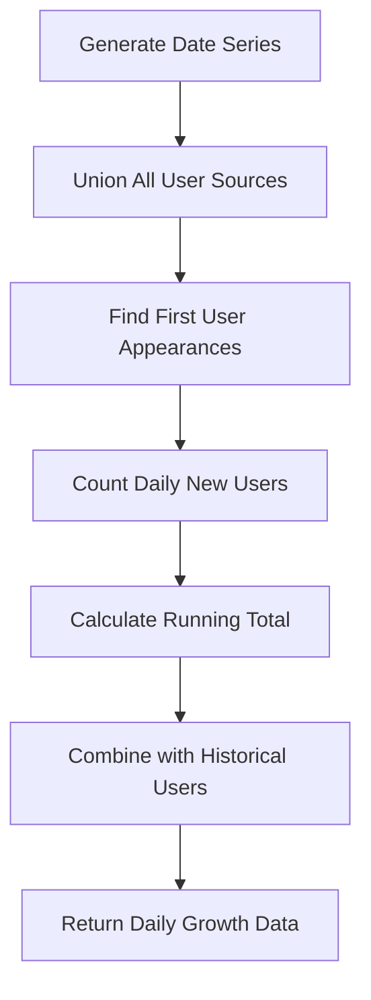
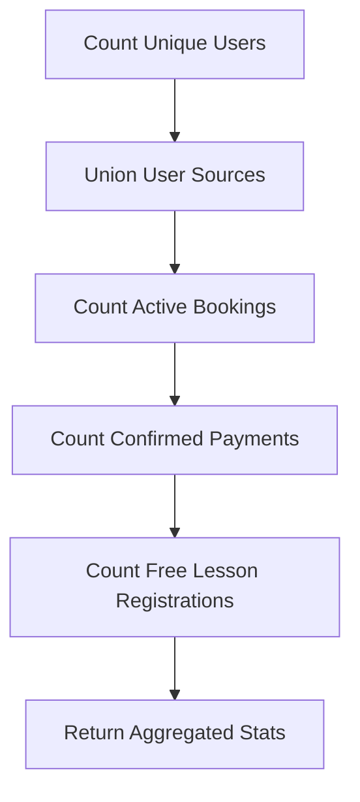
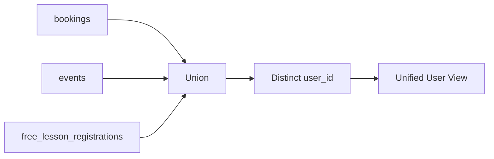

# Database Schema

<cite>
**Referenced Files in This Document**   
- [DATABASE_MIGRATION_LOG.md](file://DATABASE_MIGRATION_LOG.md)
- [lib/queries.ts](file://lib/queries.ts)
- [app/api/db-schema/route.ts](file://app/api/db-schema/route.ts)
</cite>

## Table of Contents
1. [Introduction](#introduction)
2. [Core Tables](#core-tables)
3. [Messaging System](#messaging-system)
4. [Analytics Aggregations and CTEs](#analytics-aggregations-and-ctes)
5. [Schema Evolution](#schema-evolution)
6. [Data Validation and Security](#data-validation-and-security)
7. [Data Access Patterns](#data-access-patterns)

## Introduction
The hsl-dashboard database schema is designed to support a comprehensive user engagement and analytics platform for a course management system. The schema tracks user interactions across multiple touchpoints including course bookings, free lesson registrations, and event tracking. A key feature of the system is its robust messaging capability, enabling targeted communication with users through a Telegram bot interface. The database design emphasizes data integrity through proper normalization, foreign key constraints, and indexing strategies to ensure optimal query performance. This documentation provides a detailed overview of the database structure, including core tables, messaging system implementation, analytics capabilities, and data management practices.

## Core Tables

The database schema consists of several core tables that capture user engagement and course management data. The primary user identification comes from three sources: bookings, events, and free_lesson_registrations, which are unified through the user_id field. The bookings table tracks course enrollments with a confirmation status system (-1=cancelled, 1=pending, 2=confirmed) and includes course_stream information to track which cohort users are assigned to. The events table records user interactions and bot events, providing a comprehensive audit trail of user activity. The free_lesson_registrations table captures leads from free lesson offerings, including contact information and registration details. These tables serve as the foundation for user identification and analytics throughout the system.

**Section sources**
- [DATABASE_MIGRATION_LOG.md](file://DATABASE_MIGRATION_LOG.md)
- [lib/queries.ts](file://lib/queries.ts#L102-L140)

## Messaging System

### Message History and Recipients Tables

The messaging system consists of two primary tables: message_history and message_recipients. The message_history table stores broadcast message records with delivery statistics, while the message_recipients table tracks individual message delivery status for each recipient.



**Diagram sources**
- [DATABASE_MIGRATION_LOG.md](file://DATABASE_MIGRATION_LOG.md)
- [lib/queries.ts](file://lib/queries.ts#L83-L91)

### Table Structure and Constraints

#### message_history
| Field | Type | Constraints | Description |
|-------|------|-------------|-------------|
| id | SERIAL | PRIMARY KEY | Auto-incrementing message identifier |
| message_text | TEXT | NOT NULL | The broadcast message content |
| total_recipients | INTEGER | NOT NULL, DEFAULT 0 | Total number of users the message was sent to |
| successful_deliveries | INTEGER | DEFAULT 0 | Count of successful deliveries |
| sent_at | TIMESTAMP WITH TIME ZONE | DEFAULT CURRENT_TIMESTAMP | When the message was sent |
| created_at | TIMESTAMP WITH TIME ZONE | DEFAULT CURRENT_TIMESTAMP | Record creation timestamp |
| recipient_type | VARCHAR | | 'individual' or 'group' |
| recipient_group | VARCHAR | | Target group identifier (e.g., '3rd_stream') |

#### message_recipients
| Field | Type | Constraints | Description |
|-------|------|-------------|-------------|
| id | SERIAL | PRIMARY KEY | Auto-incrementing recipient record identifier |
| message_id | INTEGER | NOT NULL, FOREIGN KEY | References message_history.id with CASCADE DELETE |
| user_id | BIGINT | NOT NULL | Telegram user ID |
| username | TEXT | | Telegram username (nullable) |
| delivery_status | TEXT | DEFAULT 'pending' | 'pending', 'sent', 'failed', or 'deleted' |
| created_at | TIMESTAMP WITH TIME ZONE | DEFAULT CURRENT_TIMESTAMP | Record creation timestamp |

The foreign key relationship between message_recipients.message_id and message_history.id is configured with CASCADE DELETE, ensuring that when a message is deleted from message_history, all corresponding recipient records are automatically removed. This maintains data consistency and prevents orphaned records.

**Section sources**
- [DATABASE_MIGRATION_LOG.md](file://DATABASE_MIGRATION_LOG.md)
- [lib/queries.ts](file://lib/queries.ts#L93-L99)

### Indexes for Query Performance

Three indexes have been created to optimize query performance for the messaging system:

```mermaid
erDiagram
message_history {
integer id PK
}
message_recipients {
integer id PK
integer message_id FK
bigint user_id
}
index idx_message_recipients_message_id on message_recipients(message_id)
index idx_message_recipients_status on message_recipients(message_id, delivery_status)
index idx_message_recipients_user_id on message_recipients(user_id)
message_history ||--o{ message_recipients : "1:N"
```

**Diagram sources**
- [DATABASE_MIGRATION_LOG.md](file://DATABASE_MIGRATION_LOG.md)

- **idx_message_recipients_message_id**: Enables fast lookups by message_id, critical for retrieving all recipients of a specific message
- **idx_message_recipients_status**: Composite index on message_id and delivery_status, optimized for counting successful deliveries and filtering by delivery status
- **idx_message_recipients_user_id**: Facilitates fast user lookups, important for user validation and deduplication

These indexes ensure that message history retrieval, recipient status tracking, and delivery statistics calculations perform efficiently even as the volume of messages grows.

**Section sources**
- [DATABASE_MIGRATION_LOG.md](file://DATABASE_MIGRATION_LOG.md)

## Analytics Aggregations and CTEs

The system employs sophisticated analytics queries using Common Table Expressions (CTEs) to provide comprehensive reporting capabilities. These queries combine data from multiple tables (bookings, events, free_lesson_registrations) to create unified views of user activity and system performance.

### User Growth Analytics

The user growth data query uses a CTE-based approach to calculate daily new users and cumulative totals:



**Diagram sources**
- [lib/queries.ts](file://lib/queries.ts#L474-L539)

This query uses PostgreSQL's generate_series function to create a complete date range, then joins with user data from all sources to calculate new users per day and maintain a running cumulative total. The CTE structure makes the query more readable and maintainable by breaking down the complex logic into logical steps.

### Dashboard Statistics Aggregation

The dashboard statistics query combines data from multiple tables using UNION operations:



**Diagram sources**
- [lib/queries.ts](file://lib/queries.ts#L102-L140)

This aggregation query counts total unique users by combining user_id values from bookings, events, and free_lesson_registrations tables, ensuring comprehensive user coverage across all interaction points.

**Section sources**
- [lib/queries.ts](file://lib/queries.ts#L102-L140)

## Schema Evolution

The database schema has evolved through a structured migration process documented in DATABASE_MIGRATION_LOG.md. The most significant recent change was the implementation of the messaging system tables on September 2, 2025.

### Migration Details

The migration created two new tables (message_history and message_recipients) and three indexes to support the Telegram bot message broadcasting functionality. The implementation followed a secure, transaction-based approach using the existing database connection and Next.js API structure.

### Implementation Methodology

The migration was executed using a dedicated endpoint (/app/api/db-migrate/route.ts) that supports secure transaction-based DDL execution. The process included comprehensive testing through a dedicated testing endpoint (/app/api/test-messages/route.ts) which verified all message-related functions including creation, recipient management, status updates, and retrieval.

### Rollback Plan

A comprehensive rollback plan was documented, providing two options:
1. Complete rollback: Drop both tables with CASCADE to remove dependent objects
2. Selective rollback: Remove specific tables or indexes as needed

The migration was completed in approximately 15 minutes, under the original 20-30 minute estimate, demonstrating efficient implementation and testing.

**Section sources**
- [DATABASE_MIGRATION_LOG.md](file://DATABASE_MIGRATION_LOG.md)

## Data Validation and Security

The system implements robust data validation and security practices to ensure data integrity and protect against common vulnerabilities.

### Data Validation Rules

User validation is performed through the validateUserIds function, which checks that requested user IDs exist in the database by querying across all user source tables (bookings, events, free_lesson_registrations). The system uses deduplication with DISTINCT ON (user_id) to prevent multiple messages to the same person and ensures user validation before message delivery.

### Retention Considerations

The system does not currently implement automated data retention policies, but the CASCADE DELETE constraint on the message_recipients table ensures that when messages are removed, associated recipient records are automatically cleaned up. Historical data is preserved for analytics purposes, with date-based queries using appropriate indexing for performance.

### Security Practices

The system employs several security best practices:
- Parameterized queries to prevent SQL injection
- Environment variables for sensitive information (database credentials, Telegram bot token)
- .env.local excluded from git
- User validation to ensure only valid database users receive messages
- Comprehensive logging and audit trail for all messaging operations

The messaging system also includes security features such as confirmation dialogs and audit logging to prevent accidental mass messaging and provide compliance tracking.

**Section sources**
- [DATABASE_MIGRATION_LOG.md](file://DATABASE_MIGRATION_LOG.md)
- [lib/queries.ts](file://lib/queries.ts#L820-L850)

## Data Access Patterns

The system implements several common data access patterns through its API endpoints and query functions.

### User Identification Pattern

Users are identified through a union of three sources: bookings, events, and free_lesson_registrations. This pattern ensures comprehensive user coverage across all interaction points:



**Diagram sources**
- [lib/queries.ts](file://lib/queries.ts#L102-L140)

### Messaging Workflow

The messaging system follows a structured workflow:
1. Create message history record
2. Add message recipients
3. Send messages and update delivery status
4. Update message delivery statistics
5. Retrieve message history and recipient status

This pattern is implemented through corresponding functions in lib/queries.ts and API routes in the app/api/messages directory.

### Analytics Query Pattern

Analytics queries use CTEs and window functions to provide aggregated data:
- Daily statistics with generate_series for complete date ranges
- User growth with cumulative calculations
- Course statistics with grouping and conditional aggregation
- Event analytics with top N queries

These patterns enable efficient reporting while maintaining query readability and performance.

**Section sources**
- [lib/queries.ts](file://lib/queries.ts#L751-L795)
- [app/api/db-schema/route.ts](file://app/api/db-schema/route.ts)