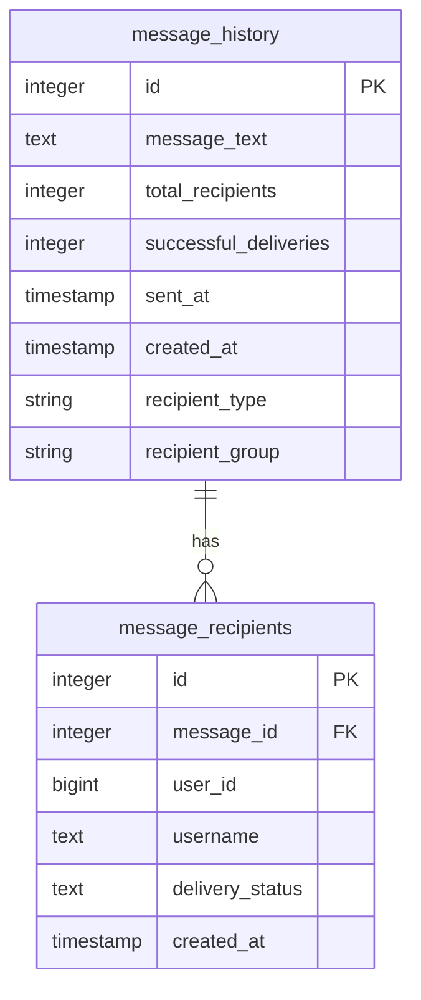
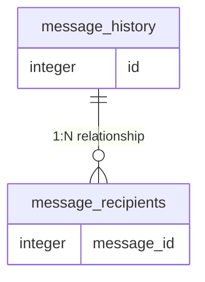
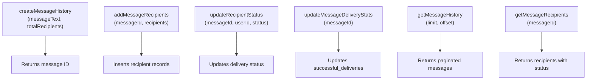
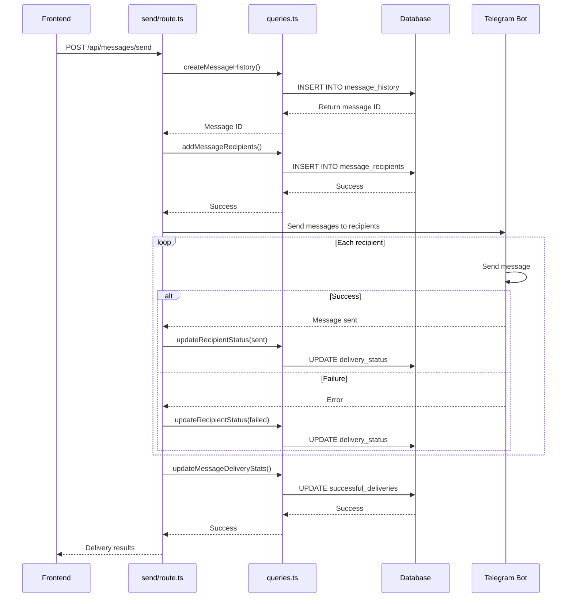
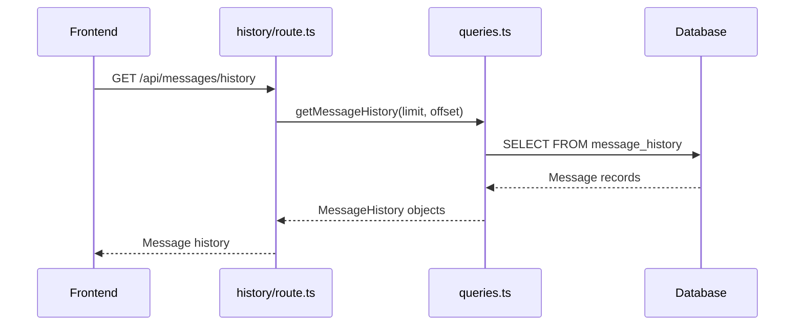
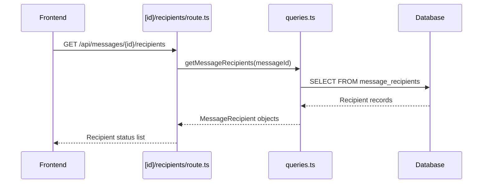

# Messaging System Schema

<cite>
**Referenced Files in This Document**   
- [DATABASE_MIGRATION_LOG.md](file://DATABASE_MIGRATION_LOG.md)
- [lib/queries.ts](file://lib/queries.ts)
- [app/api/messages/send/route.ts](file://app/api/messages/send/route.ts)
- [app/api/messages/history/route.ts](file://app/api/messages/history/route.ts)
- [app/api/messages/[id]/recipients/route.ts](file://app/api/messages/[id]/recipients/route.ts)
</cite>

## Table of Contents
1. [Introduction](#introduction)
2. [Data Model Overview](#data-model-overview)
3. [message_history Table](#message_history-table)
4. [message_recipients Table](#message_recipients-table)
5. [Foreign Key Relationship](#foreign-key-relationship)
6. [Database Indexes](#database-indexes)
7. [Query Functions](#query-functions)
8. [Data Access Workflows](#data-access-workflows)
9. [Schema Evolution](#schema-evolution)
10. [Conclusion](#conclusion)

## Introduction

The messaging system in the HSL Dashboard implements a robust message broadcasting functionality that enables administrators to send messages to users via Telegram. The system consists of two core database tables: `message_history` and `message_recipients`, which work together to track message content, delivery status, and recipient information. This documentation provides a comprehensive overview of the data model, including field definitions, constraints, indexes, and the application logic that interacts with these tables. The schema was implemented on September 2, 2025, to resolve the "relation 'message_history' does not exist" error and enable the message broadcasting feature.

## Data Model Overview

The messaging system employs a one-to-many relationship between message records and their recipients, with `message_history` serving as the parent table and `message_recipients` as the child table. This design allows for efficient tracking of broadcast messages sent to multiple users while maintaining delivery status for each individual recipient. The system supports both individual and group messaging, with metadata to distinguish between message types and recipient groups. The data model is optimized for common query patterns such as retrieving message history with pagination, fetching recipients for a specific message, and updating delivery statuses.



**Diagram sources**
- [DATABASE_MIGRATION_LOG.md](file://DATABASE_MIGRATION_LOG.md#L0-L67)

**Section sources**
- [DATABASE_MIGRATION_LOG.md](file://DATABASE_MIGRATION_LOG.md#L0-L67)

## message_history Table

The `message_history` table stores the core metadata for each broadcast message, serving as the primary record for message tracking and analytics. Each message is assigned a unique auto-incrementing ID that serves as the primary key and is referenced by the `message_recipients` table.

### Field Definitions

| Field | Data Type | Constraints | Description |
|-------|---------|-----------|-------------|
| id | SERIAL | PRIMARY KEY | Auto-incrementing unique identifier for the message |
| message_text | TEXT | NOT NULL | The content of the broadcast message |
| total_recipients | INTEGER | NOT NULL, DEFAULT 0 | Total number of users the message was sent to |
| successful_deliveries | INTEGER | DEFAULT 0 | Count of successful message deliveries |
| sent_at | TIMESTAMP WITH TIME ZONE | DEFAULT CURRENT_TIMESTAMP | Timestamp when the message was sent |
| created_at | TIMESTAMP WITH TIME ZONE | DEFAULT CURRENT_TIMESTAMP | Record creation timestamp |
| recipient_type | STRING | - | Type of message ('individual' or 'group') |
| recipient_group | STRING | - | Target group for group messages (e.g., '3rd_stream') |
| scheduled_at | STRING | - | ISO timestamp for scheduled messages |

The `message_text` field stores the actual content of the broadcast message, supporting up to 4096 characters for text messages. The `total_recipients` field is populated when the message is created and represents the total number of users who should receive the message. The `successful_deliveries` field is updated dynamically based on the delivery status of recipients in the `message_recipients` table. The `sent_at` field indicates when the message was actually sent, while `created_at` records when the message history entry was created. Additional fields like `recipient_type`, `recipient_group`, and `scheduled_at` provide metadata for message categorization and scheduling functionality.

**Section sources**
- [DATABASE_MIGRATION_LOG.md](file://DATABASE_MIGRATION_LOG.md#L0-L31)
- [lib/queries.ts](file://lib/queries.ts#L675-L694)

## message_recipients Table

The `message_recipients` table tracks the delivery status for each individual recipient of a broadcast message, enabling granular monitoring of message delivery success and failure.

### Field Definitions

| Field | Data Type | Constraints | Description |
|-------|---------|-----------|-------------|
| id | SERIAL | PRIMARY KEY | Auto-incrementing unique identifier |
| message_id | INTEGER | NOT NULL, FOREIGN KEY | References message_history.id with CASCADE DELETE |
| user_id | BIGINT | NOT NULL | Telegram user ID of the recipient |
| username | TEXT | - | Telegram username of the recipient (nullable) |
| delivery_status | TEXT | DEFAULT 'pending' | Current delivery status ('pending', 'sent', 'failed') |
| created_at | TIMESTAMP WITH TIME ZONE | DEFAULT CURRENT_TIMESTAMP | Record creation timestamp |
| telegram_message_id | INTEGER | - | Telegram's message ID for successful deliveries |

The `message_id` field creates a foreign key relationship with the `message_history` table, ensuring referential integrity. The `user_id` field stores the Telegram user ID as a BIGINT to accommodate the full range of possible Telegram user identifiers. The `username` field stores the recipient's Telegram username when available, allowing for user identification in the interface. The `delivery_status` field tracks the current state of message delivery with three possible values: 'pending' (message not yet sent), 'sent' (successful delivery), and 'failed' (delivery attempt failed). The `telegram_message_id` field stores the message ID assigned by Telegram upon successful delivery, enabling message deletion or editing through the Telegram API.

**Section sources**
- [DATABASE_MIGRATION_LOG.md](file://DATABASE_MIGRATION_LOG.md#L33-L67)
- [lib/queries.ts](file://lib/queries.ts#L697-L708)

## Foreign Key Relationship

The messaging system implements a critical foreign key relationship between `message_recipients.message_id` and `message_history.id` with CASCADE DELETE behavior, ensuring data consistency and integrity.



**Diagram sources**
- [DATABASE_MIGRATION_LOG.md](file://DATABASE_MIGRATION_LOG.md#L33-L67)

**Section sources**
- [DATABASE_MIGRATION_LOG.md](file://DATABASE_MIGRATION_LOG.md#L33-L67)

### Relationship Details

The foreign key constraint `message_id INTEGER NOT NULL REFERENCES message_history(id) ON DELETE CASCADE` establishes a parent-child relationship where each message in `message_history` can have multiple recipients in `message_recipients`, but each recipient record must belong to exactly one message. The CASCADE DELETE behavior means that when a message record is deleted from `message_history`, all corresponding recipient records in `message_recipients` are automatically deleted as well. This prevents orphaned records and maintains referential integrity without requiring application-level cleanup.

This relationship enables several important behaviors:
- **Data Consistency**: Ensures every recipient is associated with a valid message
- **Automatic Cleanup**: Removes recipient records when their parent message is deleted
- **Referential Integrity**: Prevents insertion of recipient records with invalid message IDs
- **Efficient Queries**: Enables JOIN operations between tables for comprehensive message analysis

The CASCADE DELETE behavior is particularly important for the messaging system's functionality, as it allows administrators to clean up message history without worrying about leaving behind orphaned recipient records. This is implemented at the database level, providing a reliable mechanism that works regardless of the application state.

## Database Indexes

The messaging system includes three strategically designed indexes to optimize query performance for common access patterns.

### Index Definitions

| Index Name | Columns | Purpose |
|-----------|--------|--------|
| idx_message_recipients_message_id | message_id | Fast lookups of recipients by message ID |
| idx_message_recipients_status | message_id, delivery_status | Efficient counting of delivery statuses by message |
| idx_message_recipients_user_id | user_id | Fast user lookups across messages |

```sql
CREATE INDEX idx_message_recipients_message_id ON message_recipients(message_id);
CREATE INDEX idx_message_recipients_status ON message_recipients(message_id, delivery_status);
CREATE INDEX idx_message_recipients_user_id ON message_recipients(user_id);
```

**Section sources**
- [DATABASE_MIGRATION_LOG.md](file://DATABASE_MIGRATION_LOG.md#L55-L67)

### Index Usage Analysis

The `idx_message_recipients_message_id` index optimizes queries that retrieve all recipients for a specific message, such as when displaying recipient delivery status in the dashboard. This single-column index on `message_id` enables fast lookups and is used by the `getMessageRecipients` function.

The composite `idx_message_recipients_status` index on `(message_id, delivery_status)` is designed for efficient aggregation queries that count recipients by delivery status for a specific message. This supports the calculation of delivery statistics and is particularly valuable for the `updateMessageDeliveryStats` function, which needs to count successful deliveries.

The `idx_message_recipients_user_id` index enables fast lookups of messages sent to a specific user, supporting user-centric queries and analysis. This index is valuable for auditing purposes and for understanding an individual user's message history.

These indexes were created to address the most common query patterns in the application, ensuring optimal performance for message history retrieval, recipient status tracking, and delivery statistics calculation.

## Query Functions

The messaging system's functionality is exposed through a set of well-defined query functions in the `lib/queries.ts` file, which encapsulate the database interactions and provide a clean API for the application.



**Diagram sources**
- [lib/queries.ts](file://lib/queries.ts#L675-L818)

**Section sources**
- [lib/queries.ts](file://lib/queries.ts#L675-L818)

### Core Functions

**createMessageHistory**: Creates a new message history record with the provided message text and recipient count, returning the generated message ID. This function is called when initiating a new message broadcast.

**addMessageRecipients**: Adds recipient records to the `message_recipients` table for a specific message ID. This bulk insert operation efficiently creates records for all intended recipients.

**updateRecipientStatus**: Updates the delivery status for a specific recipient of a message. This function is called after each delivery attempt to record whether the message was sent successfully or failed.

**updateMessageDeliveryStats**: Updates the `successful_deliveries` count in the `message_history` table by counting recipients with 'sent' status. This function maintains accurate delivery statistics.

**getMessageHistory**: Retrieves message history with pagination and optional filtering by recipient type or group. This function powers the message history display in the dashboard.

**getMessageRecipients**: Retrieves all recipients for a specific message with their delivery status. This function enables detailed recipient-level tracking.

## Data Access Workflows

The messaging system implements several key workflows that demonstrate how the data model supports real-world use cases.

### Message Sending Workflow



**Diagram sources**
- [app/api/messages/send/route.ts](file://app/api/messages/send/route.ts#L0-L372)
- [lib/queries.ts](file://lib/queries.ts#L675-L748)

**Section sources**
- [app/api/messages/send/route.ts](file://app/api/messages/send/route.ts#L0-L372)

The message sending workflow begins when the frontend submits a POST request to `/api/messages/send` with the message content and recipient list. The API first creates a message history record, then adds recipient records to track delivery status. It then attempts to send the message to each recipient through the Telegram Bot API, updating the delivery status for each recipient based on the outcome. Finally, it updates the overall delivery statistics in the message history record.

### Message History Retrieval Workflow



**Diagram sources**
- [app/api/messages/history/route.ts](file://app/api/messages/history/route.ts#L0-L65)
- [lib/queries.ts](file://lib/queries.ts#L751-L795)

**Section sources**
- [app/api/messages/history/route.ts](file://app/api/messages/history/route.ts#L0-L65)

The message history retrieval workflow allows the frontend to fetch a paginated list of sent messages. The API calls `getMessageHistory` with optional filters and pagination parameters, which executes a SELECT query against the `message_history` table. The results are returned as a JSON array for display in the dashboard.

### Recipient Status Retrieval Workflow



**Diagram sources**
- [app/api/messages/[id]/recipients/route.ts](file://app/api/messages/[id]/recipients/route.ts#L0-L27)
- [lib/queries.ts](file://lib/queries.ts#L798-L818)

**Section sources**
- [app/api/messages/[id]/recipients/route.ts](file://app/api/messages/[id]/recipients/route.ts#L0-L27)

The recipient status retrieval workflow enables detailed tracking of message delivery for a specific message. When the frontend requests recipient information for a message ID, the API calls `getMessageRecipients`, which queries the `message_recipients` table for all recipients of that message. The results include each recipient's delivery status, allowing administrators to see exactly who received the message and who did not.

## Schema Evolution

The messaging system schema was implemented on September 2, 2025, as documented in the `DATABASE_MIGRATION_LOG.md` file. The migration was completed successfully and resolved the "relation 'message_history' does not exist" error that was preventing the message broadcasting functionality from working.

### Migration Details

The schema was created using a secure, transaction-based approach through the `/app/api/db-migrate/route.ts` endpoint. The migration included:
- Creation of the `message_history` table with appropriate fields and constraints
- Creation of the `message_recipients` table with foreign key relationship
- Creation of three performance-optimizing indexes
- Verification of compatibility with existing code in `lib/queries.ts`

All existing functions in `lib/queries.ts` were found to be compatible with the new schema, requiring no modifications. The migration was tested thoroughly using the `/app/api/test-messages/route.ts` endpoint, which confirmed that all functions work correctly and that delivery statistics are updated accurately.

The implementation was completed in approximately 15 minutes, under the original 20-30 minute estimate. The migration included comprehensive documentation in `DATABASE_MIGRATION_LOG.md`, which details the schema, indexes, compatibility status, testing results, and rollback procedures.

**Section sources**
- [DATABASE_MIGRATION_LOG.md](file://DATABASE_MIGRATION_LOG.md#L0-L172)

## Conclusion

The messaging system schema provides a robust foundation for message broadcasting functionality in the HSL Dashboard. The two-table design with a one-to-many relationship between `message_history` and `message_recipients` effectively separates message metadata from delivery status tracking, enabling efficient queries and accurate statistics. The foreign key relationship with CASCADE DELETE ensures data integrity, while the strategically designed indexes optimize performance for common access patterns.

The schema is well-integrated with the application code through a set of well-defined query functions that encapsulate database interactions. These functions support key workflows including message sending, history retrieval, and recipient status tracking. The implementation was completed successfully on September 2, 2025, and has been tested to ensure compatibility with the existing codebase.

The messaging system is now fully operational and supports both individual and group messaging with comprehensive delivery tracking. Future enhancements could include additional auditing capabilities, message templates, or enhanced filtering options for message history, but the current schema provides a solid foundation for these potential extensions.