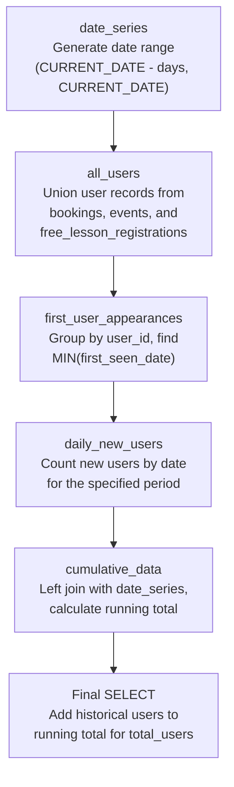
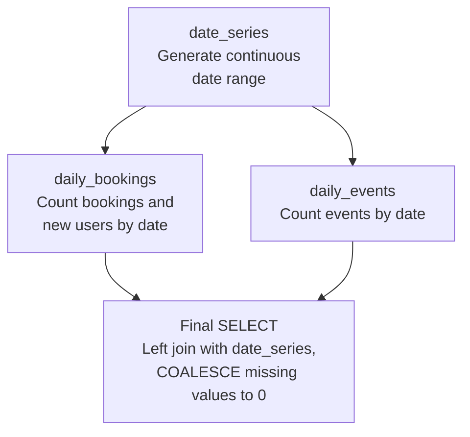
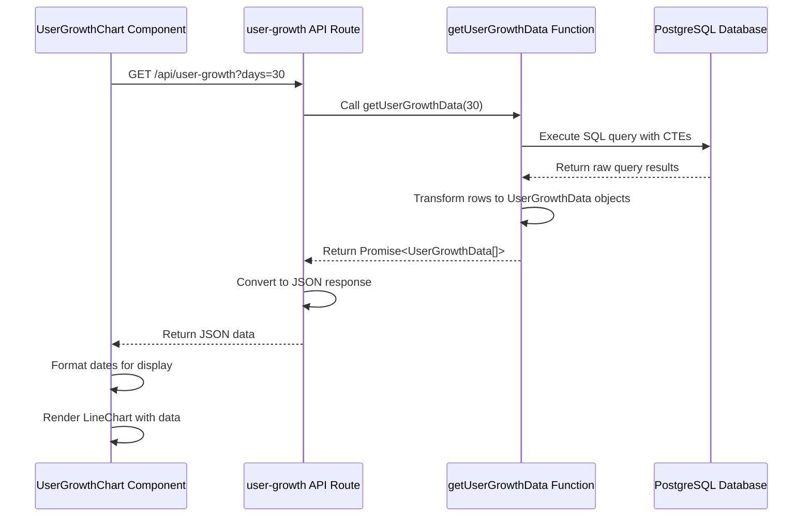
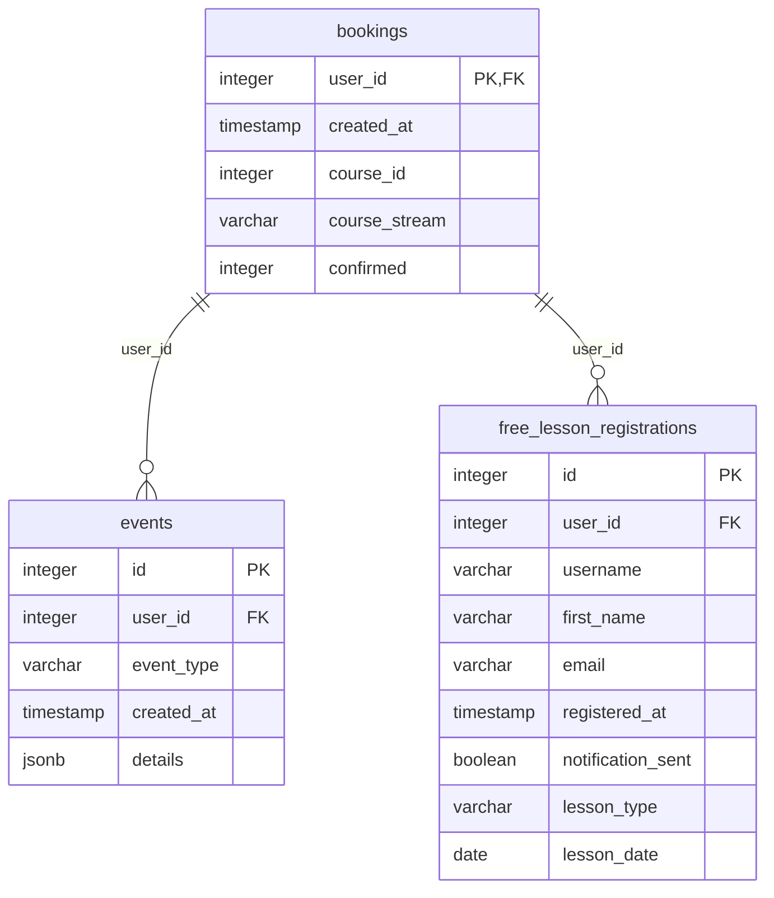
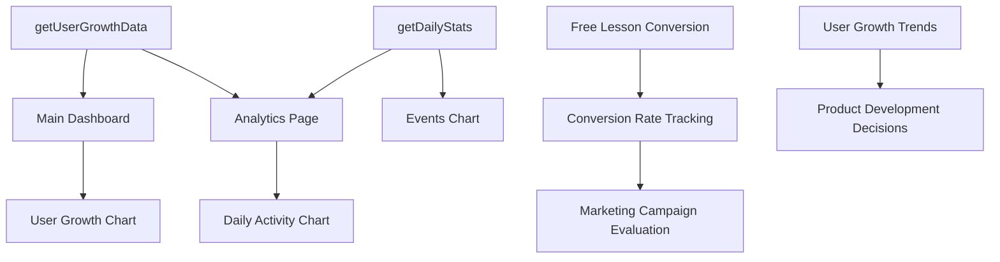

# Analytics Queries

<cite>
**Referenced Files in This Document**   
- [queries.ts](file://lib/queries.ts)
- [UserGrowthChart.tsx](file://components/UserGrowthChart.tsx)
- [route.ts](file://app/api/user-growth/route.ts)
- [page.tsx](file://app/page.tsx)
- [EventsChart.tsx](file://components/EventsChart.tsx)
- [page.tsx](file://app/analytics/page.tsx)
</cite>

## Table of Contents
1. [Introduction](#introduction)
2. [Core Analytics Functions](#core-analytics-functions)
3. [User Growth Data Query](#user-growth-data-query)
4. [Daily Statistics Query](#daily-statistics-query)
5. [Data Integration and Transformation](#data-integration-and-transformation)
6. [Query Performance and Optimization](#query-performance-and-optimization)
7. [Usage Examples and Applications](#usage-examples-and-applications)
8. [Conclusion](#conclusion)

## Introduction

The hsl-dashboard application features a comprehensive analytics system designed to track user growth, engagement, and conversion metrics. At the core of this system are two primary query functions: `getUserGrowthData` and `getDailyStats`, both implemented in the `queries.ts` file. These functions leverage PostgreSQL's advanced analytical capabilities, including Common Table Expressions (CTEs) and window functions, to generate time-series data for trend analysis. The data is consumed by various dashboard components, particularly the `UserGrowthChart` component, which visualizes user growth patterns. The queries are exposed through API routes and integrated into multiple pages, including the main dashboard and analytics page, providing stakeholders with insights into user acquisition and engagement patterns.

## Core Analytics Functions

The analytics system is built around two key functions that provide time-series data for different analytical purposes. These functions are designed to handle complex data aggregation across multiple tables while ensuring gap-free time series output through the use of date series generation.

**Section sources**
- [queries.ts](file://lib/queries.ts#L244-L292)
- [queries.ts](file://lib/queries.ts#L474-L539)

## User Growth Data Query

The `getUserGrowthData` function is a sophisticated analytics query that calculates daily and cumulative user growth over a configurable time period. It employs a multi-step CTE approach to accurately track user acquisition across different touchpoints in the application.

**Diagram sources**
- [queries.ts](file://lib/queries.ts#L474-L539)

The query begins with a `date_series` CTE that generates a continuous sequence of dates for the specified time period using PostgreSQL's `generate_series` function. This ensures that the output contains entries for every day, even days with no new users. The `all_users` CTE combines user records from three different tables—bookings, events, and free_lesson_registrations—using UNION to create a comprehensive view of all user interactions. The `first_user_appearances` CTE then groups these records by user_id and determines the first date each user appeared across any of the tables, effectively deduplicating users and identifying their acquisition date. The `daily_new_users` CTE counts the number of new users for each date within the specified time period. The `cumulative_data` CTE performs a LEFT JOIN between the date series and daily new users, using COALESCE to handle days with no new users (treating them as zero). It then applies a window function with SUM OVER to calculate the running total of new users. Finally, the main query selects the date, new users count, and total users, where total users is calculated as the running total plus the count of users who existed before the analysis period (historical users).

**Section sources**
- [queries.ts](file://lib/queries.ts#L474-L539)

## Daily Statistics Query

The `getDailyStats` function provides a comprehensive view of daily activity across multiple metrics, including new users, bookings, and events. Like the user growth query, it uses CTEs and date series generation to ensure consistent time-series output.

**Diagram sources**
- [queries.ts](file://lib/queries.ts#L244-L292)

The query starts with a `date_series` CTE that creates a continuous sequence of dates for the specified time period. This is joined with two data CTEs: `daily_bookings`, which counts both total bookings and distinct new users (based on user_id) for each date, and `daily_events`, which counts total events for each date. The main query performs LEFT JOINs between the date series and these data CTEs, ensuring that every date in the range appears in the output, even if there were no bookings or events on that date. The COALESCE function is used to replace NULL values (resulting from the LEFT JOIN on dates with no activity) with zeros, maintaining data consistency. The result is a comprehensive daily statistics record that can be used to analyze trends and correlations between different types of user activity.

**Section sources**
- [queries.ts](file://lib/queries.ts#L244-L292)

## Data Integration and Transformation

The analytics data flows from the database queries through API routes to frontend components, with transformation occurring at multiple stages to optimize for display.

**Diagram sources**
- [queries.ts](file://lib/queries.ts#L474-L539)
- [route.ts](file://app/api/user-growth/route.ts)
- [UserGrowthChart.tsx](file://components/UserGrowthChart.tsx)

The integration begins with the `UserGrowthChart` component, which receives data through its props. This data is fetched from the `/api/user-growth` endpoint, implemented in `route.ts`. The API route calls the `getUserGrowthData` function with the specified number of days (defaulting to 30). The function executes the complex SQL query and transforms the raw database rows into `UserGrowthData` objects, parsing date strings and converting numeric values from strings to integers. The API route then returns this data as a JSON response. On the frontend, the `UserGrowthChart` component receives the data and performs additional transformation, formatting the ISO date strings into a more readable format (short month and numeric day) for display on the x-axis. The component uses the Recharts library to render a line chart with two data series: total users (displayed in the primary color) and new users (displayed in green), providing a clear visual representation of user growth trends.

**Section sources**
- [queries.ts](file://lib/queries.ts#L474-L539)
- [route.ts](file://app/api/user-growth/route.ts)
- [UserGrowthChart.tsx](file://components/UserGrowthChart.tsx)
- [page.tsx](file://app/page.tsx)

## Query Performance and Optimization

The analytics queries are designed with performance considerations in mind, particularly regarding indexing strategies and query execution efficiency.

**Diagram sources**
- [queries.ts](file://lib/queries.ts#L474-L539)

For optimal performance, the database should have indexes on the date fields used in the WHERE clauses and JOIN conditions. Specifically, indexes on `bookings.created_at`, `events.created_at`, and `free_lesson_registrations.registered_at` would significantly improve query performance, especially as the dataset grows. The use of CTEs allows PostgreSQL to optimize the query execution plan, potentially materializing intermediate results when beneficial. The date series generation ensures that the application doesn't need to handle missing dates in the frontend logic, reducing client-side processing. The window function used for the running total calculation is generally efficient, as it operates on the already-aggregated daily data rather than the raw transaction records. For very large datasets, consider adding covering indexes that include both the date field and user_id to optimize the GROUP BY operations in the CTEs.

**Section sources**
- [queries.ts](file://lib/queries.ts#L474-L539)

## Usage Examples and Applications

The analytics queries support various trend analysis and conversion tracking use cases across the application.

**Diagram sources**
- [page.tsx](file://app/page.tsx)
- [page.tsx](file://app/analytics/page.tsx)
- [EventsChart.tsx](file://components/EventsChart.tsx)

The `getUserGrowthData` function is primarily used on the main dashboard page (`page.tsx`) to power the User Growth Chart, which displays the cumulative user base and daily new users. This visualization helps stakeholders understand the overall growth trajectory of the platform. The `getDailyStats` function is used in the analytics page (`analytics/page.tsx`) to provide a comprehensive view of daily activity, including new users, bookings, and events. This data is displayed in both summary metrics and a detailed line chart, allowing for analysis of correlations between different types of user engagement. Together, these queries enable conversion rate tracking by providing the numerator (free lesson registrations, bookings) and denominator (total users) for various conversion funnels. Marketing teams can use this data to evaluate the effectiveness of campaigns, while product teams can identify trends that inform development priorities. The time-series nature of the data also supports forecasting and capacity planning.

**Section sources**
- [page.tsx](file://app/page.tsx)
- [page.tsx](file://app/analytics/page.tsx)
- [EventsChart.tsx](file://components/EventsChart.tsx)

## Conclusion

The analytics queries in hsl-dashboard demonstrate a sophisticated approach to time-series data analysis using PostgreSQL's advanced SQL features. The `getUserGrowthData` and `getDailyStats` functions employ CTEs, window functions, and date series generation to provide comprehensive, gap-free analytics data. The integration between the database queries, API routes, and frontend components is well-structured, with appropriate data transformation at each layer. The queries are designed to support critical business intelligence functions, including user growth tracking, engagement analysis, and conversion rate monitoring. With proper indexing on date fields, these queries should perform efficiently even as the dataset grows. The modular design allows for easy extension to support additional metrics or time periods, making the analytics system adaptable to evolving business requirements.