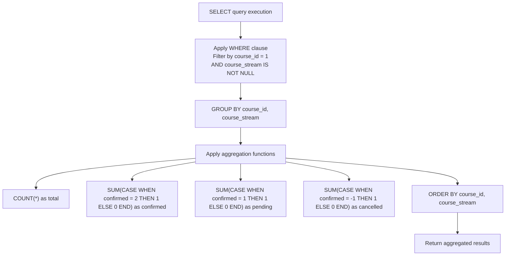
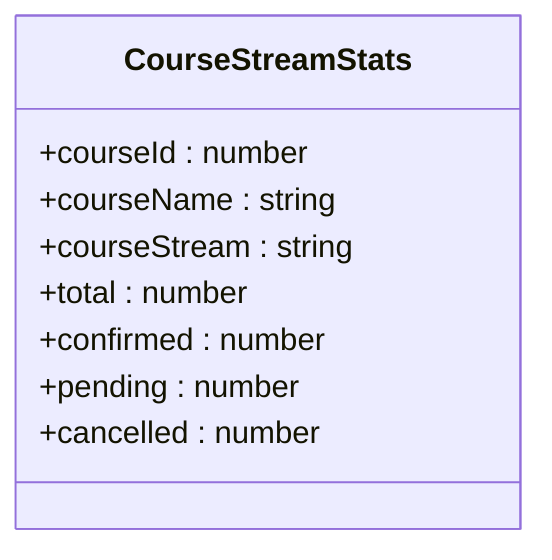
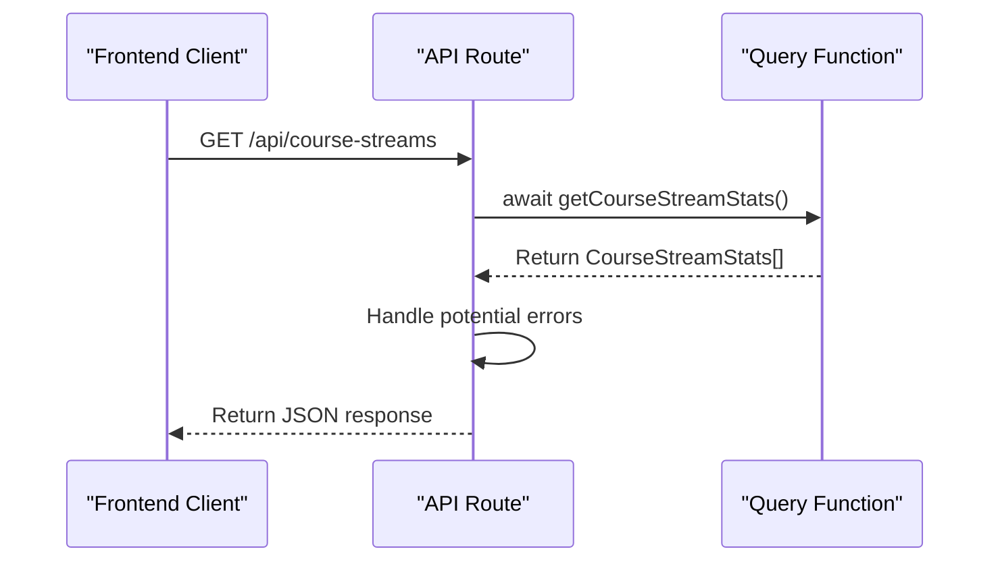
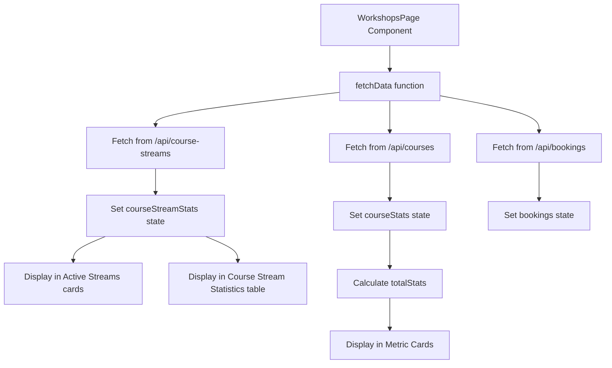

# Course Management Queries

<cite>
**Referenced Files in This Document**   
- [queries.ts](file://lib/queries.ts)
- [workshops/page.tsx](file://app/workshops/page.tsx)
- [course-streams/route.ts](file://app/api/course-streams/route.ts)
</cite>

## Table of Contents
1. [Introduction](#introduction)
2. [Core Query Function](#core-query-function)
3. [SQL Query Structure](#sql-query-structure)
4. [Data Transformation and Mapping](#data-transformation-and-mapping)
5. [Interface Definition](#interface-definition)
6. [API Endpoint](#api-endpoint)
7. [Frontend Consumption](#frontend-consumption)
8. [Performance Considerations](#performance-considerations)

## Introduction
This document provides comprehensive documentation for the course management query functions in the hsl-dashboard application, with a primary focus on the `getCourseStreamStats` function. This function retrieves booking statistics segmented by course stream, enabling detailed analytics for course management. The documentation covers the SQL query structure, data transformation logic, interface definitions, API integration, and frontend consumption patterns that support the workshops analytics page.

## Core Query Function

The `getCourseStreamStats` function is the central component for retrieving course stream booking statistics. It executes a PostgreSQL query to aggregate booking data by course and stream, then transforms the results into a human-readable format. The function is designed to provide comprehensive insights into registration patterns across different course streams.

**Section sources**
- [queries.ts](file://lib/queries.ts#L178-L218)

## SQL Query Structure

The SQL query within `getCourseStreamStats` employs several key database concepts to efficiently aggregate booking data:



**Diagram sources**
- [queries.ts](file://lib/queries.ts#L178-L218)

**Section sources**
- [queries.ts](file://lib/queries.ts#L178-L218)

### GROUP BY Clause
The query uses a composite `GROUP BY` clause on both `course_id` and `course_stream` columns. This creates distinct groups for each unique combination of course and stream, allowing the aggregation functions to calculate statistics for each specific course-stream pairing.

### Conditional Aggregation
The query implements conditional aggregation using `CASE WHEN` statements within `SUM` functions to categorize bookings based on their confirmation status:
- **Confirmed bookings**: `SUM(CASE WHEN confirmed = 2 THEN 1 ELSE 0 END)` counts bookings with a confirmation status of 2 (fully confirmed/paid)
- **Pending bookings**: `SUM(CASE WHEN confirmed = 1 THEN 1 ELSE 0 END)` counts bookings with a confirmation status of 1 (pending payment)
- **Cancelled bookings**: `SUM(CASE WHEN confirmed = -1 THEN 1 ELSE 0 END)` counts bookings with a confirmation status of -1 (cancelled)

This approach allows the query to perform multiple aggregations in a single pass through the data, improving efficiency compared to multiple separate queries.

## Data Transformation and Mapping

After retrieving the raw database results, the function applies two levels of data transformation to enhance readability and usability:

### Course ID to Name Mapping
The function maps numeric course IDs to human-readable course names using a lookup object:
```typescript
const courseNames: { [key: number]: string } = {
  1: 'Вайб кодинг'
};
```

### Stream Identifier to Human-Readable Name Mapping
The function converts technical stream identifiers to localized, human-readable names:
```typescript
const streamNames: { [key: string]: string } = {
  '3rd_stream': '3-й поток',
  '4th_stream': '4-й поток',
  '5th_stream': '5-й поток'
};
```

This mapping logic transforms technical database values like '3rd_stream' into user-friendly display names like '3-й поток', improving the user experience on the frontend interface.

**Section sources**
- [queries.ts](file://lib/queries.ts#L178-L218)

## Interface Definition

The `CourseStreamStats` interface defines the structure of the data returned by the `getCourseStreamStats` function, ensuring type safety and consistency across the application.



**Diagram sources**
- [queries.ts](file://lib/queries.ts#L18-L26)

**Section sources**
- [queries.ts](file://lib/queries.ts#L18-L26)

The interface includes the following properties:
- `courseId`: Numeric identifier for the course
- `courseName`: Human-readable name of the course
- `courseStream`: Localized name of the course stream
- `total`: Total number of bookings in the stream
- `confirmed`: Count of confirmed bookings (payment completed)
- `pending`: Count of pending bookings (awaiting payment confirmation)
- `cancelled`: Count of cancelled bookings

## API Endpoint

The `getCourseStreamStats` function is exposed through a dedicated API route that handles HTTP GET requests and returns the course stream statistics in JSON format.



**Diagram sources**
- [course-streams/route.ts](file://app/api/course-streams/route.ts#L1-L14)

**Section sources**
- [course-streams/route.ts](file://app/api/course-streams/route.ts#L1-L14)

The API endpoint implements proper error handling, logging any errors that occur during query execution and returning an appropriate HTTP 500 status code with an error message when necessary.

## Frontend Consumption

The course stream statistics are consumed by the workshops page component, which displays the data in multiple visual formats for analytics purposes.



**Diagram sources**
- [workshops/page.tsx](file://app/workshops/page.tsx#L43-L243)

**Section sources**
- [workshops/page.tsx](file://app/workshops/page.tsx#L43-L243)

The frontend component uses the course stream data in several ways:
1. **Active Streams cards**: Displaying each course stream as a card with the course name, stream name, and total student count
2. **Course Stream Statistics table**: Presenting detailed statistics including total, confirmed, pending, and cancelled bookings, along with conversion rates
3. **Metric Cards**: Aggregating data across all streams to show overall registration metrics

## Performance Considerations

The current implementation has several performance implications that should be considered:

### Query Filtering
The SQL query filters results by `course_id = 1`, which limits the dataset to a single course. While this reduces the query scope, it also hardcodes the course ID, potentially limiting reusability. For optimal performance, this filter should leverage database indexes.

### Indexing Recommendations
To optimize query performance, the following composite index should be created on the bookings table:
```sql
CREATE INDEX idx_bookings_course_stream_confirmed 
ON bookings(course_id, course_stream, confirmed) 
WHERE course_stream IS NOT NULL;
```

This composite index would significantly improve query performance by:
- Allowing efficient filtering on `course_id`
- Enabling quick grouping by `course_stream`
- Optimizing the conditional aggregation on `confirmed` status
- Applying a partial index condition to exclude NULL stream values

Without proper indexing, the query may perform full table scans, leading to performance degradation as the bookings table grows.

### Data Type Considerations
The function uses `parseInt()` to convert database string values to numbers. While this ensures proper numeric types, it adds processing overhead. If the database column types are properly defined as integers, this conversion may be unnecessary.

**Section sources**
- [queries.ts](file://lib/queries.ts#L178-L218)