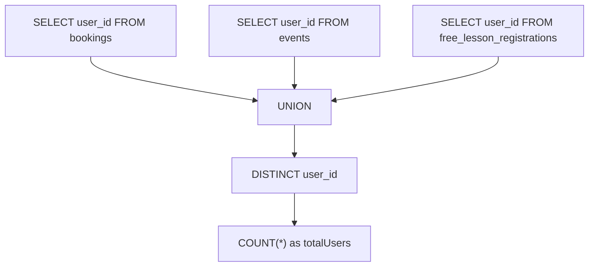
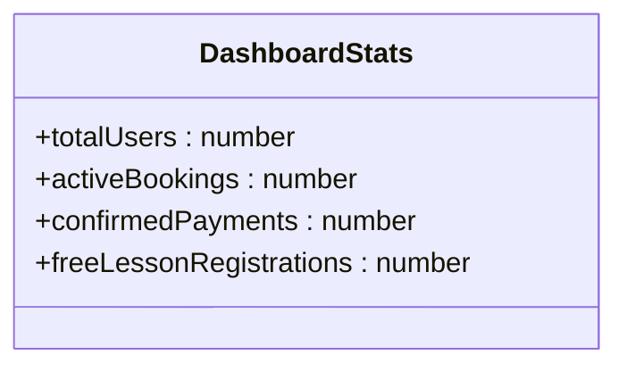
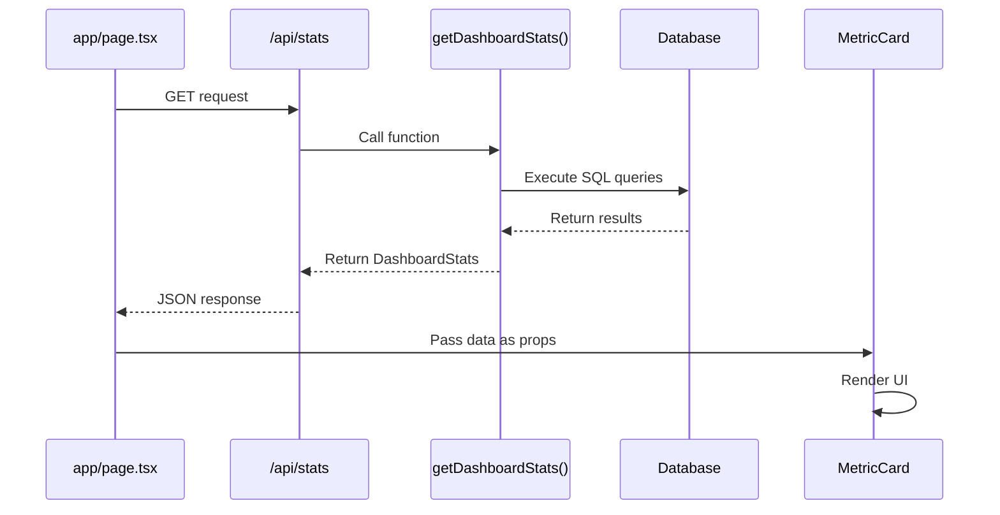
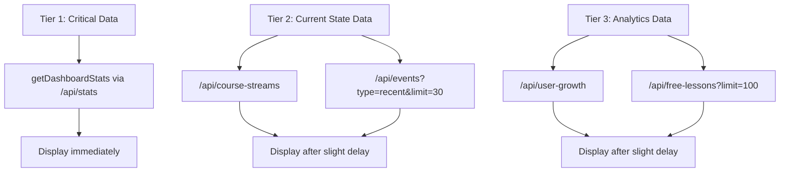
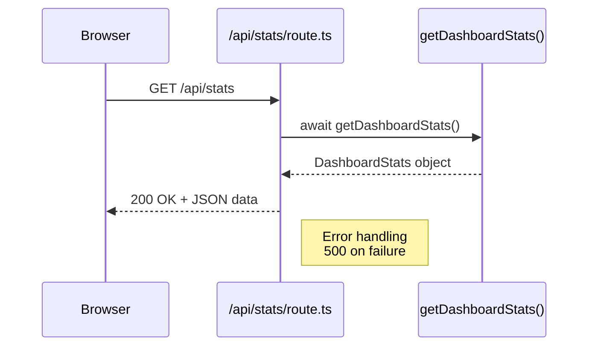
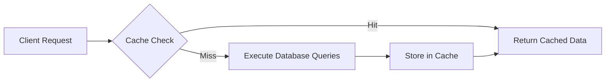

# Dashboard Queries

<cite>
**Referenced Files in This Document**   
- [lib/queries.ts](file://lib/queries.ts)
- [app/api/stats/route.ts](file://app/api/stats/route.ts)
- [app/page.tsx](file://app/page.tsx)
- [components/MetricCard.tsx](file://components/MetricCard.tsx)
</cite>

## Table of Contents
1. [Introduction](#introduction)
2. [Core Function Analysis](#core-function-analysis)
3. [SQL Query Logic](#sql-query-logic)
4. [TypeScript Interface Definition](#typescript-interface-definition)
5. [Frontend Integration](#frontend-integration)
6. [API Route Implementation](#api-route-implementation)
7. [Performance Considerations](#performance-considerations)
8. [Conclusion](#conclusion)

## Introduction
This document provides comprehensive documentation for the dashboard-related query functions in the hsl-dashboard application, with a primary focus on the `getDashboardStats` function. The analysis covers the complete data flow from database queries to frontend visualization, including the SQL logic for aggregating key metrics, TypeScript interface definitions, API route implementation, and frontend component integration. The document also examines the tiered data loading strategy employed by the main dashboard page and provides performance optimization recommendations.

## Core Function Analysis

The `getDashboardStats` function serves as the central data aggregation point for the dashboard, retrieving four key metrics: total users, active bookings, confirmed payments, and free lesson registrations. This function is implemented in the queries module and follows a consistent pattern of database connection management, query execution, and result processing.

The function establishes a database connection using a connection pool, executes four separate SQL queries to gather the required metrics, processes the results to ensure proper data types, and releases the connection regardless of success or failure through a try-finally block. This implementation ensures efficient resource management and prevents connection leaks.

**Section sources**
- [lib/queries.ts](file://lib/queries.ts#L102-L140)

## SQL Query Logic

### User Aggregation with UNION Operations
The `getDashboardStats` function employs a sophisticated SQL query to calculate the total number of unique users across multiple tables. This is achieved through a UNION operation that combines user IDs from three different sources: bookings, events, and free_lesson_registrations.



**Diagram sources**
- [lib/queries.ts](file://lib/queries.ts#L105-L111)

The query structure uses a subquery with UNION to combine user IDs from all three tables, ensuring that duplicate user IDs are eliminated through the DISTINCT clause. This approach provides an accurate count of unique users who have interacted with any aspect of the platform, regardless of whether they've made bookings, attended events, or registered for free lessons.

### Active Bookings Filtering
The function implements a specific filtering logic to identify active bookings by excluding cancelled reservations. The SQL query uses the condition `confirmed != -1` to filter out cancelled bookings:

```sql
SELECT COUNT(*) as count FROM bookings WHERE confirmed != -1
```

This logic treats any booking with a confirmation status other than -1 as active, which includes pending (status 1) and confirmed (status 2) bookings while excluding only explicitly cancelled ones.

### Confirmed Payments Identification
For tracking confirmed payments, the function uses a precise equality check to identify successfully processed transactions:

```sql
SELECT COUNT(*) as count FROM bookings WHERE confirmed = 2
```

This query specifically targets bookings with a confirmation status of 2, which represents fully confirmed and paid reservations. This targeted approach ensures accurate reporting of completed transactions.

**Section sources**
- [lib/queries.ts](file://lib/queries.ts#L113-L138)

## TypeScript Interface Definition

The `DashboardStats` interface defines the structure of the data returned by the `getDashboardStats` function. This TypeScript interface ensures type safety and provides clear documentation of the expected response format.



**Diagram sources**
- [lib/queries.ts](file://lib/queries.ts#L2-L7)

The interface specifies four properties, each representing a key metric displayed on the dashboard:
- `totalUsers`: The count of unique users across all platform interactions
- `activeBookings`: The number of non-cancelled booking records
- `confirmedPayments`: The count of successfully processed payments
- `freeLessonRegistrations`: The total number of free lesson sign-ups

This strongly-typed interface is used both in the backend implementation and frontend consumption, ensuring consistency across the application.

**Section sources**
- [lib/queries.ts](file://lib/queries.ts#L2-L7)
- [app/page.tsx](file://app/page.tsx#L14-L19)

## Frontend Integration

### MetricCard Component
The dashboard metrics are visualized using the `MetricCard` component, which receives the data from the `getDashboardStats` function and renders it in a consistent, visually appealing format.



**Diagram sources**
- [components/MetricCard.tsx](file://components/MetricCard.tsx#L1-L48)
- [app/page.tsx](file://app/page.tsx#L14-L19)

The `MetricCard` component accepts several props including title, value, icon, and optional trend information, allowing for flexible reuse across different metrics. It uses UI components like Card, CardHeader, and CardContent to create a consistent visual hierarchy.

### Tiered Data Loading Strategy
The main dashboard page implements a tiered data loading strategy to prioritize critical information and improve perceived performance:



**Diagram sources**
- [app/page.tsx](file://app/page.tsx#L45-L100)

The strategy prioritizes loading the most critical metrics first (Tier 1), followed by current state data (Tier 2) and analytics data (Tier 3) with a slight delay. This ensures that users see the most important information quickly while less critical data loads in the background.

**Section sources**
- [app/page.tsx](file://app/page.tsx#L45-L268)
- [components/MetricCard.tsx](file://components/MetricCard.tsx#L1-L48)

## API Route Implementation

The `getDashboardStats` function is exposed through a dedicated API route that handles HTTP requests and returns the aggregated statistics in JSON format.



**Diagram sources**
- [app/api/stats/route.ts](file://app/api/stats/route.ts#L1-L15)

The API route is implemented as a Next.js server-side function that imports the `getDashboardStats` function from the queries module. It wraps the function call in a try-catch block to handle potential errors gracefully, returning a 500 status code with an error message if the database query fails. The route also initializes application services through the import of the init module.

**Section sources**
- [app/api/stats/route.ts](file://app/api/stats/route.ts#L1-L15)

## Performance Considerations

### Query Execution Optimization
The current implementation executes four separate database queries, which could be optimized for better performance. Each query requires a round-trip to the database, potentially increasing latency.

A more efficient approach would combine these queries into a single execution using Common Table Expressions (CTEs) or subqueries, reducing the number of database round-trips:

```sql
WITH user_counts AS (
  SELECT COUNT(DISTINCT user_id) as total_users FROM (
    SELECT user_id FROM bookings
    UNION
    SELECT user_id FROM events
    UNION
    SELECT user_id FROM free_lesson_registrations
  ) AS all_users
),
booking_counts AS (
  SELECT 
    COUNT(CASE WHEN confirmed != -1 THEN 1 END) as active_bookings,
    COUNT(CASE WHEN confirmed = 2 THEN 1 END) as confirmed_payments
  FROM bookings
),
free_lesson_counts AS (
  SELECT COUNT(*) as free_lesson_registrations FROM free_lesson_registrations
)
SELECT 
  uc.total_users,
  bc.active_bookings,
  bc.confirmed_payments,
  flc.free_lesson_registrations
FROM user_counts uc, booking_counts bc, free_lesson_counts flc;
```

### Indexing Recommendations
To improve query performance, appropriate database indexes should be created on the status flags used in the WHERE clauses:

```sql
-- Index for active bookings filter
CREATE INDEX IF NOT EXISTS idx_bookings_confirmed ON bookings(confirmed);

-- Composite index for potential future queries
CREATE INDEX IF NOT EXISTS idx_bookings_user_confirmed ON bookings(user_id, confirmed);
```

These indexes would significantly speed up the filtering operations, especially as the dataset grows. The single-column index on the confirmed field would optimize the WHERE conditions, while a composite index could benefit queries that filter by both user and confirmation status.

### Caching Strategy
Given that these statistics don't need to be real-time, implementing a caching layer could dramatically reduce database load:



A caching strategy with a TTL (Time To Live) of 5-15 minutes would provide fresh-enough data while significantly reducing the frequency of expensive database queries.

**Section sources**
- [lib/queries.ts](file://lib/queries.ts#L102-L140)

## Conclusion
The `getDashboardStats` function and its associated components form a critical part of the hsl-dashboard application, providing essential metrics for monitoring platform performance. The current implementation effectively aggregates data from multiple sources using UNION operations and precise filtering logic, with a well-defined TypeScript interface ensuring type safety.

The tiered loading strategy implemented in the main dashboard page prioritizes critical information, improving user experience by displaying key metrics quickly. However, there are opportunities for performance optimization through query consolidation, proper indexing, and caching strategies. These improvements would reduce database load and improve response times, especially as the application scales.

The modular architecture, with clear separation between data retrieval, API exposure, and frontend visualization, provides a solid foundation that can be extended to support additional metrics and more sophisticated analytics in the future.