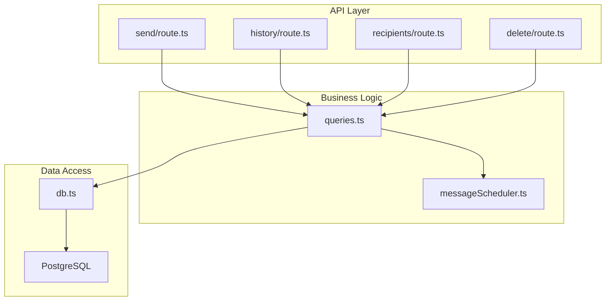
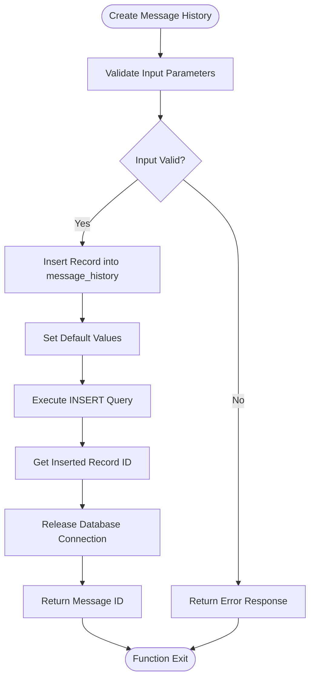
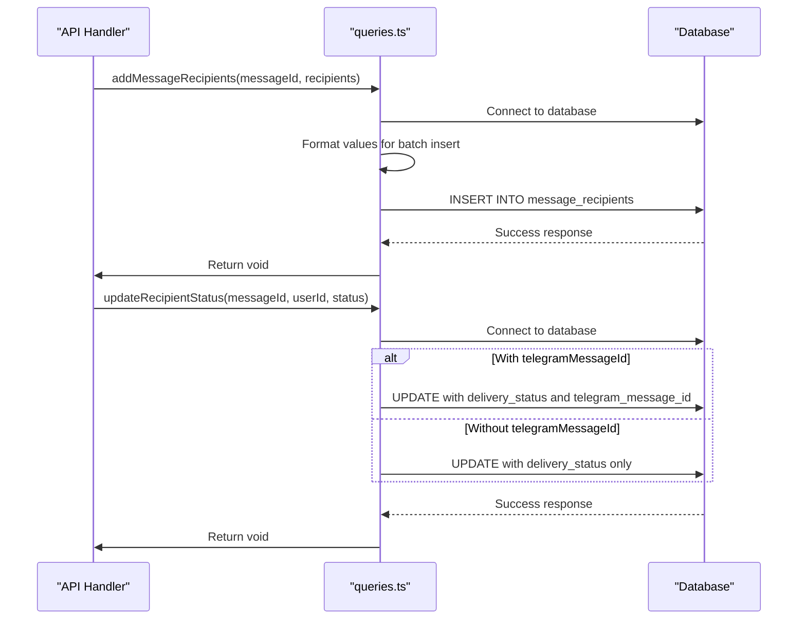
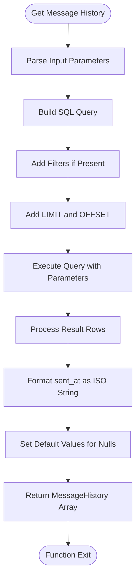
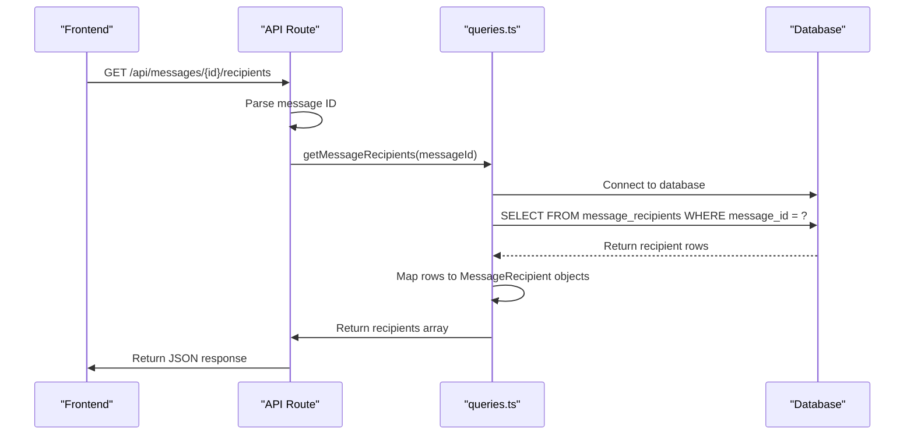
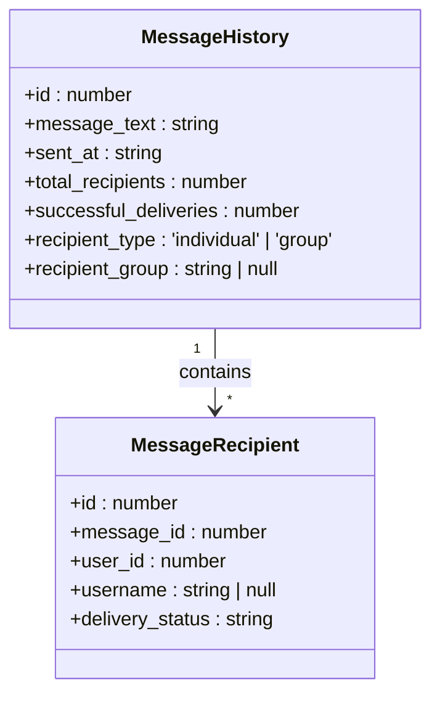
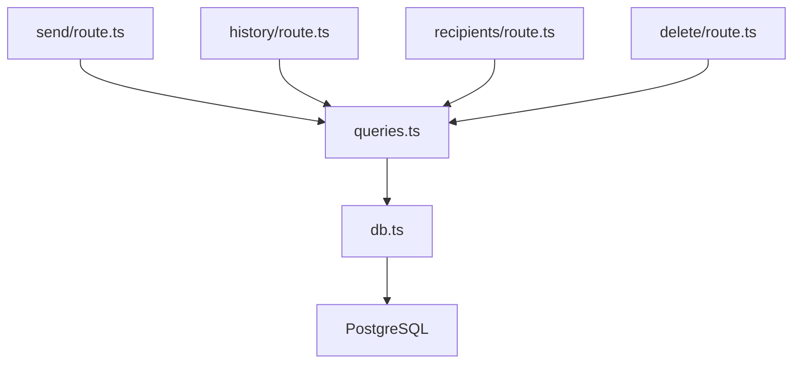

# Messaging System Queries

<cite>
**Referenced Files in This Document**   
- [queries.ts](file://lib/queries.ts)
- [db.ts](file://lib/db.ts)
- [send/route.ts](file://app/api/messages/send/route.ts)
- [history/route.ts](file://app/api/messages/history/route.ts)
- [recipients/route.ts](file://app/api/messages/[id]/recipients/route.ts)
</cite>

## Table of Contents
1. [Introduction](#introduction)
2. [Core Components](#core-components)
3. [Architecture Overview](#architecture-overview)
4. [Detailed Component Analysis](#detailed-component-analysis)
5. [Dependency Analysis](#dependency-analysis)
6. [Performance Considerations](#performance-considerations)
7. [Troubleshooting Guide](#troubleshooting-guide)
8. [Conclusion](#conclusion)

## Introduction
The messaging system in hsl-dashboard provides a comprehensive solution for managing message delivery workflows, tracking delivery status, and maintaining message history. This documentation details the core query functions that support both individual and group messaging use cases, with emphasis on transaction safety, error handling, and integration with the Telegram messaging platform. The system is designed to handle message creation, recipient management, status tracking, and historical retrieval with robust error handling and audit logging capabilities.

## Core Components

The messaging system consists of several key components that work together to manage the complete message lifecycle. The core functionality is implemented in the `queries.ts` file, which contains functions for creating message history records, managing recipients, updating delivery status, and retrieving message data with filtering and pagination capabilities. These functions interact with PostgreSQL database tables through a connection pool managed by the `db.ts` module. The system supports both immediate and scheduled message delivery, with comprehensive validation and error handling at each stage of the process.

**Section sources**
- [queries.ts](file://lib/queries.ts#L674-L818)
- [db.ts](file://lib/db.ts#L0-L52)

## Architecture Overview

The messaging system follows a layered architecture with clear separation of concerns between the API layer, business logic, and data access components. The API routes in the `app/api/messages` directory handle HTTP requests and responses, while the core messaging logic is encapsulated in the `lib/queries.ts` file. This design promotes reusability and testability, allowing the same query functions to be used across different API endpoints and testing scenarios.

**Diagram sources**
- [queries.ts](file://lib/queries.ts#L674-L818)
- [db.ts](file://lib/db.ts#L0-L52)
- [send/route.ts](file://app/api/messages/send/route.ts#L0-L372)
- [history/route.ts](file://app/api/messages/history/route.ts#L0-L65)
- [recipients/route.ts](file://app/api/messages/[id]/recipients/route.ts#L0-L27)

## Detailed Component Analysis

### Message History Management

The message history system provides functions for creating and retrieving message records with comprehensive metadata. The `createMessageHistory` function inserts a new record into the `message_history` table, capturing essential information about the message including the message text, total recipients, recipient type (individual or group), recipient group (if applicable), and scheduled time. This function returns the ID of the newly created message, which serves as a reference for subsequent operations.

**Diagram sources**
- [queries.ts](file://lib/queries.ts#L674-L694)

**Section sources**
- [queries.ts](file://lib/queries.ts#L674-L694)

### Message Recipient Management

The system provides comprehensive functions for managing message recipients throughout the delivery lifecycle. The `addMessageRecipients` function adds multiple recipients to a message in a single database operation, using batch insertion for efficiency. The `updateRecipientStatus` function updates the delivery status of individual recipients, with optional support for storing the Telegram message ID for future reference and deletion operations.

**Diagram sources**
- [queries.ts](file://lib/queries.ts#L697-L730)

**Section sources**
- [queries.ts](file://lib/queries.ts#L697-L730)

### Message History Retrieval

The `getMessageHistory` function provides flexible retrieval of message records with support for pagination and filtering. It accepts parameters for limit and offset to enable pagination, and optional filters for recipient type and recipient group. The function constructs a parameterized SQL query to prevent injection attacks and returns results ordered by sent time in descending order.

**Diagram sources**
- [queries.ts](file://lib/queries.ts#L751-L795)

**Section sources**
- [queries.ts](file://lib/queries.ts#L751-L795)

### Message Recipient Retrieval

The `getMessageRecipients` function retrieves delivery status information for all recipients of a specific message. It queries the `message_recipients` table using the message ID as a filter and returns results ordered by recipient ID. This function is essential for the message tracking system, providing detailed delivery status information that can be displayed in the dashboard interface.

**Diagram sources**
- [queries.ts](file://lib/queries.ts#L798-L818)
- [recipients/route.ts](file://app/api/messages/[id]/recipients/route.ts#L0-L27)

**Section sources**
- [queries.ts](file://lib/queries.ts#L798-L818)
- [recipients/route.ts](file://app/api/messages/[id]/recipients/route.ts#L0-L27)

### Data Interfaces

The messaging system defines two key interfaces that structure the data flow between components: `MessageHistory` and `MessageRecipient`. These interfaces ensure type safety and consistency across the application, defining the exact shape of data returned by the query functions and expected by the frontend components.

**Diagram sources**
- [queries.ts](file://lib/queries.ts#L83-L99)

**Section sources**
- [queries.ts](file://lib/queries.ts#L83-L99)

## Dependency Analysis

The messaging system queries have a clear dependency structure, with all functions depending on the database connection pool provided by `db.ts`. The query functions are designed to be independent of each other, allowing them to be used in various combinations without circular dependencies. The API routes depend on the query functions, creating a unidirectional flow of dependencies from the API layer to the data access layer.

**Diagram sources**
- [queries.ts](file://lib/queries.ts#L674-L818)
- [db.ts](file://lib/db.ts#L0-L52)
- [send/route.ts](file://app/api/messages/send/route.ts#L0-L372)
- [history/route.ts](file://app/api/messages/history/route.ts#L0-L65)
- [recipients/route.ts](file://app/api/messages/[id]/recipients/route.ts#L0-L27)

**Section sources**
- [queries.ts](file://lib/queries.ts#L674-L818)
- [db.ts](file://lib/db.ts#L0-L52)

## Performance Considerations

The messaging system is designed with performance in mind, using several optimization techniques. The batch insertion in `addMessageRecipients` reduces the number of database round trips when adding multiple recipients. The parameterized queries in `getMessageHistory` allow for query plan caching by the database. All database operations follow the pattern of acquiring a connection, performing the operation, and immediately releasing the connection back to the pool, minimizing connection holding time. The use of indexed fields in the database (such as message_id in the message_recipients table) ensures fast lookups and filtering operations.

## Troubleshooting Guide

Common issues with the messaging system typically involve database connectivity, invalid input parameters, or Telegram API errors. The system includes comprehensive error handling and logging to aid in troubleshooting. When a message fails to send, the system updates the recipient's status to "failed" and records the error details, allowing for post-mortem analysis. The audit logging system captures key operations, providing a trail of actions for debugging and security auditing. For message history retrieval issues, ensure that the recipient type and group parameters match the values stored in the database, and verify that the pagination parameters are within acceptable ranges.

**Section sources**
- [queries.ts](file://lib/queries.ts#L674-L818)
- [send/route.ts](file://app/api/messages/send/route.ts#L0-L372)
- [history/route.ts](file://app/api/messages/history/route.ts#L0-L65)

## Conclusion

The messaging system queries in hsl-dashboard provide a robust foundation for managing message delivery workflows. The well-defined functions for creating message history, managing recipients, and retrieving message data support both individual and group messaging use cases with comprehensive filtering and pagination capabilities. The system's attention to transaction safety, error handling, and performance optimization ensures reliable operation in production environments. By following the principles of separation of concerns and type safety, the codebase maintains clarity and maintainability, making it easier to extend and modify as requirements evolve.