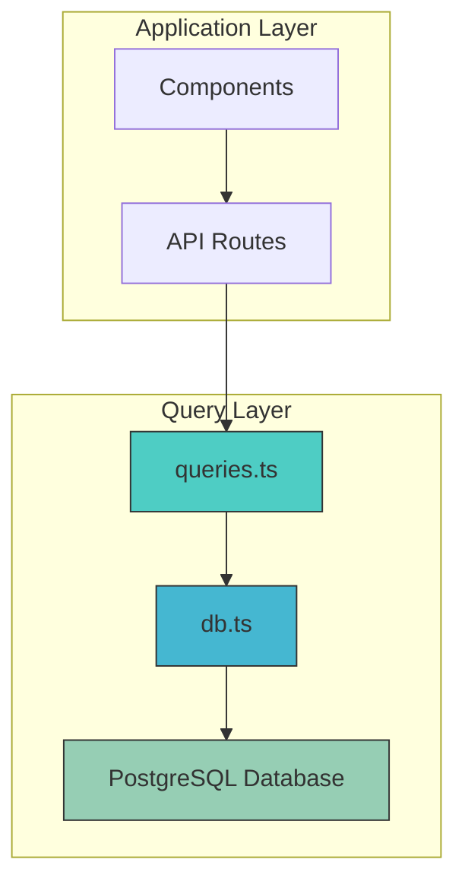
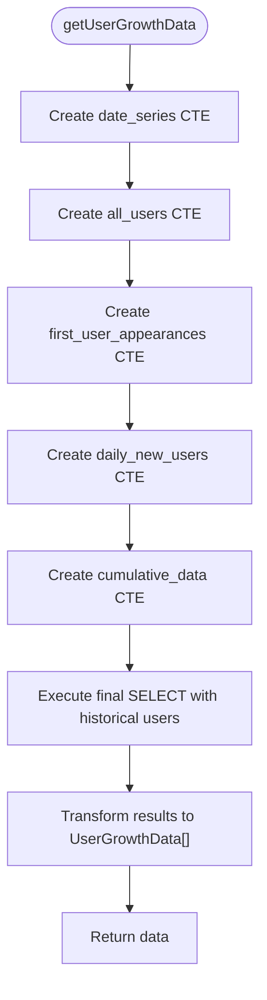
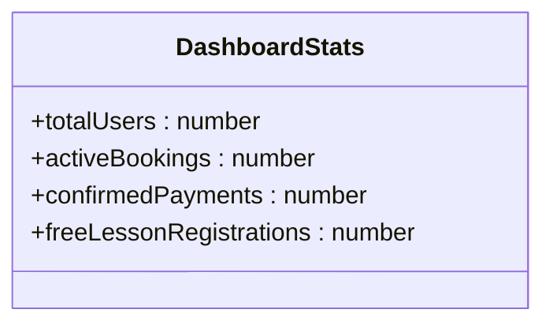
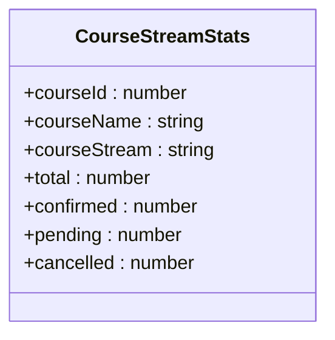
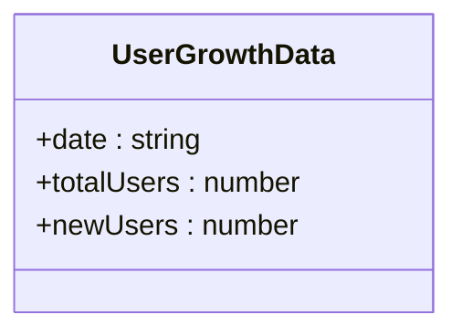
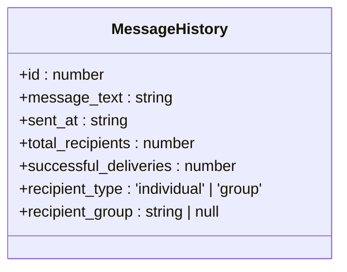
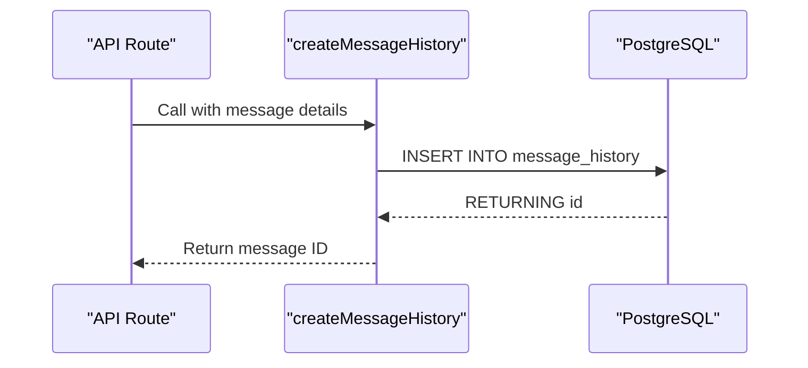
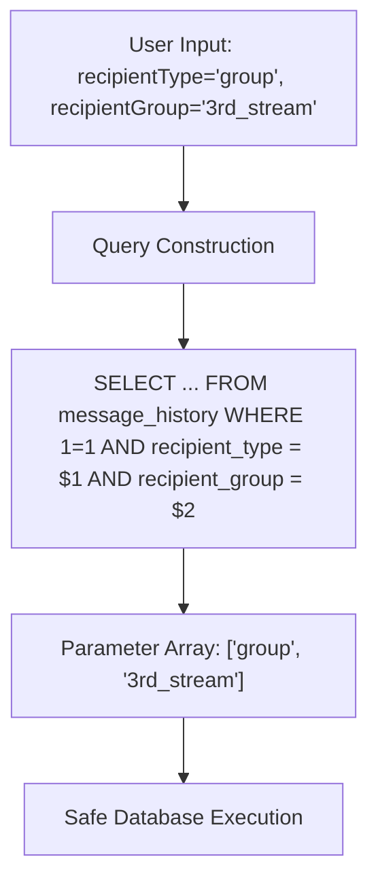

# Query Implementation

<cite>
**Referenced Files in This Document**   
- [queries.ts](file://lib/queries.ts)
- [db.ts](file://lib/db.ts)
</cite>

## Table of Contents
1. [Introduction](#introduction)
2. [Query Architecture Overview](#query-architecture-overview)
3. [Core Query Functions](#core-query-functions)
4. [Data Model Interfaces](#data-model-interfaces)
5. [Complex Query Patterns](#complex-query-patterns)
6. [Message System Queries](#message-system-queries)
7. [Error Handling and Resource Management](#error-handling-and-resource-management)
8. [Parameterized Queries and Security](#parameterized-queries-and-security)
9. [Data Transformation Patterns](#data-transformation-patterns)
10. [Performance Considerations](#performance-considerations)
11. [Conclusion](#conclusion)

## Introduction

The hsl-dashboard application implements a direct SQL query layer that bypasses traditional ORMs in favor of raw, parameterized SQL queries for optimal performance and precise control over database operations. This documentation details the query implementation layer, focusing on the key functions that power the dashboard's analytics capabilities. The approach prioritizes performance, security, and maintainability through well-structured TypeScript interfaces, comprehensive error handling, and efficient resource management.

The query layer is centralized in the `queries.ts` file within the `lib` directory, which exports a suite of functions for retrieving various statistics and managing message operations. By using raw SQL with parameterized queries, the implementation achieves high performance while maintaining protection against SQL injection attacks. The design pattern follows a consistent structure across all query functions, ensuring predictability and ease of maintenance.

**Section sources**
- [queries.ts](file://lib/queries.ts#L1-L1431)
- [db.ts](file://lib/db.ts#L1-L53)

## Query Architecture Overview

The query implementation follows a modular architecture with a clear separation of concerns. At the foundation is the database connection pool managed by the `db.ts` file, which provides a singleton PostgreSQL connection pool instance. This pool is imported by the `queries.ts` module, which contains all data access functions.

The architecture employs a direct SQL approach rather than using an ORM, which provides several advantages:
- Complete control over query optimization
- Ability to implement complex SQL patterns like CTEs and window functions
- Reduced overhead compared to ORM abstractions
- Precise performance characteristics

All query functions follow a consistent pattern: acquire a client from the pool, execute one or more SQL statements, transform the results into typed interfaces, and ensure the client is properly released. This pattern ensures resource safety and prevents connection leaks.



**Diagram sources**
- [queries.ts](file://lib/queries.ts#L1-L1431)
- [db.ts](file://lib/db.ts#L1-L53)

**Section sources**
- [queries.ts](file://lib/queries.ts#L1-L1431)
- [db.ts](file://lib/db.ts#L1-L53)

## Core Query Functions

The query implementation includes several key functions that retrieve essential statistics for the dashboard. These functions are designed to be efficient, type-safe, and easy to use from the application's API routes.

### getDashboardStats Function

The `getDashboardStats` function retrieves overall dashboard statistics including total users, active bookings, confirmed payments, and free lesson registrations. It uses UNION operations to combine user data from multiple sources (bookings, events, and free lesson registrations) to calculate the total unique users. The function employs multiple separate queries to gather different statistics, which are then combined into a single response object that matches the `DashboardStats` interface.

**Section sources**
- [queries.ts](file://lib/queries.ts#L102-L140)

### getCourseStreamStats Function

The `getCourseStreamStats` function provides detailed statistics by course and stream, showing the total, confirmed, pending, and cancelled bookings for each course stream. It uses GROUP BY operations on both course_id and course_stream to aggregate data at the appropriate level. The function also includes data transformation logic to map internal stream identifiers (like '3rd_stream') to more readable display names (like '3-й поток').

**Section sources**
- [queries.ts](file://lib/queries.ts#L178-L218)

### getUserGrowthData Function

The `getUserGrowthData` function calculates user growth metrics over a specified time period. This is one of the most complex queries in the system, utilizing Common Table Expressions (CTEs) to create a date series and track user appearances across different tables. The query combines data from bookings, events, and free lesson registrations to identify when users first appeared in the system, then calculates both daily new users and cumulative totals.



**Diagram sources**
- [queries.ts](file://lib/queries.ts#L474-L539)

**Section sources**
- [queries.ts](file://lib/queries.ts#L474-L539)

## Data Model Interfaces

The query implementation uses TypeScript interfaces to define the structure of data returned by the query functions. These interfaces ensure type safety throughout the application and provide clear documentation of the data shape.

### DashboardStats Interface

The `DashboardStats` interface defines the structure of the overall dashboard statistics, including the total number of users, active bookings, confirmed payments, and free lesson registrations. This interface is used by both the backend query functions and frontend components to ensure consistency in data handling.



**Diagram sources**
- [queries.ts](file://lib/queries.ts#L2-L7)

**Section sources**
- [queries.ts](file://lib/queries.ts#L2-L7)

### CourseStreamStats Interface

The `CourseStreamStats` interface defines the structure for course stream statistics, including identifiers for the course and stream, along with counts for total, confirmed, pending, and cancelled bookings. This interface supports the detailed course analytics displayed in the dashboard.



**Diagram sources**
- [queries.ts](file://lib/queries.ts#L18-L26)

**Section sources**
- [queries.ts](file://lib/queries.ts#L18-L26)

### UserGrowthData Interface

The `UserGrowthData` interface defines the structure for user growth metrics, including the date, total number of users, and number of new users for each day. This interface supports the user growth chart component in the dashboard.



**Diagram sources**
- [queries.ts](file://lib/queries.ts#L52-L56)

**Section sources**
- [queries.ts](file://lib/queries.ts#L52-L56)

### MessageHistory Interface

The `MessageHistory` interface defines the structure for message history records, including the message text, timestamps, delivery statistics, and recipient information. This interface supports the messaging system's history and analytics features.



**Diagram sources**
- [queries.ts](file://lib/queries.ts#L83-L91)

**Section sources**
- [queries.ts](file://lib/queries.ts#L83-L91)

## Complex Query Patterns

The query implementation leverages advanced SQL patterns to achieve sophisticated data analysis capabilities that would be difficult or inefficient with a traditional ORM.

### Common Table Expressions (CTEs)

The `getUserGrowthData` function extensively uses CTEs to break down complex calculations into manageable steps. The query creates multiple CTEs:
- `date_series`: Generates a series of dates for the specified time period
- `all_users`: Combines user appearances from multiple tables
- `first_user_appearances`: Identifies the first appearance date for each user
- `daily_new_users`: Counts new users for each date
- `cumulative_data`: Calculates running totals with window functions

This approach makes the query more readable and maintainable while allowing PostgreSQL to optimize the execution plan effectively.

**Section sources**
- [queries.ts](file://lib/queries.ts#L474-L539)

### FULL OUTER JOIN for Conversion Rate Calculations

The `getLessonConversion` function uses a FULL OUTER JOIN to calculate conversion rates between free lesson registrations and actual lesson attendance. This pattern ensures that lessons with registrations but no attendance (resulting in 0% conversion) and lessons with attendance but no registrations (which might indicate data issues) are both included in the results. The query combines data from the `free_lesson_registrations` table and the `events` table (specifically 'lesson_link_clicked' events) to calculate conversion rates.

**Section sources**
- [queries.ts](file://lib/queries.ts#L430-L472)

### Window Functions for Running Totals

The user growth query employs window functions to calculate running totals of users over time. The SUM() OVER (ORDER BY ds.date) expression creates a cumulative sum of new users, which is then combined with historical user counts to produce accurate total user numbers for each date. This pattern is essential for creating meaningful growth charts that show both daily activity and overall trends.

**Section sources**
- [queries.ts](file://lib/queries.ts#L474-L539)

## Message System Queries

The query implementation includes a comprehensive set of functions for managing the messaging system, which supports both individual and group messaging to users.

### createMessageHistory Function

The `createMessageHistory` function creates a new message history record in the database, returning the generated ID for the new message. This function uses parameterized queries to safely insert message data, including the message text, recipient counts, recipient type (individual or group), recipient group (for stream-specific messaging), and optional scheduling information.



**Diagram sources**
- [queries.ts](file://lib/queries.ts#L675-L694)

**Section sources**
- [queries.ts](file://lib/queries.ts#L675-L694)

### getMessageRecipients Function

The `getMessageRecipients` function retrieves the list of recipients for a specific message, including their delivery status. This function supports the message tracking and analytics features, allowing administrators to see which users have received, opened, or encountered issues with a message.

**Section sources**
- [queries.ts](file://lib/queries.ts#L798-L818)

## Error Handling and Resource Management

The query implementation follows a robust pattern for error handling and resource management to ensure database connection safety and application stability.

### Try-Finally Blocks for Client Release

Every query function uses a try-finally block to ensure that database clients are properly released back to the pool, even if an error occurs during query execution. This pattern prevents connection leaks that could exhaust the connection pool and cause application failures.

```typescript
const client = await pool.connect();
try {
  // Execute queries
  return transformedResults;
} finally {
  client.release();
}
```

This pattern is consistently applied across all query functions, providing a reliable mechanism for resource cleanup.

**Section sources**
- [queries.ts](file://lib/queries.ts#L102-L140)

### Comprehensive Error Handling

While the query functions themselves focus on proper resource management, the API routes that call these functions implement comprehensive error handling with logging and appropriate HTTP responses. Errors are caught, logged for debugging purposes, and translated into meaningful error responses for the client, typically returning a 500 status code for server errors.

**Section sources**
- [queries.ts](file://lib/queries.ts#L102-L140)

## Parameterized Queries and Security

The query implementation uses parameterized queries extensively to prevent SQL injection attacks and ensure data security.

### Parameterized Query Examples

The `getMessageHistory` function demonstrates the use of parameterized queries with dynamic filtering. Instead of string concatenation, the function builds the query with parameter placeholders ($1, $2, etc.) and passes the actual values separately to the query method. This approach ensures that user input is properly escaped and cannot be used to modify the query structure.



**Diagram sources**
- [queries.ts](file://lib/queries.ts#L750-L795)

**Section sources**
- [queries.ts](file://lib/queries.ts#L750-L795)

### SQL Injection Prevention

By using the parameterized query interface provided by the pg library, the implementation ensures that all user-supplied data is properly escaped and treated as data rather than executable SQL code. This approach is applied consistently across all query functions that accept parameters, providing a strong defense against SQL injection attacks.

**Section sources**
- [queries.ts](file://lib/queries.ts#L675-L694)

## Data Transformation Patterns

The query implementation includes consistent data transformation patterns that convert raw database results into properly typed interfaces.

### Result Set Mapping

All query functions map the raw result rows from PostgreSQL to the appropriate TypeScript interfaces. This transformation includes:
- Converting string values to numbers using parseInt()
- Formatting dates to ISO strings
- Mapping database field names to camelCase property names
- Providing default values for potentially null fields

This pattern ensures that the data returned by the query functions is properly typed and formatted for use by the frontend components.

**Section sources**
- [queries.ts](file://lib/queries.ts#L102-L140)

### Type Safety and Validation

The use of TypeScript interfaces provides compile-time type safety, ensuring that the data structure matches expectations throughout the application. The transformation functions include null checks and default values to handle potential data inconsistencies, making the system more robust.

**Section sources**
- [queries.ts](file://lib/queries.ts#L2-L7)

## Performance Considerations

The direct SQL approach provides several performance advantages over ORM-based solutions.

### Query Optimization Opportunities

The raw SQL implementation allows for precise query optimization, including:
- Selecting only the required columns
- Using appropriate indexes
- Implementing efficient JOIN strategies
- Leveraging database-specific features like CTEs and window functions

The queries are designed to minimize data transfer between the database and application by aggregating data at the database level rather than in application code.

**Section sources**
- [queries.ts](file://lib/queries.ts#L102-L140)

### Indexing Strategies

While the specific indexes are not defined in the query code, the query patterns suggest several indexing opportunities:
- Indexes on frequently queried columns like course_id, course_stream, and confirmed status in the bookings table
- Composite indexes for common query patterns
- Indexes on date columns used for time-based queries
- Indexes on user_id columns used for JOIN operations

These indexing strategies would support the performance of the analytics queries and ensure fast response times even as data volumes grow.

**Section sources**
- [queries.ts](file://lib/queries.ts#L102-L140)

## Conclusion

The query implementation layer in hsl-dashboard demonstrates a well-architected approach to database access that prioritizes performance, security, and maintainability. By using raw SQL with parameterized queries instead of an ORM, the implementation achieves optimal performance while maintaining protection against SQL injection attacks. The consistent use of TypeScript interfaces ensures type safety throughout the application, and the standardized error handling and resource management patterns provide reliability and prevent connection leaks.

The complex query patterns, including CTEs, FULL OUTER JOINs, and window functions, enable sophisticated data analysis capabilities that would be difficult to achieve with a traditional ORM. The message system queries demonstrate how the same patterns can be applied to different domains within the application.

Overall, this query implementation represents a balanced approach that leverages the full power of PostgreSQL while maintaining code quality and security through TypeScript and consistent design patterns.