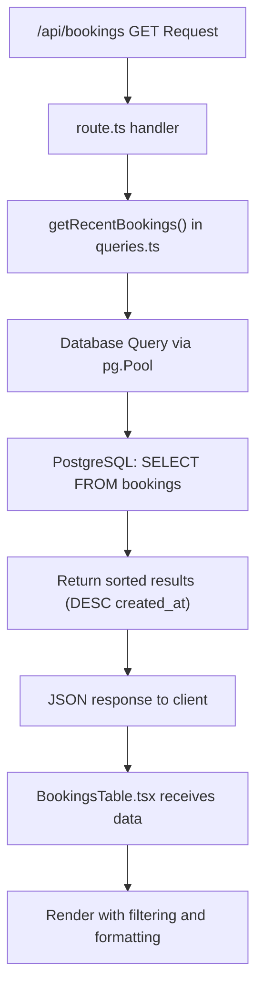
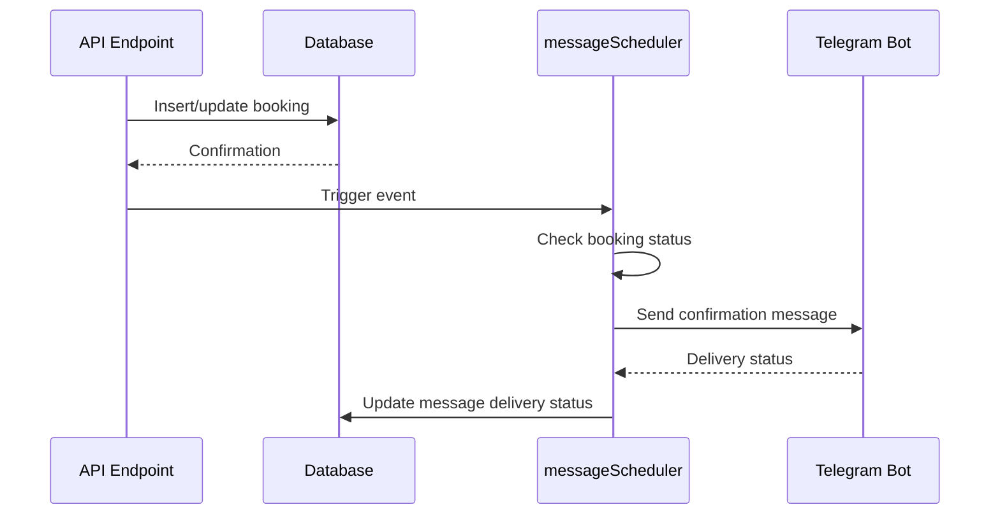

# Booking Management

<cite>
**Referenced Files in This Document**   
- [route.ts](file://app/api/bookings/route.ts)
- [BookingsTable.tsx](file://components/BookingsTable.tsx)
- [UserBookingsTable.tsx](file://components/UserBookingsTable.tsx)
- [db.ts](file://lib/db.ts)
- [queries.ts](file://lib/queries.ts)
</cite>

## Table of Contents
1. [Introduction](#introduction)
2. [API Endpoint: /api/bookings](#api-endpoint-apibookings)
3. [Domain Model: Booking](#domain-model-booking)
4. [Core Components](#core-components)
5. [Data Flow and Retrieval](#data-flow-and-retrieval)
6. [Error Handling and Validation](#error-handling-and-validation)
7. [Performance Considerations](#performance-considerations)
8. [Concurrency and Race Conditions](#concurrency-and-race-conditions)
9. [Integration with Messaging System](#integration-with-messaging-system)
10. [Troubleshooting Common Issues](#troubleshooting-common-issues)

## Introduction
The booking management system in hsl-dashboard enables administrators to monitor, manage, and analyze user course bookings. This document details the implementation of the `/api/bookings` endpoint, the `BookingsTable.tsx` and `UserBookingsTable.tsx` components, and the underlying domain model for bookings. It covers the full lifecycle of a booking — creation, retrieval, update, and display — along with integration points, performance optimizations, and error handling strategies.

## API Endpoint: /api/bookings
The `/api/bookings` endpoint provides read access to recent bookings through a GET request. It supports an optional `limit` query parameter to control the number of returned records (default: 20).

### Request Format
```
GET /api/bookings?limit=10
```

### Response Format
The endpoint returns a JSON array of booking objects with the following structure:
- `id`: Unique booking identifier
- `user_id`: Telegram user ID
- `username`: Telegram username
- `first_name`: User's first name
- `course_id`: ID of the booked course
- `course_stream`: Target course stream (e.g., "3rd_stream")
- `confirmed`: Status code (-1 = cancelled, 1 = pending, 2 = confirmed)
- `created_at`: ISO timestamp of booking creation
- `referral_code`: Applied referral code (if any)
- `discount_percent`: Discount percentage applied

### Error Handling
In case of database or server errors, the endpoint returns a 500 status code with a JSON error object:
```json
{ "error": "Failed to fetch bookings" }
```
Errors are logged to the console for debugging purposes.

**Section sources**
- [route.ts](file://app/api/bookings/route.ts#L1-L17)

## Domain Model: Booking
A booking represents a user's registration for a course. The system tracks several key attributes:

### Status Lifecycle
- **Pending (confirmed = 1)**: User has initiated booking but payment is not confirmed
- **Confirmed (confirmed = 2)**: Payment received and booking is active
- **Cancelled (confirmed = -1)**: Booking was cancelled by user or admin

### Database Schema
The `bookings` table includes:
- `id` (Primary Key)
- `user_id` (Foreign Key to Telegram user)
- `course_id` (Course identifier)
- `course_stream` (Target cohort)
- `confirmed` (Status flag)
- `created_at` (Timestamp)
- `referral_code` and `discount_percent` (Promotional data)

### Status Mapping
The system uses numeric codes for booking status to optimize storage and querying:
- 2 → "Confirmed"
- 1 → "Pending"
- -1 → "Cancelled"

**Section sources**
- [queries.ts](file://lib/queries.ts#L295-L319)
- [BookingsTable.tsx](file://components/BookingsTable.tsx#L24-L59)

## Core Components

### BookingsTable.tsx
This component displays a paginated table of recent bookings with filtering capabilities.

#### Props
- `bookings`: Array of booking objects (interface `Booking`)

#### Features
- Filter by status: All, Confirmed, Pending, Cancelled
- Responsive layout with user, course, status, discount, and date columns
- Badge-based status visualization with color coding
- Course name mapping (e.g., course_id 1 → "Вайб кодинг")
- Stream name translation (e.g., "3rd_stream" → "3-й поток")

#### UI Elements
- Status badges with semantic colors (green = confirmed, yellow = pending, red = cancelled)
- Username and user ID display
- Date formatting in Russian locale (DD.MM.YYYY HH:MM)
- Discount display with referral code

**Section sources**
- [BookingsTable.tsx](file://components/BookingsTable.tsx#L62-L188)

### UserBookingsTable.tsx
This component shows all bookings for a specific user, typically used within user detail views.

#### Props
- `bookings`: Array of `UserBookingInfo` objects
- `onUpdate`: Callback function triggered when booking data changes

#### Features
- Comprehensive booking details including ID, course, stream, status, discount, and referral code
- Compact card-based layout for additional details
- Icon-based information display (calendar, credit card, tags)
- Responsive grid layout for detailed view
- Empty state handling with illustrative UI

#### Data Display
- Formatted dates with short and full variants
- Badge components for course names and streams
- Conditional rendering of discount and referral information
- Creation timestamp with calendar icon

**Section sources**
- [UserBookingsTable.tsx](file://components/UserBookingsTable.tsx#L25-L258)

## Data Flow and Retrieval
The booking data flow follows a structured pattern from database to UI:



**Diagram sources**
- [route.ts](file://app/api/bookings/route.ts#L1-L17)
- [queries.ts](file://lib/queries.ts#L295-L319)
- [BookingsTable.tsx](file://components/BookingsTable.tsx#L62-L188)

## Error Handling and Validation
The system implements multiple layers of error handling:

### API Level
- Try-catch wrapper around database operations
- 500 error response with generic message (avoids exposing sensitive information)
- Console logging for debugging

### Database Connection
- Graceful degradation when environment variables are missing
- Proxy pattern for pool creation with fallback behavior
- SSL configuration for secure connections

### Client-Side
- Empty state rendering when no bookings exist
- Fallback values for missing user data (e.g., "Unknown", "no_username")
- Defensive programming with optional chaining

**Section sources**
- [route.ts](file://app/api/bookings/route.ts#L1-L17)
- [db.ts](file://lib/db.ts#L8-L45)

## Performance Considerations
The system is optimized for efficient querying and rendering of booking data.

### Query Optimization
- Indexed fields: `user_id`, `course_id`, `course_stream`, `confirmed`, `created_at`
- LIMIT clause to prevent excessive data transfer
- ORDER BY `created_at DESC` for chronological relevance
- Single query with projection (specific columns) rather than SELECT *

### Indexing Strategy
Recommended database indexes:
```sql
CREATE INDEX idx_bookings_user ON bookings(user_id);
CREATE INDEX idx_bookings_course ON bookings(course_id);
CREATE INDEX idx_bookings_stream ON bookings(course_stream);
CREATE INDEX idx_bookings_status ON bookings(confirmed);
CREATE INDEX idx_bookings_date ON bookings(created_at);
CREATE INDEX idx_bookings_user_status ON bookings(user_id, confirmed);
```

### Caching Opportunities
- User data caching to reduce database load
- Static course and stream name mappings stored in memory
- Potential for Redis caching of frequent queries

**Section sources**
- [queries.ts](file://lib/queries.ts#L295-L319)
- [db.ts](file://lib/db.ts#L34-L45)

## Concurrency and Race Conditions
The system addresses potential concurrency issues through several mechanisms:

### Double Booking Prevention
- Application-level validation before booking creation
- Database constraints on user-course combinations (if implemented)
- Idempotent operations where possible

### High-Demand Scenarios
- Connection pooling with pg.Pool for efficient database resource management
- Transaction isolation to prevent dirty reads
- Optimistic UI patterns (though not currently implemented in read-only display)

### Data Integrity
- Atomic operations for status updates
- Proper error handling to prevent partial updates
- Consistent status transitions through business logic

## Integration with Messaging System
The booking system integrates with the messaging infrastructure for automated communications:

### Event-Driven Workflow


**Diagram sources**
- [queries.ts](file://lib/queries.ts#L295-L319)
- [messageScheduler.ts](file://lib/messageScheduler.ts)

### Automated Messages
- Booking confirmation messages upon status change to "confirmed"
- Reminder messages before course start
- Cancellation notifications
- Personalized messages using user and booking data

### Status Synchronization
- Message delivery status tracked in `message_recipients` table
- Successful deliveries update booking records
- Retry mechanisms for failed deliveries

## Troubleshooting Common Issues

### Common Problems
- **Missing Environment Variables**: Ensure POSTGRES_HOST and POSTGRES_PASSWORD are set
- **Database Connection Failures**: Verify network connectivity and SSL settings
- **Empty Booking Lists**: Check database content and query parameters
- **Incorrect Status Display**: Verify confirmed value mappings in UI components

### Debugging Tools
- `/api/test-db` endpoint for database connectivity testing
- `/api/debug-events` for tracing system events
- Console logging of database queries and results
- Direct database inspection via `/api/db-schema`

### Monitoring Recommendations
- Track API response times and error rates
- Monitor database query performance
- Log booking creation and status change events
- Set up alerts for failed database connections

**Section sources**
- [db.ts](file://lib/db.ts)
- [queries.ts](file://lib/queries.ts)
- [messageScheduler.ts](file://lib/messageScheduler.ts)