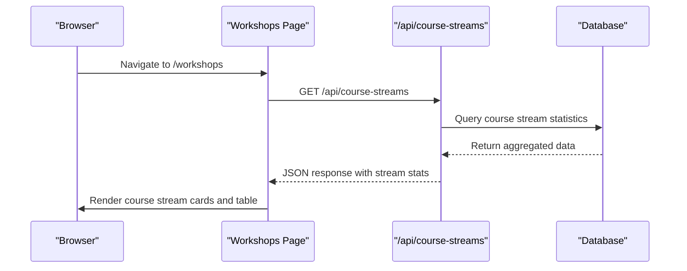
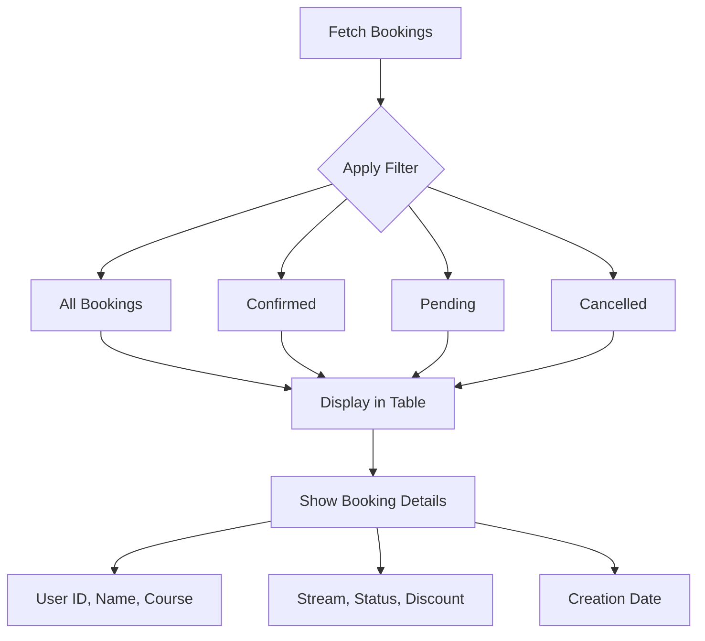
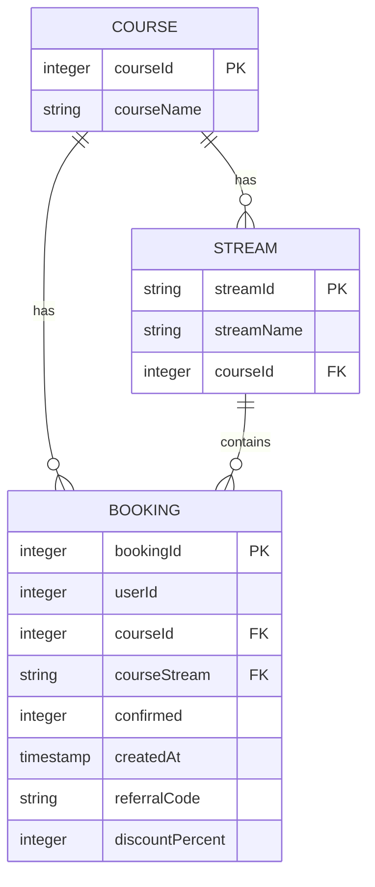
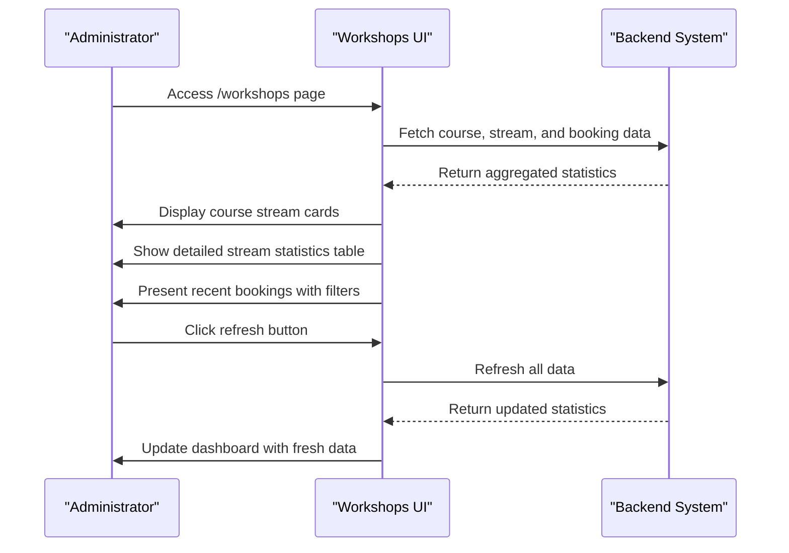
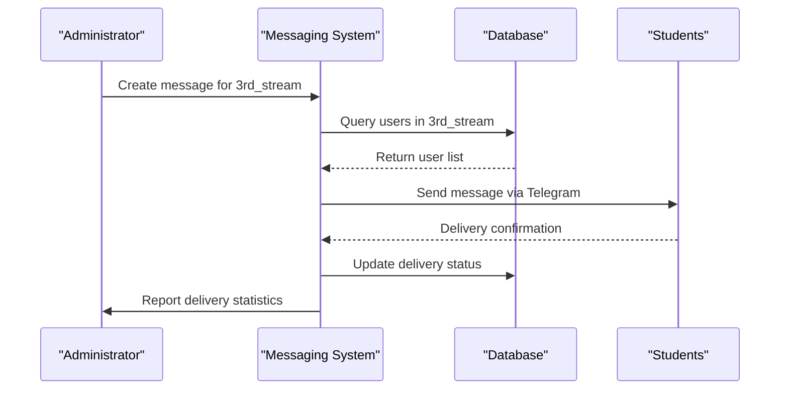

# Course Management

<cite>
**Referenced Files in This Document**   
- [workshops/page.tsx](file://app/workshops/page.tsx)
- [api/course-streams/route.ts](file://app/api/course-streams/route.ts)
- [components/BookingsTable.tsx](file://components/BookingsTable.tsx)
- [lib/queries.ts](file://lib/queries.ts)
- [api/bookings/route.ts](file://app/api/bookings/route.ts)
- [lib/messageScheduler.ts](file://lib/messageScheduler.ts)
</cite>

## Table of Contents
1. [Introduction](#introduction)
2. [Course Stream Tracking](#course-stream-tracking)
3. [Booking Management System](#booking-management-system)
4. [Relationship Between Courses, Streams, and Bookings](#relationship-between-courses-streams-and-bookings)
5. [Administrator Workflow and Practical Examples](#administrator-workflow-and-practical-examples)
6. [Common Issues and Edge Cases](#common-issues-and-edge-cases)
7. [Performance Considerations](#performance-considerations)
8. [Integration with Messaging System](#integration-with-messaging-system)

## Introduction
The course management system in hsl-dashboard provides comprehensive tracking for workshops, course streams, and student bookings. This system enables administrators to monitor course capacity, track student enrollment status, and manage booking confirmations efficiently. The implementation centers around three key components: the course stream tracking endpoint, the workshop analytics interface, and the booking management table. These components work together to provide real-time visibility into course registration metrics and student engagement patterns.

## Course Stream Tracking
The course stream tracking system is implemented through the `/api/course-streams` endpoint, which provides detailed statistics about student enrollment across different course streams. This endpoint retrieves data from the bookings database and aggregates it by course and stream, providing administrators with insights into enrollment patterns and conversion rates.

**Diagram sources**
- [workshops/page.tsx](file://app/workshops/page.tsx#L53-L64)
- [api/course-streams/route.ts](file://app/api/course-streams/route.ts#L4-L14)

The endpoint implementation in `route.ts` calls the `getCourseStreamStats()` function from `queries.ts`, which executes a PostgreSQL query to aggregate booking data by course ID and course stream. The query counts total registrations and categorizes them by confirmation status (confirmed, pending, cancelled). The results are then mapped to human-readable course and stream names before being returned as JSON.

**Section sources**
- [api/course-streams/route.ts](file://app/api/course-streams/route.ts#L1-L15)
- [lib/queries.ts](file://lib/queries.ts#L178-L218)

## Booking Management System
The booking management system handles the creation, retrieval, and display of student bookings through the `BookingsTable.tsx` component. Bookings are retrieved from the `/api/bookings` endpoint and displayed in a tabular format with filtering capabilities for different booking statuses.

**Diagram sources**
- [components/BookingsTable.tsx](file://components/BookingsTable.tsx#L22-L188)
- [api/bookings/route.ts](file://app/api/bookings/route.ts#L1-L17)

The `BookingsTable` component accepts a list of bookings as a prop and provides filtering options to view all bookings or filter by status (confirmed, pending, cancelled). Each booking displays comprehensive information including user details, course information, stream assignment, confirmation status, discount information, and creation timestamp. The table uses helper functions to format stream names and display appropriate status badges based on the confirmed field value.

**Section sources**
- [components/BookingsTable.tsx](file://components/BookingsTable.tsx#L1-L188)
- [api/bookings/route.ts](file://app/api/bookings/route.ts#L1-L17)

## Relationship Between Courses, Streams, and Bookings
The system establishes a hierarchical relationship between courses, streams, and user bookings. A course represents a specific educational program (e.g., "Вайб кодинг"), while a stream represents a specific cohort or session of that course (e.g., "3-й поток", "4-й поток"). Each user booking is associated with both a course and a stream, creating a many-to-one relationship where multiple bookings can belong to the same stream, and multiple streams can belong to the same course.

**Diagram sources**
- [lib/queries.ts](file://lib/queries.ts#L18-L26)
- [components/BookingsTable.tsx](file://components/BookingsTable.tsx#L8-L19)

The data model shows that bookings are the central entity that connects users to specific course streams. The confirmed field in the booking record indicates the payment status: 2 for confirmed, 1 for pending, and -1 for cancelled. This relationship allows administrators to track not only overall course enrollment but also the distribution of students across different streams and their payment status.

**Section sources**
- [lib/queries.ts](file://lib/queries.ts#L18-L218)
- [components/BookingsTable.tsx](file://components/BookingsTable.tsx#L8-L19)

## Administrator Workflow and Practical Examples
Administrators use the course management system to monitor course capacity and student enrollment through the workshops analytics page. When accessing the `/workshops` page, the system fetches course statistics, course stream data, and recent bookings in parallel, providing a comprehensive overview of course registration metrics.

**Diagram sources**
- [workshops/page.tsx](file://app/workshops/page.tsx#L43-L243)
- [components/BookingsTable.tsx](file://components/BookingsTable.tsx#L22-L188)

Practical examples of administrator usage include monitoring the conversion rate of each course stream, identifying streams that are approaching capacity, and tracking the number of pending payments that require follow-up. The system displays key metrics such as total registrations, confirmed bookings, pending payments, and cancellations, allowing administrators to assess the overall health of course enrollment.

**Section sources**
- [workshops/page.tsx](file://app/workshops/page.tsx#L43-L243)

## Common Issues and Edge Cases
The course management system addresses several common issues and edge cases in course enrollment management. One common issue is double bookings, where a student attempts to register for multiple streams simultaneously. The system handles this by allowing administrators to view all bookings for a specific user and update their stream assignment as needed.

Another common issue is stream capacity limits. While the current implementation does not enforce hard limits on stream enrollment, administrators can monitor stream totals and manually intervene when a stream approaches its capacity. The system provides clear visibility into enrollment numbers, allowing proactive management of capacity constraints.

Edge cases include bookings with invalid confirmation statuses, which are handled by displaying an "Unknown" status badge in the interface. The system also handles cases where users have multiple bookings by showing all bookings in the table and allowing administrators to update the most recent active booking through the user management interface.

**Section sources**
- [components/BookingsTable.tsx](file://components/BookingsTable.tsx#L32-L45)
- [lib/queries.ts](file://lib/queries.ts#L1337-L1430)

## Performance Considerations
The course management system implements several performance optimizations to handle large numbers of bookings efficiently. The primary optimization is the use of database indexing on key fields such as course_id, course_stream, and confirmed status, which enables fast aggregation queries for course stream statistics.

The system also implements pagination for booking retrieval, with the `/api/bookings` endpoint accepting a limit parameter to control the number of records returned. This prevents performance degradation when displaying recent bookings in the interface.

For large datasets, the system could benefit from additional optimizations such as:
- Implementing database views for frequently accessed aggregations
- Adding caching for course stream statistics
- Creating composite indexes on commonly queried field combinations
- Implementing server-side pagination for the bookings table

The current implementation efficiently handles the aggregation of booking data by leveraging PostgreSQL's GROUP BY and SUM with CASE statements, minimizing the amount of data transferred between the database and application server.

**Section sources**
- [lib/queries.ts](file://lib/queries.ts#L178-L218)
- [api/bookings/route.ts](file://app/api/bookings/route.ts#L1-L17)

## Integration with Messaging System
The course management system integrates with the messaging system to enable booking confirmations and notifications. When a booking is confirmed, the system can trigger automated messages to students through the Telegram integration. The messaging system uses the course_stream field from bookings to target messages to specific course cohorts.

The integration works by querying the bookings table to identify users in specific streams, then using the message scheduler to send targeted communications. This allows administrators to send announcements, reminders, and other information to students in specific course streams.

**Diagram sources**
- [lib/queries.ts](file://lib/queries.ts#L575-L599)
- [lib/messageScheduler.ts](file://lib/messageScheduler.ts#L151-L184)

The integration uses the `getUsersByStream` function to retrieve users enrolled in a specific course stream, then sends messages through the Telegram bot interface. Delivery status is tracked in the message_recipients table, allowing administrators to monitor the success rate of their communications.

**Section sources**
- [lib/queries.ts](file://lib/queries.ts#L575-L599)
- [lib/messageScheduler.ts](file://lib/messageScheduler.ts#L1-L280)