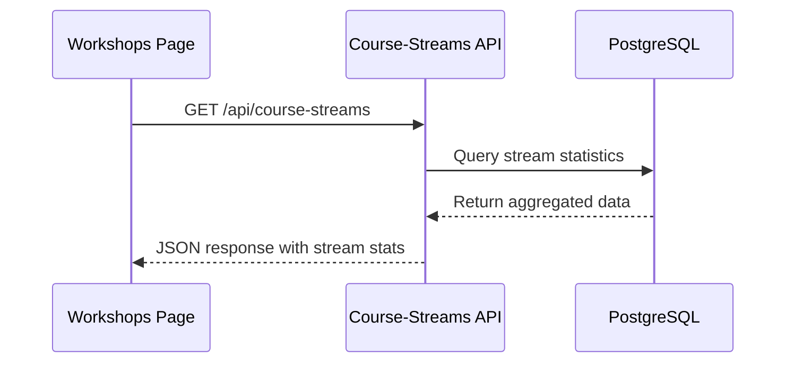
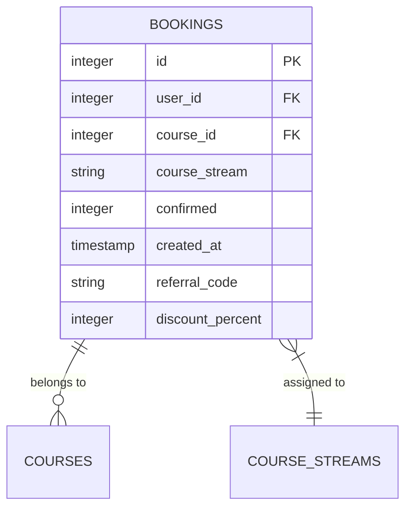
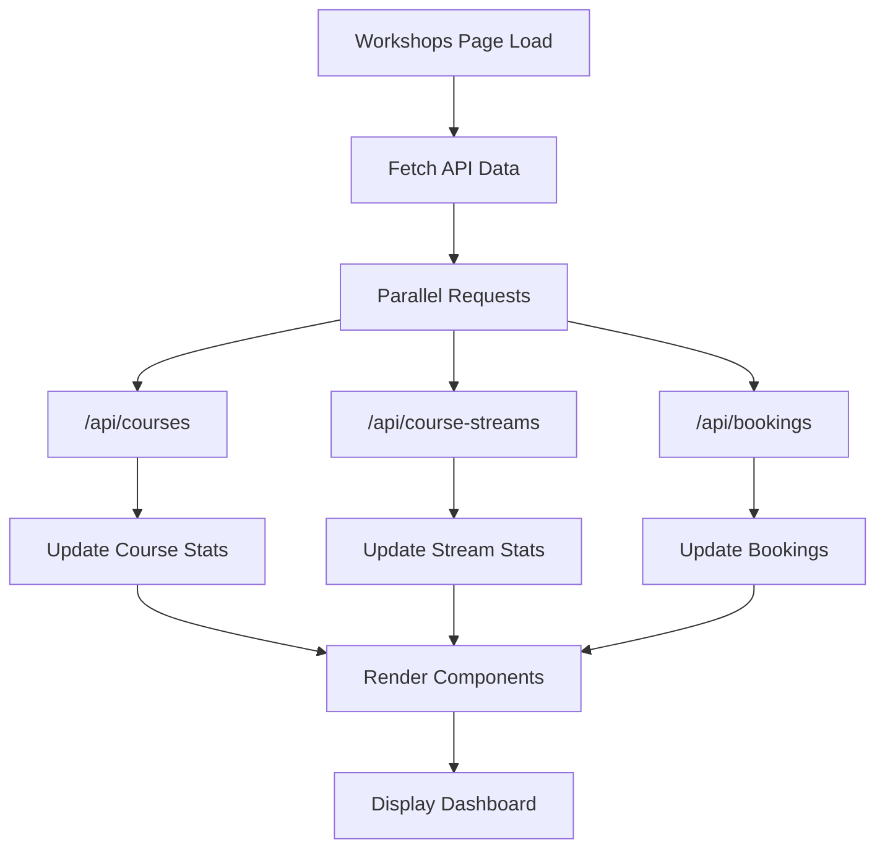
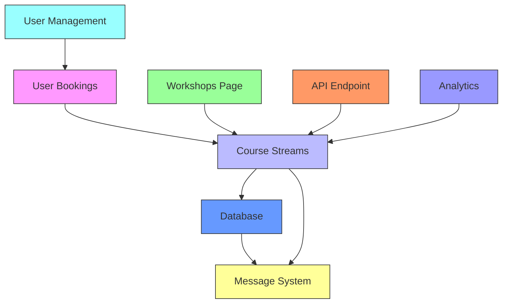

# Course Streams

<cite>
**Referenced Files in This Document**   
- [route.ts](file://app/api/course-streams/route.ts)
- [page.tsx](file://app/workshops/page.tsx)
- [queries.ts](file://lib/queries.ts)
</cite>

## Table of Contents
1. [Introduction](#introduction)
2. [Course Streams Overview](#course-streams-overview)
3. [API Implementation](#api-implementation)
4. [Database Integration](#database-integration)
5. [Frontend Consumption](#frontend-consumption)
6. [Administrative Use Cases](#administrative-use-cases)
7. [Common Issues and Solutions](#common-issues-and-solutions)
8. [Performance Optimization](#performance-optimization)
9. [System Relationships](#system-relationships)
10. [Conclusion](#conclusion)

## Introduction
The course streams feature in hsl-dashboard provides a structured approach to organizing workshops by cohort, schedule, or specialization. This documentation details the implementation and usage of course streams, focusing on the API endpoint, database integration, frontend display, and administrative applications.

**Section sources**
- [route.ts](file://app/api/course-streams/route.ts)
- [page.tsx](file://app/workshops/page.tsx)
- [queries.ts](file://lib/queries.ts)

## Course Streams Overview
Course streams serve as organizational units for workshops, enabling administrators to group participants by various criteria such as cohort, schedule, or specialization. Each stream maintains its own registration statistics, allowing for granular tracking of workshop performance and participant engagement.

The system currently supports named streams such as "3rd_stream", "4th_stream", and "5th_stream", which are mapped to more readable display names like "3-й поток", "4-й поток", and "5-й поток" in the interface. This abstraction allows for both technical consistency in the database and user-friendly presentation in the dashboard.

Streams are particularly valuable for capacity management, enabling administrators to monitor registration levels and plan future workshops based on historical data and current demand patterns.

**Section sources**
- [queries.ts](file://lib/queries.ts#L200-L209)

## API Implementation
The `/api/course-streams` endpoint provides access to course stream statistics through a GET request. This endpoint returns comprehensive data about each course stream, including registration counts categorized by status.



**Diagram sources**
- [route.ts](file://app/api/course-streams/route.ts#L1-L14)

**Section sources**
- [route.ts](file://app/api/course-streams/route.ts#L1-L14)

The API endpoint implements proper error handling, returning a 500 status code with an error message when data retrieval fails. On success, it returns an array of CourseStreamStats objects in JSON format, enabling the frontend to display current registration metrics.

## Database Integration
The course stream functionality is integrated with the database through the `getCourseStreamStats` function in `lib/queries.ts`. This function executes a SQL query that aggregates booking data by course and stream, calculating key metrics for each stream.



**Diagram sources**
- [queries.ts](file://lib/queries.ts#L178-L218)

**Section sources**
- [queries.ts](file://lib/queries.ts#L178-L218)

The database query filters for course ID 1 (Вайб кодинг) and excludes records where course_stream is null. It groups results by course_id and course_stream, then calculates:
- Total registrations
- Confirmed registrations (confirmed = 2)
- Pending registrations (confirmed = 1)
- Cancelled registrations (confirmed = -1)

The function also maps technical course and stream identifiers to human-readable names using lookup objects, enhancing the usability of the returned data.

## Frontend Consumption
The frontend consumes course stream data in the workshops dashboard page (`workshops/page.tsx`), where it is displayed in multiple formats to provide comprehensive insights.



**Diagram sources**
- [page.tsx](file://app/workshops/page.tsx#L45-L70)

**Section sources**
- [page.tsx](file://app/workshops/page.tsx#L45-L70)

The data is displayed in three primary ways:
1. **Metric Cards**: Summary statistics for total, confirmed, pending, and cancelled registrations
2. **Stream Cards**: Visual representation of each active stream with enrollment counts
3. **Detailed Table**: Comprehensive breakdown of statistics by course and stream, including conversion rates

The frontend uses React's useState and useEffect hooks to manage data fetching and rendering, with error handling to display appropriate messages when data retrieval fails.

## Administrative Use Cases
Administrators leverage course stream data for several critical management functions:

### Capacity Management
By monitoring the total, confirmed, pending, and cancelled registrations for each stream, administrators can:
- Identify streams approaching capacity limits
- Plan additional sessions when demand exceeds supply
- Reallocate resources between streams based on enrollment patterns
- Forecast future workshop capacity needs

### Workshop Planning
Historical stream data informs strategic decisions about:
- Optimal timing for future workshops
- Popular specializations to expand
- Underperforming streams that may need revision
- Pricing and promotional strategies based on conversion rates

### Performance Analysis
The conversion rate calculation (confirmed/total * 100%) provides insights into:
- Effectiveness of marketing efforts for each stream
- Student commitment levels across different cohorts
- Impact of pricing, scheduling, or content changes
- Seasonal patterns in enrollment behavior

**Section sources**
- [page.tsx](file://app/workshops/page.tsx#L150-L200)
- [queries.ts](file://lib/queries.ts#L178-L218)

## Common Issues and Solutions
Several challenges may arise when managing course streams, along with their corresponding solutions:

### Stream Overflow
When a stream approaches or exceeds capacity, administrators should:
- Create additional sections of high-demand streams
- Implement waitlist functionality
- Redirect registrations to alternative streams
- Increase pricing to manage demand

### Inconsistent Data States
Potential data inconsistencies can occur due to:
- Concurrent updates to booking records
- Network interruptions during data synchronization
- Cache invalidation issues

Solutions include implementing transactional integrity, proper error handling, and cache consistency mechanisms.

### High Concurrency Performance
Under heavy load, the system may experience:
- Slow response times for stream statistics
- Database connection pool exhaustion
- API timeout errors

**Section sources**
- [route.ts](file://app/api/course-streams/route.ts#L5-L14)
- [queries.ts](file://lib/queries.ts#L178-L218)

## Performance Optimization
To ensure optimal performance of the course streams feature, several optimization strategies are recommended:

### Caching Stream Statistics
Implement server-side caching of stream statistics to:
- Reduce database query frequency
- Improve API response times
- Handle traffic spikes more effectively
- Minimize database load

A cache invalidation strategy should be implemented to ensure data freshness, potentially triggered by booking updates or at regular intervals.

### Database Indexing
Critical database optimizations include:
- Creating an index on the course_stream column in the bookings table
- Indexing the confirmed status field for faster aggregation
- Composite indexing on (course_id, course_stream) for optimized querying

```sql
CREATE INDEX idx_bookings_course_stream ON bookings(course_stream);
CREATE INDEX idx_bookings_confirmed ON bookings(confirmed);
CREATE INDEX idx_bookings_course_stream_confirmed ON bookings(course_id, course_stream, confirmed);
```

### Query Optimization
The current query can be enhanced by:
- Adding proper parameterization for course ID filtering
- Implementing pagination for large result sets
- Using materialized views for frequently accessed statistics
- Optimizing the course and stream name mapping process

**Section sources**
- [queries.ts](file://lib/queries.ts#L178-L218)

## System Relationships
The course streams feature is interconnected with multiple components of the hsl-dashboard system:



**Diagram sources**
- [route.ts](file://app/api/course-streams/route.ts)
- [page.tsx](file://app/workshops/page.tsx)
- [queries.ts](file://lib/queries.ts)

**Section sources**
- [route.ts](file://app/api/course-streams/route.ts)
- [page.tsx](file://app/workshops/page.tsx)
- [queries.ts](file://lib/queries.ts)

Changes in stream capacity propagate through the system as follows:
1. Booking updates trigger database changes
2. The getCourseStreamStats function reflects these changes in its aggregations
3. The API endpoint serves updated statistics
4. The frontend automatically refreshes when users trigger data reload
5. Related systems (messaging, analytics) access the updated stream data

This architecture ensures data consistency while allowing for efficient access to stream statistics across the application.

## Conclusion
The course streams feature in hsl-dashboard provides a robust framework for organizing and managing workshops by cohort, schedule, or specialization. Through the integration of a well-designed API endpoint, efficient database queries, and an intuitive frontend interface, administrators can effectively monitor registration metrics and make data-driven decisions about workshop planning and capacity management.

By addressing potential issues such as stream overflow and performance under high concurrency, and implementing optimization strategies like caching and database indexing, the system can scale effectively to meet growing demands. The relationships between course streams and other system components ensure data consistency and enable comprehensive analytics across the platform.