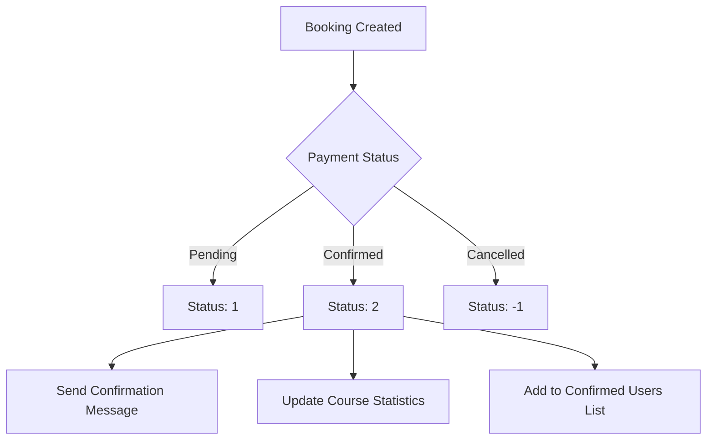
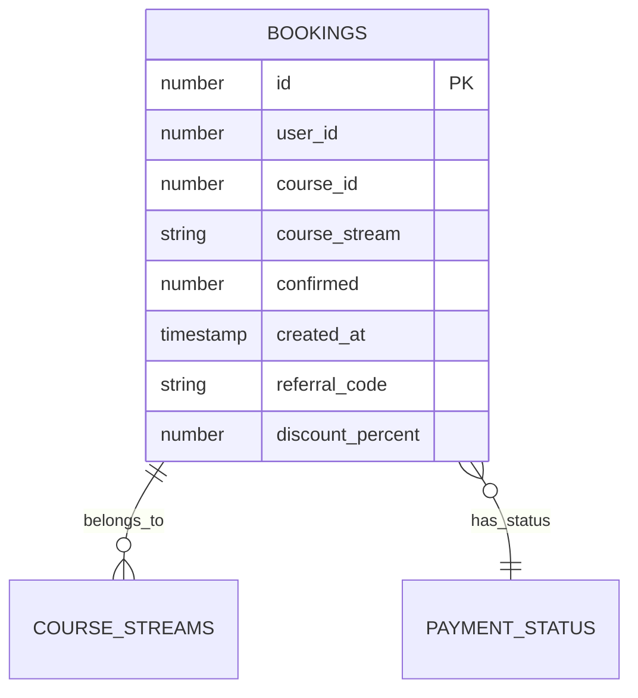

# Payment Tracking

<cite>
**Referenced Files in This Document**   
- [queries.ts](file://lib/queries.ts)
- [BookingsTable.tsx](file://components/BookingsTable.tsx)
- [UserEditForm.tsx](file://components/UserEditForm.tsx)
- [users/[id]/bookings/route.ts](file://app/api/users/[id]/bookings/route.ts)
</cite>

## Table of Contents
1. [Introduction](#introduction)
2. [Payment Status Model](#payment-status-model)
3. [Booking and Payment Association](#booking-and-payment-association)
4. [Payment Status in User Interface](#payment-status-in-user-interface)
5. [Course Stream Statistics](#course-stream-statistics)
6. [Data Model and Storage](#data-model-and-storage)
7. [Security and Compliance](#security-and-compliance)
8. [Performance Considerations](#performance-considerations)

## Introduction
The payment tracking functionality in the course management system is centered around the `confirmed` field in the bookings data model, which serves as the primary indicator of payment status and booking confirmation. This document details how payment status is associated with user bookings, how it determines confirmation status, and how the system differentiates between pending and confirmed payments. The implementation tracks payment states through a numeric enumeration system and integrates this information across the user interface, statistical reporting, and administrative workflows.

## Payment Status Model
The system implements a three-state payment status model using the `confirmed` field in the bookings table. This field uses integer values to represent different payment and booking states:

- **2**: Confirmed payment (fully paid and confirmed)
- **1**: Pending payment (payment initiated but not yet confirmed)
- **-1**: Cancelled booking (payment cancelled or rejected)

This model allows the system to track the complete lifecycle of a booking from initial creation through payment processing to final confirmation or cancellation. The status values are validated at the API level to ensure only valid states can be set, preventing invalid transitions.

**Section sources**
- [queries.ts](file://lib/queries.ts#L121)
- [users/[id]/bookings/route.ts](file://app/api/users/[id]/bookings/route.ts#L96)

## Booking and Payment Association
Payment status is directly associated with user bookings through the `confirmed` field in the bookings table. When a user initiates a booking, it is created with a pending payment status (value 1). The payment confirmation process updates this field to 2, which triggers the booking confirmation workflow.

The system does not currently show explicit integration with external payment processors via webhook handling in the available code, but the status update mechanism is designed to support such integration. The `updateUserBooking` function in the queries module handles status updates and would be the integration point for payment processor webhooks.

When a payment is confirmed, the system updates the booking status, which cascades to various parts of the application including user interfaces, statistics, and messaging systems. This status change serves as the single source of truth for booking confirmation across the entire system.

**Diagram sources**
- [queries.ts](file://lib/queries.ts#L1338-L1387)
- [users/[id]/bookings/route.ts](file://app/api/users/[id]/bookings/route.ts#L96)

**Section sources**
- [queries.ts](file://lib/queries.ts#L1338-L1387)
- [users/[id]/bookings/route.ts](file://app/api/users/[id]/bookings/route.ts#L92-L141)

## Payment Status in User Interface
The payment status is prominently displayed in multiple user interface components, particularly in the BookingsTable and UserEditForm components. The BookingsTable component renders status badges with appropriate styling based on the confirmed value:

- Confirmed payments (2) are displayed with a green badge labeled "Подтверждено" (Confirmed)
- Pending payments (1) are displayed with a yellow badge labeled "В ожидании" (Pending)
- Cancelled bookings (-1) are displayed with a red destructive badge labeled "Отменено" (Cancelled)

The interface also includes filtering capabilities that allow administrators to filter bookings by status (all, confirmed, pending, cancelled), enabling efficient management of bookings based on payment status. The UserEditForm component provides a dropdown interface for administrators to update the payment status of bookings.

**Section sources**
- [BookingsTable.tsx](file://components/BookingsTable.tsx#L62-L188)
- [UserEditForm.tsx](file://components/UserEditForm.tsx#L234-L252)

## Course Stream Statistics
Payment status directly impacts course stream statistics, with confirmed payments contributing to enrollment metrics. The system calculates statistics by aggregating bookings data grouped by course and stream, with separate counts for confirmed, pending, and cancelled bookings.

The `getCourseStreamStats` function in the queries module executes a database query that uses conditional aggregation to count bookings by status. This allows the system to provide real-time statistics on enrollment by stream, showing both total bookings and the breakdown by payment status. These statistics are used to monitor course demand, manage capacity, and make business decisions about future course offerings.

**Diagram sources**
- [queries.ts](file://lib/queries.ts#L178-L218)
- [BookingsTable.tsx](file://components/BookingsTable.tsx#L15)

## Data Model and Storage
The payment tracking data model is implemented within the existing bookings table, using the `confirmed` field as the primary indicator of payment status. This field is an integer that stores the status code (2, 1, or -1) as previously described.

In addition to the status field, the system stores related information such as:
- `referral_code`: The referral code used for the booking (if any)
- `discount_percent`: The discount percentage applied to the booking
- `created_at`: Timestamp of when the booking was created

The data model does not appear to store external payment processor references, transaction IDs, or detailed payment timestamps beyond the booking creation time. This suggests that either this information is stored externally or the system relies on the `confirmed` status field as the authoritative source of payment information.

The system does include audit logging capabilities, with a `createAuditLogEntry` function that could be used to log payment-related operations for compliance and debugging purposes.

**Section sources**
- [queries.ts](file://lib/queries.ts#L1338-L1387)
- [queries.ts](file://lib/queries.ts#L967-L1017)

## Security and Compliance
The system implements several security measures for handling payment-related data. The API endpoints validate payment status updates to ensure only permitted values can be set, preventing invalid state transitions. The validation occurs both at the type level (ensuring the value is a number) and at the business logic level (ensuring the value is one of the permitted status codes).

While the available code does not show specific compliance measures for payment data handling, the system follows general security best practices:
- Input validation for all booking updates
- Use of parameterized queries to prevent SQL injection
- Error handling that avoids leaking sensitive information
- Audit logging capabilities for critical operations

For full compliance with privacy regulations, additional measures would be recommended, such as encrypting sensitive payment data, implementing stricter access controls, and ensuring proper data retention policies.

**Section sources**
- [users/[id]/bookings/route.ts](file://app/api/users/[id]/bookings/route.ts#L92-L141)
- [queries.ts](file://lib/queries.ts#L1338-L1387)

## Performance Considerations
The payment tracking implementation has several performance implications, particularly when joining booking and payment data at scale. The current design stores payment status directly in the bookings table, which avoids the need for joins when retrieving payment status information.

The statistical queries use aggregate functions with conditional counting (SUM with CASE statements) to calculate confirmed, pending, and cancelled counts in a single database query. This approach is generally efficient as it requires only one pass through the data.

However, as the dataset grows, the performance of these aggregate queries may degrade. Potential optimization strategies include:
- Adding database indexes on the `confirmed` and `course_stream` columns
- Implementing caching for frequently accessed statistics
- Using materialized views for complex aggregations
- Paginating results for large result sets

The system's current implementation appears to be optimized for moderate data volumes, with room for optimization as the user base grows.

**Section sources**
- [queries.ts](file://lib/queries.ts#L178-L218)
- [queries.ts](file://lib/queries.ts#L102-L140)