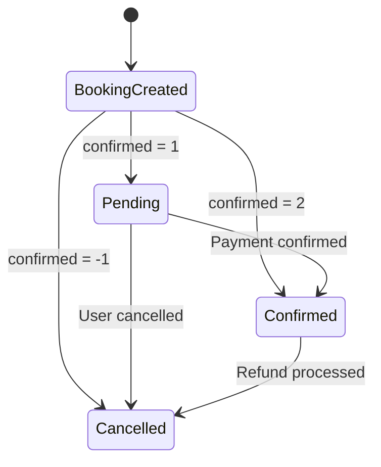
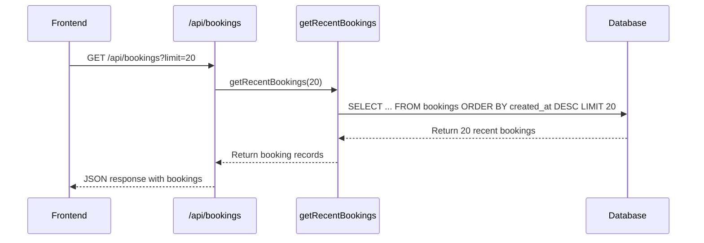
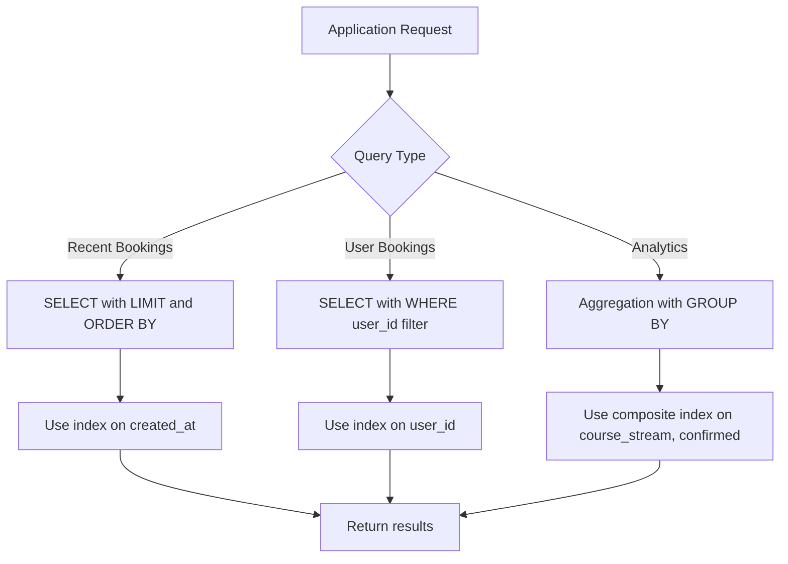
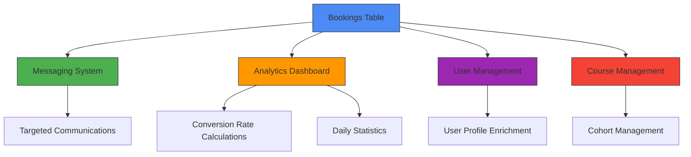

# Bookings Table

<cite>
**Referenced Files in This Document**   
- [queries.ts](file://lib/queries.ts#L295-L319)
- [queries.ts](file://lib/queries.ts#L1264-L1287)
- [queries.ts](file://lib/queries.ts#L1338-L1387)
- [route.ts](file://app/api/bookings/route.ts#L0-L17)
- [route.ts](file://app/api/users/[id]/bookings/route.ts#L0-L141)
- [BookingsTable.tsx](file://components/BookingsTable.tsx#L98-L132)
- [UserEditForm.tsx](file://components/UserEditForm.tsx#L234-L252)
- [UserBookingsTable.tsx](file://components/UserBookingsTable.tsx#L228-L258)
- [workshops/page.tsx](file://app/workshops/page.tsx#L207-L243)
</cite>

## Table of Contents
1. [Introduction](#introduction)
2. [Field Definitions](#field-definitions)
3. [Business Rules](#business-rules)
4. [Data Access Patterns](#data-access-patterns)
5. [Sample Data](#sample-data)
6. [Performance Considerations](#performance-considerations)
7. [Integration Points](#integration-points)
8. [Conclusion](#conclusion)

## Introduction
The Bookings table in the hsl-dashboard application serves as the central data store for tracking course enrollments and user registrations. This document provides comprehensive documentation of the table structure, business logic, and integration points within the system. The table captures essential information about user bookings, including course details, enrollment status, and timestamps, enabling robust analytics and user management capabilities.

**Section sources**
- [queries.ts](file://lib/queries.ts#L295-L319)
- [queries.ts](file://lib/queries.ts#L1264-L1287)

## Field Definitions
The Bookings table contains the following fields with their respective data types and purposes:

- **id (SERIAL)**: Primary key that uniquely identifies each booking record. This auto-incrementing field serves as the main identifier for all booking operations and relationships.
- **user_id (BIGINT)**: Foreign key that references the users table, establishing the relationship between bookings and users. This field enables tracking of course enrollments by individual users.
- **course_id (INTEGER)**: Identifier for the specific course associated with the booking. Currently supports the "Вайб кодинг" course with ID 1.
- **course_stream (VARCHAR)**: Text field that specifies the course stream or cohort (e.g., "3rd_stream", "4th_stream", "5th_stream"). This field enables grouping of users by their enrollment cohort.
- **confirmed (INTEGER)**: Status field that indicates the booking state with values -1 (Cancelled), 1 (Pending), and 2 (Confirmed). This field drives business logic for enrollment management.
- **created_at (TIMESTAMP)**: Timestamp that records when the booking was created. Used for chronological sorting and time-based analytics.
- **referral_code (VARCHAR)**: Optional field that stores the referral code used during booking, enabling tracking of marketing campaign effectiveness.
- **discount_percent (INTEGER)**: Optional field that records the percentage discount applied to the booking, supporting promotional tracking.

**Section sources**
- [queries.ts](file://lib/queries.ts#L298-L313)
- [queries.ts](file://lib/queries.ts#L1267-L1272)

## Business Rules
The confirmed field implements a state machine with three distinct values that represent different stages of the booking lifecycle:

- **-1 = Cancelled**: Indicates that the booking has been cancelled by the user or administratively. Cancelled bookings are excluded from active enrollment counts and analytics.
- **1 = Pending**: Represents a booking that has been created but not yet confirmed. This status typically indicates that payment processing is pending or requires manual verification.
- **2 = Confirmed**: Denotes a fully confirmed booking where payment has been processed and the user is officially enrolled in the course.

These business rules are enforced through validation in the updateUserBooking function, which restricts the confirmed field to only these three valid values. The application UI reflects these states with appropriate visual indicators: destructive badges for cancelled bookings, secondary badges for pending bookings, and default badges for confirmed bookings.

**Diagram sources**
- [queries.ts](file://lib/queries.ts#L1338-L1387)
- [UserEditForm.tsx](file://components/UserEditForm.tsx#L234-L252)

**Section sources**
- [queries.ts](file://lib/queries.ts#L1338-L1387)
- [UserEditForm.tsx](file://components/UserEditForm.tsx#L234-L252)

## Data Access Patterns
The application implements several data access patterns for retrieving booking information:

### Recent Bookings Retrieval
The getRecentBookings function retrieves the most recent bookings ordered by creation date in descending order. This function supports pagination through an optional limit parameter, defaulting to 20 records. The API endpoint at `/api/bookings` exposes this functionality to the frontend.

**Diagram sources**
- [route.ts](file://app/api/bookings/route.ts#L0-L17)
- [queries.ts](file://lib/queries.ts#L295-L319)

### User-Specific Bookings
The getUserBookings function retrieves all bookings for a specific user, ordered by creation date in descending order. This function is accessed through the `/api/users/[id]/bookings` endpoint and supports user-centric views of booking history.

### Course Stream Filtering
The application supports filtering bookings by course stream through various analytics functions. The getCourseStreamStats function aggregates booking data by course and stream, providing conversion metrics for each cohort.

**Section sources**
- [route.ts](file://app/api/bookings/route.ts#L0-L17)
- [queries.ts](file://lib/queries.ts#L295-L319)
- [route.ts](file://app/api/users/[id]/bookings/route.ts#L0-L141)

## Sample Data
The following sample data demonstrates different booking statuses and their representation in the system:

| id | user_id | course_id | course_stream | confirmed | created_at | referral_code | discount_percent |
|----|---------|-----------|---------------|-----------|------------|---------------|------------------|
| 1001 | 555 | 1 | 3rd_stream | 2 | 2024-01-15T10:30:00Z | VIP2024 | 15 |
| 1002 | 556 | 1 | 4th_stream | 1 | 2024-01-16T14:20:00Z | EARLYBIRD | 20 |
| 1003 | 557 | 1 | 5th_stream | -1 | 2024-01-17T09:15:00Z | NULL | 0 |
| 1004 | 558 | 1 | 3rd_stream | 2 | 2024-01-18T16:45:00Z | REF500 | 10 |

This data drives course management analytics by enabling:
- Conversion rate calculations (confirmed bookings / total bookings)
- Cohort-based performance tracking by course stream
- User journey analysis from initial booking to confirmation
- Referral program effectiveness measurement

**Section sources**
- [workshops/page.tsx](file://app/workshops/page.tsx#L207-L243)
- [UserBookingsTable.tsx](file://components/UserBookingsTable.tsx#L228-L258)

## Performance Considerations
The Bookings table implementation includes several performance optimizations:

### Indexing Strategy
While the exact database schema is not visible in the code, optimal performance would require indexes on:
- **user_id**: Essential for efficient retrieval of user-specific bookings through the getUserBookings function
- **course_stream**: Critical for filtering and aggregating bookings by cohort, especially in the getCourseStreamStats function
- **confirmed**: Beneficial for filtering active vs. cancelled bookings in various analytics queries
- **created_at**: Necessary for chronological sorting in recent bookings retrieval

### Query Optimization
The application employs several query optimization techniques:
- **Connection pooling**: All database operations use a connection pool to minimize connection overhead
- **Parameterized queries**: Prevents SQL injection and enables query plan caching
- **Selective field retrieval**: Queries only retrieve needed fields rather than using SELECT *
- **Efficient sorting**: Leverages database indexing for ORDER BY operations on created_at

**Diagram sources**
- [queries.ts](file://lib/queries.ts#L298-L313)
- [queries.ts](file://lib/queries.ts#L1267-L1272)

**Section sources**
- [queries.ts](file://lib/queries.ts#L295-L319)
- [queries.ts](file://lib/queries.ts#L1264-L1287)

## Integration Points
The Bookings table integrates with several key system components:

### Messaging System
The booking data drives targeted communications through the messaging system. The getUsersByStream function queries the Bookings table to identify users in specific course streams for group messaging. Only confirmed bookings (confirmed = 2) are included in these recipient lists, ensuring messages are sent only to active participants.

### Analytics Features
The Bookings table is central to multiple analytics calculations:
- **Conversion rates**: Ratio of confirmed bookings to total bookings
- **Daily statistics**: Bookings are counted in daily aggregates for dashboard metrics
- **User growth**: New bookings contribute to new user counts in growth analytics
- **Course performance**: Bookings are aggregated by course and stream to evaluate program success

### User Management
The booking data enhances user profiles by providing:
- Latest course stream information for user context
- Booking history for support interactions
- Enrollment status for access control decisions
- Referral tracking for marketing analysis

**Diagram sources**
- [queries.ts](file://lib/queries.ts#L575-L599)
- [queries.ts](file://lib/queries.ts#L243-L281)

**Section sources**
- [queries.ts](file://lib/queries.ts#L575-L599)
- [queries.ts](file://lib/queries.ts#L243-L281)

## Conclusion
The Bookings table serves as a critical component in the hsl-dashboard application, enabling comprehensive course enrollment tracking and driving multiple business processes. Its well-defined schema with clear business rules for the confirmed field provides a reliable foundation for user management, analytics, and communications. The implementation demonstrates thoughtful consideration of data access patterns and performance requirements, with opportunities for further optimization through strategic indexing. The tight integration with messaging and analytics systems highlights the table's central role in the application's ecosystem, making it essential for effective course management and user engagement.